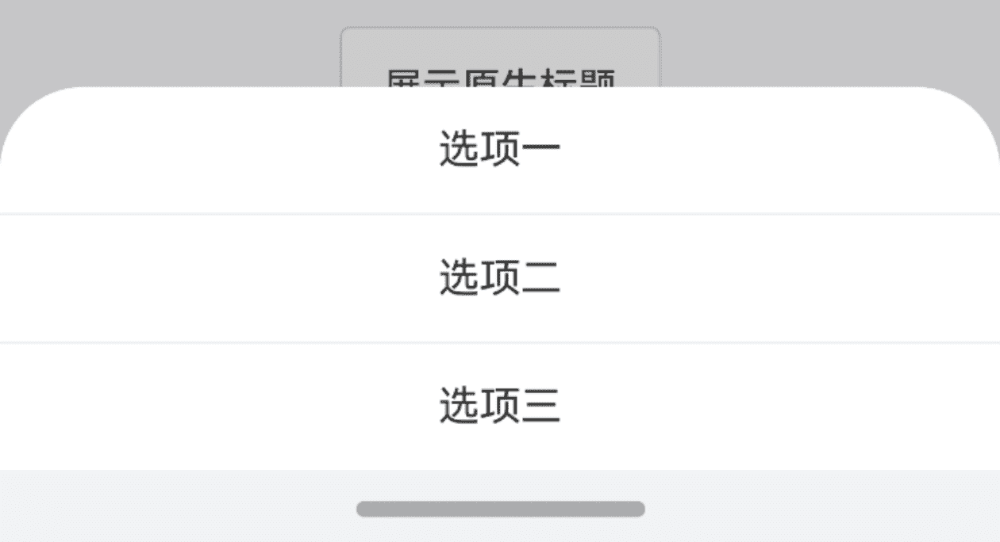
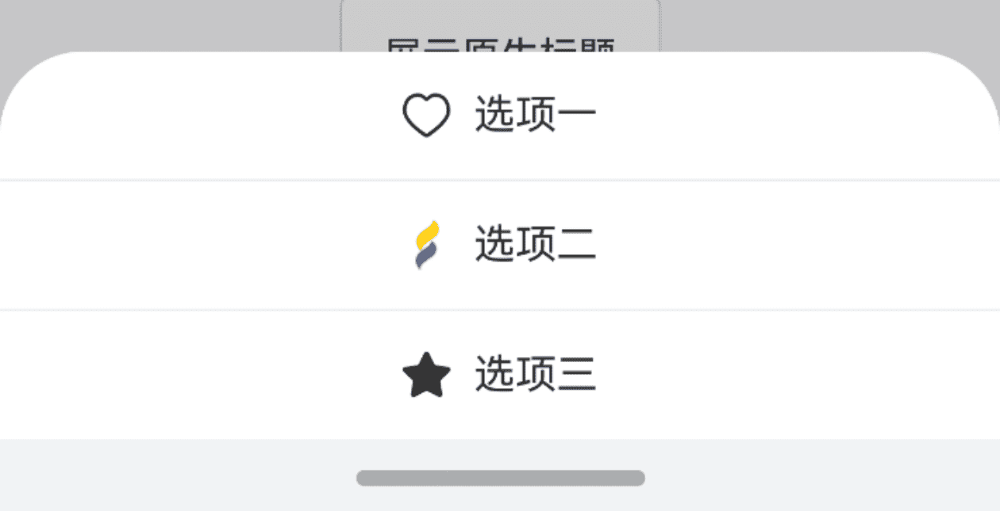
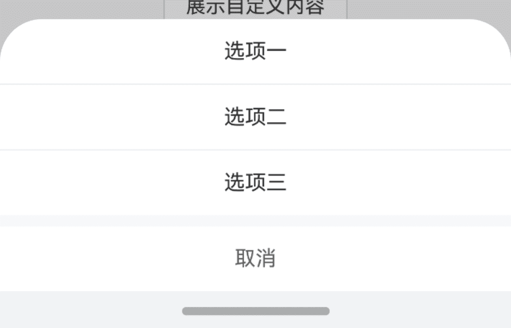
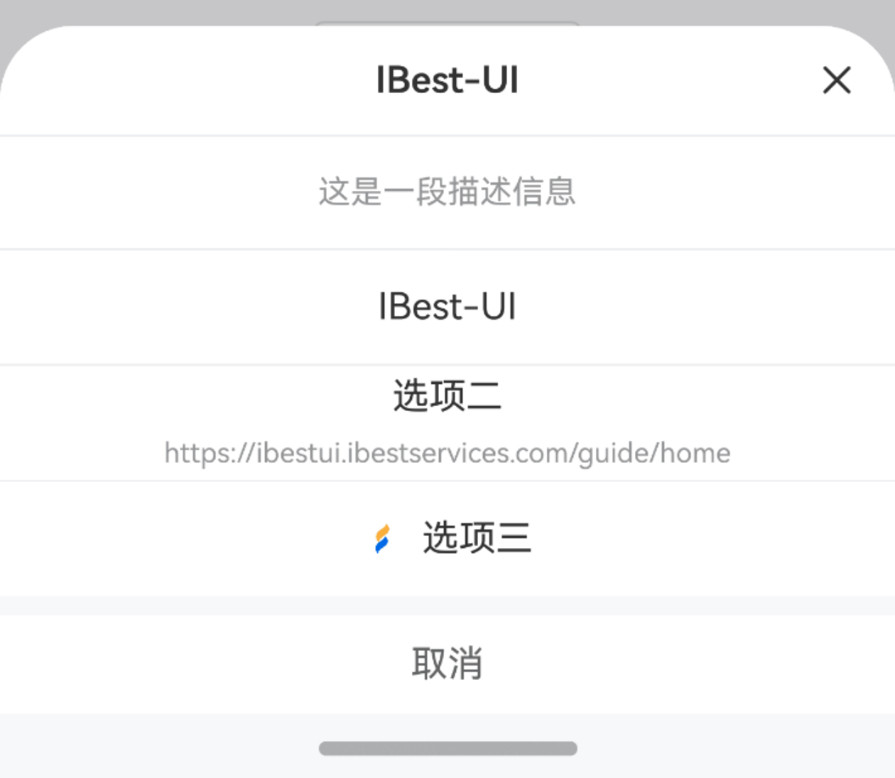
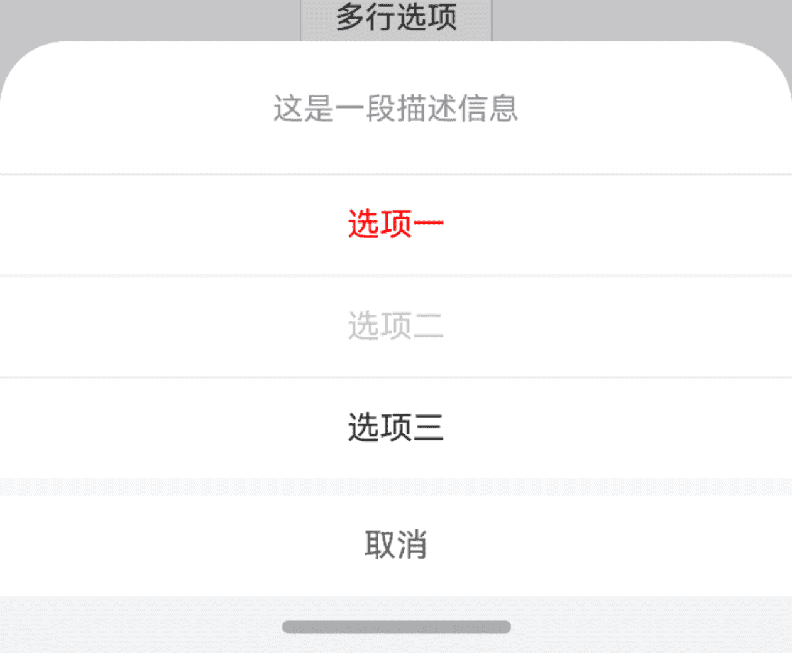
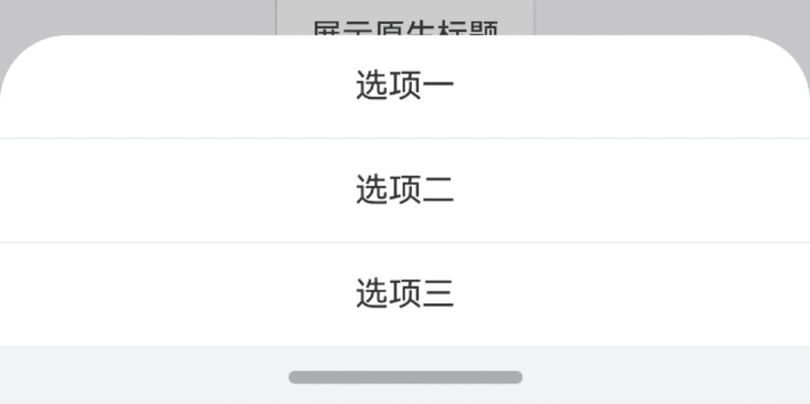
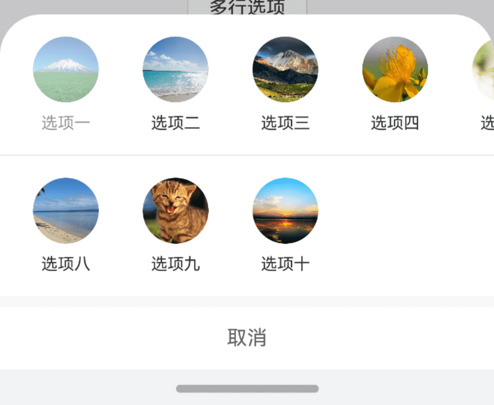
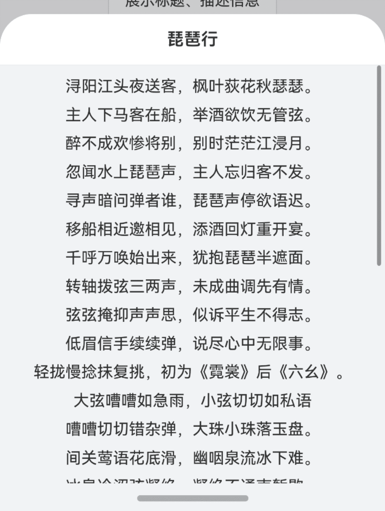
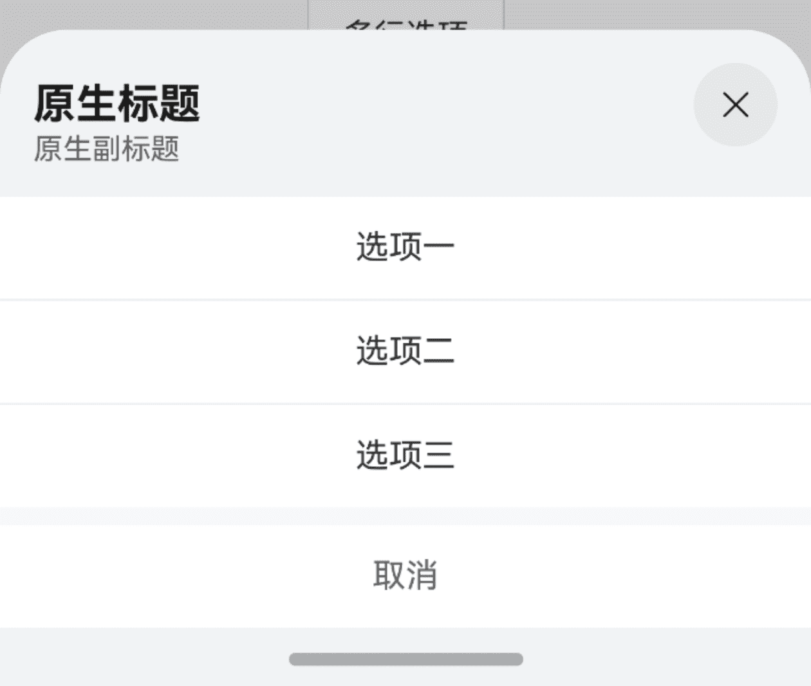

# ActionSheet 动作面板

## 介绍

底部弹起的模态面板，包含与当前情境相关的多个选项。
 
## 引入

```ts
import { IBestActionSheet } from "@ibestservices/ibest-ui-v2";
```

## 代码演示

### 基础用法



::: details 点我查看代码
```ts
@Entry
@ComponentV2
struct DemoPage {
  build() {
    Column(){
      IBestButton({
        text: '基础用法',
        onBtnClick: () => {
          IBestActionSheet.show({
            actions: ["选项一", "选项二", "选项三"],
            onSelect: (index: number) => {
              IBestToast.show(`点击了第${index}个选项`)
            }
          })
        }
      })
    }
  }
}
```
:::

### 展示图标



::: details 点我查看代码
```ts
@Entry
@ComponentV2
struct DemoPage {
  build() {
    Column(){
      IBestButton({
        text: '展示图标',
        onBtnClick: () => {
          IBestActionSheet.show({
            actions: [
              { name: '选项一', icon: $r("app.media.icon_like") },// 替换为自己项目的资源
              { name: '选项二', icon: "https://ibestui.ibestservices.com/favicon.ico" },
              { name: '选项三', icon: $r("app.media.icon_star_o") }// 替换为自己项目的资源
            ]
          })
        }
      })
    }
  }
}
```
:::

### 展示取消按钮



::: details 点我查看代码
```ts
@Entry
@ComponentV2
struct DemoPage {
  build() {
    Column(){
      IBestButton({
        text: '展示取消按钮',
        onBtnClick: () => {
          IBestActionSheet.show({
            actions: [
              { name: '选项一' },
              { name: '选项二' },
              { name: '选项三' }
            ],
            cancelText: '取消',
            onCancel: () => {
              IBestToast.show(`取消`)
            }
          })
        }
      })
    }
  }
}
```
:::

### 展示标题、描述信息



::: details 点我查看代码
```ts
@Entry
@ComponentV2
struct DemoPage {
  build() {
    Column(){
      IBestButton({
        text: '展示标题、描述信息',
        onBtnClick: () => {
          IBestActionSheet.show({
            customTitle: $r("app.string.app_name"),// 替换为自己项目的资源
            description: '这是一段描述信息',
            actions: [
              { name: $r("app.string.app_name") },// 替换为自己项目的资源
              { name: '选项二', subName: $r("app.string.app_doc_url") },// 替换为自己项目的资源
              { name: '选项三', icon: $r("app.media.app_icon") }// 替换为自己项目的资源
            ],
            cancelText: '取消'
          })
        }
      })
    }
  }
}
```
:::

### 选项状态



::: details 点我查看代码
```ts
@Entry
@ComponentV2
struct DemoPage {
  build() {
    Column(){
      IBestButton({
        text: '选项状态',
        onBtnClick: () => {
          IBestActionSheet.show({
            description: '这是一段描述信息',
            actions: [
              { name: '选项一', color: '#ff0000' },
              { name: '选项二', isDisabled: true },
              { name: '选项三' }
            ],
            cancelText: '取消'
          })
        }
      })
    }
  }
}
```
:::

### 指定选项标识


:::tip
通过选项中的 `value` 属性可指定选项的标识, 此时 `onSelect` 回调中 第二个参数为当前选中选项的标识。
:::

::: details 点我查看代码
```ts
@Entry
@ComponentV2
struct DemoPage {
  build() {
    Column(){
      IBestButton({
        text: '指定选项标识',
        onBtnClick: () => {
          IBestActionSheet.show({
            actions: [
              { name: '选项一', value: '1' },
              { name: '选项二', value: '2' },
              { name: '选项三', value: '3' }
            ],
            onSelect: (index: number, value?: string | number) => {
              IBestToast.show(`点击了第${index}个选项，标识为${value}`)
            }
          })
        }
      })
    }
  }
}
```
:::

### 多行选项


:::tip
通过配置 `actions` 为二维数组，即可实现多行选项，此时 `onSelect` 回调中第一个参数表示第几行，第二个参数表示当前行第几个，若配置了 `value` 属性，第三个参数为当前选中选项的标识。
:::

::: details 点我查看代码
```ts
@Entry
@ComponentV2
struct DemoPage {
  build() {
    Column(){
      IBestButton({
        text: '多行选项',
        onBtnClick: () => {
          IBestActionSheet.show({
            actions: [
              [
                { name: '选项一', value: '1', icon: "https://img0.baidu.com/it/u=3543009939,2144310597&fm=253&fmt=auto&app=138&f=JPEG?w=704&h=500", isDisabled: true },
                { name: '选项二', value: '2', icon: "https://img0.baidu.com/it/u=2123036823,827931345&fm=253&fmt=auto&app=120&f=JPEG?w=1280&h=800" },
                { name: '选项三', value: '3', icon: "https://img0.baidu.com/it/u=180300320,2476402890&fm=253&fmt=auto&app=120&f=JPEG?w=1280&h=800" },
                { name: '选项四', value: '4', icon: "https://img0.baidu.com/it/u=3335548191,973645921&fm=253&fmt=auto&app=138&f=JPEG?w=800&h=500" },
                { name: '选项五', value: '5', icon: "https://img0.baidu.com/it/u=2138148539,1764238981&fm=253&fmt=auto&app=138&f=JPEG?w=889&h=500" },
                { name: '选项六', value: '6', icon: "https://img1.baidu.com/it/u=733418214,3903491350&fm=253&fmt=auto&app=138&f=JPEG?w=500&h=313" },
                { name: '选项七', value: '7', icon: "https://img1.baidu.com/it/u=1718642830,3610884461&fm=253&fmt=auto&app=138&f=JPEG?w=800&h=500" }
              ],
              [
                { name: '选项八', value: '8', icon: "https://img0.baidu.com/it/u=145395842,2013084776&fm=253&fmt=auto&app=120&f=JPEG?w=889&h=500" },
                { name: '选项九', value: '9', icon: "https://img2.baidu.com/it/u=840413173,1942127153&fm=253&fmt=auto&app=138&f=JPEG?w=800&h=500" },
                { name: '选项十', value: '10', icon: "https://img0.baidu.com/it/u=863503243,1550253516&fm=253&fmt=auto&app=120&f=JPEG?w=1280&h=800" }
              ]
            ],
            cancelText: '取消',
            onSelect: (index1: number, index2?: number | string, value?: string) => {
              IBestToast.show(`点击了第${index1}行第${index2}个选项，标识为${value}`)
            }
          })
        }
      })
    }
  }
}
```
:::

### 展示自定义内容



::: details 点我查看代码
```ts
@Entry
@ComponentV2
struct DemoPage {
  @Builder defaultContent(){
    Scroll(){
      Column({ space: 10 }){
        Text("浔阳江头夜送客，枫叶荻花秋瑟瑟。")
        Text("主人下马客在船，举酒欲饮无管弦。")
        Text("醉不成欢惨将别，别时茫茫江浸月。")
        Text("忽闻水上琵琶声，主人忘归客不发。")
        Text("寻声暗问弹者谁，琵琶声停欲语迟。")
        Text("移船相近邀相见，添酒回灯重开宴。")
        Text("千呼万唤始出来，犹抱琵琶半遮面。")
        Text("转轴拨弦三两声，未成曲调先有情。")
        Text("弦弦掩抑声声思，似诉平生不得志。")
        Text("低眉信手续续弹，说尽心中无限事。")
        Text("轻拢慢捻抹复挑，初为《霓裳》后《六幺》。")
        Text("大弦嘈嘈如急雨，小弦切切如私语")
        Text("嘈嘈切切错杂弹，大珠小珠落玉盘。")
        Text("间关莺语花底滑，幽咽泉流冰下难。")
        Text("冰泉冷涩弦凝绝，凝绝不通声暂歇。")
        Text("别有幽愁暗恨生，此时无声胜有声。")
        Text("银瓶乍破水浆迸，铁骑突出刀枪鸣。")
        Text("曲终收拨当心画，四弦一声如裂帛。")
        Text("东船西舫悄无言，唯见江心秋月白。")
        Text("沉吟放拨插弦中，整顿衣裳起敛容。")
        Text("自言本是京城女，家在虾蟆陵下住。")
        Text("十三学得琵琶成，名属教坊第一部。")
        Text("曲罢曾教善才服，妆成每被秋娘妒。")
        Text("五陵年少争缠头，一曲红绡不知数。")
        Text("钿头银篦击节碎，血色罗裙翻酒污。")
        Text("今年欢笑复明年，秋月春风等闲度。")
        Text("弟走从军阿姨死，暮去朝来颜色故。")
        Text("门前冷落鞍马稀，老大嫁作商人妇。")
        Text("商人重利轻别离，前月浮梁买茶去。")
        Text("去来江口守空船，绕船月明江水寒。")
      }
      .width("100%")
      .alignItems(HorizontalAlign.Center)
      .padding(8)
    }
    .layoutWeight(1)
  }
  build() {
    Column(){
      IBestButton({
        text: '展示自定义内容',
        onBtnClick: () => {
          IBestActionSheet.show({
            customTitle: '琵琶行',
            height: 500,
            customContent: (): void => this.defaultContent()
          })
        }
      })
    }
  }
}
```
:::

### 展示原生标题



::: details 点我查看代码
```ts
@Entry
@ComponentV2
struct DemoPage {
  build() {
    Column(){
      IBestButton({
        text: '展示原生标题',
        onBtnClick: () => {
          IBestActionSheet.show({
            title: {
              title: "原生标题",
              subtitle: "原生副标题"
            },
            actions: [
              { name: '选项一' },
              { name: '选项二' },
              { name: '选项三' }
            ],
            cancelText: '取消'
          })
        }
      })
    }
  }
}
```
:::

## API

### IBestActionSheetOption 数据结构
:::tip
部分原生属性会有版本兼容问题,详情可点 <a href="https://developer.huawei.com/consumer/cn/doc/harmonyos-references-V5/ts-universal-attributes-sheet-transition-V5#sheetoptions" target="__blank">这里</a> 查阅官方文档。
:::

| 参数         | 说明                                          | 类型      | 默认值     |
| ------------ | ---------------------------------------------| --------- | ---------- |
| width        | 面板宽度, 原生属性                              | _<a href="https://developer.huawei.com/consumer/cn/doc/harmonyos-references-V5/ts-types-V5#dimension10" target="__blank">Dimension</a>_  | `100%` |
| height       | 面板高度, 原生属性                              | _<a href="https://developer.huawei.com/consumer/cn/doc/harmonyos-references-V5/ts-universal-attributes-sheet-transition-V5#sheetsize%E6%9E%9A%E4%B8%BE%E8%AF%B4%E6%98%8E" target="__blank">SheetSize</a> \| Length_ |  `SheetSize.FIT_CONTENT`  |
| backgroundColor| 半模态页面的背板颜色, 原生属性                 | _ResourceColor_ | `-` |
| detents      | 半模态页面的切换高度档位, 原生属性                | _[(SheetSize \| Length), ( SheetSize \| Length)?, (SheetSize \| Length)?]_ | `-` |
| preferType   | 半模态页面的样式, 原生属性                       | _<a href="https://developer.huawei.com/consumer/cn/doc/harmonyos-references-V5/ts-universal-attributes-sheet-transition-V5#sheettype11%E6%9E%9A%E4%B8%BE%E8%AF%B4%E6%98%8E" target="__blank">SheetType</a>_ | `-` |
| mode        | 设置半模态页面的显示层级, 原生属性                  | _<a href="https://developer.huawei.com/consumer/cn/doc/harmonyos-references-V5/ts-universal-attributes-sheet-transition-V5#sheetmode12" target="__blank">SheetMode</a>_ | `-` |
| dragBar  | 是否显示控制条, 原生属性                             | _boolean_ | `false` |
| title    | 标题, 原生属性                                      | _<a href="https://developer.huawei.com/consumer/cn/doc/harmonyos-references-V5/ts-universal-attributes-sheet-transition-V5#sheettitleoptions11" target="__blank">SheetTitleOptions</a> \| CustomBuilder_ | `-` |
| showClose    | 是否显示原生关闭图标, 原生属性, 在配置 `title` 时默认为 `true` | _boolean_ |  `false`  |
| actions      | 选项列表                                        | _(IBestActionType \| string)[] \| (IBestActionMultiLine)[][]_ |  `false`  |
| customTitle  | 自定义标题                                      | _ResourceStr_ |  `''`  |
| titleBgColor | 自定义标题背景色                                 | _ResourceColor_ |  `#fff`  |
| description  | 描述                                           | _ResourceStr_ |  `''`  |
| closeable    | 是否显示自定义关闭图标                            | _boolean_ |  `true`  |
| closeIcon    | 自定义关闭图标                                   | _ResourceStr_ |  `-`  |
| cancelText   | 取消按钮文字                                     | _ResourceStr_ |  `''`  |
| safeAreaInsetBottom| 是否开启底部安全距离适配                     | _boolean_ |  `true`  |
| closeOnBackPress   | 是否允许物理关闭                            | _boolean_ |  `true`  |
| closeOnClickOverlay| 是否允许点击遮罩关闭                         | _boolean_ |  `true`  |
| customContent   | 自定义内容                                    | _CustomBuilder_ |  `-`  |
| onOpen     | 打开面板后触发                                      | _() => void_ |  `-`  |
| onSelect   | 点击选项后触发, 当 `acions` 为一维数组时, `index1` 为选项索引, `index` 为选项标识; 当 `acions` 为二维数组时, `index1` 为点击选项的行索引, `index2` 为当前行的选项索引, `value` 为选项标识 | _(index1: number, index2?: number \| string, value?: string) => void_ |  `-`  |
| onCancel        | 点击取消按钮触发                                        | _() => void_ |  `-`  |
| onClose         | 面板关闭后触发                                          | _() => void_ |  `-`  |
| cancelTextColor | 取消按钮文字颜色        | _ResourceColor_ |  `#646566`  |
| beforeClose     | 关闭前的回调函数，返回 false 可阻止关闭，支持返回 Promise    | _() => Promise\<boolean\> \| boolean_ |  `-`  |
| itemHeight      | 选项高度     | _string_ \| _number_ |  `50`  |
| radius          | 面板圆角     | _number_ \| _BorderRadiuses_ \| _LocalizedBorderRadiuses_ |  `16`  |

### IBestActionType 数据结构
| 参数         | 说明                                          | 类型      |
| ------------ | --------------------------------------------- | --------- |
| name         | 选项文案, 必填                                 | _ResourceStr_  |
| value        | 选项标识                                       | _string_ \| _number_  |
| subName      | 选项描述                                       | _ResourceStr_ |
| color        | 选项字体颜色                                   | _ResourceColor_ |
| icon         | 选项图标                                       | _ResourceStr_ |
| isDisabled   | 是否禁用                                       | _boolean_ |
| readonly     | 是否只读                                       | _boolean_ |


### IBestActionMultiLine 数据结构
| 参数         | 说明                                          | 类型      |
| ------------ | --------------------------------------------- | --------- |
| name         | 选项文案, 必填                                 | _ResourceStr_  |
| icon         | 选项图标, 必填                                 | _ResourceStr_ |
| value        | 选项标识                                       | _string_  |
| subName      | 选项描述                                       | _ResourceStr_ |
| color        | 选项字体颜色                                   | _ResourceColor_ |
| isDisabled   | 是否禁用                                       | _boolean_ |
| readonly     | 是否只读                                       | _boolean_ |