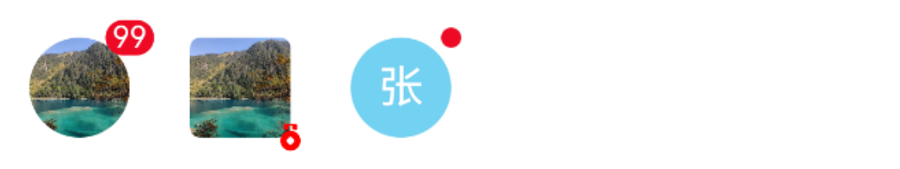

# Avatar 头像

## 介绍

用于展示用户头像。
 
## 引入

```ts
import { IBestAvatar } from "@ibestservices/ibest-ui-v2";
```

## 代码演示

### 基础用法


::: details 点我查看代码
```ts
@Entry
@ComponentV2
struct DemoPage {
  @Local avatar: string = "https://img1.baidu.com/it/u=700838104,4078529388&fm=253&fmt=auto&app=138&f=JPEG?w=500&h=500"
  build() {
    Column() {
      IBestAvatar({
        src: this.avatar,
        onAvatarClick: () => {
          IBestToast.show('点击了头像')
        }
      })
    }
  }
}
```
:::

### 头像形状


::: details 点我查看代码
```ts
@Entry
@ComponentV2
struct DemoPage {
  @Local avatar: string = "https://img1.baidu.com/it/u=700838104,4078529388&fm=253&fmt=auto&app=138&f=JPEG?w=500&h=500"
  build() {
    Row({space: 20}) {
      IBestAvatar({
        src: this.avatar,
        shape: 'circle'
      })
      IBestAvatar({
        src: this.avatar,
        shape: 'square'
      })
    }
  }
}
```
:::

### 头像尺寸


::: details 点我查看代码
```ts
@Entry
@ComponentV2
struct DemoPage {
  @Local avatar: string = "https://img1.baidu.com/it/u=700838104,4078529388&fm=253&fmt=auto&app=138&f=JPEG?w=500&h=500"
  build() {
    Row({space: 20}) {
      IBestAvatar({
        src: this.avatar,
        avatarSize: 30
      })
      IBestAvatar({
        src: this.avatar,
        avatarSize: 40
      })
      IBestAvatar({
        src: this.avatar,
        avatarSize: 50
      })
    }
  }
}
```
:::

### 图标头像


::: details 点我查看代码
```ts
@Entry
@ComponentV2
struct DemoPage {
  build() {
    Row({space: 20}) {
      IBestAvatar({
        icon: 'bill'
      })
      IBestAvatar({
        icon: 'star'
      })
    }
  }
}
```
:::

### 文字头像


::: details 点我查看代码
```ts
@Entry
@ComponentV2
struct DemoPage {
  build() {
    Row({space: 20}) {
      IBestAvatar({
        text: "Z",
        randomBgColor: true
      })
      IBestAvatar({
        text: "张",
        randomBgColor: true
      })
      IBestAvatar({
        text: "郭",
        randomBgColor: true
      })
      IBestAvatar({
        text: "柴",
        randomBgColor: true
      })
    }
  }
}
```
:::

### 显示徽标



::: details 点我查看代码
```ts
@Entry
@ComponentV2
struct DemoPage {
  @Local avatar: string = "https://img1.baidu.com/it/u=700838104,4078529388&fm=253&fmt=auto&app=138&f=JPEG?w=500&h=500"
  build() {
    Row({space: 20}) {
      IBestAvatar({
        src: this.avatar,
        badgeContent: 99
      })
      IBestAvatar({
        src: this.avatar,
        shape: 'square',
        badgeIcon: "medal",
        badgeIconColor: Color.Red,
        badgePosition: "bottom-right"
      })
      IBestAvatar({
        text: "张",
        randomBgColor: true,
        dot: true
      })
    }
  }
}
```
:::

### 默认头像


:::tip
· 当头像加载失败时, 会显示默认头像。   
· 通过 `defaultAvatar` 可设置默认头像。   
· 通过 `IBestSetGlobalConfig` 方法可设置全局默认头像。
:::

::: details 点我查看代码
```ts
@Entry
@ComponentV2
struct DemoPage {
  @Local avatar: string = 'https://img1.baidu.com/it/u=700838104,4078529388'
  build() {
    Row({space: 20}) {
      IBestAvatar({
        src: this.avatar
      })
    }
  }
}
```
:::

### 头像组


::: details 点我查看代码
```ts
@Entry
@ComponentV2
struct DemoPage {
  @Local urls: string[] = [
    "https://img1.baidu.com/it/u=700838104,4078529388&fm=253&fmt=auto&app=138&f=JPEG?w=500&h=500",
    "https://img0.baidu.com/it/u=447148445,3812237851&fm=253&fmt=auto&app=138&f=JPEG?w=500&h=500",
    "https://img0.baidu.com/it/u=1596600438,2136408442&fm=253&fmt=auto&app=138&f=JPEG?w=500&h=500",
    "https://img0.baidu.com/it/u=2816983398,655618517&fm=253&fmt=auto&app=138&f=JPEG?w=500&h=500",
    "https://pics4.baidu.com/feed/1ad5ad6eddc451da34d4638413f67668d016325c.jpeg",
    "https://img0.baidu.com/it/u=2397297586,1192210697&fm=253&fmt=auto&app=138&f=JPEG?w=500&h=500",
    "https://img0.baidu.com/it/u=781626259,587761743&fm=253&fmt=auto&app=138&f=JPEG?w=300&h=300",
    "https://img0.baidu.com/it/u=3731477373,291511913&fm=253&fmt=auto&app=138&f=JPEG?w=500&h=500"
  ]
  build() {
    Column({space: 20}){
      IBestAvatarGroup({
        urls: this.urls,
        onMoreClick: () => {
          IBestToast.show('点击了更多')
        }
      })
      IBestAvatarGroup({
        urls: this.urls,
        shape: 'square',
        gap: 0.3,
        max: 7,
        moreText: '更多',
        onMoreClick: () => {
          IBestToast.show('点击了更多')
        }
      })
    }
    .alignItems(HorizontalAlign.Start)
  }
}
```
:::


## API

### IBestAvatar @Props

| 参数         | 说明                                 | 类型      | 默认值     |
| ------------ | ----------------------------------- | --------- | ---------- |
| src          | 头像地址                              | _PixelMap_ \| _ResourceStr_ \| _DrawableDescriptor_  | `''` |
| shape        | 头像形状，可选值 `square` 、`circle`   | _string_ | `circle` |
| avatarSize   | 头像大小                              | _string_ \| _number_ | `40` |
| objectFit    | 头像裁剪类型                           | _ImageFit_ |  `ImageFit.Cover`  |
| radius       | 圆角值                                | _Length_ \| _BorderRadiuses_ \| _LocalizedBorderRadiuses_ |  `4`  |
| bgColor      | 背景色                                | _ResourceColor_ |  `#c8c9cc`  |
| text         | 文字替代图片, 优先级高于src            | _ResourceStr_ | `''` |
| icon         | 显示的图标, 优先级大于text             | _ResourceStr_ | `''` |
| iconColor    | 图标、文字颜色                         | _ResourceColor_ |  `#ffffff`  |
| iconFontSize | 图标、文字大小                         | _string_ \| _number_ | `18` |
| randomBgColor| 随机背景色                             | _boolean_ | `false` |
| defaultAvatar| 默认头像，可全局配置                    | _ResourceStr_ | `''` |
| badgeContent | 徽标内容                               | _string_ \| _number_ | `''` |
| badgeIcon    | 徽标图标, 优先级高于 content dot        | _ResourceStr_ | `''` |
| badgeIconSize| 徽标图标大小                            | _string_ \| _number_ | `12` |
| badgeIconColor| 徽标图标颜色                           | _ResourceColor_ |  `''`  |
| badgeColor   | 徽标背景色                              | _ResourceColor_ |  `#DB3131`  |
| dot          | 是否展示为小红点                        | _boolean_ | `false` |
| max          | 最大值,超过最大值会显示 {max}+,仅当 content 为数字时有效| _number_ |  `-1`  |
| showZero     | 值为0时是否显示徽标                      | _boolean_ |  `true`  |
| badgePosition| 徽标位置, 可选值 `top-left` `top-right` `bottom-left` `bottom-right`| _string_ |  `top-right`  |

### IBestAvatar Events

| 事件名     | 说明                                             | 回调参数                         |
| ---------- | ------------------------------------------------| -------------------------------- |
| onAvatarClick | 点击头像的回调事件    | `-` |

### IBestAvatarGroup @Props
| 参数         | 说明                                 | 类型      | 默认值     |
| ------------ | ----------------------------------- | --------- | ---------- |
| urls         | 头像地址列表                         | _(_PixelMap_ \| _ResourceStr_ \| _DrawableDescriptor_)[]_  | `[]` |
| max          | 最多展示数量                         | _number_ | `5` |
| shape        | 头像形状，可选值 `square` 、`circle`  | _string_ | `circle` |
| avatarSize   | 头像大小                             | _string_ \| _number_ | `40` |
| objectFit    | 头像裁剪类型                         | _ImageFit_ |  `ImageFit.Cover`  |
| radius       | 圆角值                               | _Length_ | _BorderRadiuses_ \| _LocalizedBorderRadiuses_ |  `4`  |
| gap          | 头像之间遮挡比例（0.5 代表遮挡 50%）   | _number_ | `0.5` |
| showMore     | 超出max时是否显示更多提示              | _boolean_ | `true` |
| moreText     | 更多文案, 默认为 +n，n为超出max数量, 仅当showMore为true时生效，当头像列表小于max时，也可设置moreText强制显示更多 | _ResourceStr_ | `''` |
| moreTextSize | 更多文案大小                          | _string_ \| _number_ | `14` |

### IBestAvatarGroup Events

| 事件名     | 说明                                             | 回调参数                         |
| ---------- | ------------------------------------------------| -------------------------------- |
| onMoreClick | 点击更多的回调事件    | `-` |

## 主题定制

组件提供了下列颜色变量，可用于自定义深色/浅色模式样式，使用方法请参考 [颜色模式](../../guide/color-mode/index.md) 章节，如需要其它颜色变量可提 [issue](https://github.com/ibestservices/ibest-ui/issues)。

| 名称                                       | 描述                              | 默认值        |
| -------------------------------------------|----------------------------------|--------------|
| ibest_avatar_background                    | 背景颜色                          | `#c8c9cc`   |