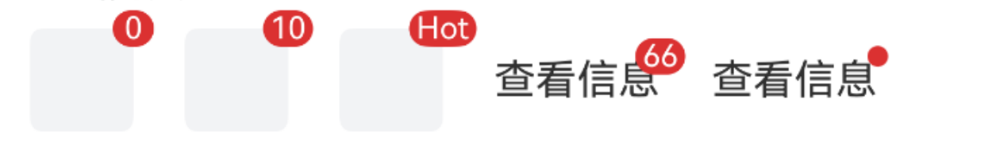
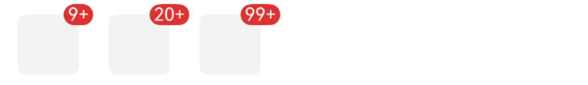
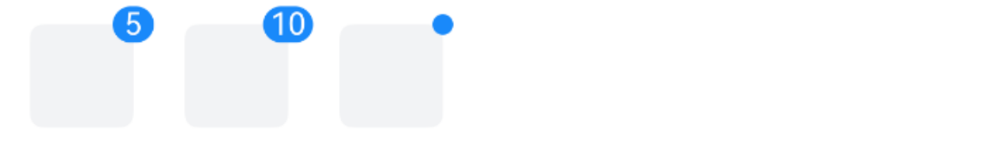
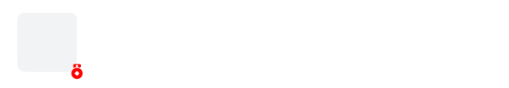
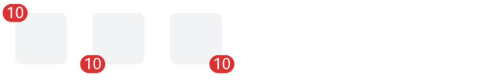

# Badge 徽标

## 介绍

在右上角展示徽标数字或小红点。
 
## 引入

```ts
import { IBestBadge } from "@ibestservices/ibest-ui-v2";
```

## 代码演示

### 基础用法



::: details 点我查看代码
```ts
@Entry
@ComponentV2
struct DemoPage {
  @Builder badgeContent() {
    Row()
      .width(40)
      .height(40)
      .borderRadius(5)
      .backgroundColor("#f2f3f5")
  }
  build() {
    Row({space: 20}) {
      IBestBadge({
        content: 0
      }){
        this.badgeContent()
      }
      IBestBadge({
        content: 10
      }){
        this.badgeContent()
      }
      IBestBadge({
        content: "Hot"
      }){
        this.badgeContent()
      }
      IBestBadge({
        content: 66
      }){
        Text("查看信息")
      }
      IBestBadge({
        dot: true
      }){
        Text("查看信息")
      }
    }
  }
}
```
:::

### 最大值



::: details 点我查看代码
```ts
@Entry
@ComponentV2
struct DemoPage {
  @Builder badgeContent() {
    Row()
      .width(40)
      .height(40)
      .borderRadius(5)
      .backgroundColor("#f2f3f5")
  }
  build() {
    Row({space: 20}) {
      IBestBadge({
        content: 20,
        max: 9
      }){
        this.badgeContent()
      }
      IBestBadge({
        content: 50,
        max: 20
      }){
        this.badgeContent()
      }
      IBestBadge({
        content: 200,
        max: 99
      }){
        this.badgeContent()
      }
    }
  }
}
```
:::

### 自定义颜色



::: details 点我查看代码
```ts
@Entry
@ComponentV2
struct DemoPage {
  @Builder badgeContent() {
    Row()
      .width(40)
      .height(40)
      .borderRadius(5)
      .backgroundColor("#f2f3f5")
  }
  build() {
    Row({space: 20}) {
      IBestBadge({
        content: 5,
        color: '#1989fa'
      }){
        this.badgeContent()
      }
      IBestBadge({
        content: 10,
        color: '#1989fa'
      }){
        this.badgeContent()
      }
      IBestBadge({
        dot: true,
        color: '#1989fa'
      }){
        this.badgeContent()
      }
    }
  }
}
```
:::

### 显示图标



::: details 点我查看代码
```ts
@Entry
@ComponentV2
struct DemoPage {
  @Builder badgeContent() {
    Row()
      .width(40)
      .height(40)
      .borderRadius(5)
      .backgroundColor("#f2f3f5")
  }
  build() {
    Row({space: 20}) {
      IBestBadge({
        icon: "medal",
        iconColor: Color.Red,
        badgePosition: "bottom-right"
      }){
        this.badgeContent()
      }
    }
  }
}
```
:::

### 自定义徽标位置



::: details 点我查看代码
```ts
@Entry
@ComponentV2
struct DemoPage {
  @Builder badgeContent() {
    Row()
      .width(40)
      .height(40)
      .borderRadius(5)
      .backgroundColor("#f2f3f5")
  }
  build() {
    Row({space: 20}) {
      IBestBadge({
        content: 10,
        badgePosition: "top-left"
      }){
        this.badgeContent()
      }
      IBestBadge({
        content: 10,
        badgePosition: "bottom-left"
      }){
        this.badgeContent()
      }
      IBestBadge({
        content: 10,
        badgePosition: "bottom-right"
      }){
        this.badgeContent()
      }
    }
  }
}
```
:::


## API

### @Props

| 参数         | 说明                                 | 类型      | 默认值     |
| ------------ | -------------------------------------| --------- | ---------- |
| content      | 徽标内容                              | _string_ \| _number_  | `''` |
| color        | 徽标背景色                            | _ResourceColor_ | `#DB3131` |
| dot          | 是否展示为小红点                       | _boolean_ | `false` |
| max          | 最大值,超过最大值会显示 {max}+,仅当 content 为数字时有效| _number_ |  `-1`  |
| showZero     | 值为0时是否显示徽标                     | _boolean_ |  `true`  |
| badgePosition| 徽标位置, 可选值 `top-left` `top-right` `bottom-left` `bottom-right`| _string_ |  `top-right`  |
| icon <span style="font-size: 12px; padding:2px 4px;color:#3D8AF2;border-radius:4px;border: 1px solid #3D8AF2">1.0.1</span>| 徽标图标, 优先级高于 content dot | _ResourceStr_ | `''` |
| iconColor <span style="font-size: 12px; padding:2px 4px;color:#3D8AF2;border-radius:4px;border: 1px solid #3D8AF2">1.0.1</span>| 徽标图标颜色 | _ResourceColor_ | `''` |
| iconSize <span style="font-size: 12px; padding:2px 4px;color:#3D8AF2;border-radius:4px;border: 1px solid #3D8AF2">1.0.1</span>| 徽标图标大小 | _string_ \| _number_  | `12` |

### 插槽

| 插槽名             | 说明               | 类型             |
| ------------------| ------------------| ----------------|
| defaultBuilder    | 默认内容的插槽      | _CustomBuilder_ |

## 主题定制

组件提供了下列颜色变量，可用于自定义深色/浅色模式样式，使用方法请参考 [颜色模式](../../guide/color-mode/index.md) 章节，如需要其它颜色变量可提 [issue](https://github.com/ibestservices/ibest-ui/issues)。

| 名称                                       | 描述                              | 默认值        |
| -------------------------------------------|----------------------------------|--------------|
| ibest_badge_background                     | 徽标背景颜色                       | `#ee0a24`   |
| ibest_badge_text_color                     | 徽标文字颜色                       | `#fff`   |