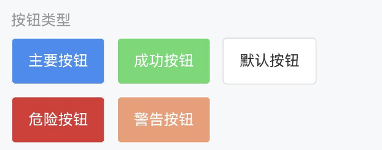
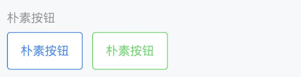
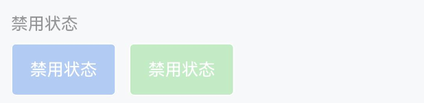
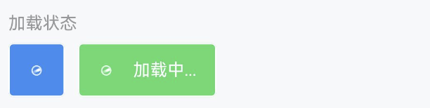
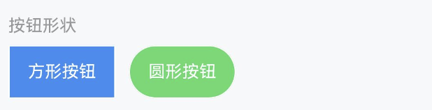
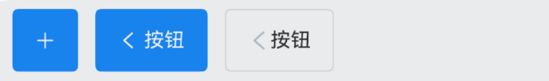
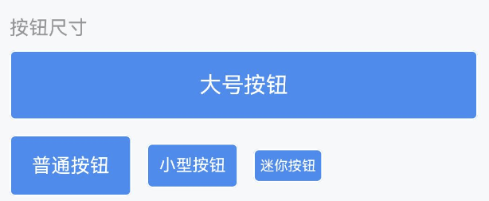
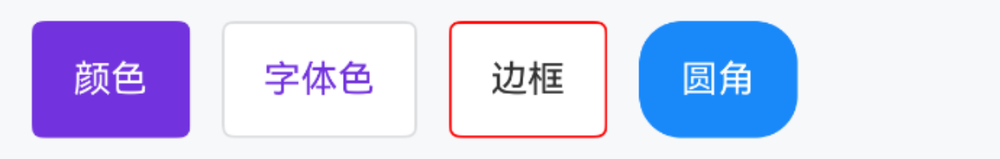
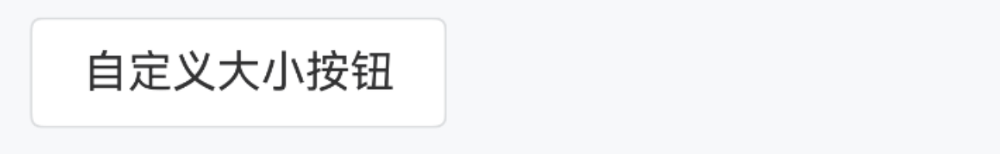

# Button 按钮

## 介绍

按钮用于触发一个操作，如提交表单。

## 引入

```ts
import { IBestButton } from "@ibestservices/ibest-ui-v2";
```

## 代码演示

### 按钮类型


::: tip
按钮支持 `default`、`primary`、`success`、`warning`、`danger` 五种类型，默认为 `default`。
:::

::: details 点我查看代码
```ts
@Entry
@ComponentV2
struct DemoPage {
  build() {
    Flex({ wrap: FlexWrap.Wrap, space: {main: LengthMetrics.vp(12), cross: LengthMetrics.vp(12)} }) {
      IBestButton({
        text: '主要按钮',
        type: 'primary'
      })
      IBestButton({
        text: '成功按钮',
        type: 'success'
      })
      IBestButton({
        text: '默认按钮',
        type: 'default'
      })
      IBestButton({
        text: '危险按钮',
        type: 'danger'
      })
      IBestButton({
        text: '警告按钮',
        type: 'warning'
      })
    }
  }
}
```
:::

### 朴素按钮


::: tip
通过 `plain` 属性将按钮设置为朴素按钮，朴素按钮的文字为按钮颜色，背景为白色。
:::

::: details 点我查看代码
```ts
@Entry
@ComponentV2
struct DemoPage {
  build() {
    Row({ space: 12 }) {
      IBestButton({
        text: '朴素按钮',
        type: 'primary',
        plain: true
      })
      IBestButton({
        text: '朴素按钮',
        plain: true,
        type: 'success'
      })
    }
  }
}
```
:::

### 禁用状态


::: tip
通过 `disabled` 属性来禁用按钮，禁用状态下按钮不可点击。
:::

::: details 点我查看代码
```ts
@Entry
@ComponentV2
struct DemoPage {
  build() {
    Row({ space: 12 }) {
      IBestButton({
        text: '禁用状态',
        type: 'primary',
        disabled: true
      })
      IBestButton({
        text: '禁用状态',
        type: 'success',
        disabled: true
      })
    }
  }
}
```
:::

### 加载状态


::: tip
通过 `loading` 属性设置按钮为加载状态，加载状态下默认会隐藏按钮文字，可以通过 `loadingText` 设置加载状态下的文字。
:::

::: details 点我查看代码
```ts
@Entry
@ComponentV2
struct DemoPage {
  build() {
    Row({ space: 12 }) {
      IBestButton({
        loading: true,
        type: 'primary',
      })
      IBestButton({
        text: '加载状态',
        loadingText: '加载中...',
        type: 'success',
        loading: true
      })
    }
  }
}
```
:::

### 按钮形状


::: tip
通过 `square` 设置方形按钮，通过 `round` 设置圆形按钮。
:::

::: details 点我查看代码

```ts
@Entry
@ComponentV2
struct DemoPage {
  build() {
    Row({ space: 12 }) {
      IBestButton({
        text: "方形按钮",
        type: "primary",
        square: true,
      });

      IBestButton({
        text: "圆形按钮",
        type: "success",
        round: true,
      });
    }
  }
}
```

:::

### 图标按钮


::: tip
通过 `iconBuilder` 插槽设置按钮图标。
:::

::: details 点我查看代码
```ts
@Entry
@ComponentV2
struct ButtonPage {
  @Builder Arrow(){
    Image($r('app.media.title_back'))
      .width(16)
  }
  build(){
    Row({ space: 12 }) {
      IBestButton({
        type: 'primary',
        icon: 'plus'
      })
      IBestButton({
        text: '按钮',
        type: 'primary',
        iconPosition: "right",
        icon: 'arrow'
      })
      IBestButton({
        text: '按钮',
        type: 'primary',
        iconPosition: "top",
        icon: $r('app.media.app_icon')
      })
      IBestButton({
        type: 'primary',
        text: '按钮',
        iconPosition: "bottom",
        iconBuilder: (): void => this.Arrow()
      })
    }
  }
}
```
:::

### 按钮尺寸


::: tip
支持 `large`、`normal`、`small`、`mini` 四种尺寸，默认为 `normal`
:::

::: details 点我查看代码
```ts
@Entry
@ComponentV2
struct ButtonPage {
  build(){
    Row({ space: 12 }) {
      IBestButton({
        text: '大号按钮',
        type: 'primary',
        buttonSize: 'large'
      })
      IBestButton({
        type: 'primary',
        text: '普通按钮',
      })
      IBestButton({
        text: '小型按钮',
        type: 'primary',
        buttonSize: 'small'
      })
      IBestButton({
        text: '迷你按钮',
        type: 'primary',
        buttonSize: 'mini'
      })
    }
  }
}
```
:::

### 自定义样式


::: tip
通过 `color` 属性可以自定义按钮的颜色。
:::

::: details 点我查看代码
```ts
@Entry
@ComponentV2
struct ButtonPage {
  build(){
    Row({space: 12}) {
      IBestButton({
        text: '颜色',
        color: "#7232dd"
      })
      IBestButton({
        text: '字体色',
        fontColor: "#7232dd"
      })
      IBestButton({
        text: '边框',
        btnBorderColor: "red"
      })
      IBestButton({
        type: "primary",
        text: '圆角',
        btnBorderRadius: 16
      })
    }
  }
}
```
:::

### 自定义大小


::: tip
通过 `btnWidth` `btnHeight` 属性可以自定义按钮的大小, `btnFontSize` 属性可设置按钮文字大小。
:::

::: details 点我查看代码
```ts
@Entry
@ComponentV2
struct ButtonPage {
  build(){
    IBestButton({
      text: "自定义大小按钮",
      btnWidth: 150,
      btnHeight: 40,
      btnFontSize: 16
    })
  }
}
```
:::

## API

### @Props

| 参数         | 说明                                                | 类型       | 默认值      |
| ------------ | ---------------------------------------------------| ----------| -----------|
| type         | 类型，可选值为 `primary` `success` `warning` `danger`| _string_  | `default`   |
| buttonSize   | 尺寸，可选值为 `large` `small` `mini`                | _string_  | `normal`    |
| btnWidth     | 按钮宽度，不写的话则使用 `buttonSize` 尺寸             | _string_ \| _number_ | `-` |
| btnHeight    | 按钮高度，不写的话则使用 `buttonSize` 尺寸             | _string_ \| _number_ | `-` |
| btnFontSize  | 按钮文字大小，不写的话则使用 `buttonSize` 尺寸          | _string_ \| _number_ | `-` |
| text         | 按钮文字                                            | _ResourceStr_   |   `''`   |
| color        | 按钮颜色                                            | _ResourceColor_ |     |
| iconPosition | 图标展示位置，可选值为 `left` `right` `top` `bottom`  | _string_  | `left`    |
| plain        | 是否为朴素按钮                                       | _boolean_ | `false`  |
| square       | 是否为方形按钮                                       | _boolean_ | `false`  |
| round        | 是否为圆形按钮                                       | _boolean_ | `false`  |
| disabled     | 是否禁用按钮                                         | _boolean_ | `false`  |
| hairline     | 是否使用细边框                                       | _boolean_ | `false`  |
| loading      | 是否显示为加载状态                                    | _boolean_ | `false`  |
| loadingText  | 加载状态提示文字                                      | _ResourceStr_ |  `''`  |
| loadingSize  | 加载图标大小，如果为-1 默认跟随字体大小                 | _string_ \| _number_  | `-1` |
| icon         | 按钮图标                                             | _ResourceStr_ | `-` |
| fontColor    | 按钮文字颜色                                         | _ResourceColor_ | `-` |
| btnBorderColor | 按钮边框颜色                                       | _ResourceColor_ | `-` |
| btnBorderRadius| 按钮圆角                                           | _Length_ \| _BorderRadiuses_ \| _LocalizedBorderRadiuses_ | `-` |
| space          | 文字与图标间距                                      | _string_ \| _number_ | `4` |
| fontWeight     | 文字字重                                            | _string_ \| _number_ \| FontWeight | `Normal` |
| btnPadding     | 按钮内边距                                          | _Length_ \| _Padding_ \| _LocalizedPadding_ | `-` |
| stateEffect    | 是否开启按压态                                      | _boolean_ | `true` |

### Events

| 事件名     | 说明                                             | 事件类型                         |
| ---------- | ------------------------------------------------| -------------------------------- |
| onBtnClick | 点击按钮的回调事件，按钮状态不为加载或禁用时触发     | `() => void` |

### 插槽

| 插槽名             | 说明                                                     | 类型             |
| ------------------ | -------------------------------------------------------| ----------------|
| defaultBuilder     | 按钮内容的插槽，使用该插槽后将完全接管按钮内容，其余插槽均失效    | _CustomBuilder_ |
| iconBuilder        | 按钮图标的插槽，`loading`为`true`时，将显示`loading`图标     | _CustomBuilder_ |
| loadingIconBuilder | `loading` 状态的图标，使用该插槽将替换默认的 `loading` 图标   | _CustomBuilder_ |
