# Calendar 日历

## 介绍

日历用于选择单个、多个日期或日期范围。
 
## 引入

```ts
import { IBestCalendar, IBestCalendarDialog, IBestCalendarConfirmResult } from "@ibestservices/ibest-ui-v2";
```

## 代码演示

### 选择单个日期

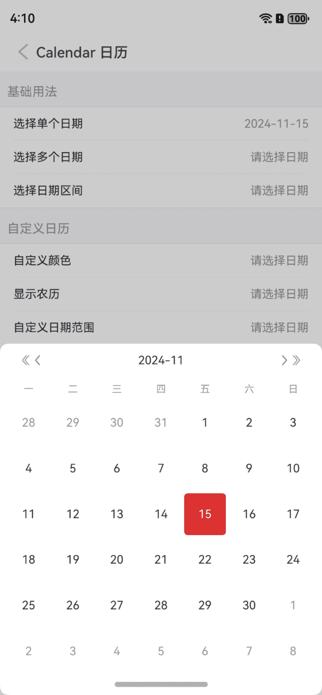

::: details 点我查看代码

```ts
@Entry
@ComponentV2
struct DemoPage {
  @Local visible: boolean = false
  @Local selectDate: string = "请选择日期"
  onDialogConfirm(value: IBestCalendarConfirmResult[]): void {
    console.log("onConfirm", JSON.stringify(value))
    this.selectDate = value.map(item => item.dateStr).join(",")
  }
  build() {
    Column(){
      IBestCell({
        title: '选择单个日期',
        value: this.selectDate,
        onCellClick: () => {
          this.visible = true
        }
      })
      IBestCalendarDialog({
        visible: this.visible!!,
        onConfirm: (value): void => this.onDialogConfirm(value)
      })
    }
  }
}
```
:::

### 选择多个日期

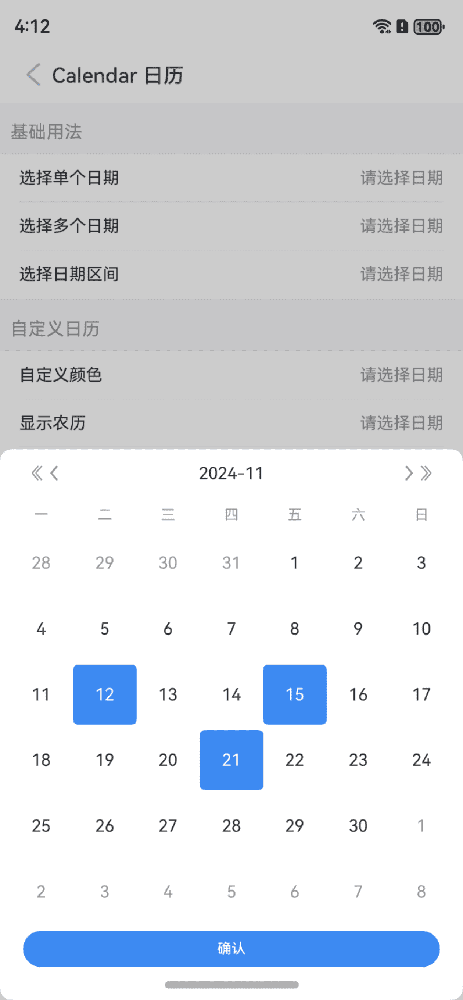

::: details 点我查看代码

```ts
@Entry
@ComponentV2
struct DemoPage {
  @Local visible: boolean = false
  @Local selectDate: string = "请选择日期"
  onDialogConfirm(value: IBestCalendarConfirmResult[]): void {
    console.log("onConfirm", JSON.stringify(value)) 
    this.selectDate = value.map(item => item.dateStr).join(",")
  }
  build() {
    Column(){
      IBestCell({
        title: '选择多个日期',
        value: this.selectDate,
        onCellClick: () => {
          this.visible = true
        }
      })
      IBestCalendarDialog({
        visible: this.visible!!,
        type: "danger",
        selectType: "multiple",
        onConfirm: (value): void => this.onDialogConfirm(value)
      })
    }
  }
}
```

:::

### 选择日期区间

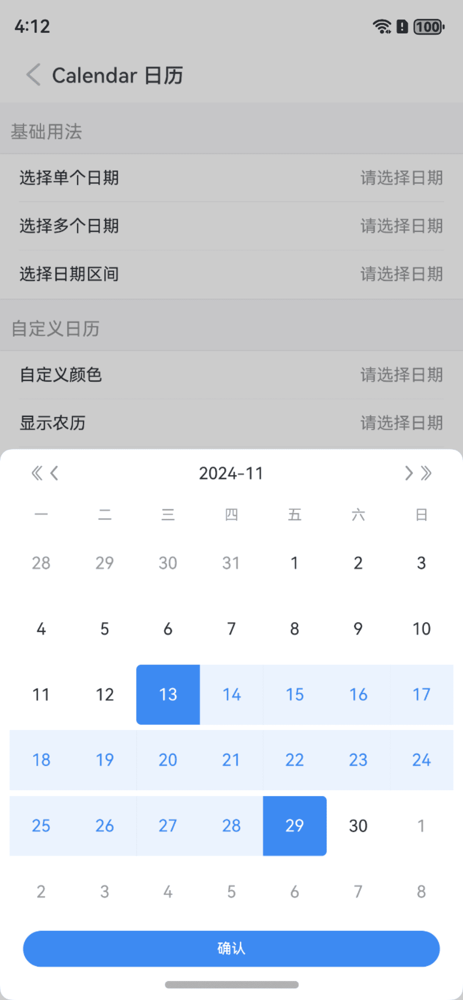

::: details 点我查看代码

```ts
@Entry
@ComponentV2
struct DemoPage {
  @Local visible: boolean = false
  @Local selectDate: string = "请选择日期"
  onDialogConfirm(value: IBestCalendarConfirmResult[]): void {
    console.log("onConfirm", JSON.stringify(value)) 
    this.selectDate = value.map(item => item.dateStr).join(",")
  }
  build() {
    Column(){
      IBestCell({
        title: '选择日期区间',
        value: this.selectDate,
        onCellClick: () => {
          this.visible = true
        }
      })
      IBestCalendarDialog({
        visible: this.visible!!,
        selectType: "range",
        onConfirm: (value): void => this.onDialogConfirm(value)
      })
    }
  }
}
```

:::

### 自定义选中样式

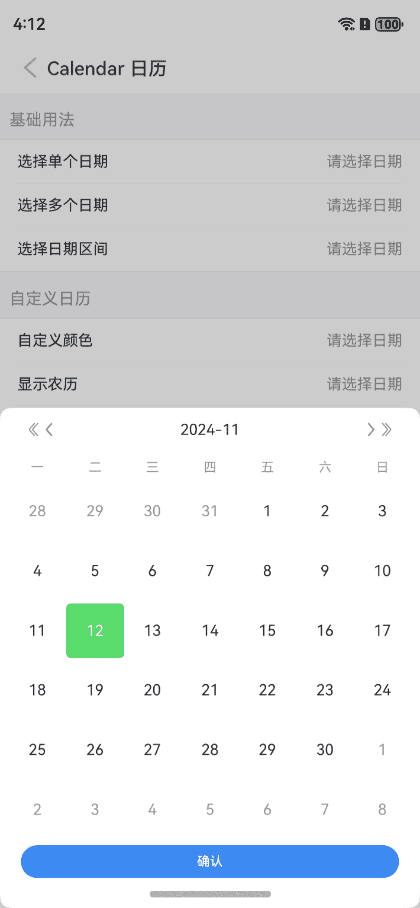

::: tip
通过 `type` 属性可修改选中样式，支持 `primary`、`success`、`warning`、`danger` 四种选中类型，默认为 `primary`，也可通过`selectedColor`属性自定义选中颜色，同时设置时selectedColor优先。
:::

::: details 点我查看代码

```ts
@Entry
@ComponentV2
struct DemoPage {
  @Local visible: boolean = false
  @Local selectDate: string = "请选择日期"
  onDialogConfirm(value: IBestCalendarConfirmResult[]): void {
    console.log("onConfirm", JSON.stringify(value)) 
    this.selectDate = value.map(item => item.dateStr).join(",")
  }
  build() {
    Column(){
      IBestCell({
        title: '选择日期',
        value: this.selectDate,
        onCellClick: () => {
          this.visible = true
        }
      })
      IBestCalendarDialog({
        visible: this.visible!!,
        type: "danger",
        selectedColor: "#58db6b",
        onConfirm: (value): void => this.onDialogConfirm(value)
      })
    }
  }
}
```

:::

### 显示农历

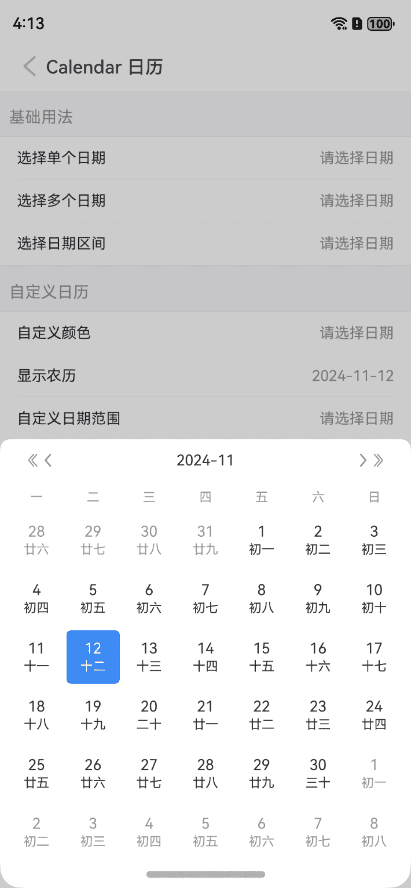
::: tip
通过 `isShowLunar` 属性可设置显示农历，通过 `cornerRadius` 属性可设置弹框圆角。
:::

::: details 点我查看代码

```ts
@Entry
@ComponentV2
struct DemoPage {
  @Local visible: boolean = false
  @Local selectDate: string = "请选择日期"
  onDialogConfirm(value: IBestCalendarConfirmResult[]): void {
    console.log("onConfirm", JSON.stringify(value)) 
    this.selectDate = value.map(item => item.dateStr).join(",")
  }
  build() {
    Column(){
      IBestCell({
        title: '选择日期',
        value: this.selectDate,
        onCellClick: () => {
          this.visible = true
        }
      })
      IBestCalendarDialog({
        visible: this.visible!!,
        isShowLunar: true,
        cornerRadius: 20,
        onConfirm: (value): void => this.onDialogConfirm(value)
      })
    }
  }
}
```

:::

### 自定义日期范围

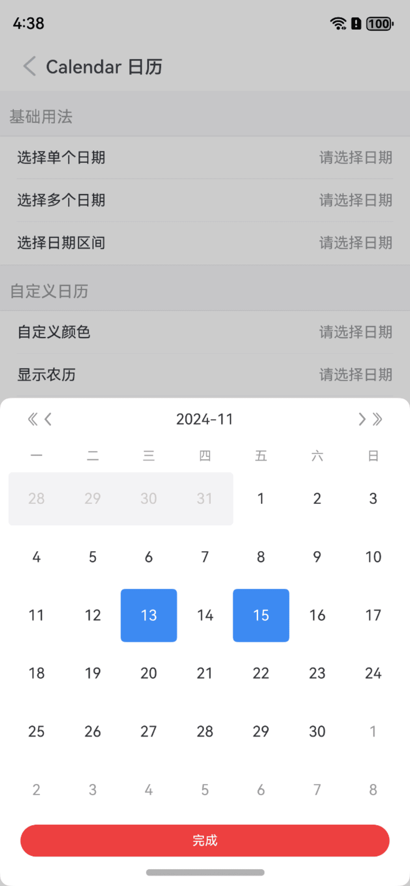
::: tip
通过 `minDate` 属性可设置最小日期，`maxDate` 属性可设置最大日期。
:::

::: details 点我查看代码

```ts
@Entry
@ComponentV2
struct DemoPage {
  @Local visible: boolean = false
  @Local selectDate: string = "请选择日期"
  onDialogConfirm(value: IBestCalendarConfirmResult[]): void {
    console.log("onConfirm", JSON.stringify(value)) 
    this.selectDate = value.map(item => item.dateStr).join(",")
  }
  build() {
    Column(){
      IBestCell({
        title: '选择日期',
        value: this.selectDate,
        onCellClick: () => {
          this.visible = true
        }
      })
      IBestCalendarDialog({
        visible: this.visible!!,
        selectType: "multiple",
        selectedStyleType: "circle",
        minDate: new Date(),
        maxDate: new Date("2025-01-01"),
        confirmBtnColor: "#ed4040",
        confirmBtnText: "完成",
        onConfirm: (value): void => this.onDialogConfirm(value)
      })
    }
  }
}
```

:::

### 区间最大范围

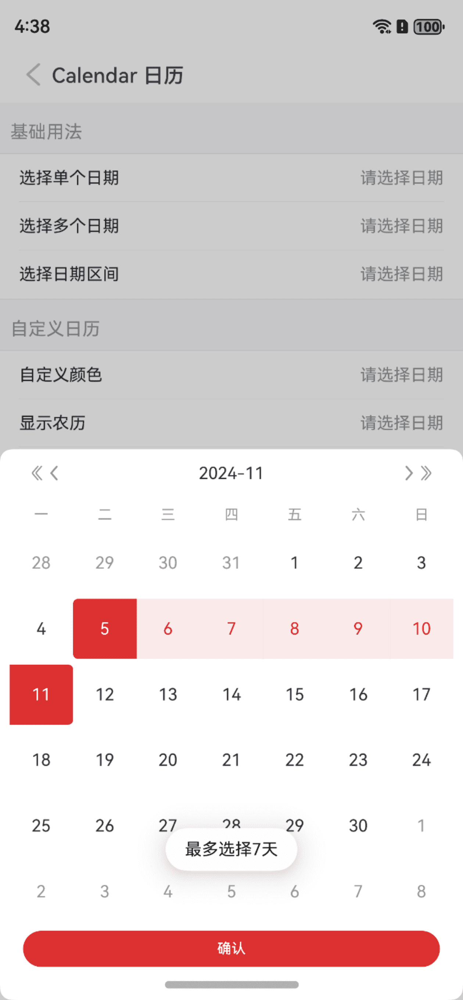
::: tip
通过 `maxRange` 属性可设置区间最大范围。
:::

::: details 点我查看代码

```ts
@Entry
@ComponentV2
struct DemoPage {
  @Local visible: boolean = false
  @Local selectDate: string = "请选择日期"
  onDialogConfirm(value: IBestCalendarConfirmResult[]): void {
    console.log("onConfirm", JSON.stringify(value)) 
    this.selectDate = value.map(item => item.dateStr).join(",")
  }
  build() {
    Column(){
      IBestCell({
        title: '选择日期区间',
        value: this.selectDate,
        onCellClick: () => {
          this.visible = true
        }
      })
      IBestCalendarDialog({
        visible: this.visible!!,
        type: "danger",
        selectType: "range",
        maxRange: 7,
        onConfirm: (value): void => this.onDialogConfirm(value)
      })
    }
  }
}
```
:::

### 自定义周起始日期

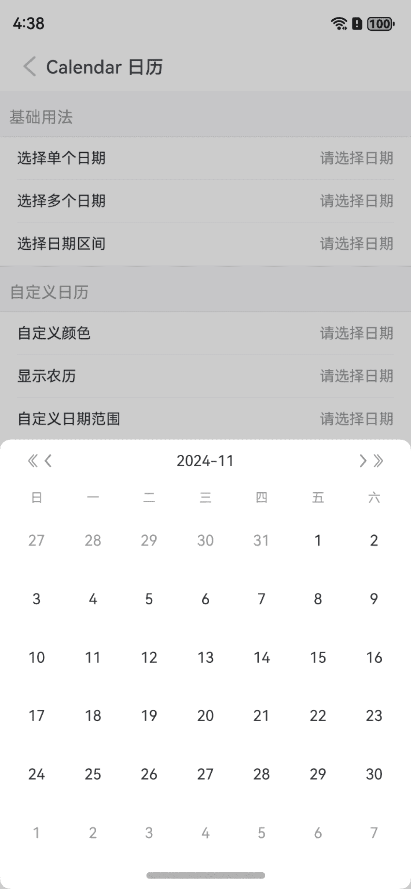
::: tip
通过 `weekFirstDay` 属性可以自定义周起始日期。
:::

::: details 点我查看代码

```ts
@Entry
@ComponentV2
struct DemoPage {
  @Local visible: boolean = false
  @Local selectDate: string = "请选择日期"
  onDialogConfirm(value: IBestCalendarConfirmResult[]): void {
    console.log("onConfirm", JSON.stringify(value)) 
    this.selectDate = value.map(item => item.dateStr).join(",")
  }
  build() {
    Column(){
      IBestCell({
        title: '选择日期',
        value: this.selectDate,
        onCellClick: () => {
          this.visible = true
        }
      })
      IBestCalendarDialog({
        visible: this.visible!!,
        weekFirstDay: 0,
        onConfirm: (value): void => this.onDialogConfirm(value)
      })
    }
  }
}
```

:::

### 显示月份背景水印

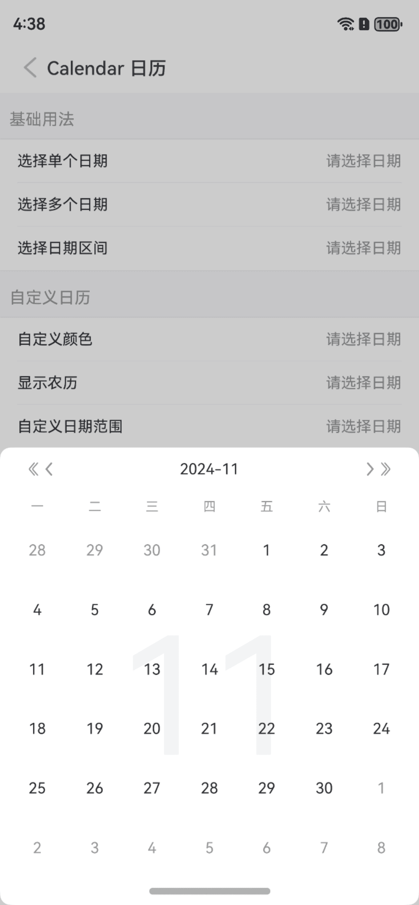
::: tip
通过 `isShowMark` 属性可以显示月份背景水印。
:::

::: details 点我查看代码
```ts
@Entry
@ComponentV2
struct DemoPage {
  @Local visible: boolean = false
  @Local selectDate: string = "请选择日期"
  onDialogConfirm(value: IBestCalendarConfirmResult[]): void {
    console.log("onConfirm", JSON.stringify(value)) 
    this.selectDate = value.map(item => item.dateStr).join(",")
  }
  build() {
    Column(){
      IBestCell({
        title: '选择日期',
        value: this.selectDate,
        onCellClick: () => {
          this.visible = true
        }
      })
      IBestCalendarDialog({
        visible: this.visible!!,
        weekFirstDay: "日",
        onConfirm: (value): void => this.onDialogConfirm(value)
      })
    }
  }
}
```
:::

### 平铺展示

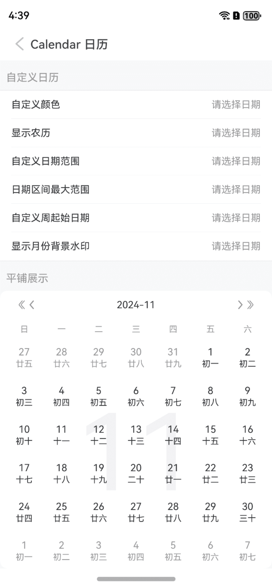

::: details 点我查看代码
```ts
@Entry
@ComponentV2
struct DemoPage {
  build() {
    Column(){
      IBestCalendar({
        isShowLunar: true,
        weekFirstDay: "日",
        selectedStyleType: "normal",
        selectType: "multiple",
        selectedColor: "#ed4040",
        isShowMark: true,
        onConfirm: (value: IBestCalendarConfirmResult[]) => {
          let text = value.map(item => item.dateStr).join(",")
          promptAction.showDialog({
            message: `当前日期为：${text}`,
            alignment: DialogAlignment.Center
          })
        }
      })
    }
  }
}
```
:::

### 自定义单个日期样式

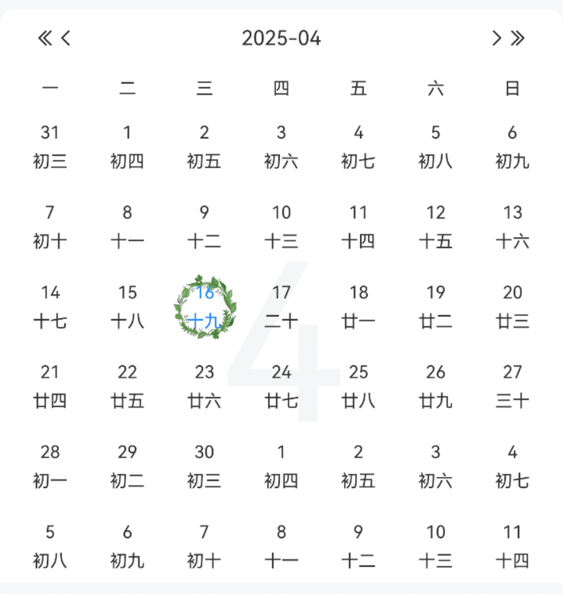

::: details 点我查看代码
```ts
import { IBestCalendarDayItem } from "@ibestservices/ibest-ui-v2";
@Entry
@ComponentV2
struct DemoPage {
  @Builder itemBuilder($$: IBestCalendarDayItem){
    Column({space: 6}){
      Text($$.day)
        .fontSize(12)
        .fontColor($$.isSelected ? "#1989fa" : "#333")
      Text($$.lunarDay)
        .fontSize(12)
        .fontColor($$.isSelected ? "#1989fa" : "#333")
    }
    .width(50)
    .aspectRatio(1)
    .justifyContent(FlexAlign.Center)
    .backgroundImage($$.isSelected ? "https://img95.699pic.com/xsj/0w/ev/jl.jpg%21/fh/300" : "")
    .backgroundImageSize(ImageSize.FILL)
    .backgroundImagePosition(Alignment.Center)
  }
  build() {
    Column(){
      IBestCalendar({
        selectType: "multiple",
        dayItemBuilder: this.itemBuilder,   // 此处较为特殊, 只能这样传递, 否则UI不刷新
        onConfirm: (value: IBestCalendarConfirmResult[]) => {
          let text = value.map(item => item.dateStr).join(",")
          promptAction.showDialog({
            message: `当前日期为：${text}`,
            alignment: DialogAlignment.Center
          })
        }
      })
    }
  }
}
```
:::

### 打卡模式

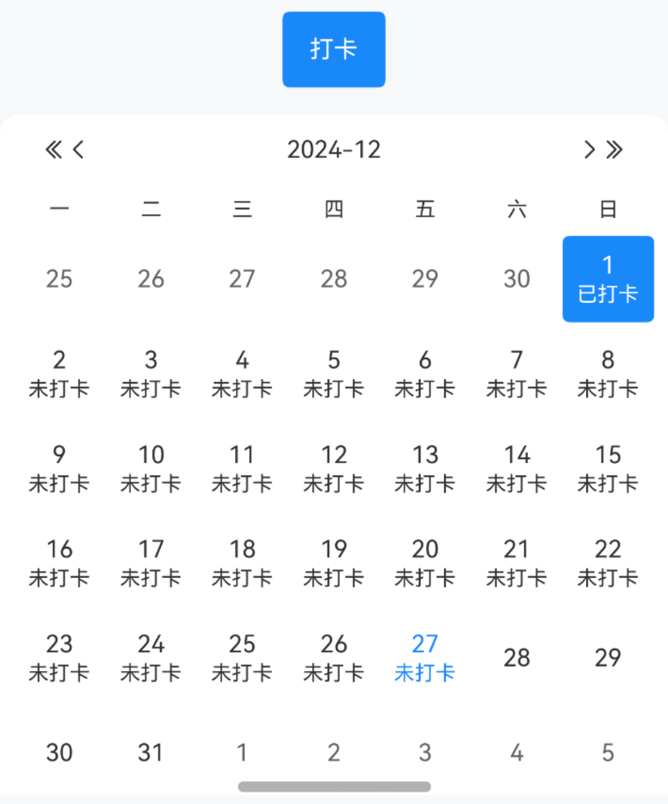
:::tip
设置 `clock` 为 `true`, 可开启打卡模式, 打卡模式下只能切换年月, 不能选择日期.
:::

::: details 点我查看代码
```ts
import dayjs from "@hview/dayjs"
@Entry
@ComponentV2
struct DemoPage {
  @Local clockDate: string[] = [dayjs().startOf("month").format('YYYY-MM-DD')]
  build() {
    Column({space: 14}){
      IBestButton({
        type: "primary",
        text: "打卡",
        onBtnClick: () => {
          this.clockDate.push(dayjs(this.clockDate[this.clockDate.length-1]).add(1, 'day').format("YYYY-MM-DD"))
        }
      })
      IBestCalendar({
        clock: true,
        defaultSelectedDate: this.clockDate
      })
    }
  }
}
```
:::


## API

### Calendar @Props

| 参数         | 说明                                                     | 类型      | 默认值     |
| ------------ | --------------------------------------------------------| --------- | ---------- |
| type         | 主题类型，可选值为 `primary` `success` `warning` `danger` | _string_  | `primary` |
| defaultSelectedDate   | 默认选中日期                                    | _string[]_  | `[]` |
| itemWidth    | 每一项宽度                                               | _string_ \| _number_  | `50`|
| weekFirstDay | 周起始日期, `周一到周六`分别对应`123456`, 周日为 `0`         | _number_  |    `1`     |
| isShowLunar  | 是否显示农历                                             | _boolean_ | `false`  |
| selectType   | 选择类型，可选值为 `single` `multiple` `range`            | _string_ | `single`|
| selectedStyleType | 选中样式，可选值为 `normal` `circle`                 | _string_ | `normal`|
| selectedColor| 自定义选中颜色                                           | _ResourceColor_ |    |
| maxRange     | `selectType` 为 `range` 时，最多可选天数，-1为无限制       | _number_ | `-1`   |
| minDate      | 最小可选日期                                             | _Date_ | `` |
| maxDate      | 最大可选日期                                             | _Date_ | `` |
| isShowMark   | 是否显示月份背景水印                                       | _boolean_ | `false` |
| isShowHeader | 是否显示头部                                              | _boolean_ | `true` |
| isShowConfirmBtn | 是否显示底部确定按钮                                   | _boolean_ | `false` |
| confirmBtnColor  | 确认按钮颜色                                          | _ResourceColor_  | `#3D8AF2` |
| confirmBtnText   | 确认按钮文案                                          | _ResourceStr_  | `确认` |
| cornerRadius | 弹框圆角                                                 | _Length_ \| _BorderRadiuses_ \| _LocalizedBorderRadiuses_ | `10`|
| clock        | 开启打卡模式                                              | _boolean_ | `false`  |
| clockSuccessText | 打卡成功文案                                          | _ResourceStr_  | `已成功` |
| isShowUnClock | 是否显示未打卡                                           | _boolean_ | `true`  |
| unClockText  | 未打卡文案                                                | _ResourceStr_  | `未打卡` |
| showOtherMonthDate <span style="font-size: 12px; padding:2px 4px;color:#3D8AF2;border-radius:4px;border: 1px solid #3D8AF2">0.0.8</span>| 是否显示其他月份的日期                        | _boolean_ | `true` |


### CalendarDialog @Props
::: tip
CalendarDialog包含Calendar除 `isShowConfirmBtn` 以外所有属性，CalendarDialog的 `isShowConfirmBtn` 属性默认为`selectType`不为`single`时显示，以下仅列Calendar不包含的属性
:::
| 参数         | 说明                                                     | 类型      | 默认值     |
| ------------ | --------------------------------------------------------| --------- | ---------- |
| visible      | 弹框展示状态                                             | _boolean_ | `false`  |
| isModal      | 是否为模态窗口                                            | _boolean_ | `true`  |
| offsetY      | 弹框底部偏移量                                            | _number_ | `0`  |
| cornerRadius | 弹框圆角                                                 | _string_ \| _number_  | `10`|

### 插槽

| 插槽名             | 说明               | 类型             |
| ------------------| ------------------| ----------------|
| dayItemBuilder    | 单个日期的插槽      | `($$: IBestCalendarDayItem) => void` |

### Events

| 事件名     | 说明                                             | 回调参数                         |
| ----------| ------------------------------------------------ | -------------------------------- |
| onConfirm | 选择日期后的回调，`selectType` 为 `multiple` 时需点击按钮触发 | `value: IBestCalendarConfirmResult[]` |

### IBestCalendarDayItem 数据类型
| 参数          | 说明                                       | 类型      |
| ------------ | ------------------------------------------| --------- |
| date         | 日期                                       | _Date_    |
| dateStr      | 日期字符串                                  | _string_  |
| year         | 年份                                       | _string_  |
| month        | 月份                                       | _string_  |
| day          | 天                                         | _string_  |
| weekNum      | 星期                                       | _number_  |
| lunarMonth   | 农历月份                                    | _string_ |
| lunarDay     | 农历天                                      | _string_ |
| isCurMonthDay| 是否为当前月份的日期                          | _boolean_ |
| isSelected   | 是否选中                                    | _boolean_ |
| isDisabled   | 是否禁用                                    | _boolean_ |
| isClock      | 是否打卡                                    | _boolean_ |

### IBestCalendarConfirmResult 数据类型
| 参数          | 说明                                          | 类型      |
| ------------ | --------------------------------------------- | --------- |
| date         | 选中日期                                       | _Date_  |
| dateStr      | 选中日期字符串                                  | _string_  |
| lunarMonth   | 农历月份                                       | _string_ |
| lunarDay     | 农历天                                         | _string_ |