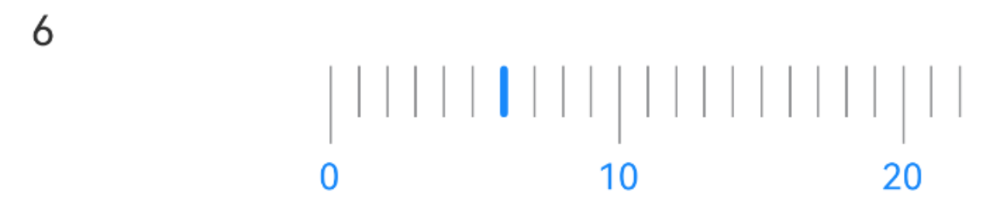
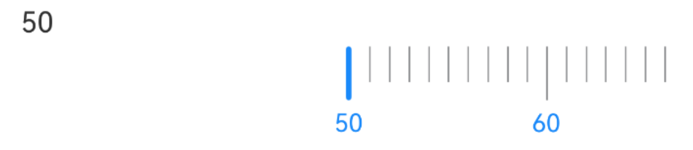
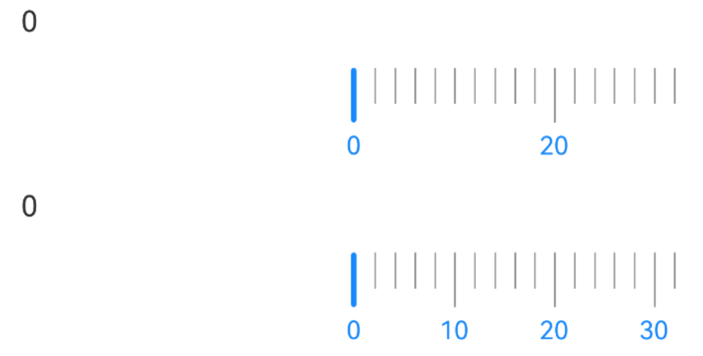
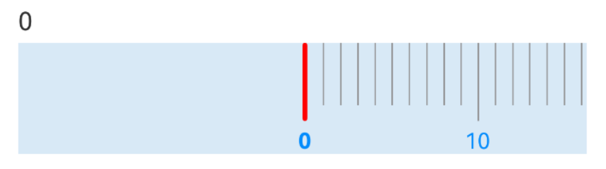
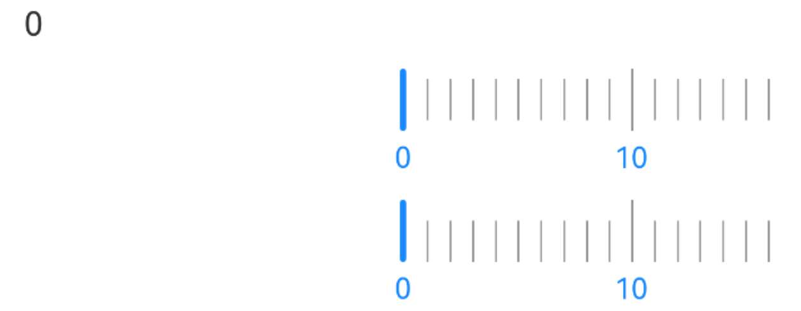

# Caliper 卡尺

## 介绍

用于选择某个范围内的值。
 
## 引入

```ts
import { IBestCaliper } from "@ibestservices/ibest-ui-v2"
```

## 代码演示

### 基础用法



::: details 点我查看代码
```ts
@Entry
@ComponentV2
struct DemoPage {
  @Local value: number = 6
  build() {
    Column({space: 14}){
      Text(this.value.toString())
      IBestCaliper({
        value: this.value!!
      })
    }.alignItems(HorizontalAlign.Start)
  }
}
```
:::

### 设置开始结尾数



::: details 点我查看代码
```ts
@Entry
@ComponentV2
struct DemoPage {
  @Local value: number = 6
  build() {
    Column({space: 14}){
      Text(this.value.toString())
      IBestCaliper({
        value: this.value!!,
        startNum: 50,
        endNum: 200
      })
    }.alignItems(HorizontalAlign.Start)
  }
}
```
:::

### 自定义刻度



::: details 点我查看代码
```ts
@Entry
@ComponentV2
struct DemoPage {
  @Local value: number = 0
  @Local value1: number = 0
  build() {
    Column({space: 14}){
      Text(this.value.toString())
      IBestCaliper({
        value: this.value!!,
        scaleSize: 2
      })
      Text(this.value1.toString())
      IBestCaliper({
        value: this.value1!!,
        scales: 5,
        scaleSize: 2
      })
    }.alignItems(HorizontalAlign.Start)
  }
}
```
:::

### 自定义样式



::: details 点我查看代码
```ts
@Entry
@ComponentV2
struct DemoPage {
  @Local value: number = 0
  build() {
    Column({space: 14}){
      Text(this.value.toString())
      IBestCaliper({
        value: this.value!!,
        bgColor: "#d8e9f6",
        fontColor: "#038cfd",
        bigScaleHeight: 50,
        smallScaleHeight: 40,
        activeScaleColor: "red",
        activeFontWeight: FontWeight.Bold
      })
    }.alignItems(HorizontalAlign.Start)
  }
}
```
:::

### 刻度对齐方式



::: details 点我查看代码
```ts
@Entry
@ComponentV2
struct DemoPage {
  @Local value: number = 0
  build() {
    Column({space: 14}){
      Text(this.value.toString())
      IBestCaliper({
        value: this.value!!,
        scaleAlign: "center"
      })
      IBestCaliper({
        value: this.value!!,
        scaleAlign: "bottom"
      })
    }.alignItems(HorizontalAlign.Start)
  }
}
```
:::


## API

### @Props

| 参数         | 说明                                 | 类型      | 默认值     |
| ------------ | ----------------------------------- | --------- | ---------- |
| value        | 绑定值, 支持双向绑定                  | _number_  | `''` |
| scales       | 大刻度之间划分的小刻度数量             | _number_  | `10` |
| scaleSize    | 小刻度代表数值                        | _number_  | `1` |
| startNum     | 开始刻度值                            | _number_  | `0` |
| endNum       | 结束刻度值                            | _number_  | `100` |
| bgColor      | 背景颜色                              | _ResourceColor_  | `''` |
| scaleColor   | 刻度线颜色                            | _ResourceColor_  | `#969799` |
| activeScaleColor | 选中刻度线颜色                     | _ResourceColor_  | `#1989fa` |
| scaleAlign   | 刻度线对齐方式, 可选值 `top`、`center`、`bottom`| _string_  | `top` |
| fontSize     | 刻度值字体大小                         | _number_  | `14` |
| fontColor    | 刻度值字体颜色                         | _ResourceColor_  | `#1989fa` |
| bigScaleWidth| 大刻度线宽度                           | _string_ \| _number_ | `1` |
| bigScaleHeight| 大刻度线高度                          | _string_ \| _number_ | `30` |
| smallScaleWidth| 小刻度线宽度                         | _string_ \| _number_ | `1` |
| smallScaleHeight| 小刻度线高度                        | _string_ \| _number_ | `20` |
| activeScaleWidth| 选中刻度线宽度                      | _string_ \| _number_ | `3` |
| activeFontWeight| 选中刻度文字字重                    | _string_ \| _number_\| _FontWeight_  | `Normal` |
| scaleSpace   | 刻度线间距                             | _string_ \| _number_ | `10` | 

### Events

| 事件名      | 说明           | 事件类型                         |
| -----------| ---------------| -------------------------------- |
| onChange   | 刻度变化回调    | `(value: number) => void` |

## 主题定制

组件提供了下列颜色变量，可用于自定义深色/浅色模式样式，使用方法请参考 [颜色模式](../../guide/color-mode/index.md) 章节，如需要其它颜色变量可提 [issue](https://github.com/ibestservices/ibest-ui/issues)。

| 名称                                       | 描述                              | 默认值        |
| -------------------------------------------|----------------------------------|--------------|
| ibest_caliper_scale_color                  | 刻度线颜色                        | `#969799`   |