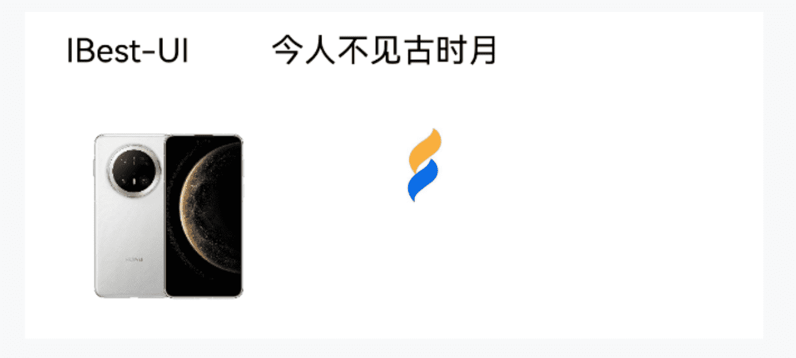
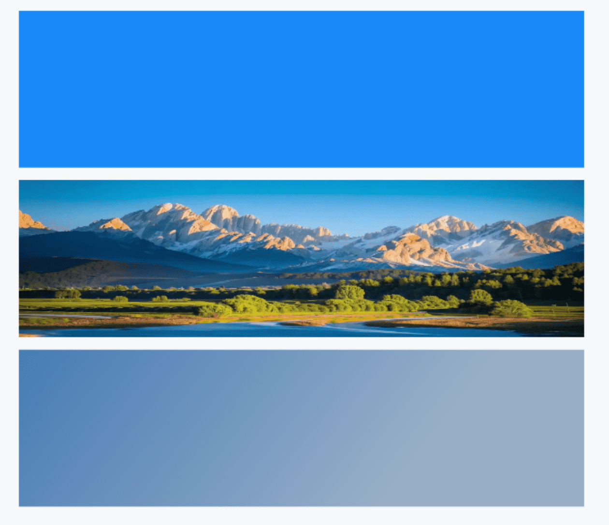
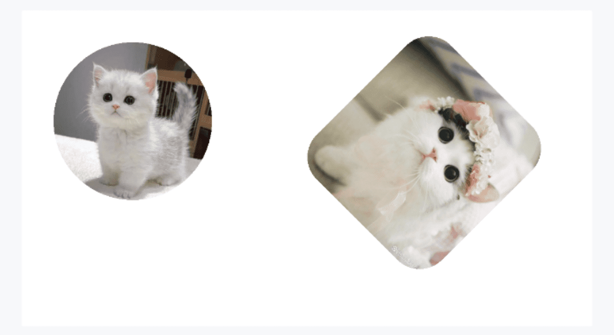
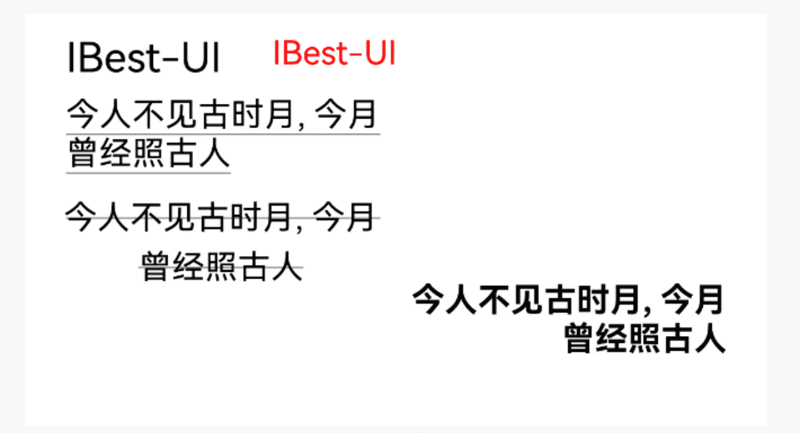

# CanvasDrawer 画布绘制

## 介绍

用于动态绘制海报、图片添加水印等需要canvas的场景。
 
## 引入

```ts
import { IBestCanvasDrawer, IBestCanvasContent } from "@ibestservices/ibest-ui-v2";
```

## 代码演示

### 基础用法


:::tip
组件本身并不显示, 使用时先动态生成好 `contentList`, 然后创建 `IBestCanvasDrawer` 组件, 通过 `onDrawFinish` 事件得到最终图片(PixelMap格式), 拿到图片后销毁`IBestCanvasDrawer` 组件。
:::

::: details 点我查看代码
```ts
@Entry
@ComponentV2
struct DemoPage {
  @Local canvasWidth: number = 360
  @Local canvasHeight: number = 160
  @Local canvasShow: boolean = false
  @Local pixelMap: PixelMap | null = null
  @Local contentList: IBestCanvasContent[] = []
  aboutToAppear(){
    // 模拟异步
    setTimeout(() => {
      // 动态生成内容
      this.contentList = [
        { type: "text", text: $r("app.string.app_name"), left: 20, top: 10 },
        { type: "text", text: "今人不见古时月", left: 120, top: 10 },
        { type: "image", url: "https://res1.vmallres.com/pimages/FssCdnProxy/vmall_product_uom/pmsSalesFile/800_800_6DEFA8E52CD749385860692A24DA15B9.png", width: 100, height: 100, left: 20, top: 50 },
        { type: "image", url: $r("app.media.app_icon"), width: 50, height: 50, left: 170, top: 50 }
      ]
      // 创建组件
      this.canvasShow = true
    }, 1000)
  }
  build() {
    Column(){
      Image(this.pixelMap)
        .width(this.canvasWidth)
        .height(this.canvasHeight)
      if(this.canvasShow){
        IBestCanvasDrawer({
          canvasWidth: this.canvasWidth,
          canvasHeight: this.canvasHeight,
          contentList: this.contentList,
          onDrawFinish: pixelMap => {
            // 得到图片
            this.pixelMap = pixelMap
            // 销毁组件
            this.canvasShow = false
          }
        })
      }
    }
  }
}
```
:::

### 自定义背景



::: details 点我查看代码
```ts
@Entry
@ComponentV2
struct DemoPage {
  @Local canvasWidth: number = 360
  @Local canvasHeight: number = 100
  @Local canvasShow: boolean = false
  @Local pixelMap: PixelMap | null = null
  @Local canvasShow1: boolean = false
  @Local pixelMap1: PixelMap | null = null
  @Local canvasShow2: boolean = false
  @Local pixelMap2: PixelMap | null = null
  aboutToAppear(){
    this.canvasShow = true
    this.canvasShow1 = true
    this.canvasShow2 = true
  }
  build() {
    Column(){
      Image(this.pixelMap)
        .width(this.canvasWidth)
        .height(this.canvasHeight)
      Image(this.pixelMap1)
        .width(this.canvasWidth)
        .height(this.canvasHeight)
      Image(this.pixelMap2)
        .width(this.canvasWidth)
        .height(this.canvasHeight)
      if(this.canvasShow){
        IBestCanvasDrawer({
          canvasWidth: this.canvasWidth,
          canvasHeight: this.canvasHeight,
          canvasBgColor: "#1989fa",
          onDrawFinish: pixelMap => {
            this.pixelMap = pixelMap
            this.canvasShow = false
          }
        })
      }
      if(this.canvasShow1){
        IBestCanvasDrawer({
          canvasWidth: this.canvasWidth,
          canvasHeight: this.canvasHeight,
          canvasBgImg: "https://img0.baidu.com/it/u=295003109,130135700&fm=253&fmt=auto&app=120&f=JPEG?w=1422&h=800",
          onDrawFinish: pixelMap => {
            this.pixelMap1 = pixelMap
            this.canvasShow1 = false
          }
        })
      }
      if(this.canvasShow2){
        IBestCanvasDrawer({
          canvasWidth: this.canvasWidth,
          canvasHeight: this.canvasHeight,
          linerGradient: {
            angle: 128,
            colors: [["rgba(69,123,180,1)", 0], ["rgba(152,174,199,1)", 0.7]]
          },
          onDrawFinish: pixelMap => {
            this.canvasShow2 = false
            this.pixelMap2 = pixelMap
          }
        })
      }
    }
  }
}
```
:::

### 图片样式



::: details 点我查看代码
```ts
@Entry
@ComponentV2
struct DemoPage {
  @Local canvasWidth: number = 360
  @Local canvasHeight: number = 200
  @Local canvasShow: boolean = false
  @Local pixelMap: PixelMap | null = null
  @Local contentList: IBestCanvasContent[] = [
    { type: "image", url: "https://img1.baidu.com/it/u=3367326055,3107318562&fm=253&fmt=auto&app=120&f=JPEG?w=500&h=500", width: 100, height: 100, left: 20, top: 20, borderRadius: 50 },
    { type: "image", url: "https://img1.baidu.com/it/u=1371594408,1235079511&fm=253&fmt=auto&app=138&f=JPEG?w=500&h=539", left: 160, top: 30, width: 112, height: 120, deg: 45, borderRadius: 20 }
  ]
  aboutToAppear(){
    this.canvasShow = true
  }
  build() {
    Column(){
      Image(this.pixelMap)
        .width(this.canvasWidth)
        .height(this.canvasHeight)
      if(this.canvasShow){
        IBestCanvasDrawer({
          canvasWidth: this.canvasWidth,
          canvasHeight: this.canvasHeight,
          contentList: this.contentList,
          onDrawFinish: pixelMap => {
            this.pixelMap = pixelMap
            this.canvasShow = false
          }
        })
      }
    }
  }
}
```
:::

### 文字样式



::: details 点我查看代码
```ts
@Entry
@ComponentV2
struct DemoPage {
  @Local canvasWidth: number = 360
  @Local canvasHeight: number = 200
  @Local canvasShow: boolean = false
  @Local pixelMap: PixelMap | null = null
  @Local contentList: IBestCanvasContent[] = [
    { type: "text", text: $r("app.string.app_name"), fontSize: 20, left: 20, top: 10 },
    { type: "text", text: "IBest-UI", fontColor: "red", left: 120, top: 10 },
    { type: "text", text: "今人不见古时月, 今月曾经照古人", textDecoration: "underline", width: 150, maxLineNumber: 2, left: 20, top:40 },
    { type: "text", text: "今人不见古时月, 今月曾经照古人", textDecoration: "lineThrough", lineHeight: 24, width: 150, maxLineNumber: 2, textAlign: "center", left: 20, top: 90 },
    { type: "text", text: "今人不见古时月, 今月曾经照古人", fontWeight: "bold", width: 150, maxLineNumber: 2, textAlign: "right", right: 20, top: 130 }
  ]
  aboutToAppear(){
    this.canvasShow = true
  }
  build() {
    Column(){
      Image(this.pixelMap)
        .width(this.canvasWidth)
        .height(this.canvasHeight)
      if(this.canvasShow){
        IBestCanvasDrawer({
          canvasWidth: this.canvasWidth,
          canvasHeight: this.canvasHeight,
          contentList: this.contentList,
          onDrawFinish: pixelMap => {
            this.pixelMap = pixelMap
            this.canvasShow = false
          }
        })
      }
    }
  }
}
```
:::

## API

| 参数          | 说明                               | 类型       | 默认值      |
| ------------ | -----------------------------------| ----------| -----------|
| canvasWidth  | 画板宽度                             | _number_ \| _string_  | `0` |
| canvasHeight | 画板高度                             | _number_ \| _string_   | `0` |
| canvasBgColor| 画板背景色                           | _ResourceColor_ |  `#fff`  |
| linerGradient| 画板渐变背景色                        | _LinearGradient_ | `-` |
| canvasBgImg  | 画板背景图片                          | _ResourceStr_ \| _PixelMap_ | `''` |
| radius       | 画板圆角                             | _number_ \| _string_ | `0` |
| contentList  | 要绘制的内容列表                      | _IBestCanvasContent_ | `[]` |

### IBestCanvasContent 数据结构
:::tip
单位统一为 `vp`
:::

| 参数          | 说明                                          | 类型             |    默认值 |
| ------------ | --------------------------------------------- | ----------------| ---------|
| type         | 内容类型, 可选值 `image` `text`                 | _string_        | `''`  |
| url          | 图片地址, 支持网络图片、base64、相册选择的图片      | _ResourceStr_   |  `''` |
| text         | 文字内容                                       | _ResourceStr_   | `''` |
| width        | 内容宽度                                       | _number_        | `0`  |
| height       | 图片高度, 文字无效                              | _number_        | `0`  |
| top          | 内容左上角距离画布顶部距离                        | _number_        | `0`  |
| left         | 内容左上角距离画布左侧距离                        | _number_        | `0`  |
| right        | 内容右上角距离画布右侧距离, 优先级大于left          | _number_        | `''`  |
| bottom       | 图片右下角距离画布底部距离, 优先级大于top, 文字无效   | _number_        | `''`  |
| maxLineNumber| 文字最大行数                                    | _number_        | `1` |
| lineHeight   | 文字行高                                       | _number_        | `''` |
| fontSize     | 文字字体大小                                    | _number_        | `16` |
| fontColor    | 文字颜色                                       | _ResourceColor_ | `#000` |
| fontWeight   | 文字字重, 可选 `normal` `bold` `bolder` `lighter` `100` `200` `300` `400` `500` `600` `700` `800` `900`                    | _string_        | `normal` |
| textDecoration| 文字修饰线, 可选值 `underline` `lineThrough`    | _string_        | `''`  |
| textAlign    | 文字对齐方式                                    | _CanvasTextAlign_| `left` |
| borderRadius | 图片圆角                                       | _number_         | `0`  |
| deg          | 图片旋转角度                                    | _number_         | `0`  |

### Events

| 事件名        | 说明                       | 回调参数              |
| -------------| --------------------------| ---------------------|
| onDrawFinish | 内容全部绘制完毕时触发        | `pixelMap: PixelMap` |