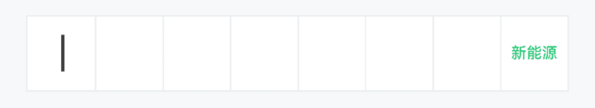
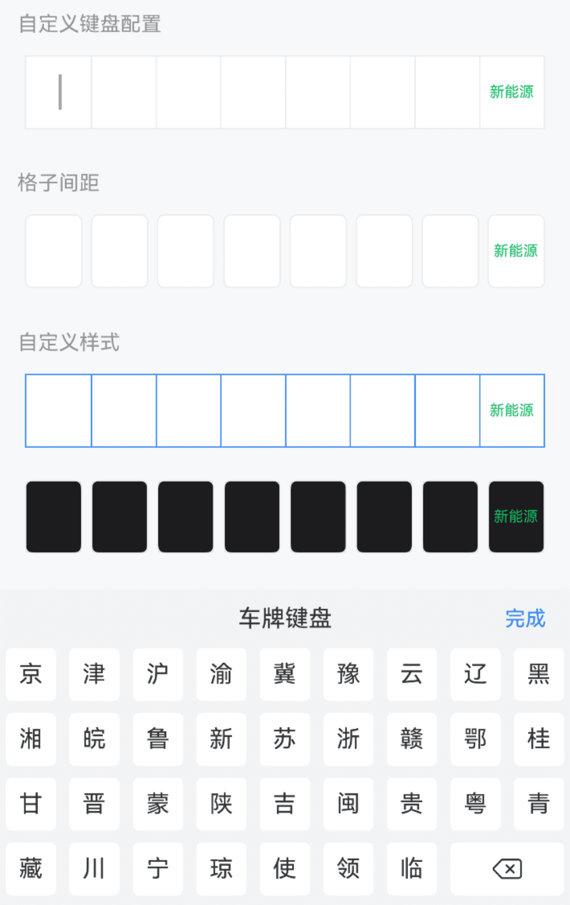
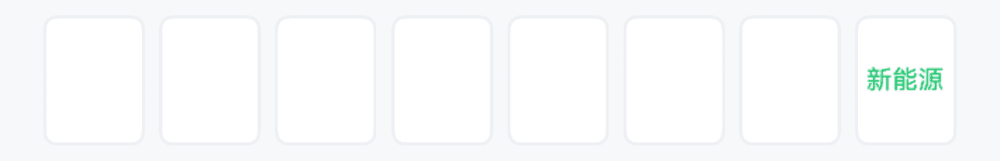
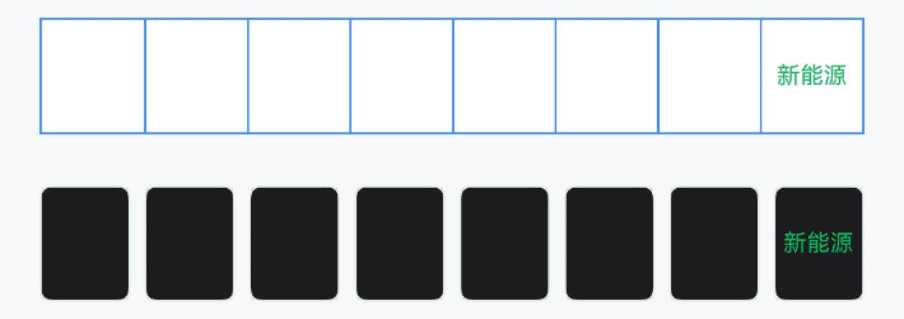

# CarInput 车牌输入框

## 介绍

用于输入车牌号码。
 
## 引入

```ts
import { IBestCarInput } from "@ibestservices/ibest-ui-v2";
```

## 代码演示

### 基础用法



::: details 点我查看代码
```ts
@Entry
@ComponentV2
struct DemoPage {
  @Local value: string = ''
  build() {
    Column(){
      IBestCarInput({
        value: this.value!!
      })
    }
  }
}
```
:::

### 自定义键盘配置



::: details 点我查看代码
```ts
@Entry
@ComponentV2
struct DemoPage {
  @Local value: string = ''
  build() {
    Column(){
      IBestCarInput({
        value: this.value!!,
        keyboardConfig: {
          title: '车牌键盘',
          keyHeight: 36
        }
      })
    }
  }
}
```
:::

### 格子间距


:::tip
通过 `space` 属性可以设置格子间距, 以下属性仅在space不为0时生效:   
• `radius` 设置单个格子圆角;   
• `isHighlightCurrent` 设置是否高亮当前正在输入的格子;   
• `highlightColor` 设置高亮颜色。
:::

::: details 点我查看代码
```ts
@Entry
@ComponentV2
struct DemoPage {
  @Local value: string = ''
  build() {
    Column(){
      IBestCarInput({
        value: this.value!!,
        space: 6
      })
    }
  }
}
```
:::

### 自定义样式



::: details 点我查看代码
```ts
@Entry
@ComponentV2
struct DemoPage {
  @Local value: string = ''
  build() {
    Column({space: 14}){
      IBestCarInput({
        value: this.value!!,
        bdColor: '#3d8af2',
        textColor: '#3d8af2',
        cursorPosition: "bottom",
        cursorColor: "#3d8af2"
      })
      IBestCarInput({
        value: this.value!!,
        space: 6,
        bgColor: "#1c1c1e",
        textColor: "#fff",
        highlightType: "shadow"
      })
    }
  }
}
```
:::

## API

### @Props

| 参数         | 说明                                          | 类型      | 默认值     |
| ------------ | ---------------------------------------------| --------- | ---------- |
| value        | 当前输入框的值, 支持双向绑定                      | _string_  | `''` |
| autoFocus    | 自动聚焦                                       | _boolean_ |  `false`  |
| showCursor   | 是否显示闪烁光标                                | _boolean_ |  `true`  |
| cursorPosition| 光标位置, 可选值为 `center` `bottom`           | _string_ |  `center`  |
| cursorColor  | 光标颜色, 默认跟随字体色                         | _ResourceColor_ |  ``  |
| inputHeight  | 输入框高度                                     | _string_ \| _number_ | `50` |
| space        | 格子间距                                       | _string_ \| _number_ | `0` |
| radius       | 格子圆角,当 `space` 不为0时有效                  | _string_ \| _number_ | `5` |
| isShowBorder | 是否显示边框线                                  | _boolean_ |  `true`  |
| bdColor      | 边框线颜色                                     | _ResourceColor_ |  `#ebedf0`  |
| bgColor      | 背景色                                         | _ResourceColor_ |  `#fff`  |
| textColor    | 文字颜色                                       | _ResourceColor_ |  `#323233`  |
| fontSize     | 文字大小                                       | _string_ \| _number_ |  `20`    |
| isHighlightCurrent | 是否高亮当前正在输入的格子,当 `space` 不为0时有效| _boolean_ | `true` |
| highlightType| 格子高亮类型, 可选值为 `shadow` `border`        | _string_ |  `border`  |
| highlightColor | 格子高亮颜色,当 `space` 不为0时有效            | _ResourceColor_ | `#3D8AF2` |
| keyboardConfig | 自定义键盘配置项                              | _IBestCarKeyboardConfig_ |  `-`  |

### IBestCarKeyboardConfig 数据结构
| 参数              | 说明                              | 类型      |
| ------------------| ---------------------------------| ---------|
| title             | 键盘标题                          | _string_ |
| confirmBtnText    | 确认按钮文字                       | _string_ |
| keyHeight         | 按键高度                          | _string_ \| _number_ |

### Events

| 事件名        | 说明                  | 回调参数             |
| -------------| ---------------------| -------------------------------- |
| onConfirm    | 点击完成触发           | `-` |