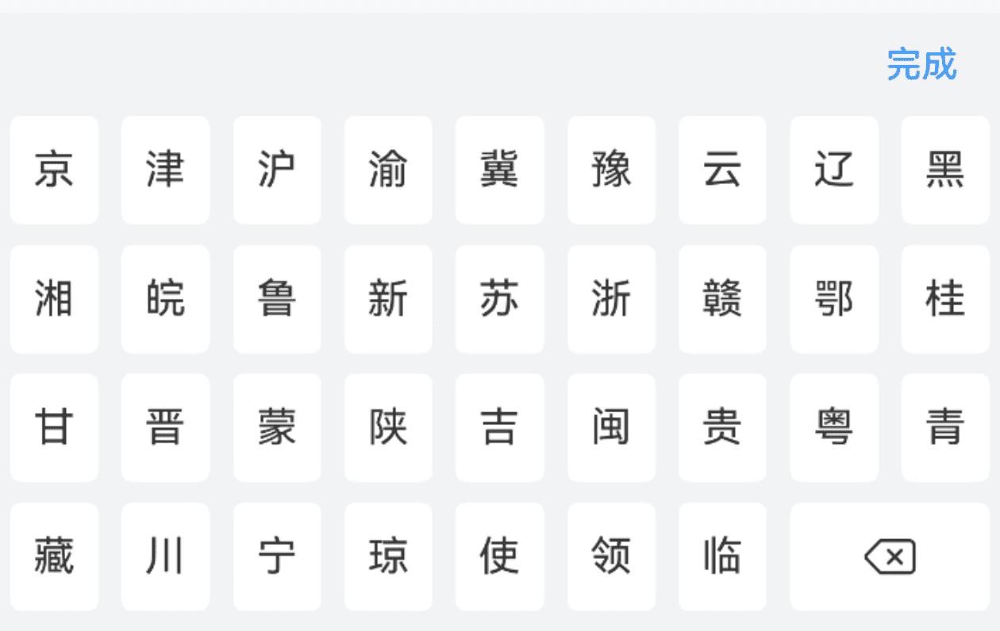
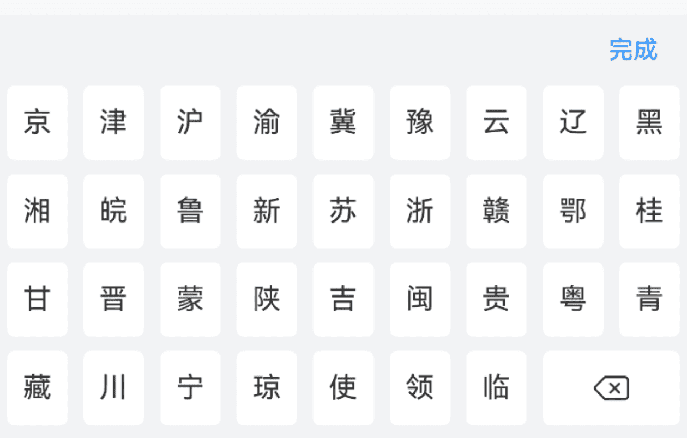
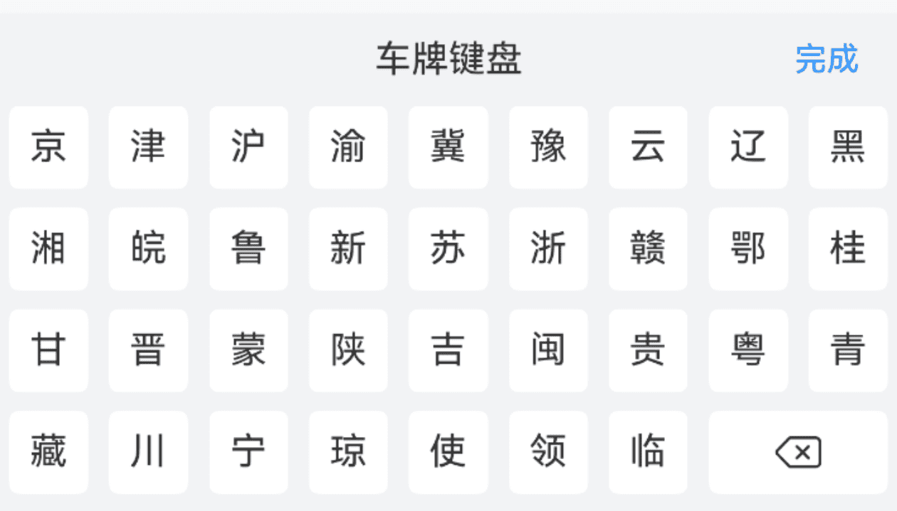

# CarKeyboard 数字键盘

## 介绍

带网格的输入框组件，通常与车牌输入框组件或其它自定义输入框配合使用。
 
## 引入

```ts
import { IBestCarKeyboard } from "@ibestservices/ibest-ui-v2";
```

## 代码演示

### 基础用法



::: details 点我查看代码
```ts
import { IBestCell } from "@ibestservices/ibest-ui-v2"
@Entry
@ComponentV2
struct DemoPage {
  @Local visible: boolean = false
  @Local value: string = ''
  build() {
    Column(){
      IBestCell({
        title: '默认键盘',
        value: this.value,
        clickable: true,
        onCellClick: () => {
          this.visible = true
        }
      })
      IBestCarKeyboard({
        visible: this.visible!!,
        value: this.value!!
      })
    }
  }
}
```
:::

### 最大长度



::: details 点我查看代码
```ts
import { IBestCell } from "@ibestservices/ibest-ui-v2"
@Entry
@ComponentV2
struct DemoPage {
  @Local visible: boolean = false
  @Local value: string = ''
  build() {
    Column(){
      IBestCell({
        title: '最大长度',
        value: this.value,
        clickable: true,
        onCellClick: () => {
          this.visible = true
        }
      })
      IBestCarKeyboard({
        visible: this.visible!!,
        value: this.value!!,
        maxLength: 7
      })
    }
  }
}
```
:::

### 自定义样式



::: details 点我查看代码
```ts
import { IBestCell } from "@ibestservices/ibest-ui-v2"
@Entry
@ComponentV2
struct DemoPage {
  @Local visible: boolean = false
  @Local value: string = ''
  build() {
    Column(){
      IBestCell({
        title: '自定义样式',
        value: this.value,
        clickable: true,
        onCellClick: () => {
          this.visible = true
        }
      })
      IBestCarKeyboard({
        visible: this.visible!!,
        value: this.value!!,
        title: "车牌键盘",
        keyHeight: 36
      })
    }
  }
}
```
:::


## API

### @Props

| 参数         | 说明                                          | 类型      | 默认值     |
| ------------ | ---------------------------------------------| --------- | ---------- |
| visible      | 控制键盘显隐, 支持双向绑定                       | _boolean_ | `false` | 
| value        | 当前输入的值, 支持双向绑定                       | _string_  | `''` |
| maxLength    | 最大长度		                                   | _number_ | `8` |
| title        | 顶部标题文字                                   | _ResourceStr_ | `''` |
| confirmBtnText | 确认按钮文字                                 | _ResourceStr_ | `完成` |
| keyHeight    | 按键高度                                       | _string_ \| _number_ | `42` |
 
### Events

| 事件名     | 说明                            | 回调参数             |
| ----------| ------------------------------ | -------------------------------- |
| onInput   | 按下按键后触发   | `value: string` |
| onDelete  | 点击删除键时触发 | `-` |
| onClose   | 点击关闭键时触发 | `-` |
| onConfirm | 点击完成键时触发 | `value: string` |

## 主题定制

组件提供了下列颜色变量，可用于自定义深色/浅色模式样式，使用方法请参考 [颜色模式](../../guide/color-mode/index.md) 章节，如需要其它颜色变量可提 [issue](https://github.com/ibestservices/ibest-ui/issues)。

| 名称                                       | 描述                              | 默认值        |
| -------------------------------------------|----------------------------------|--------------|
| ibest_car_keyboard_background              | 键盘背景色                        | `#f2f3f5`   |
| ibest_car_keyboard_key_background          | 键盘按键背景色                     | `#fff`   |
| ibest_car_keyboard_key_active_color        | 键盘按键激活态背景色                | `#ebedf0`   |