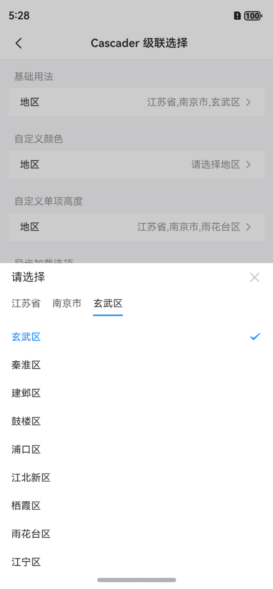
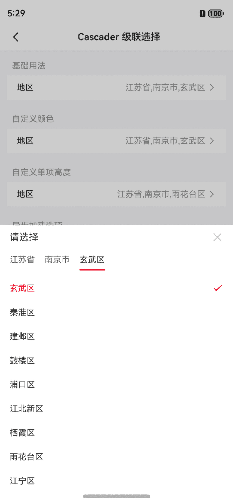
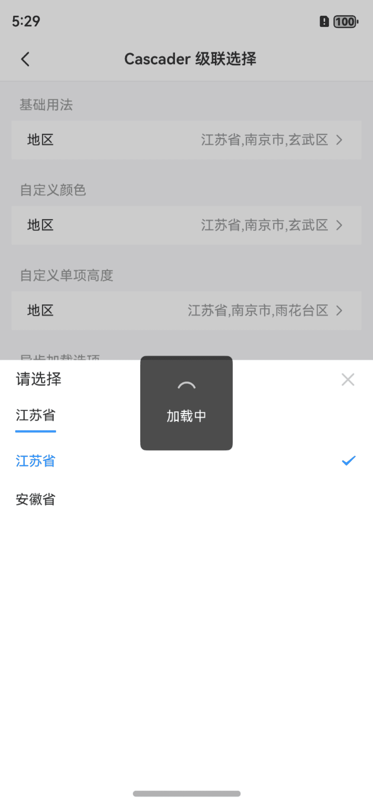
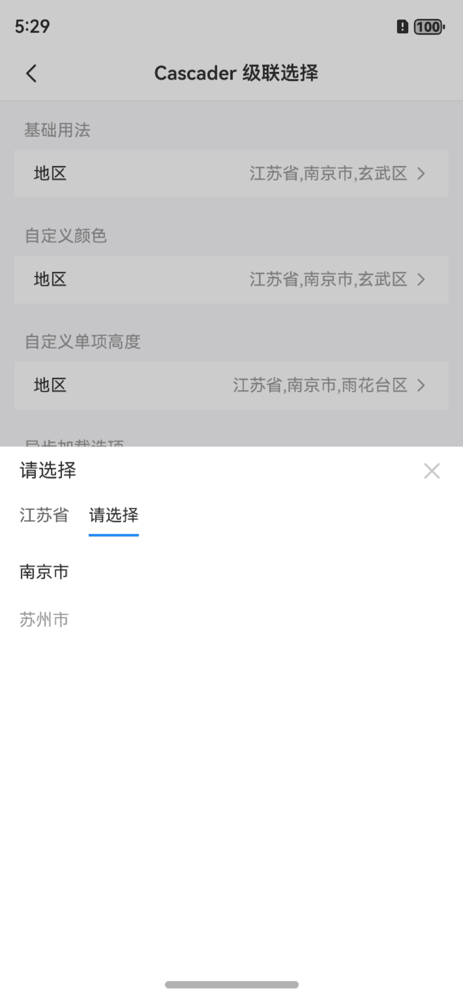
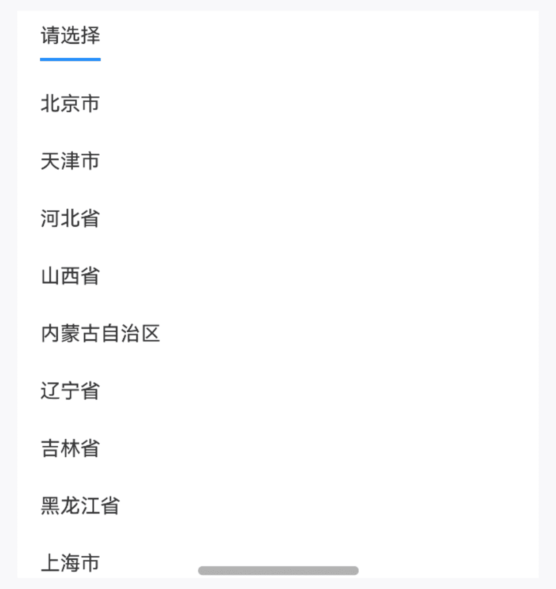

# Cascader 级联选择器

## 介绍

级联选择框，用于多层级数据的选择，典型场景为省市区选择。
 
## 引入

```ts
import { IBestCascader, IBestCascaderOption } from "@ibestservices/ibest-ui-v2";
```

## 代码演示

### 基础用法



::: details 点我查看代码
```ts
import { IBestCell } from "@ibestservices/ibest-ui-v2";
@Entry
@ComponentV2
struct DemoPage {
  @Local visible: boolean = false
  @Local fieldValue: string = '请选择地区'
	@Local selectValue: string[] = []
  @Local data: IBestCascaderOption[] = [
    {
      text: "江苏省",
      value: "320000",
      children: [
        {
          text: "南京市",
          value: "320100",
          children: [
            {
              text: "秦淮区",
              value: "320104"
            },
            {
              text: "雨花台区",
              value: "320114"
            }
          ]
        },
        {
          text: "苏州市",
          value: "320500",
          children: [
            {
              text: "姑苏区",
              value: "320508"
            },
            {
              text: "昆山市",
              value: "320583"
            }
          ]
        }
      ]
    },
    {
      text: "安徽省",
      value: "340000",
      children: [
        {
          text: "合肥市",
          value: "340100",
          children: [
            {
              text: "蜀山区",
              value: "340104"
            },
            {
              text: "合肥高新技术产业开发区",
              value: "340171"
            }
          ]
        },
        {
          text: "黄山市",
          value: "341000",
          children: [
            {
              text: "屯溪区",
              value: "341002"
            },
            {
              text: "黄山区",
              value: "341003"
            }
          ]
        }
      ]
    }
  ]
  build() {
    Column(){
      IBestCell({
        title: '地区',
        value: this.fieldValue,
        isLink: true,
        onCellClick: () => {
          this.visible = true
        }
      })
      IBestCascader({
        visible: this.visible!!,
        options: this.data,
        value: this.selectValue!!,
        itemHeight: 100,
        onConfirm: (value: IBestCascaderOption[]) => {
          this.fieldValue = value.map(item => item.text).join(',')
        }
      })
    }
  }
}
```
:::

### 自定义选中颜色



::: details 点我查看代码
```ts
import { IBestCell } from "@ibestservices/ibest-ui-v2";
@Entry
@ComponentV2
struct DemoPage {
  @Local visible: boolean = false
  @Local fieldValue: string = '江苏省,南京市,雨花台区'
	@Local selectValue: string[] = ["320000", "320100", "320114"]
  @Local data: IBestCascaderOption[] = [
    {
      text: "江苏省",
      value: "320000",
      children: [
        {
          text: "南京市",
          value: "320100",
          children: [
            {
              text: "秦淮区",
              value: "320104"
            },
            {
              text: "雨花台区",
              value: "320114"
            }
          ]
        },
        {
          text: "苏州市",
          value: "320500",
          children: [
            {
              text: "姑苏区",
              value: "320508"
            },
            {
              text: "昆山市",
              value: "320583"
            }
          ]
        }
      ]
    },
    {
      text: "安徽省",
      value: "340000",
      children: [
        {
          text: "合肥市",
          value: "340100",
          children: [
            {
              text: "蜀山区",
              value: "340104"
            },
            {
              text: "合肥高新技术产业开发区",
              value: "340171"
            }
          ]
        },
        {
          text: "黄山市",
          value: "341000",
          children: [
            {
              text: "屯溪区",
              value: "341002"
            },
            {
              text: "黄山区",
              value: "341003"
            }
          ]
        }
      ]
    }
  ]
  build() {
    Column(){
      IBestCell({
        title: '地区',
        value: this.fieldValue,
        isLink: true,
        hasBorder: false,
        onCellClick: () => {
          this.visible = true
        }
      })
      IBestCascader({
        visible: this.visible!!,
        options: this.data,
        value: this.selectValue!!,
        activeColor: '#ee0a24',
        onConfirm: (value: IBestCascaderOption[]) => {
          this.fieldValue = value.map(item => item.text).join(',')
        }
      })
    }
  }
}
```
:::

### 异步加载选项


:::tip
通过 `lazy` 属性可开启异步加载, 通过传入 `lazyLoad` 函数可实现获取异步数据, 共三个参数:

• `value` 为当前点击的选项值。  
• `level` 为下一个选项的层级, 默认从0开始。  
• `cb` 为接收异步请求结果的回调函数。
:::
::: details 点我查看代码
```ts
@Entry
@ComponentV2
struct DemoPage {
  @Local visible: boolean = false
  @Local fieldValue: string = '请选择地区'
	@Local selectValue: string[] = []
  @Local data: IBestCascaderOption[] = [
    {
      text: "江苏省",
      value: "320000"
    },
    {
      text: "安徽省",
      value: "340000"
    }
  ]
  // 定义异步加载函数
  lazyLoad(value: string | number, level: number, cb: (arr: IBestCascaderOption[]) => void){
		IBestToast.show({
			type: "loading"
		})
		setTimeout(() => {
			IBestToast.hide()
			cb(value == "320000" ? [
				{
				text: "南京市",
				value: "320100",
				isEnd: level >= 1
			},
			{
				text: "苏州市",
				value: "320500",
				isEnd: level >= 1
			}
			] : [
				{
					text: "合肥市",
					value: "340100",
					isEnd: level >= 1
				},
				{
					text: "黄山市",
					value: "341000",
					isEnd: level >= 1
				}
			])
		}, 2000)
	}
  build() {
    Column(){
      IBestCell({
        title: '地区',
        value: this.fieldValue,
        isLink: true,
        onCellClick: () => {
          this.visible = true
        }
      })
      IBestCascader({
        visible: this.visible!!,
        options: this.data,
        value: this.selectValue!!,
        lazy: true,
        lazyLoad: this.lazyLoad,
        onConfirm: (value: IBestCascaderOption[]) => {
          this.fieldValue = value.map(item => item.text).join(',')
        }
      })
    }
  }
}
```
:::

### 禁用选项


:::tip
通过 `disabled` 属性禁用选项。
:::

::: details 点我查看代码
```ts
@Entry
@ComponentV2
struct DemoPage {
  @Local visible: boolean = false
  @Local fieldValue: string = '请选择地区'
  @Local selectValue: string[] = []
  @Local data: IBestCascaderOption[] = [
		{
			text: "江苏省",
			value: "320000",
			children: [
				{
					text: "南京市",
					value: "320100",
					children: [
						{
							text: "秦淮区",
							value: "320104"
						},
						{
							text: "雨花台区",
							value: "320114"
						}
					]
				},
				{
					text: "苏州市",
					value: "320500",
					disabled: true,
					children: [
						{
							text: "姑苏区",
							value: "320508"
						},
						{
							text: "昆山市",
							value: "320583"
						}
					]
				}
			]
		},
		{
			text: "安徽省",
			value: "340000",
			children: [
				{
					text: "合肥市",
					value: "340100",
					children: [
						{
							text: "蜀山区",
							value: "340104"
						},
						{
							text: "合肥高新技术产业开发区",
							value: "340171"
						}
					]
				},
				{
					text: "黄山市",
					value: "341000",
					disabled: true,
					children: [
						{
							text: "屯溪区",
							value: "341002"
						},
						{
							text: "黄山区",
							value: "341003"
						}
					]
				}
			]
		}
	]
  build() {
    Column(){
      IBestCell({
        title: '地区',
        value: this.fieldValue,
        isLink: true,
        onCellClick: () => {
          this.visible = true
        }
      })
      IBestCascader({
        visible: this.visible!!,
        options: this.data,
        value: this.selectValue!!,
        onConfirm: (value: IBestCascaderOption[]) => {
          this.fieldValue = value.map(item => item.text).join(',')
        }
      })
    }
  }
}
```
:::

### 平铺展示



::: details 点我查看代码
```ts
import { IBestCascaderContent } from "@ibestservices/ibest-ui-v2";
@Entry
@ComponentV2
struct DemoPage {
  @Local selectValue: string[] = []
  @Local data: IBestCascaderOption[] = [
		{
			text: "江苏省",
			value: "320000",
			children: [
				{
					text: "南京市",
					value: "320100",
					children: [
						{
							text: "秦淮区",
							value: "320104"
						},
						{
							text: "雨花台区",
							value: "320114"
						}
					]
				},
				{
					text: "苏州市",
					value: "320500",
					disabled: true,
					children: [
						{
							text: "姑苏区",
							value: "320508"
						},
						{
							text: "昆山市",
							value: "320583"
						}
					]
				}
			]
		},
		{
			text: "安徽省",
			value: "340000",
			children: [
				{
					text: "合肥市",
					value: "340100",
					children: [
						{
							text: "蜀山区",
							value: "340104"
						},
						{
							text: "合肥高新技术产业开发区",
							value: "340171"
						}
					]
				},
				{
					text: "黄山市",
					value: "341000",
					disabled: true,
					children: [
						{
							text: "屯溪区",
							value: "341002"
						},
						{
							text: "黄山区",
							value: "341003"
						}
					]
				}
			]
		}
	]
  build() {
    Column(){
      IBestCascaderContent({
        value: this.selectValue!!,
        options: this.data
      })
    }
  }
}
```
:::

## API

### @Props

| 参数         | 说明                                                     | 类型      | 默认值     |
| ------------ | --------------------------------------------------------| --------- | ---------- |
| visible      | 控制弹出层显隐                                           | _boolean_  | `false` |
| value        | 选中选项值, 支持双向绑定                                   | _(string \| number)[]_ | `[]` |
| title        | 弹出层标题                                              | _ResourceStr_  | `请选择` |
| options      | 可选项数据源                                            | _IBestCascaderOption[]_ |`[]`|
| activeColor  | 选中项颜色                                              | _ResourceColor_ | `#3D8AF2`  |
| listHeight   | 滚动区域高度                                             | _string_ \| _number_ | `350`|
| itemHeight   | 单个选项高度                                             | _string_ \| _number_ | `40`|
| lazy         | 是否开启动态加载                                         | _boolean_ | `false` |
| lazyLoad     | 异步加载函数,`value` 为当前点击的选项值, `level` 为下一个选项的层级, 默认从0开始, `cb` 为接收结果的回调函数 | _(value: string \| number, level: number, cb: (arr: IBestCascaderOption[]) => void) => void_|`null`|

### IBestCascaderOption 数据结构

| 参数         | 说明                              | 类型      | 默认值     |
| ------------ | ---------------------------------| --------- | ---------- |
| text        | 选项文字(必填)                      | _ResourceStr_ | `''`  |
| value       | 选项对应的值(必填)                  | _string \| number_ | `''`  |
| isEnd       | 是否是结束选项                      | _boolean_ | `false`  |
| disabled    | 是否禁用单项                        | _boolean_ | `false`  |
| children    | 子选项列表                          | _IBestCascaderOption[]_ | `[]`  |

### Events

| 事件名     | 说明                                             | 回调参数                         |
| ----------| ------------------------------------------------ | -------------------------------- |
| onChange  | 选择单项后触发 | `value: string \| number, selectedOptions: IBestCascaderOption[], index: number` |
| onConfirm | 全部选择完毕后触发 | `value: IBestCascaderOption[]` |

## 主题定制

组件提供了下列颜色变量，可用于自定义深色/浅色模式样式，使用方法请参考 [颜色模式](../../guide/color-mode/index.md) 章节，如需要其它颜色变量可提 [issue](https://github.com/ibestservices/ibest-ui/issues)。

| 名称                                       | 描述                              | 默认值        |
| -------------------------------------------|----------------------------------|--------------|
| ibest_cascader_background                  | 级联选择器背景色                   | `#fff`   |