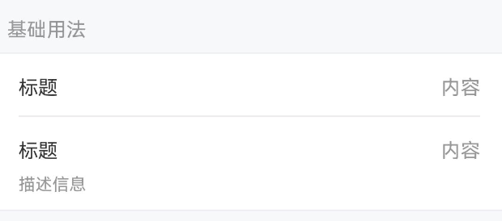
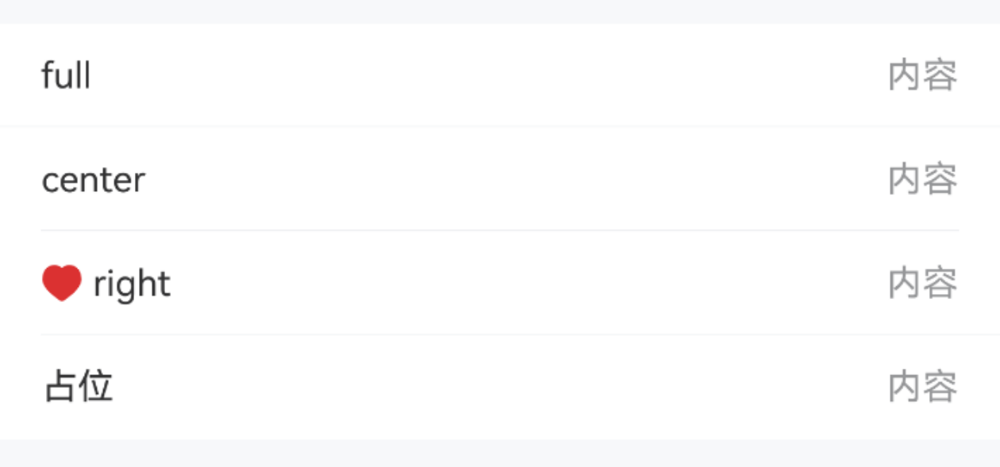
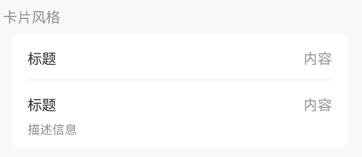
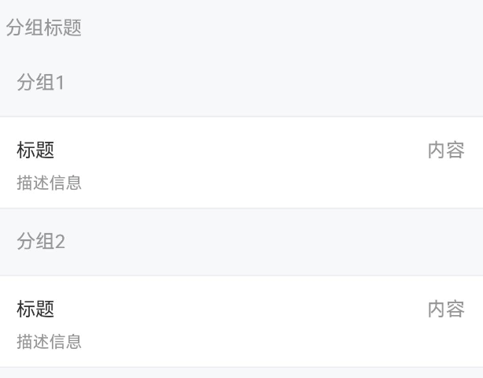
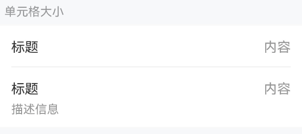
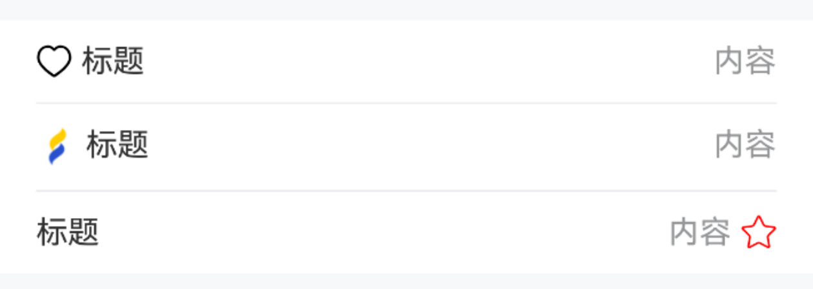
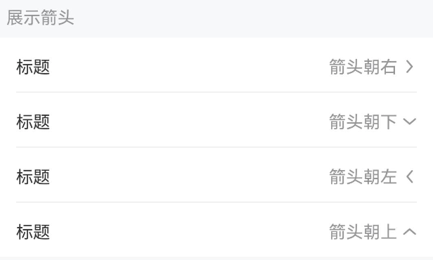
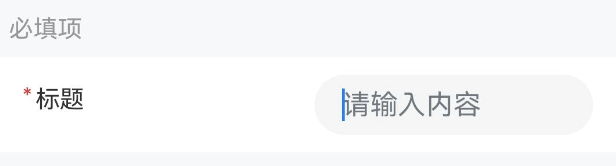
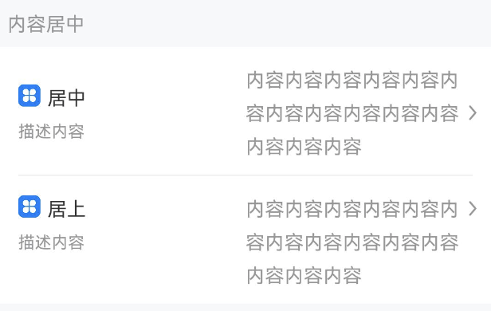
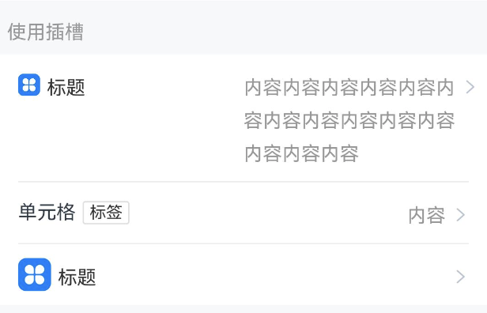

# Cell 单元格

## 介绍

单元格为列表中的单个展示项。

## 引入

```ts
import { IBestCell, IBestCellGroup } from "@ibestservices/ibest-ui-v2";
```

## 代码演示

### 基础用法


::: tip
`Cell` 可以单独使用，也可以与 `CellGroup`， `CellGroup` 可以为 `Cell` 提供上下外边框。
:::

::: details 点我查看代码
```ts
@Entry
@ComponentV2
struct DemoPage {
  build() {
    IBestCellGroup() {
      IBestCell({
        title: '标题',
        value: '内容'
      })
      IBestCell({
        title: '标题',
        value: '内容',
        label: '描述信息',
        hasBorder: false
      })
    }
  }
}
```
:::

### 下边框样式



::: details 点我查看代码

```ts
@Entry
@ComponentV2
struct DemoPage {
  build() {
    Column(){
      IBestCellGroup() {
        IBestCell({ title: 'full', value: '内容', borderSizeType: 'full' })
        IBestCell({ title: 'center', value: '内容', borderSizeType: 'center' })
        IBestCell({
          leftIcon: $r("app.media.icon_like_o"),
          title: 'right',
          value: '内容',
          borderSizeType: 'right'
        })
        IBestCell({ title: '占位', value: '内容', hasBorder: false })
      }
    }
  }
}
```
:::

### 卡片风格


::: tip
通过 `CellGroup` 的 `inset` 属性，可以将单元格转换为圆角卡片风格
:::

::: details 点我查看代码
```ts
@Entry
@ComponentV2
struct DemoPage {
  build() {
    Column(){
      IBestCellGroup({ inset: true }) {
        IBestCell({
          title: '标题',
          value: '内容'
        })
        IBestCell({
          title: '标题',
          value: '内容',
          label: '描述信息',
          hasBorder: false
        })
      }
    }
  }
}
```
:::

### 分组标题


::: tip
通过 `CellGroup` 的 `title` 属性可以指定分组标题。
:::

::: details 点我查看代码
```ts
@Entry
@ComponentV2
struct DemoPage {
  build() {
    Column(){
      IBestCellGroup({ title: '分组1' }) {
        IBestCell({
          title: '标题',
          value: '内容',
          label: '描述信息',
          hasBorder: false
        })
      }
      IBestCellGroup({ title: '分组2' }) {
        IBestCell({
          title: '标题',
          value: '内容',
          label: '描述信息',
          hasBorder: false
        })
      }
    }
  }
}
```
:::

### 单元格大小


::: tip
通过 `cellSize` 属性可以控制单元格的大小。
:::

::: details 点我查看代码
```ts
@Entry
@ComponentV2
struct DemoPage {
  build() {
    Column(){
      IBestCellGroup() {
        IBestCell({ title: '标题', value: '内容', cellSize: 'large' })
        IBestCell({
          title: '标题',
          value: '内容',
          label: '描述信息',
          hasBorder: false,
          cellSize: 'large'
        })
      }
    }
  }
}
```
:::

### 展示图标



::: details 点我查看代码

```ts
@Entry
@ComponentV2
struct DemoPage {
  @Builder StarIcon() {
    Image($r('app.media.startIcon')).width(16)
  }
  build(){
    Column(){
      IBestCellGroup() {
        IBestCell({
          title: '标题',
          value: '内容',
          leftIcon: $r("app.media.icon_like")
        })
        IBestCell({
          title: '标题',
          value: '内容',
          iconBuilder: () => this.StarIcon()
        })
        IBestCell({
          title: '标题',
          value: '内容',
          rightIcon: $r("app.media.ibest_icon_star"),
          rightIconColor: '#FF0000',
          hasBorder: false
        })
      }
    }
  }
}
```
:::

### 展示箭头


::: tip
设置 `isLink` 属性后会在单元格右侧显示箭头，并且可以通过 `arrowDirection` 属性控制箭头方向。
:::

::: details 点我查看代码
```ts
@Entry
@ComponentV2
struct DemoPage {
  build(){
    Column(){
      IBestCellGroup() {
        IBestCell({
          title: "标题",
          value: "箭头朝右",
          isLink: true,
        })
        IBestCell({
          title: "标题",
          value: "箭头朝下",
          isLink: true,
          arrowDirection: "bottom",
        })
        IBestCell({
          title: "标题",
          value: "箭头朝左",
          isLink: true,
          arrowDirection: "left",
        })
        IBestCell({
          title: "标题",
          value: "箭头朝上",
          isLink: true,
          arrowDirection: "top",
          hasBorder: false,
        })
      }
    }
  }
}
```
:::

### 必填项


::: tip
设置 `required` 属性后会在单元格左侧显示必填`*`号。
:::

::: details 点我查看代码
```ts
@Entry
@ComponentV2
struct DemoPage {
  @Builder InputContain() {
    TextInput({ placeholder: '请输入内容' })
  }
  build(){
    Column(){
      IBestCell({
        title: '标题',
        value: '内容',
        center: true,
        required: true,
        hasBorder: false,
        valueBuilder: (): void => this.InputContain()
      })
    }
  }
}
```
:::

### 内容居中


::: tip
通过 `center` 属性可以让 `Cell`的左右内容都垂直居中。
:::

::: details 点我查看代码

```ts
@Entry
@ComponentV2
struct DemoPage {
  @Builder StarIcon(width = 16) {
    Image($r('app.media.app_icon')).width(width)
  }
  build(){
    Column(){
      IBestCell({
        title: '居中',
        label: '描述内容',
        value: '内容内容内容内容内容内容内容内容内容内容内容内容内容内容',
        center: true,
        iconBuilder: () => this.StarIcon(),
        isLink: true
      })
      IBestCell({
        title: '居上',
        label: '描述内容',
        value: '内容内容内容内容内容内容内容内容内容内容内容内容内容内容',
        hasBorder: false,
        iconBuilder: () => this.StarIcon(24),
        isLink: true
      })
    }
  }
}
```

:::

### 使用插槽


::: tip
如以上用法不能满足你的需求，可以使用`@BuilderParams`插槽来自定义内容。
:::

::: details 点我查看代码

```ts
@Entry
@ComponentV2
struct DemoPage {
  @Builder StarIcon(height = 24) {
    Image($r('app.media.startIcon')).height(height).margin({ right: 10 })
  }
  @Builder Arrow() {
    Image($r('app.media.title_back')).height(14).margin({ left: 14 }).rotate({ angle: 180 })
  }
  @Builder Title() {
    Row({space: 5}) {
      Text('单元格').fontSize(14)
      IBestTag({ text: '标签' })
    }
  }
  build(){
    Column(){
      IBestCell({
        title: '标题',
        value: '内容内容内容内容内容内容内容内容内容内容内容内容内容内容',
        iconBuilder: (): void => this.StarIcon(16),
        rightIconBuilder: (): void => this.Arrow(),
        clickable: true
      })
      IBestCell({
        titleBuilder: (): void => this.Title(),
        value: '内容',
        rightIconBuilder: (): void => this.Arrow(),
        clickable: true
      })
      IBestCell({
        title: '标题',
        iconBuilder: (): void => this.StarIcon(),
        hasBorder: false,
        rightIconBuilder: (): void => this.Arrow(),
        clickable: true
      })
    }
  }
}
```
:::

## API

### CellGroup @Props

| 参数   | 说明                                               | 类型      | 默认值  |
| ------ | ---------------------------------------------------| --------- | ------- |
| title  | 分组标题                                            | _ResourceStr_  |  `''`   |
| inset  | 是否展示为圆角卡片风格                               | _boolean_ | `false` |
| border | 是否显示外边框                                       | _boolean_ | `true`  |
| radius | 圆角大小, 仅inset为true时有效                        | _Length_ \| _BorderRadiuses_ \| _LocalizedBorderRadiuses_ | `8`   |
| titlePadding | 标题内边距                                     | _Padding_ \| _Length_ \| _LocalizedPadding_ | `16`  |
| outerMargin <span style="font-size: 12px; padding:2px 4px;color:#3D8AF2;border-radius:4px;border: 1px solid #3D8AF2">1.0.0</span>| 外边距, 仅inset为true时有效     | _Padding_ \| _Length_ \| _LocalizedPadding_ | `{ left: 16, right: 16 }`  |

### Cell @Props

| 参数           | 说明                                  | 类型                  | 默认值               |
| -------------- | -------------------------------------| ------------------   | --------------------|
| title          | 左侧标题                              | _ResourceStr_  |   `''`   |
| titleColor     | 左侧标题文字颜色                       | _ResourceColor_       | `#323233` |
| value          | 右侧内容                              | _ResourceStr_  |  `''`  |
| valueColor     | 右侧内容文字颜色                       | _ResourceColor_       | `#969799` |
| label          | 标题下方的描述信息                      | _ResourceStr_  |   `''`   |
| labelColor     | 标题下方的描述信息文字颜色               | _ResourceColor_       | `#969799` |
| cellSize       | 单元格大小，可选值为 `large` `normal`   | _string_              |          |
| hasBorder      | 是否显示内边框                         | _boolean_             | `true`   |
| clickable      | 是否开启点击反馈                       | _boolean_             | `false` |
| isLink         | 是否展示右侧箭头并开启点击反馈            | _boolean_             | `false`  |
| required       | 是否显示表单必填星号                    | _boolean_             | `false`  |
| center         | 是否使内容垂直居中                      | _boolean_             | `false`|
| arrowDirection | 箭头方向，可选值为 left up down         | _string_              | `right`  |
| leftIcon| 左侧图标                                      | _ResourceStr_         |          |
| leftIconColor  | 左侧图标颜色                            | _ResourceStr_ |          |
| leftIconSize   | 左侧图标大小                             | _number_ \| _string_ |   `16`  |
| rightIcon      | 右侧图标                                 | _ResourceStr_|          |
| rightIconColor | 右侧图标颜色                             | _ResourceStr_ |          |
| rightIconSize  | 右侧图标大小                             | _number_ \| _string_|   `16`  |
| leftIconMarginRight| 左侧图标与title间距                  | _number_ \| _string_ |   `4`  |
| rightIconMarginLeft| 右侧图标与内容间距                    | _number_ \| _string_ |   `4`  |
| leftContentWidth| 左侧内容宽度                             | _number_ \| _string_ |   ``  |
| leftRightPadding| 左右padding                             | _number_ \| _string_ |   `16`  |
| borderSizeType  | 底部分割线尺寸类型, 可选值 `full` `center` `right` | _string_ | `center` |
| borderLeft      | 底部分割线left值, `borderSizeType` 为 `right` 时有效| _Dimension_| `16` |
| bdColor         | 底部分割线颜色                            | _ResourceColor_| `#ebedf0` |
| titleFontSize   | 标题字体大小                              | _number_ \| _string_ |   `''`  |
| labelFontSize   | 描述信息字体大小                           | _number_ \| _string_ |   `''`  |
| arrowSize       | 箭头大小                                  | _number_ \| _string_ |   `14`  |
| arrowColor      | 箭头颜色                                  | _ResourceColor_ |   `#323233`  |
| cellPadding     | 单元格内边距                              | _Length_ \| _Padding_ \| _LocalizedPadding_ | `0`|


### Events

| 事件名       | 说明               | 事件类型                         |
| ------------| -------------------| -------------------------------- |
| onCellClick | 点击单元格的回调事件 | `() => void` |

### 插槽

| 插槽名           | 说明                                                            | 类型          |
| ---------------- | -------------------------------------------------------------- | ------------ |
| titleBuilder     | `title` 的插槽 优先级大于 `@Prop title`                           | _CustomBuilder_ |
| valueBuilder     | `value` 的插槽 优先级大于 `@Prop value`                           | _CustomBuilder_ |
| labelBuilder     | `label` 的插槽 优先级大于 `@Prop label`                           | _CustomBuilder_ |
| iconBuilder      | 自定义`title`左侧`icon`的插槽, 使用`titleBuilder`时，该插槽不生效     | _CustomBuilder_ |
| rightIconBuilder | 自定义`value`右侧`icon`的插槽, 使用`valueBuilder`时，该插槽不生效     | _CustomBuilder_ |