# Checkbox 复选框

## 介绍

在一组备选项中进行多选。

## 引入

```ts
import { IBestCheckbox, IBestCheckboxGroup } from "@ibestservices/ibest-ui-v2";
```

## 代码演示

### 基础用法

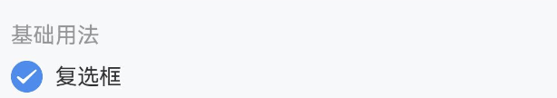
::: tip
• 通过 `group` 属性绑定 `IBestCheckboxGroup` 与 `IBestCheckbox` 的关系, `group` 值需具有**全局唯一性**。   
• `IBestCheckbox` 组件的 `name` 值在同一 `group` 中需具备**唯一性**。
:::

::: details 点我查看代码
```ts
@Entry
@ComponentV2
struct DemoPage {
  @Local isChecked: boolean = true
  build() {
    Column(){
      IBestCheckbox({
        value: this.isChecked!!,
        label: this.isChecked + ""
      })
    }
  }
}
```
:::

### 禁用状态

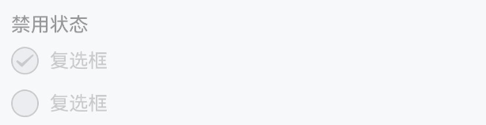
::: tip
通过设置 `disabled` 属性可以禁用复选框。
:::

::: details 点我查看代码
```ts
@Entry
@ComponentV2
struct DemoPage {
  build() {
    Column(){
      IBestCheckbox({
        value: false,
        disabled: true,
        label: "复选框"
      })
      IBestCheckbox({
        value: true,
        disabled: true,
        label: "复选框"
      })
    }
  }
}
```
:::

### 自定义形状

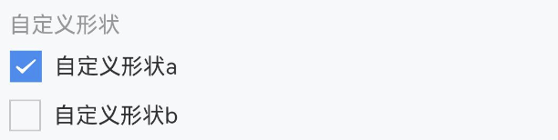
::: tip
将 `shape` 属性设置为 `square`，复选框的形状会变成方形。
:::

::: details 点我查看代码
```ts
@Entry
@ComponentV2
struct DemoPage {
  @Local isChecked: boolean = true
  build() {
    Column(){
      IBestCheckbox({
        value: this.isChecked!!,
        shape: 'square',
        label: "自定义形状"
      })
    }
  }
}
```
:::

### 自定义颜色

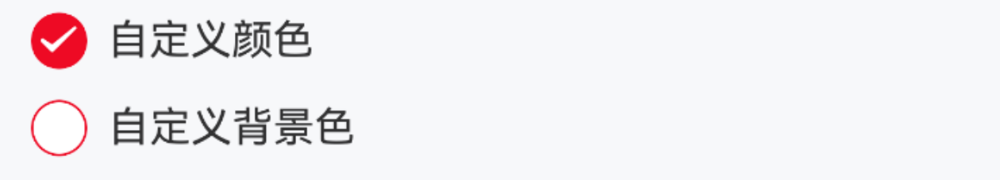
::: tip
通过 `checkedColor` 属性设置选中状态的图标颜色。
:::

::: details 点我查看代码
```ts
@Entry
@ComponentV2
struct DemoPage {
  @Local isChecked: boolean = true
  build() {
    Column({ space: 20 }) {
      IBestCheckbox({
        value: this.isChecked!!,
        checkedColor: '#ee0a24',
        label: '自定义颜色'
      })
      IBestCheckbox({
        value: false,
        bdColor: '#ee0a24',
        bgColor: "#fff",
        label: '自定义背景色'
      })
    }.alignItems(HorizontalAlign.Start)
  }
}
```
:::

### 自定义大小

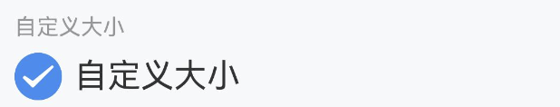
::: tip
通过 `iconSize` 属性可以自定义图标与文字的大小。
:::

::: details 点我查看代码
```ts
@Entry
@ComponentV2
struct DemoPage {
  @Local isChecked: boolean = true
  build() {
    Column(){
      IBestCheckbox({
        value: this.isChecked!!,
        iconSize: 30,
        label: '自定义大小'
      })
    }
  }
}
```
:::

### 自定义内容

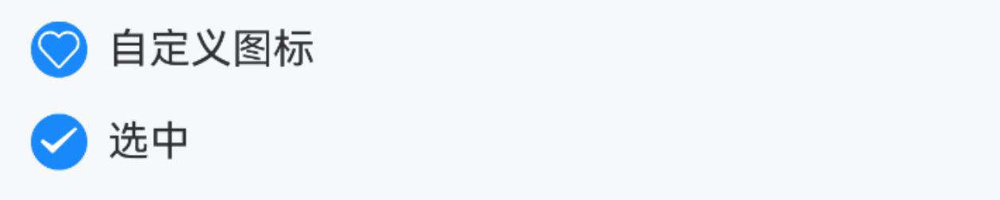
::: tip
· 通过 `iconBuilder` 插槽可以自定义图标, 通过 `labelBuilder` 插槽可以自定义文本。   
· 注意：`iconBuilder` 与 `labelBuilder` 只能通过this.xxx方式传递，箭头函数无效。
:::

::: details 点我查看代码
```ts
@Entry
@ComponentV2
struct DemoPage {
  @Local isChecked: boolean = true
  @Builder iconBuilder($$: IBestCheckboxBuilderParams){
    IBestIcon({
      name: "like-o",
      color: "#fff",
      iconSize: 18
    })
      .opacity($$.checked ? 1 : 0)
  }
  @Builder labelBuilder($$: IBestCheckboxBuilderParams) {
    Text($$.checked ? "选中" : "未选中")
  }
  build() {
    Column({space: 14}){
      IBestCheckbox({
        value: this.isChecked!!,
        iconBuilder: this.iconBuilder,
        label: '自定义图标'
      })
      IBestCheckbox({
        value: this.isChecked!!,
        defaultBuilder: this.labelBuilder
      })
    }
    .alignItems(HorizontalAlign.Start)
  }
}
```
:::

### 左侧文本

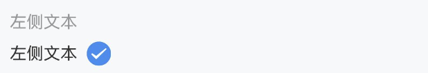
::: tip
将 `labelPosition` 属性设置为 `'left'`，可以将文本位置调整到复选框左侧。
:::

::: details 点我查看代码
```ts
@Entry
@ComponentV2
struct DemoPage {
  @Local isChecked: boolean = true
  build() {
    Column(){
      IBestCheckbox({
        value: this.isChecked!!,
        labelPosition: 'left',
        label: '左侧文本'
      })
    }
  }
}
```
:::

### 禁用文本点击

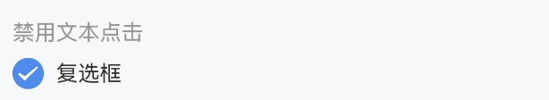
::: tip
设置 `labelDisabled` 属性后，点击图标以外的内容不会触发复选框切换。
:::

::: details 点我查看代码
```ts
@Entry
@ComponentV2
struct DemoPage {
  @Local isChecked: boolean = true
  build() {
    Column(){
      IBestCheckbox({
        value: this.isChecked!!,
        label: '左侧文本',
        labelDisabled: true
      })
    }
  }
}
```
:::

### 异步切换

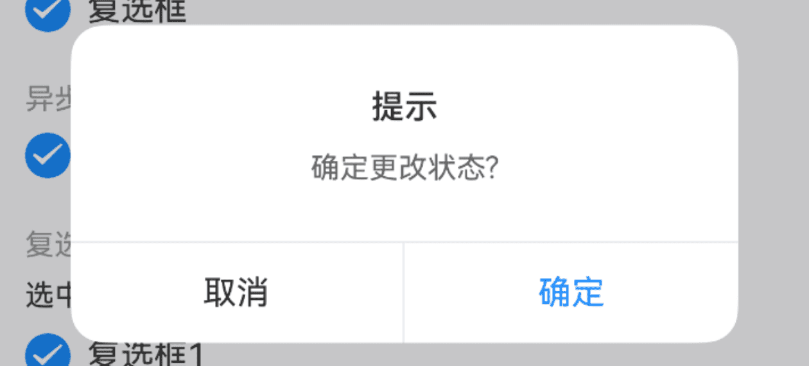

::: details 点我查看代码
```ts
@Entry
@ComponentV2
struct DemoPage {
  @Local isChecked: boolean = true
  build() {
    Column(){
      IBestCheckbox({
        value: this.isChecked!!,
        label: '复选框',
        beforeChange: () => {
          return new Promise((resolve, reject) => {
            IBestDialogUtil.open({
              title: "提示",
              message: "确定更改状态?",
              showCancelButton: true,
              onConfirm: () => {
                resolve(true)
              },
              onCancel: () => {
                reject(false)
              }
            })
          })
        }
      })
    }
  }
}
```
:::

### 其他类型

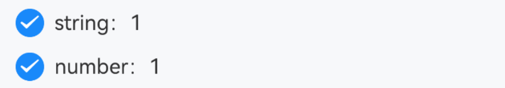
::: details 点我查看代码
```ts
@Entry
@ComponentV2
struct DemoPage {
  @Local isChecked: string = '1'
  @Local isChecked1: number = 1
  build() {
    Column({ space: 12 }) {
      IBestCheckbox({
        value: this.isChecked!!,
        label: "string：" + this.isChecked,
        trueValue: "1",
        falseValue: "2"
      })
      IBestCheckbox({
        value: this.isChecked1!!,
        label: "number：" + this.isChecked1.toString(),
        trueValue: 1,
        falseValue: 0
      })
    }.alignItems(HorizontalAlign.Start)
  }
}
```
:::

### 复选框组

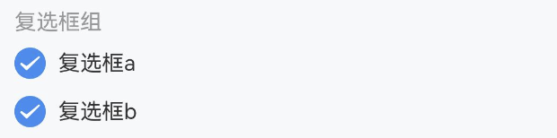

::: details 点我查看代码
```ts
@Entry
@ComponentV2
struct DemoPage {
  @Local group: string = "group"
  @Local activeList: string[] = ["1", "2"]
  build() {
    Column(){
      IBestCheckboxGroup({ group: this.group, activeList: this.activeList!!, beforeChange: () => {
        return new Promise((resolve, reject) => {
          IBestDialogUtil.open({
            title: "提示",
            message: "确定更改状态?",
            showCancelButton: true,
            onConfirm: () => {
              resolve(true)
            },
            onCancel: () => {
              reject(false)
            }
          })
        })
      }}){
        IBestCheckbox({
          group: this.group,
          label: '复选框1',
          name: '1'
        })
        IBestCheckbox({
          group: this.group,
          label: '复选框2',
          name: '2'
        })
      }
    }
  }
}
```
:::

### 水平排列

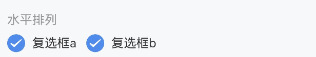

::: details 点我查看代码
```ts
@Entry
@ComponentV2
struct DemoPage {
  @Local group: string = "group"
  @Local activeList: number[] = [1, 2]
  build() {
    Column(){
      IBestCheckboxGroup({ group: this.group, activeList: this.activeList!!, placeDirection: Axis.Horizontal }){
        IBestCheckbox({
          group: this.group,
          label: '复选框1',
          name: 1
        })
        IBestCheckbox({
          group: this.group,
          label: '复选框2',
          name: 2
        })
      }
    }
  }
}
```
:::

### 限制最大可选数

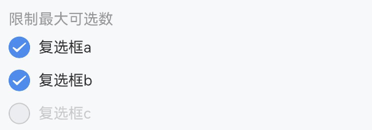
::: tip
通过 `max` 属性可以限制复选框组的最大可选数。
:::

::: details 点我查看代码
```ts
@Entry
@ComponentV2
struct DemoPage {
  @Local group: string = "group"
  @Local activeList: string[] = ["1", "2"]
  build() {
    Column(){
      IBestCheckboxGroup({ group: this.group, activeList: this.activeList!!, max: 2 }){
        IBestCheckbox({
          group: this.group,
          label: '复选框1',
          name: '1'
        })
        IBestCheckbox({
          group: this.group,
          label: '复选框2',
          name: '2'
        })
        IBestCheckbox({
          group: this.group,
          label: '复选框3',
          name: '3'
        })
      }
    }
  }
}
```
:::

### 全选与反选

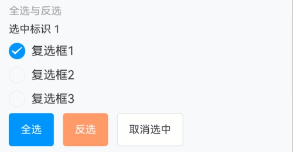
::: tip
通过 `controller` 上的 `toggleAll` 方法可以实现全选与反选。
:::

::: details 点我查看代码
```ts
import { IBestCheckboxGroupController } from '@ibestservices/ibset-ui'
@Entry
@ComponentV2
struct CheckboxPage {
  @Local group: string = "group"
  @Local activeList: string[] = ["1"]
  private controller: IBestCheckboxGroupController = new IBestCheckboxGroupController()
  build(){
    Column(){
      IBestCheckboxGroup({ group: this.group, activeList: this.activeList!!, controller: this.controller }){
        IBestCheckbox({
          group: this.group,
          label: '复选框1',
          name: '1'
        })
        IBestCheckbox({
          group: this.group,
          label: '复选框2',
          name: '2'
        })
        IBestCheckbox({
          group: this.group,
          label: '复选框3',
          name: '3'
        })
      }
      Row({space: 12}){
        IBestButton({
          text: '全选',
          type: 'primary',
          onBtnClick: ()=>{
            this.controller.toggleAll(true)
          }
        })
        IBestButton({
          text: '反选',
          type: 'warning',
          onBtnClick: ()=>{
            this.controller.toggleAll()
          }
        })
        IBestButton({
          text: '取消选中',
          onBtnClick: ()=>{
            this.controller.toggleAll(false)
          }
        })
      }.margin({top: 12})
    }
  }
}
```
:::

### 不确定状态

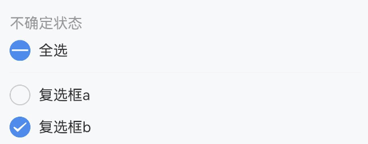
::: tip
通过 `indeterminate` 设置复选框是否为不确定状态。
:::

::: details 点我查看代码
```ts
import { IBestCheckboxGroupController } from '@ibestservices/ibset-ui'
@Entry
@ComponentV2
struct CheckboxPage {
  @Local group: string = "group"
  @Local activeList: string[] = ["2"]
  @Local isIndeterminate: boolean = true
  @Local isIndeterminateCheckAll: boolean = false
  private controller: IBestCheckboxGroupController = new IBestCheckboxGroupController()
  build(){
    Column() {
      IBestCheckbox({
        value: this.isIndeterminateCheckAll,
        label: '全选',
        indeterminate: this.isIndeterminate,
        onChange: checked => {
          this.controller.toggleAll(checked)
        }
      })
      IBestCheckboxGroup({
        group: this.group,
        activeList: this.activeList!!,
        controller: this.controller,
        onChange: checkedNames => {
          const length = checkedNames.length
          this.isIndeterminate = length < 2 && length > 0
          this.isIndeterminateCheckAll = length === 2
        }
      }){
        IBestCheckbox({
          group: this.group,
          label: '复选框1',
          name: '1'
        })
        IBestCheckbox({
          group: this.group,
          label: '复选框2',
          name: '2'
        })
      }
    }
  }
}
```
:::

### 搭配单元格组件使用

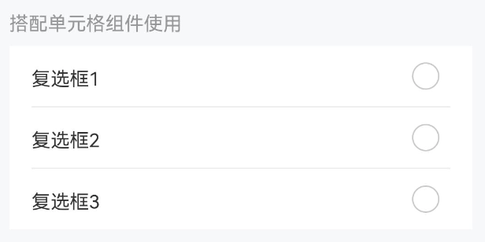

::: details 点我查看代码
```ts
@Entry
@ComponentV2
struct CheckboxPage {
  @Local group: string = "group"
  @Local activeList: string[] = []
  @Local cellCheckedMaxNum: number = 2
  @Builder CellCheckbox(name, group){
    IBestCheckbox({ name, group })
  }
  handleCellClick(name){
    const index = this.activeList.indexOf(name)
    if(index > -1){
      this.activeList.splice(index, 1)
    }else{
      this.activeList.push(name)
    }
  }
  build(){
    Column() {
      IBestCheckboxGroup({
        group: this.group,
        activeList: this.activeList!!,
        max: this.cellCheckedMaxNum,
        space: 0
      }){
        IBestCell({
          clickable: true,
          title: '复选框1',
          disabled: this.activeList.length >= this.cellCheckedMaxNum && !this.activeList.includes('1'),
          rightIconBuilder: (): void => this.CellCheckbox('1', this.group),
          onCellClick: (): void => this.handleCellClick('1')
        })
        IBestCell({
          clickable: true,
          title: '复选框2',
          disabled: this.activeList.length >= this.cellCheckedMaxNum && !this.activeList.includes('2'),
          rightIconBuilder: (): void => this.CellCheckbox('2', this.group),
          onCellClick: (): void => this.handleCellClick('2')
        })
        IBestCell({
          clickable: true,
          title: '复选框3',
          disabled: this.activeList.length >= this.cellCheckedMaxNum && !this.activeList.includes('3'),
          hasBorder: false,
          rightIconBuilder: (): void => this.CellCheckbox('3', this.group),
          onCellClick: (): void => this.handleCellClick('3')
        })
      }
    }
  }
}
```
:::

## API

### Checkbox @Props

| 参数          | 说明                                                              | 类型   | 默认值  |
| ------------- | -----------------------------------------------------------------|-------| ------- |
| group         | 标识符，通常为一个唯一的字符串，需具备`全局唯一性`或已入栈的页面`唯一性`| _string_ \| _number_  |  `''`   |
| name          | 标识符，通常为一个唯一的字符串或数字，同一 `group` 的 `name` 不可重复 | _string_ \| _number_ | `''` |
| label         | 显示的文本                                                        | _ResourceStr_   |  `''`   |
| value         | 选中绑定值，支持双向绑定                                           | _string_ \| _number_ \| _boolean_| `false` |
| iconSize      | 图标大小                                                          | _string_ \| _number_ | `18`|
| shape         | 形状，可选值为 `square` `round`                                    | _string_        | `round` |
| disabled      | 是否为禁用状态                                                     | _boolean_       | `false` |
| labelDisabled | 是否禁用文本内容点击                                                | _boolean_       | `false` |
| labelPosition | 文本位置，可选值为 `left`                                           | _string_        | `right` |
| checkedColor  | 选中状态颜色                                                       | _ResourceColor_ | `#1989fa`  |
| indeterminate | 是否为不确定状态                                                    | _boolean_       | `false` |
| labelFontSize | 文本字体大小                                                       | _string_ \| _number_ | `16`|
| bgColor       | 背景色                                                             | _ResourceColor_ | `''` |
| bdColor       | 边框色                                                             | _ResourceColor_ | `#ebedf0` |
| beforeChange  | 改变前的回调                                                        | _(value: boolean) => Promise\<boolean\> \| boolean_ | `-` |
| trueValue <span style="font-size: 12px; padding:2px 4px;color:#3D8AF2;border-radius:4px;border: 1px solid #3D8AF2">1.0.2</span>| 选中时的值，仅单独使用时生效         | _string_ \| _number_ | `'1'` |
| falseValue <span style="font-size: 12px; padding:2px 4px;color:#3D8AF2;border-radius:4px;border: 1px solid #3D8AF2">1.0.2</span>| 未选中时的值，仅单独使用时生效     | _string_ \| _number_ | `'0'` |

### Checkbox Events

| 事件名   | 说明                   | 事件类型                       |
| -------- | ----------------------| ------------------------------ |
| onChange | 选中状态改变的回调事件   | `(checked: string \| number \| boolean) => void` |

### Checkbox 插槽

| 插槽名         | 说明                        | 参数类型    |
| ---------------| ---------------------------| --------- |
| defaultBuilder | `label` 的插槽，优先级大于 `label` 属性  | `$$: IBestCheckboxBuilderParams` |
| iconBuilder    | 自定义图标插槽，需要自己调整选中与未选中展示的 `UI` 内容 | `$$: IBestCheckboxBuilderParams` |

### IBestCheckboxBuilderParams 数据类型
| 参数        | 说明       | 类型     |
| -----------|------------| --------|
| checked    | 是否选中    | _boolean_ |
| disabled   | 是否禁用    | _boolean_ |

### CheckboxGroup @Props

| 参数  | 说明                                                           | 类型     | 默认值 |
| ----- | -------------------------------------------------------------| -------- | ------ |
| group | 标识符，通常为一个唯一的字符串，需具备`全局唯一性` | _string_ \| _number_ |  `''`  |
| max   | 最大可选数，`0` 为无限制                        | _number_ |  `0`   |
| activeList | 激活的标识列表, 支持双向绑定                | _(string \| number)[]_  |  `[]`  |
| placeDirection | 排列方向                              | _<a href="https://developer.huawei.com/consumer/cn/doc/harmonyos-references-V13/ts-appendix-enums-V13#axis" target="__blank">Axis</a>_   | `Axis.Vertical` |
| space | 间距                                           | _string_ \| _number_ | `12` |
| controller | 组件实例                                   | _IBestCheckboxGroupController_ | `-` |
| beforeChange | 改变前的回调     | _(value: boolean) => Promise\<boolean\> \| boolean_ | `-` |
| disabled     | 是否禁用                           | _boolean_ | `false` |

### IBestCheckboxGroupController 方法

| 方法名     |       说明                | 参数类型             |
| --------- | -------------------------| --------------------|
| toggleAll | 全选与反选, true 为选中，false 为取消选中，不传参为取反 | `isSelectAll?: boolean` |

### CheckboxGroup Events

| 事件名    | 说明                            | 事件类型                  |
| -------- | ------------------------------ | ------------------------ |
| onChange | 选中状态改变的回调事件，回调参数是选中的 `checkbox` 组件的 `name` 值 | `(checkboxNames: (string \| number)[]) => void`  |

### CheckboxGroup 插槽

| 插槽名         | 说明                        | 参数类型    |
| --------------| ---------------------------| --------- |
| defaultBuilder | 默认内容插槽                | `-` |

## 主题定制

组件提供了下列颜色变量，可用于自定义深色/浅色模式样式，使用方法请参考 [颜色模式](../../guide/color-mode/index.md) 章节，如需要其它颜色变量可提 [issue](https://github.com/ibestservices/ibest-ui/issues)。

| 名称                                       | 描述                              | 默认值        |
| -------------------------------------------|----------------------------------|--------------|
| ibest_checkbox_label_color                 | 标签文字颜色                       | `#323233`   |
| ibest_checkbox_disabled_label_color        | 禁用时标签文字颜色                  | `#c8c9cc`   |
| ibest_checkbox_disabled_icon_color         | 禁用时图标颜色                     | `#c8c9cc`   |
| ibest_checkbox_border_color                | 边框颜色                           | `#ebedf0`   |