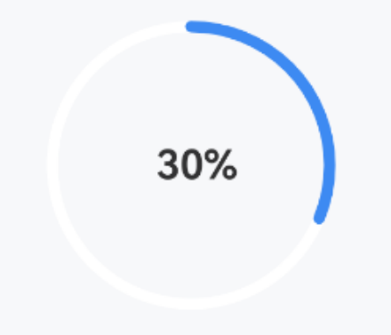
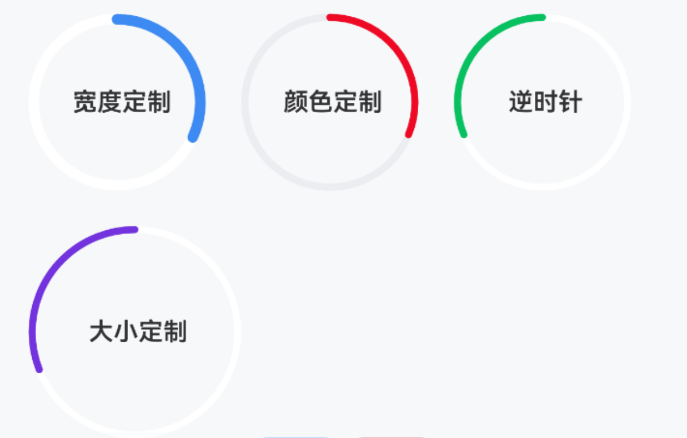
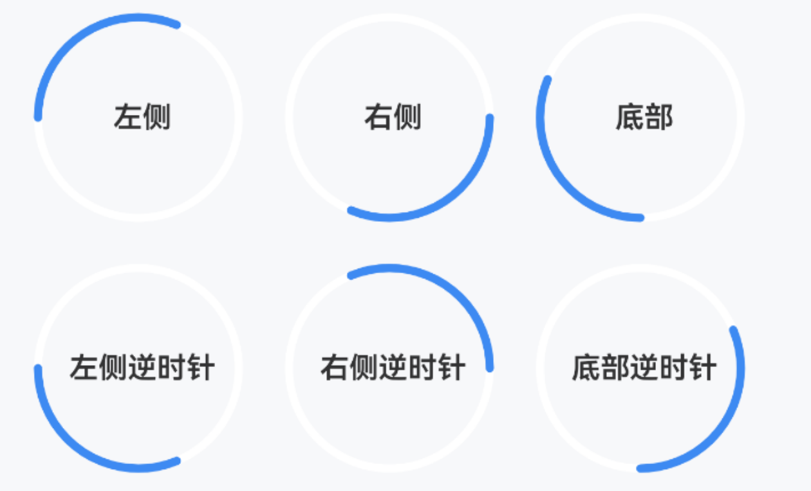

# CircleProgress 环形进度条

## 介绍

圆环形的进度条组件。
 
## 引入

```ts
import { IBestCircleProgress } from "@ibestservices/ibest-ui-v2";
```

## 代码演示

### 基础用法



::: details 点我查看代码
```ts
@Entry
@ComponentV2
struct DemoPage {
  @Local value: number = 30
  build() {
    Column(){
      IBestCircleProgress({
        value: this.value!!,
        text: `${this.value}%`
      })
    }
  }
}
```
:::

### 样式定制



::: details 点我查看代码
```ts
@Entry
@ComponentV2
struct DemoPage {
  @Local value: number = 30
  build() {
    Flex({wrap: FlexWrap.Wrap, space: { main: LengthMetrics.vp(20), cross: LengthMetrics.vp(20) }}){
      IBestCircleProgress({
        value: this.value!!,
        strokeWidth: 6,
        text: "宽度定制"
      })
      IBestCircleProgress({
        value: this.value!!,
        color: "#ee0a24",
        bgColor: "#ebedf0",
        text: "颜色定制"
      })
      IBestCircleProgress({
        value: this.value!!,
        clockwise: false,
        text: "逆时针",
        color: "#07c160"
      })
      IBestCircleProgress({
        value: this.value!!,
        diameter: 120,
        clockwise: false,
        text: "大小定制",
        color: "#7232dd"
      })
    }
  }
}
```
:::

### 起始位置



::: details 点我查看代码
```ts
@Entry
@ComponentV2
struct DemoPage {
  @Local value: number = 30
  build() {
    Flex({wrap: FlexWrap.Wrap, space: { main: LengthMetrics.vp(20), cross: LengthMetrics.vp(20) }}){
      IBestCircleProgress({
        value: this.value!!,
        startPosition: "left",
        text: "左侧"
      })
      IBestCircleProgress({
        value: this.value!!,
        startPosition: "right",
        text: "右侧"
      })
      IBestCircleProgress({
        value: this.value!!,
        startPosition: "bottom",
        text: "底部"
      })
      IBestCircleProgress({
        value: this.value!!,
        startPosition: "left",
        clockwise: false,
        text: "左侧逆时针"
      })
      IBestCircleProgress({
        value: this.value!!,
        startPosition: "right",
        clockwise: false,
        text: "右侧逆时针"
      })
      IBestCircleProgress({
        value: this.value!!,
        startPosition: "bottom",
        clockwise: false,
        text: "底部逆时针"
      })
    }
  }
}
```
:::

## API

### @Props

| 参数         | 说明                                 | 类型      | 默认值     |
| ------------ | ----------------------------------- | --------- | ---------- |
| value        | 进度值, 支持双向绑定                    | _number_  | `0` |
| diameter     | 进度条直径(宽度)                       | _number_  | `100` |
| target       | 目标进度                              | _number_  | `100` |
| text         | 中间文字                              | _string_ |  `''`  |
| textColor    | 中间文字颜色                           | _ResourceColor_ |  `#323233`  |
| textFontSize | 中间文字大小                           | _string_ \| _number_  | `16` |
| textFontWeight| 中间文字字重                          | _FontWeight_ |  `600`  |
| color        | 进度条颜色                             | _ResourceColor_  | `#3d8af2` |
| bgColor      | 进度条背景颜色                          | _ResourceColor_  | `#fff` |
| strokeWidth  | 进度条宽度                             | _number_  | `4` |
| duration     | 动画时长                               | _number_  | `300` |
| strokeLineCap| 进度端点样式                           | _<a href="https://developer.huawei.com/consumer/cn/doc/harmonyos-references-V13/ts-appendix-enums-V13#linecapstyle" target="__blank">LineCapStyle</a>_  | `Round` |
| clockwise    | 是否顺时针                             | _boolean_  | `true` |
| startPosition| 进度条起始位置, 可选值 `left` `right` `top` `bottom` | _string_  | `top` |

### Events

| 事件名         | 说明                 | 回调参数                       |
| --------------| ---------------------| ------------------------------ |
| onReachTarget | 到达目标值            | `-` |

## 主题定制

组件提供了下列颜色变量，可用于自定义深色/浅色模式样式，使用方法请参考 [颜色模式](../../guide/color-mode/index.md) 章节，如需要其它颜色变量可提 [issue](https://github.com/ibestservices/ibest-ui/issues)。

| 名称                                       | 描述                              | 默认值        |
| -------------------------------------------|----------------------------------|--------------|
| ibest_circle_progress_background           | 进度条背景颜色                     | `#fff`   |
| ibest_circle_progress_text_color           | 进度条文字颜色                     | `#323233`   |