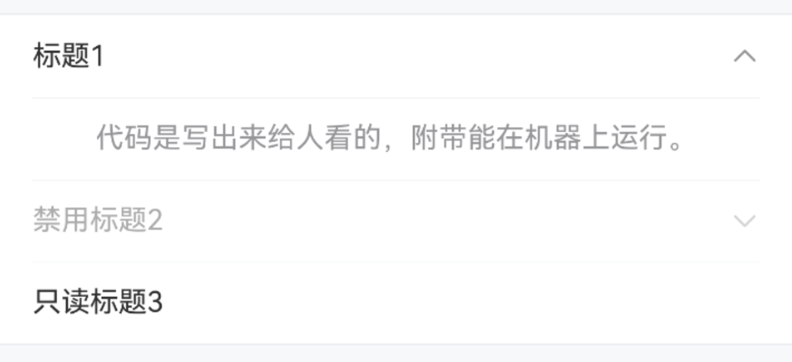

# Collapse 折叠面板

## 介绍

将一组内容放置在多个折叠面板中，点击面板的标题可以展开或收缩其内容。
 
## 引入

```ts
import { IBestCollapse, IBestCollapseItem } from "@ibestservices/ibest-ui-v2";
```

## 代码演示

### 基础用法


::: details 点我查看代码
```ts
@Entry
@ComponentV2
struct DemoPage {
  @Local activeName: string[] = ['1']
  @Local groupId: string = 'group'
  build() {
    Column(){
      IBestCollapse({groupId: this.groupId, activeName: this.activeName!!}){
        IBestCollapseItem({
          groupId: this.groupId,
          name: '1',
          index: 0,
          title: '标题1'
        }){
          Text('代码是写出来给人看的，附带能在机器上运行。').fontSize(14).fontColor("#969799")
        }
        IBestCollapseItem({
          groupId: this.groupId,
          name: '2',
          index: 1,
          title: '标题2'
        }){
          Text('技术无非就是那些开发它的人的共同灵魂。').fontSize(14).fontColor("#969799")
        }
        IBestCollapseItem({
          groupId: this.groupId,
          name: '3',
          index: 2,
          title: '标题3'
        }){
          Text('在代码阅读过程中人们说脏话的频率是衡量代码质量的唯一标准。').fontSize(14).fontColor("#969799")
        }
      }
    }
  }
}
```
:::

### 手风琴


::: details 点我查看代码
```ts
@Entry
@ComponentV2
struct DemoPage {
  @Local activeName: number = 1
  @Local groupId: string = 'group'
  build() {
    Column(){
      IBestCollapse({groupId: this.groupId, activeName: this.activeName!!, accordion: true}){
        IBestCollapseItem({
          groupId: this.groupId,
          name: 1,
          index: 0,
          title: '标题1'
        }){
          Text('代码是写出来给人看的，附带能在机器上运行。').fontSize(14).fontColor("#969799")
        }
        IBestCollapseItem({
          groupId: this.groupId,
          name: 2,
          index: 1,
          title: '标题2'
        }){
          Text('技术无非就是那些开发它的人的共同灵魂。').fontSize(14).fontColor("#969799")
        }
        IBestCollapseItem({
          groupId: this.groupId,
          name: 3,
          index: 2,
          title: '标题3'
        }){
          Text('在代码阅读过程中人们说脏话的频率是衡量代码质量的唯一标准。').fontSize(14).fontColor("#969799")
        }
      }
    }
  }
}
```
:::

### 禁用状态



::: details 点我查看代码
```ts
@Entry
@ComponentV2
struct DemoPage {
  @Local activeName: string[] = ['2']
  @Local groupId: string = 'group'
  build() {
    Column(){
      IBestCollapse({groupId: this.groupId, activeName: this.activeName!!}){
        IBestCollapseItem({
          groupId: this.groupId,
          name: '1',
          index: 0,
          title: '标题1'
        }){
          Text('代码是写出来给人看的，附带能在机器上运行。').fontSize(14).fontColor("#969799")
        }
        IBestCollapseItem({
          groupId: this.groupId,
          name: '2',
          index: 1,
          title: '标题2',
          disabled: true
        }){
          Text('技术无非就是那些开发它的人的共同灵魂。').fontSize(14).fontColor("#969799")
        }
        IBestCollapseItem({
          groupId: this.groupId,
          name: '3',
          index: 2,
          title: '标题3'
        }){
          Text('在代码阅读过程中人们说脏话的频率是衡量代码质量的唯一标准。').fontSize(14).fontColor("#969799")
        }
      }
    }
  }
}
```
:::

### 自定义标题


::: details 点我查看代码
```ts
@Entry
@ComponentV2
struct DemoPage {
  @Local activeName: string[] = ['1']
  @Local groupId: string = 'group'
  build() {
    Column(){
      IBestCollapse({groupId: this.groupId, activeName: this.activeName!!}){
        IBestCollapseItem({
          groupId: this.groupId,
          name: '1',
          index: 0,
          icon: $r("app.media.icon_like"),
          title: '标题1',
          value: "右侧内容"
        }){
          Text('代码是写出来给人看的，附带能在机器上运行。').fontSize(14).fontColor("#969799")
        }
      }
    }
  }
}
```
:::

### 实例方法


::: details 点我查看代码
```ts
import { IBestCollapseController } from '@ibestservices/ibest-ui';

@Entry
@ComponentV2
struct DemoPage {
  @Local activeName: number[] = [2]
  @Local groupId: string = 'group'
  private controller: IBestCollapseController = new IBestCollapseController()
  build() {
    Column(){
      IBestCollapse({
        groupId: this.groupId,
        activeName: this.activeName!!,
        controller: this.controller
      }){
        IBestCollapseItem({
          groupId: this.groupId,
          name: 1,
          index: 0,
          title: '标题1'
        }){
          Text('代码是写出来给人看的，附带能在机器上运行。').fontSize(14).fontColor("#969799")
        }
        IBestCollapseItem({
          groupId: this.groupId,
          name: 2,
          index: 1,
          title: '标题2',
          disabled: true
        }){
          Text('技术无非就是那些开发它的人的共同灵魂。').fontSize(14).fontColor("#969799")
        }
        IBestCollapseItem({
          groupId: this.groupId,
          name: 3,
          index: 2,
          title: '标题3'
        }){
          Text('在代码阅读过程中人们说脏话的频率是衡量代码质量的唯一标准。').fontSize(14).fontColor("#969799")
        }
      }
      Column(){
        Row({space: 16}){
          IBestButton({
            type: "primary",
            text: "全部展开",
            buttonSize: "small",
            onBtnClick: () => {
              this.controller.toggleAll(true)
            }
          })
          IBestButton({
            type: "primary",
            text: "全部收起",
            buttonSize: "small",
            onBtnClick: () => {
              this.controller.toggleAll(false)
            }
          })
          IBestButton({
            type: "primary",
            text: "切换",
            buttonSize: "small",
            onBtnClick: () => {
              this.controller.toggleAll()
            }
          })
        }
        .padding({top: 16, left: 16})
        Row({space: 16}){
          IBestButton({
            type: "primary",
            text: "跳过禁用展开",
            buttonSize: "small",
            onBtnClick: () => {
              this.controller.toggleAll({
                expanded: true,
                skipDisabled: true
              })
            }
          })
          IBestButton({
            type: "primary",
            text: "跳过禁用收起",
            buttonSize: "small",
            onBtnClick: () => {
              this.controller.toggleAll({
                expanded: false,
                skipDisabled: true
              })
            }
          })
          IBestButton({
            type: "primary",
            text: "跳过禁用切换",
            buttonSize: "small",
            onBtnClick: () => {
              this.controller.toggleAll({
                skipDisabled: true
              })
            }
          })
        }
        .padding({top: 16, left: 16})
      }
    }
  }
}
```
:::

## API

### IBestCollapse @Props

| 参数         | 说明                         | 类型      | 默认值     |
| ------------ | ----------------------------| --------- | ---------- |
| groupId      | 分组id, 需保证全局唯一性      | _string_ \| _number_  | `''`  |
| activeName   | 当前展开面板的name           | 手风琴模式：_string_ \| _number_ <br>非手风琴模式：_(string \| number)[]_ | `''`  |
| accordion    | 是否开启手风琴模式            | _boolean_ | `false`  |
| isShowBorder | 是否显示外边框                | _boolean_ | `true`  |
| controller   | 实例方法                     | _IBestCollapseController_ | `-`  |

### IBestCollapse 插槽
| 插槽名             | 说明                             | 类型             |
| ------------------| --------------------------------| ----------------|
| defaultBuilder    | 默认内容                         | _CustomBuilder_ |

### IBestCollapse Events

| 事件名     | 说明                  | 回调参数                         |
| ----------| ---------------------| -------------------------------- |
| onChange  | 面板状态变化回调        | `name: string \| string[]` |

### IBestCollapseController 实例方法
| 方法名      | 说明                  | 参数             | 返回值 |
| ----------| ---------------------| -------------------------------- | ---|
| toggleAll  | 切换所有面板状态, 传 true 为全部展开，false 为全部收起，不传参为全部切换 | `option?: boolean \| ToggleOption` | `-` |

### ToggleOption 数据类型
| 参数         | 说明                         | 类型                       | 默认值     |
| ------------| -----------------------------| ------------------------- | ---------|
| expanded    | 是否展开, 传 true 为全部展开，false 为全部收起，不传参为全部切换  | _boolean_ | `undefined`  |
| skipDisabled | 是否跳过禁用的选项             | _boolean_ | `false` |

### IBestCollapseItem @Props
| 参数         | 说明                                          | 类型      | 默认值     |
| ------------ | ---------------------------------------------| --------- | ---------|
| groupId      | 分组id, 与IBestCollapse `groupId` 一致         | _string_ \| _number_  | `''`  |
| name         | 唯一标识符                                     | _string_ \| _number_  | `''`  |
| index        | 索引                                          | _number_  | `''`  |
| icon         | 标题栏左侧图标                                  | _ResourceStr_  | `''` |
| iconColor    | 标题栏左侧图标颜色                               | _ResourceColor_ | `#323233` |
| iconSize     | 选项图标                                       | _string_ \| _number_ | `16` |
| title        | 标题文字                                       | _ResourceStr_ | `''` |
| titleColor   | 标题文字颜色                                    | _ResourceColor_ | `#323233` |
| titleFontSize| 标题文字大小                                    | _string_ \| _number_ | `14` |
| value        | 标题右侧文字                                    | _ResourceStr_ | `''` |
| valueColor   | 标题右侧文字颜色                                 | _ResourceColor_ | `#969799` |
| valueFontSize| 标题右侧文字大小                                 | _string_ \| _number_ | `14` |
| isShowBorder | 是否显示内边框                                   | _boolean_ | `true` |
| disabled     | 是否禁用                                        | _boolean_ | `false` |
| readOnly     | 是否只读                                        | _boolean_ | `false` |

### IBestCollapseItem 插槽
| 插槽名             | 说明                             | 类型             |
| ------------------| --------------------------------| ----------------|
| defaultBuilder    | 默认内容                         | _CustomBuilder_ |

## 主题定制

组件提供了下列颜色变量，可用于自定义深色/浅色模式样式，使用方法请参考 [颜色模式](../../guide/color-mode/index.md) 章节，如需要其它颜色变量可提 [issue](https://github.com/ibestservices/ibest-ui/issues)。

| 名称                                       | 描述                              | 默认值        |
| -------------------------------------------|----------------------------------|--------------|
| ibest_collapse_background                  | 面板背景颜色                      | `#fff`   |
| ibest_collapse_title_color                 | 面板标题文字颜色                  | `#323233`   |
| ibest_collapse_icon_color                  | 面板图标颜色                      | `#323233`   |
| ibest_collapse_value_color                 | 面板标题右侧文字颜色               | `#969799`   |
| ibest_collapse_border_color                | 面板边框颜色                      | `#ebedf0`   |