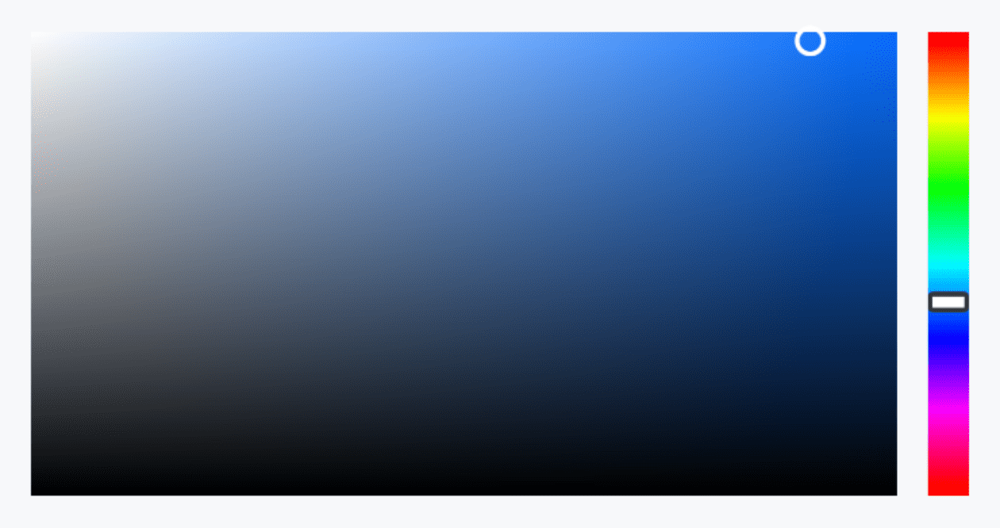
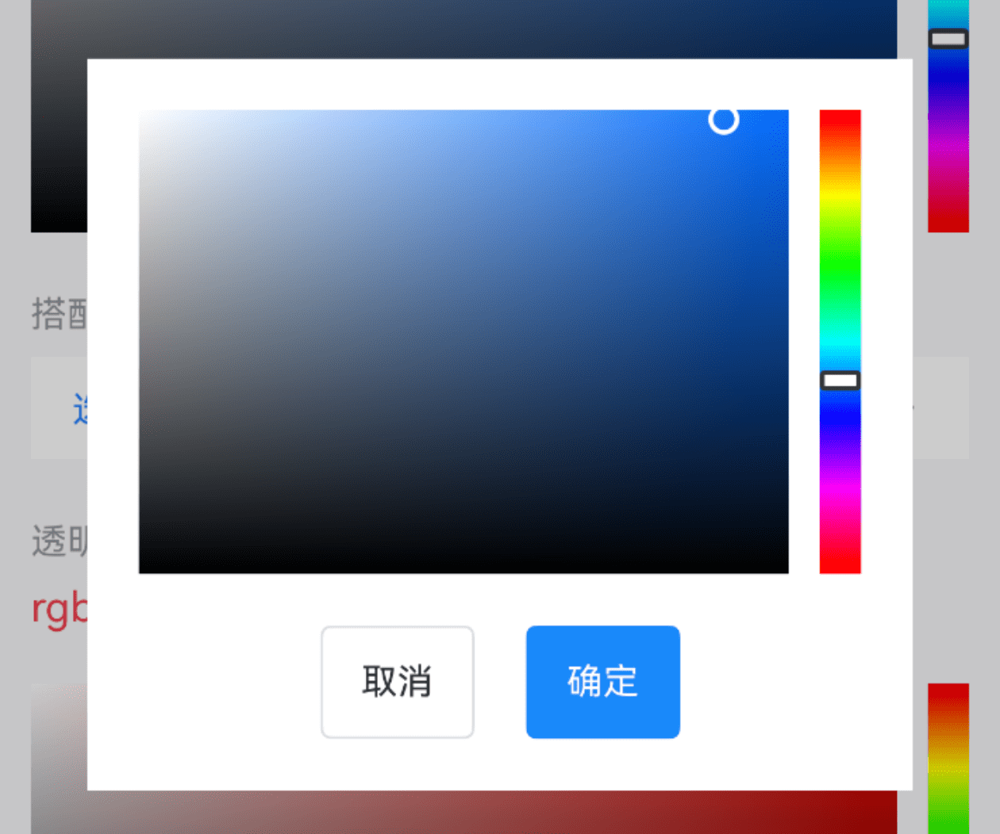
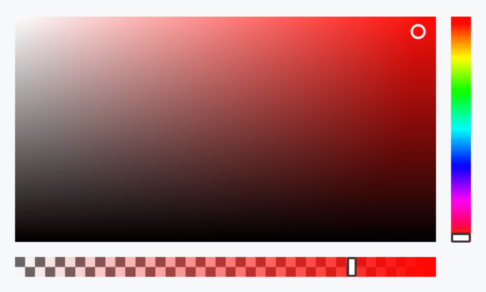
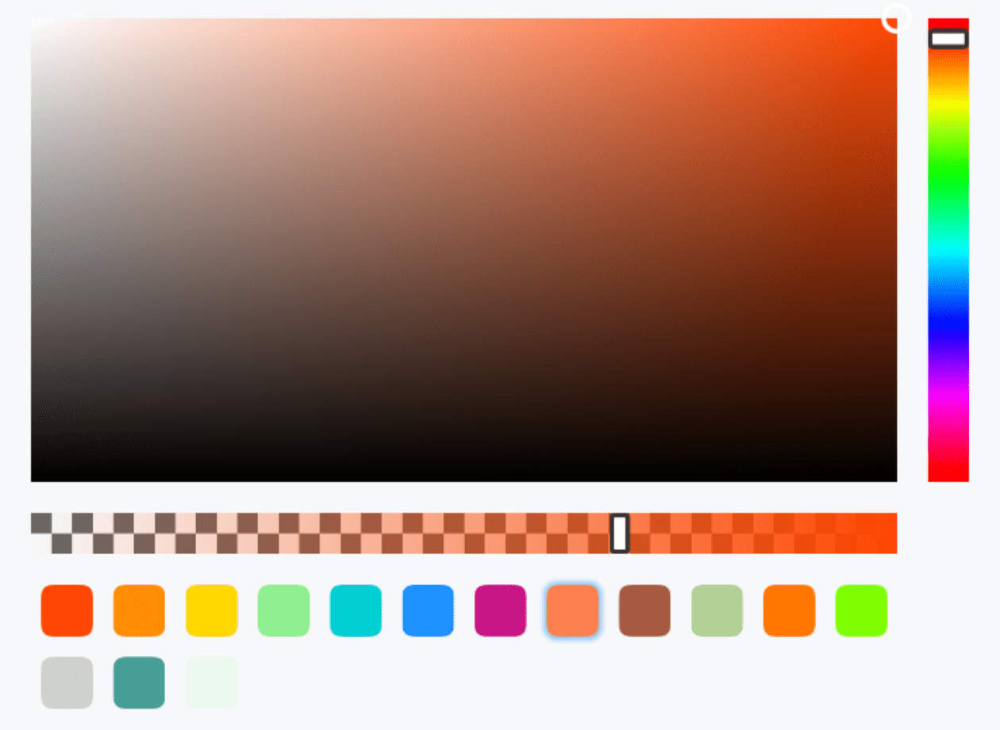
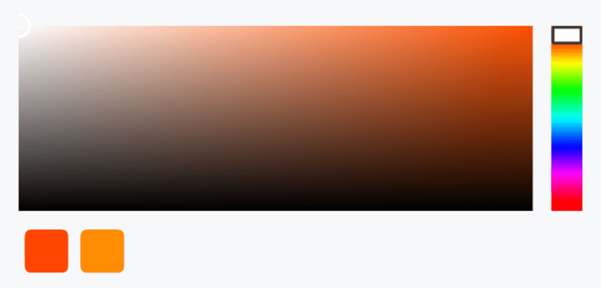

# ColorPicker 颜色选择器

## 介绍

用于选择颜色。
 
## 引入

```ts
import { IBestColorPicker } from "@ibestservices/ibest-ui-v2";
```

## 代码演示

### 基础用法



::: details 点我查看代码
```ts
@Entry
@ComponentV2
struct DemoPage {
  @Local color: string = "#1989fa"
  build() {
    Column(){
      IBestColorPicker({
        value: this.color!!
      })
    }
  }
}
```
:::

### 搭配弹出层使用



::: details 点我查看代码
```ts
import { IBestField, IBestPopup } from '@ibestservices/ibest-ui-v2'
@Entry
@ComponentV2
struct DemoPage {
  @Local color: string = "#1989fa"
  @Local visible: boolean = false
  @Builder pickerBuilder(){
    Column({space: 20}){
      IBestColorPicker({
        value: this.color!!
      })
      Row({space: 20}){
        IBestButton({
          text: "取消",
          onBtnClick: () => {
            this.visible = false
          }
        })
        IBestButton({
          type: "primary",
          text: "确定",
          onBtnClick: () => {
            this.visible = false
          }
        })
      }
    }.padding(20)
  }
  build() {
    Column(){
      IBestField({
        label: '选择颜色',
        value: this.color,
        placeholder: "请选择颜色",
        labelColor: this.color,
        isLink: true,
        hasBorder: false,
        onFieldClick: () => {
          this.visible = true
        }
      })
      // 弹出层
      IBestPopup({
        visible: this.visible!!,
        popupWidth: 320,
        contentBuilder: (): void => this.pickerBuilder()
      })
    }
  }
}
```
:::

### 透明度



::: details 点我查看代码
```ts
@Entry
@ComponentV2
struct DemoPage {
  @Local color: string = "rgba(238,10,36,0.8)"
  build() {
    Column(){
      IBestColorPicker({
        value: this.color!!,
        enableAlpha: true
      })
    }
  }
}
```
:::

### 预定颜色



::: details 点我查看代码
```ts
@Entry
@ComponentV2
struct DemoPage {
  @Local color: string = "rgba(255, 69, 0, 0.68)"
  build() {
    Column(){
      IBestColorPicker({
        value: this.color!!,
        enableAlpha: true,
        predefineColors: [
          '#ff4500',
          '#ff8c00',
          '#ffd700',
          '#90ee90',
          '#00ced1',
          '#1e90ff',
          '#c71585',
          'rgba(255, 69, 0, 0.68)',
          'rgba(146, 50, 20, 0.8)',
          'rgba(107, 167, 50, 0.5)',
          'rgb(255, 120, 0)',
          'rgb(125, 255, 0)',
          '#ffced1cc',
          '#c7158577',
          '#1e90ff99'
        ]
      })
    }
  }
}
```
:::

### 自定义尺寸


::: details 点我查看代码
```ts
@Entry
@ComponentV2
struct DemoPage {
  @Local color: string = ""
  build() {
    Column(){
      IBestColorPicker({
        value: this.color!!,
        panelHeight: 120,
        cursorWidth: 16,
        hueSliderWidth: 20,
        hueSliderHeight: 12,
        predefineBlockWidth: 28,
        predefineColors: [
          '#ff4500',
          '#ff8c00'
        ]
      })
    }
  }
}
```
:::

## API

### @Props

| 参数         | 说明                                          | 类型      | 默认值     |
| ------------ | ---------------------------------------------| --------- | ---------- |
| value        | 当前选中的颜色值, 支持双向绑定, 仅支持 hex 或 rgb 格式| _string_  | `''` | 
| colorFormat  | 指定传入的颜色格式, 可选值 `rgb` 、`hex`          | _string_  | `hex` |
| enableAlpha  | 是否支持透明度选择                               | _boolean_ | `false` |
| bgColor      | 整体背景色                                     | _ResourceColor_  | `''` |
| panelHeight  | 面板高度                                       | _string_ \| _number_ | `180`   |
| cursorWidth   | 颜色选取块宽度(宽高一致)                        | _string_ \| _number_ | `12`   |
| hueSliderWidth| 色彩滑块宽度                                   | _string_ \| _number_ | `16`   |
| hueSliderHeight| 色彩滑块高度                                  | _string_ \| _number_ | `8`   |
| alphaSliderWidth| 透明度滑块宽度                               | _string_ \| _number_ | `8`   |
| alphaSliderHeight| 透明度滑块高度                              | _string_ \| _number_ | `16`   |
| panelHueSpace | 颜色面板与色彩滑块之间的距离                      | _string_ \| _number_ | `12`   |
| panelAlphaSpace| 颜色面板与透明度滑块之间的距离                    | _string_ \| _number_ | `12`   |
| predefineColors | 预设颜色                                     | _string[]_ | `[]`   |
| predefineBlockWidth | 预设颜色块宽度(宽高一致)                    | _string_ \| _number_ | `20`   |

### Events

| 事件名     | 说明          | 事件类型          |
| ----------| --------------| -------------------------------- |
| onChange  | 颜色变化时触发 | `(value: string) => void` |