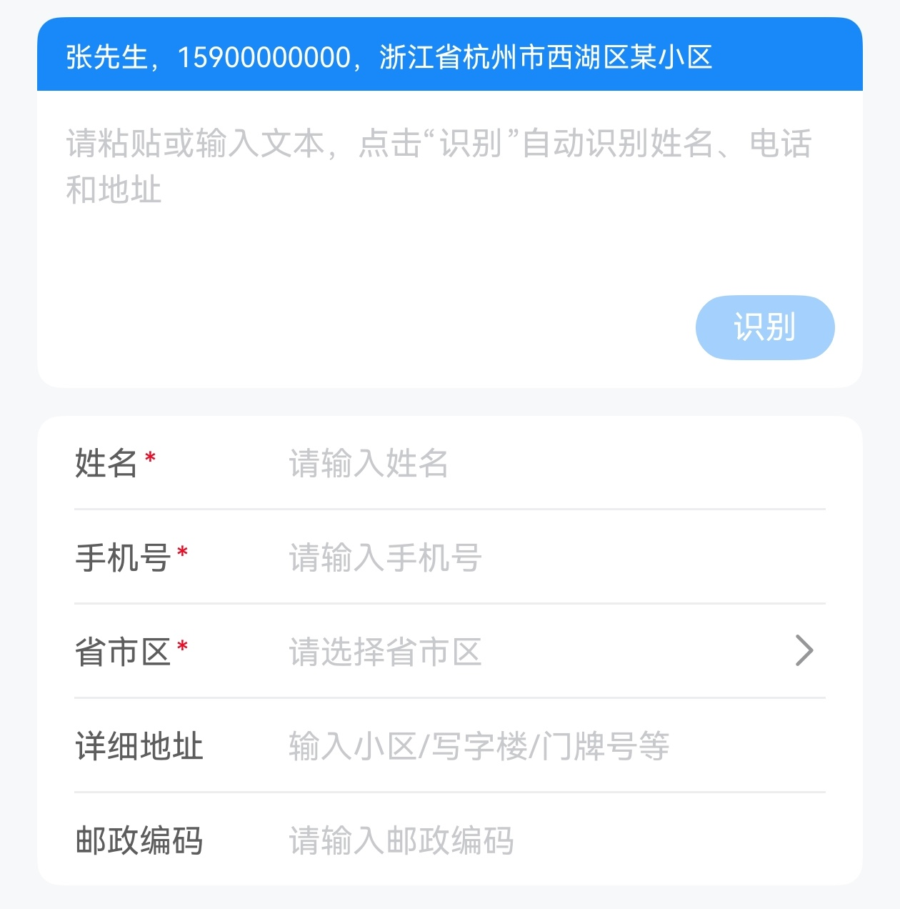

# ContactAddress 联系人地址

## 介绍

用于选择联系人地址, 可粘贴识别。
 
## 引入

```ts
import { IBestContactAddress, IBestContactAddressController } from "@ibestservices/ibest-ui-v2";
```

## 代码演示

### 基础用法



::: details 点我查看代码
```ts
@Entry
@ComponentV2
struct DemoPage {
  @Local showInputBox: boolean = true
  @Local labelColor: string = '#5d5d5d'
  @Local inputFontSize: number = 14
  @Local hasBorder: boolean = true
  @Local identifyPlaceholder: string = "请粘贴或输入文本，点击“识别”自动识别姓名、电话和地址"
  @Local identifyTagText: string = "张先生，15900000000，浙江省杭州市西湖区某小区"
  @Local identifyTagBgColor: string = '#1989fa'
  controller: IBestContactAddressController = new IBestContactAddressController()
  private labelWidth: number = 120
  private testList: Array<string> = [
    "杨俊斌15915800000深圳市龙华区龙胜新村B区162栋510000",
    "杨俊斌15915800000深圳市龙华区龙胜新村B区162栋402510000",
    "广东省珠海市香洲区盘山路28号 陈景勇 13593464918",
    "马云 河北省石家庄新华区中华北大街68号鹿城商务中心6号楼1413室",
    "收货人:李节霁 | 手机:151-8023-1234 | 地址:浙江省金华市婺城区西关街道",
    "雁塔区高新四路710061 刘国良"
  ]
  @Builder showInputBoxBuilder() {
    IBestSwitch({
      value: this.showInputBox!!
    })
  }
  @Builder labelColorChangeBuilder() {
    IBestButton({
      text: "切换颜色",
      type: "primary",
      plain: true,
      buttonSize: "mini",
      onBtnClick: () => {
        this.labelColor = getRandomColor()
      }
    })
  }
  @Builder tagColorChangeBuilder() {
    IBestButton({
      text: "切换颜色",
      type: "primary",
      plain: true,
      buttonSize: "mini",
      onBtnClick: () => {
        this.identifyTagBgColor = getRandomColor()
      }
    })
  }
  @Builder stepperBuilder() {
    IBestStepper({
      value: this.inputFontSize!!,
      min: 10,
      max: 20,
      step: 1
    })
  }
  @Builder showHasBorderBuilder() {
    IBestSwitch({
      value: this.hasBorder!!
    })
  }
  function getRandomColor(): string {
    return '#' + Math.floor(Math.random()*16777215).toString(16).padStart(6, '0')
  }
  
  build() {
    NavDestination() {
      Column({space: 10}) {
        IBestContactAddress({
          controller: this.controller,
          showIdentifyInputBox: this.showInputBox,
          labelColor: this.labelColor,
          inputFontSize: this.inputFontSize,
          hasBorder: this.hasBorder,
          identifyPlaceholder: this.identifyPlaceholder,
          identifyTagText: this.identifyTagText,
          identifyTagBgColor: this.identifyTagBgColor
        })
        Row({ space: 5 }) {
          IBestButton({
            text: "验证表单",
            type: "primary",
            buttonSize: "small",
            onBtnClick: () => {
              this.controller.validateForm().then(res => {
                if (res.valid) {
                  IBestToast.show("验证成功")
                } else {
                  let labels: string[] = res.fields.map(item => item.label)
                  IBestToast.show({
                    message: `${labels.join(',')}验证失败`
                  })
                }
              })
            }
          })
          IBestButton({
            text: "获取数据",
            type: "primary",
            buttonSize: "small",
            onBtnClick: () => {
              IBestDialogUtil.open({
                message: JSON.stringify(this.controller.getFormValues(), null, 2),
                messageTextAlign: "left"
              })
            }
          })
          IBestButton({
            text: "清空表单",
            type: "primary",
            buttonSize: "small",
            onBtnClick: () => {
              this.controller.cleanFormValues()
            }
          })
          IBestButton({
            text: "随机数据",
            type: "primary",
            buttonSize: "small",
            onBtnClick: () => {
              let getRandomItem: (arr: string[]) => string = (arr: string[]) => {
                const randomIndex = Math.floor(Math.random() * arr.length)
                return arr[randomIndex]
              }
              const text = getRandomItem(this.testList)
              IBestDialogUtil.open({
                message: text,
                messageTextAlign: "left",
                confirmButtonText: "复制",
                onConfirm: () => {
                  const pasteData = pasteboard.createData(pasteboard.MIMETYPE_TEXT_PLAIN, text)
                  const systemPasteboard = pasteboard.getSystemPasteboard()
                  systemPasteboard.setData(pasteData)
                  IBestToast.show("复制成功")
                }
              })
            }
          })
        }
        Column(){
          IBestField({
            value: this.showInputBox,
            label: "识别输入框",
            labelWidth: this.labelWidth,
            customRightContent: () => this.showInputBoxBuilder()
          })
          IBestField({
            value: this.identifyPlaceholder,
            label: "识别框占位提示",
            labelWidth: this.labelWidth,
            autosize: true,
            disabled: !this.showInputBox
          })
          IBestField({
            value: this.identifyTagText,
            label: "识别框顶部提示",
            labelWidth: this.labelWidth,
            autosize: true,
            disabled: !this.showInputBox
          })
          IBestField({
            value: this.identifyTagBgColor,
            label: "识别框主题颜色",
            labelWidth: this.labelWidth,
            buttonBuilder: () => this.tagColorChangeBuilder(),
            disabled: !this.showInputBox,
          })
          IBestField({
            value: this.labelColor,
            label: "左侧字体颜色",
            labelWidth: this.labelWidth,
            buttonBuilder: () => this.labelColorChangeBuilder()
          })
          IBestField({
            value: this.inputFontSize,
            label: "输入框文字大小",
            labelWidth: this.labelWidth,
            customRightContent: () => this.stepperBuilder()
          })
          IBestField({
            value: this.hasBorder,
            label: "表单分隔线",
            labelWidth: this.labelWidth,
            customRightContent: () => this.showHasBorderBuilder(),
            hasBorder: false
          })
        }
      }
      .padding(16)
    }
  }
}
```
:::

## API

### @Props

| 参数         | 说明                                 | 类型      | 默认值     |
| ------------ | ----------------------------------- | --------- | ---------- |
| showIdentifyInputBox | 是否显示识别输入框             | _boolean_ | `true` |
| identifyTagText      | 识别输入框顶部的提示文字        | _ResourceStr_ | `''` |
| identifyTagBgColor   | 识别输入框顶部标签的背景色       | _ResourceColor_ | `#1989fa` |
| identifyTagTextColor | 识别输入框顶部的提示文字颜色     | _ResourceColor_ | `#fff` |
| placeholderColor     | 占位文字颜色                   | _ResourceColor_ | `#c8c9cc` |
| identifyPlaceholder  | 识别输入框内占位提示文字         | _ResourceStr_ |  `请粘贴或输入文本，点击“识别”自动识别姓名、电话和地址`  |
| labelColor           | 左侧label字体颜色              | _ResourceColor_ | `#323233` |
| inputFontSize        | 输入框文字大小                 | _string_ \| _number_ | `14` |
| inputFontWeight      | 输入框文字粗细                 | _string_ \| _number_ \| _FontWeight_ | `Bold` |
| hasBorder            | 底部线条                      | _boolean_ | `true` |
| controller           | 组件控制器                    | _IBestContactAddressController_ | `-` |

### IBestContactAddressController API

| 方法名          | 说明           | 参数    |  返回值   |
| -------------- | ---------------| ------|----------|
| validateForm   | 验证整个表单           | `callback?: (valid: boolean, field: FieldValidateResult[]) => void` | `Promise<IBestFormValidateResult>` |
| getFormValues  | 获取表单所有表单项的值   | `-` | `IBestContactAddressFormResult` |
| setFormValues  | 设置表单所有表单项的值   | `value: IBestContactAddressFormResult` | `-` |
| cleanFormValues| 清空表单所有表单项的值   | `-` | `-` |