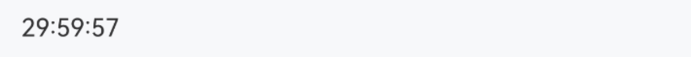
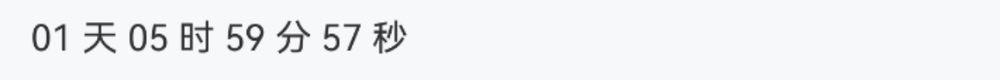
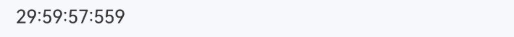
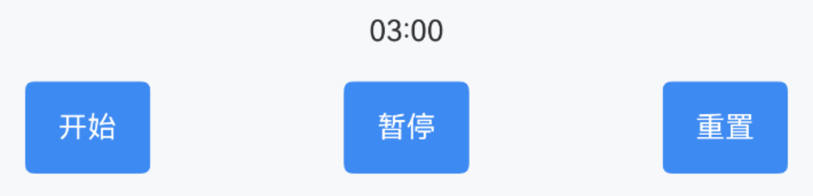

# CountDown 倒计时

## 介绍

用于实时展示倒计时数值，支持毫秒精度。
 
## 引入

```ts
import { IBestCountDown } from "@ibestservices/ibest-ui-v2";
```

## 代码演示

### 基础用法



::: details 点我查看代码
```ts
@Entry
@Component
struct DemoPage {
  @State time: number = 30 * 60 * 60 * 1000
  build() {
    Column(){
      IBestCountDown({
        time: this.time
      })
    }
  }
}
```
:::

### 自定义格式



::: details 点我查看代码
```ts
@Entry
@Component
struct DemoPage {
  @State time: number = 30 * 60 * 60 * 1000
  build() {
    Column(){
      IBestCountDown({
        time: this.time,
        format: "DD 天 HH 时 mm 分 ss 秒"
      })
    }
  }
}
```
:::

### 毫秒级渲染



::: details 点我查看代码
```ts
@Entry
@Component
struct DemoPage {
  @State time: number = 30 * 60 * 60 * 1000
  build() {
    Column(){
      IBestCountDown({
        time: this.time,
        format: 'HH:mm:ss:SSS'
      })
    }
  }
}
```
:::

### 手动控制



::: details 点我查看代码
```ts
import { IBestCountDownController } from '@ibestservices/ibest-ui'
@Entry
@Component
struct DemoPage {
  @State time: number = 3 * 1000
  private controller = new IBestCountDownController()
  build() {
    Column({space: 16}){
      IBestCountDown({
        time: this.time,
        format: 'ss:SSS',
        autoStart: false,
        controller: this.controller
      })
      Row(){
        IBestButton({
          type: 'primary',
          text: "开始",
          onClickBtn: () => {
            this.controller.start()
          }
        })
        IBestButton({
          type: 'primary',
          text: "暂停",
          onClickBtn: () => {
            this.controller.pause()
          }
        })
        IBestButton({
          type: 'primary',
          text: "重置",
          onClickBtn: () => {
            this.controller.reset()
          }
        })
      }
      .width("100%")
      .justifyContent(FlexAlign.SpaceBetween)
    }
  }
}
```
:::


## API

### @Props

| 参数         | 说明                                 | 类型      | 默认值     |
| ------------ | ----------------------------------- | --------- | ---------- |
| time         | 倒计时时长, 单位 毫秒                  | _number_  | `0` |
| color        | 文字颜色                              | _ResourceColor_ | `#323232` |
| fontSize     | 文字大小                              | _number_ \| _string_ | `16` |
| format       | 时间格式                              | _string_ |  `HH:mm:ss`  |
| autoStart    | 是否自动开始倒计时                      | _boolean_ |  `true`  |
| controller   | 组件库控制器                           | _IBestCountDownController_ |  `-`  |

### format 格式
| 格式   | 说明  |
| ----- | ---- |
| DD    | 天数  |
| HH    | 小时  |
| mm    | 分钟  |
| ss    | 秒数  |
| S     | 毫秒(1位)  |
| SS    | 毫秒(2位)  |
| SSS   | 毫秒(3位)  |

### IBestCountDownController 

| 方法名             | 说明               | 参数类型             |
| ------------------| ------------------ | ----------------|
| start             | 默认内容的插槽       | `-` |
| pause             | 暂停倒计时          | `-` |
| reset             | 重置倒计时          | `(time?: number)` |