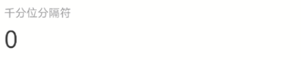

# CountTo 数字滚动

## 介绍

用于需要滚动数字到某一个值的场景，目标要求是一个递增的值。
 
## 引入

```ts
import { IBestCountTo } from "@ibestservices/ibest-ui-v2";
```

## 代码演示

### 基础用法


::: details 点我查看代码
```ts
@Entry
@ComponentV2
struct DemoPage {
  build() {
    Column(){
      IBestCountTo({
        start: 0,
        end: 666
      })
    }
  }
}
```
:::

### 自定义滚动时长


::: details 点我查看代码
```ts
@Entry
@ComponentV2
struct DemoPage {
  build() {
    Column(){
      IBestCountTo({
        start: 0,
        end: 1000,
        duration: 3000
      })
    }
  }
}
```
:::

### 显示小数位


::: details 点我查看代码
```ts
@Entry
@ComponentV2
struct DemoPage {
  build() {
    Column(){
      IBestCountTo({
        start: 0,
        end: 666.66,
        decimals: 2
      })
    }
  }
}
```
:::

### 千分位分隔符



::: details 点我查看代码
```ts
@Entry
@ComponentV2
struct DemoPage {
  build() {
    Column(){
      IBestCountTo({
        start: 0,
        end: 12138,
        separator: ','
      })
    }
  }
}
```
:::

### 手动控制


::: details 点我查看代码
```ts
import { IBestCountToController } from "@ibestservices/ibest-ui-v2";
@Entry
@ComponentV2
struct DemoPage {
  controller: IBestCountToController = new IBestCountToController()
  build() {
    Column({space: 16}){
      IBestCountTo({
        start: 0,
        end: 6666,
        duration: 3000,
        fontSize: 40,
        color: "#1989fa",
        fontWeight: FontWeight.Bold,
        autoPlay: false,
        controller: this.controller
      })
      Row(){
        IBestButton({
          type: 'primary',
          text: "开始",
          onBtnClick: () => {
            this.controller.start()
          }
        })
        IBestButton({
          type: 'primary',
          text: "暂停",
          onBtnClick: () => {
            this.controller.pause()
          }
        })
        IBestButton({
          type: 'primary',
          text: "继续",
          onBtnClick: () => {
            this.controller.reStart()
          }
        })
        IBestButton({
          type: 'primary',
          text: "重置",
          onBtnClick: () => {
            this.controller.reset()
          }
        })
      }.width("100%").justifyContent(FlexAlign.SpaceBetween)
    }
  }
}
```
:::


## API

### @Props

| 参数         | 说明                    | 类型      | 默认值     |
| ------------ | -----------------------| --------- | ---------- |
| start        | 开始值                  | _number_  | `0` |
| end          | 结束值                  | _number_  | `0` |
| duration     | 滚动时长, 单位 ms        | _number_  | `2000` |
| autoPlay     | 是否自动开始滚动          | _boolean_ |  `true`  |
| decimals     | 小数位数                 | _number_ | `0` |
| useEasing    | 结尾使用缓动              | _boolean_ |  `true`  |
| separator    | 千分位分隔符              | _string_ |  `''`  |
| fontSize     | 文字大小                 | _string_ \| _number_ | `30` |
| color        | 字体色                   | _string_ |  `#323233`  |
| fontWeight   | 字重                     | _FontWeight_ |  `Normal`  |
| controller   | 组件控制器                | _IBestCountToController_ |  `-`  |

### Events

| 事件名      | 说明         | 回调参数                         |
| ---------- | ------------| -------------------------------- |
| onFinish   | 结束事件     | `-` |

### IBestCountToController 

| 方法名             | 说明          | 参数类型             |
| ------------------| -------------| ----------------|
| start             | 开始          | `-` |
| pause             | 暂停          | `-` |
| reStart           | 继续          | `-` |
| reset             | 重置          | `-` |