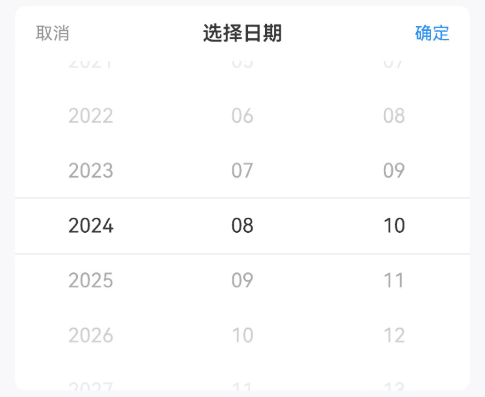
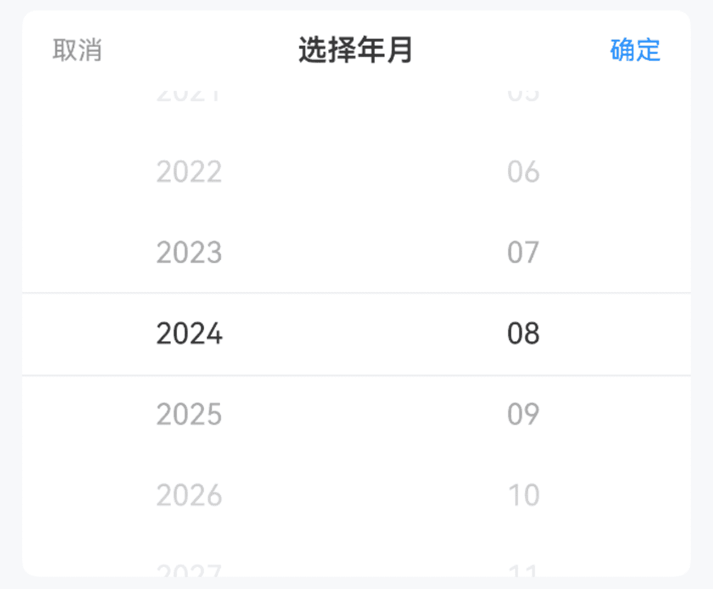
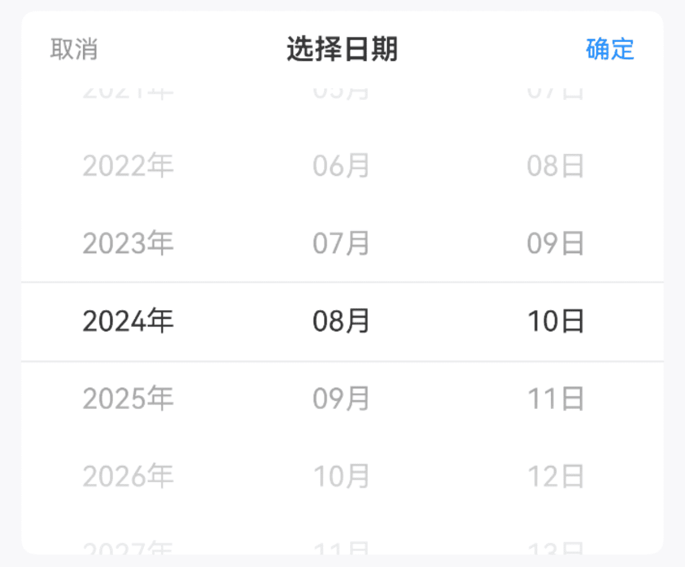
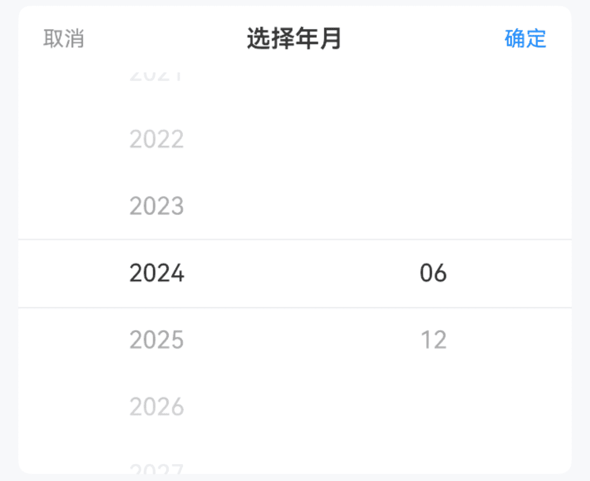

# DatePicker 日期选择

## 介绍

日期选择器，用于选择年、月、日，通常与弹出层组件配合使用。
 
## 引入

```ts
import { IBestDatePicker, IBestDatePickerResult, IBestPickerOption } from "@ibestservices/ibest-ui-v2";
```

## 代码演示

### 基础用法


:::tip
通过 `minDate` `maxDate` 属性可控制日期范围。   
• 默认最小日期为十年前；   
• 默认最大日期为十年后。
:::

::: details 点我查看代码
```ts
@Entry
@ComponentV2
struct DemoPage {
  @Local selectValue: string[] = ["2024", "08", "10"]
  build() {
    Column(){
      IBestDatePicker({
        title: "选择日期",
        minDate: new Date("2020-05-01"),
        maxDate: new Date("2028-05-01"),
        value: this.selectValue!!,
        onConfirm: (value: IBestDatePickerResult) => {
          IBestToast.show(this.selectValue.join("-") , value.dateStr)
        },
        onChange: (value: IBestDatePickerResult) => {
          IBestToast.show(this.selectValue.join("-") , value.dateStr)
        }
      })
    }
  }
}
```
:::

### 选项类型



::: details 点我查看代码
```ts
@Entry
@ComponentV2
struct DemoPage {
  @Local selectValue: string[] = ["2024", "08"]
  build() {
    Column(){
      IBestDatePicker({
        title: "选择日期",
        minDate: new Date("2020-05"),
        maxDate: new Date("2028-05"),
        isShowDay: false,
        value: this.selectValue!!,
        onConfirm: (value: IBestDatePickerResult) => {
          IBestToast.show(this.selectValue.join("-") , value.dateStr)
        },
        onChange: (value: IBestDatePickerResult) => {
          IBestToast.show(this.selectValue.join("-") , value.dateStr)
        }
      })
    }
  }
}
```
:::

### 显示单位



::: details 点我查看代码
```ts
@Entry
@ComponentV2
struct DemoPage {
  @Local selectValue: string[] = ["2024", "08", "18"]
  build() {
    Column(){
      IBestDatePicker({
        title: "选择日期",
        minDate: new Date("2020-05-01"),
        maxDate: new Date("2028-05-01"),
        showUnit: true,
        value: this.selectValue!!,
        onConfirm: (value: IBestDatePickerResult) => {
          IBestToast.show(this.selectValue.join("-") , value.dateStr)
        },
        onChange: (value: IBestDatePickerResult) => {
          IBestToast.show(this.selectValue.join("-") , value.dateStr)
        }
      })
    }
  }
}
```
:::

### 过滤选项



::: details 点我查看代码
```ts
@Entry
@ComponentV2
struct DemoPage {
  @Local selectValue: string[] = ["2024", "08"]
  filter(type: string, options: IBestPickerOption[]): IBestPickerOption[]{
    if (type === 'month') {
      return options.filter((option) => Number(option.value) % 6 === 0)
    }
    return options
  }
  build() {
    Column(){
      IBestDatePicker({
        title: "选择日期",
        minDate: new Date("2020-05"),
        maxDate: new Date("2028-05"),
        isShowDay: false,
        filter: this.filter,
        value: this.selectValue!!,
        onConfirm: (value: IBestDatePickerResult) => {
          IBestToast.show(this.selectValue.join("-") , value.dateStr)
        },
        onChange: (value: IBestDatePickerResult) => {
          IBestToast.show(this.selectValue.join("-") , value.dateStr)
        }
      })
    }
  }
}
```
:::

## API

### @Props

| 参数         | 说明                                          | 类型      | 默认值     |
| ------------ | ---------------------------------------------| --------- | ---------- |
| value        | 当前选中的日期, 支持双向绑定                     | _string[]_  | `[]` | 
| minDate      | 最小可选日期                                   | _Date_  |    `十年前`     |
| maxDate      | 最大可选日期                                   | _Date_ | `十年后`  |
| isShowDay    | 是否显示日列                                   | _boolean_ | `true`|
| showUnit     | 是否显示单位                                   | _boolean_ | `false` |
| title        |  标题                                         | _ResourceStr_ |  `''`  |
| itemHeight   | 单项高度                                       | _number_ \| _string_ | `44` |
| visibleItemCount | 可见选项数量                                | _number_ | `6`   |
| showToolBar   | 是否显示顶部栏                                 | _boolean_ | `true` |
| confirmText   | 确认按钮文字                                   | _ResourceStr_ |  `确定`  |
| cancelText    | 取消按钮文字                                   | _ResourceStr_ |  `取消`  |
| filter        | 过滤器                                         | _(type: string, options: IBestPickerOption[]) => IBestPickerOption[]_ | `null` |
| groupId       | 分组id, 通常在配合PickerGroup组件使用时传入, 可实现多个DatePicker联动| _string_ \| _number_ | `''` |
| horizontal    | 是否横向                                       | _boolean_ | `false` |
| itemWidth     | 单项宽度                                       | _number_ \| _string_ | `44`   |
| contentHeight | 整体高度, 仅横向时生效                          | _number_ \| _string_ | `44`   |
| optionFontSize| 选项字体大小                                    | _number_ \| _string_ | `16`   |
| lunar         | 是否显示农历                                    | _boolean_ | `false` |
| radius <span style="font-size: 12px; padding:2px 4px;color:#3D8AF2;border-radius:4px;border: 1px solid #3D8AF2">1.0.0</span>| 外部圆角                                       | _number_ \| _string_ | `0`   |
 
### Events

| 事件名     | 说明         | 回调参数             |
| ----------| ------------------------------ | -------------------------------- |
| onChange | 某一列选项变更后触发 | `value: IBestDatePickerResult` |
| onConfirm | 点击确定按钮时触发 | `value: IBestDatePickerResult` |
| onCancel |  点击取消按钮时触发 | `-` |

### IBestDatePickerResult 数据结构
| 参数         | 说明                                          | 类型      |
| ------------ | ---------------------------------------------| --------- |
| dateStr      | 选中的日期字符串                                | _string_  |
| date         | 选中的日期                                     | _Date_  |
| year         | 选中的年份                                     | _string_  |
| month        | 选中的月份                                     | _string_  |
| day          | 选中的日期                                     | _string_  |