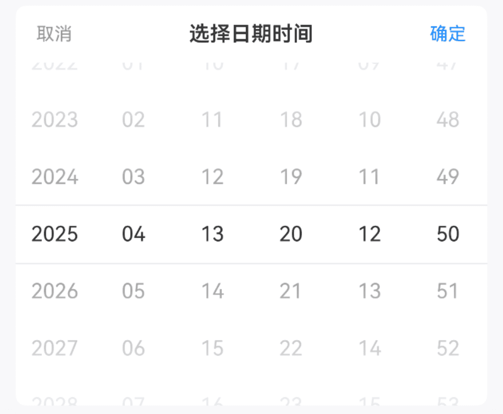
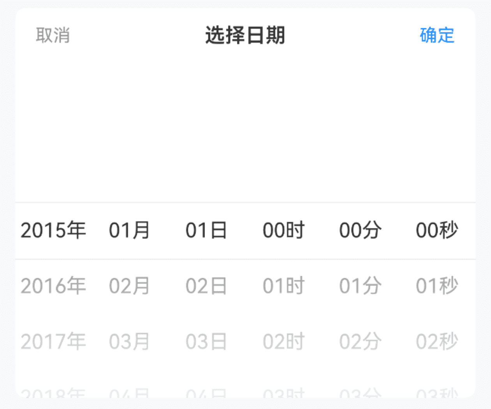

# DateTimePicker 日期时间选择

## 介绍

日期时间选择器，用于选择年、月、日、时、分、秒，通常与弹出层组件配合使用。

## 引入

```ts
import { IBestDateTimePicker, IBestDateTimePickerResult } from "@ibestservices/ibest-ui-v2";
```

## 代码演示

### 基础用法


:::tip
通过 `minDate` `maxDate` 属性可控制日期范围。   
• 默认最小日期为十年前；   
• 默认最大日期为十年后。
:::

::: details 点我查看代码
```ts
@Entry
@ComponentV2
struct DemoPage {
  @Local selectValue: string[] = ["2025", "04", "13", "20", "12", "50"]
  build() {
    Column(){
      IBestDateTimePicker({
        title: "选择日期时间",
        value: this.selectValue!!,
        onConfirm: value => {
          IBestToast.show(value.year + '-' + value.month + '-' + value.day + ' ' + value.hour + ':' + value.minute + ':' + value.second)
        }
      })
    }
  }
}
```
:::

### 显示单位



::: details 点我查看代码
```ts
@Entry
@ComponentV2
struct DemoPage {
  @Local selectValue: string[] = []
  build() {
    Column(){
      IBestDateTimePicker({
        title: "选择日期",
        showUnit: true,
        value: this.selectValue!!,
        onConfirm: (value: IBestDateTimePickerResult) => {
          IBestToast.show(value.year + '-' + value.month + '-' + value.day + ' ' + value.hour + ':' + value.minute + ':' + value.second)
        }
      })
    }
  }
}
```
:::


## API

### @Props

| 参数         | 说明                                          | 类型      | 默认值     |
| ------------ | ---------------------------------------------| --------- | ---------- |
| value        | 当前选中的日期, 支持双向绑定                     | _string[]_  | `[]` | 
| minDate      | 最小可选日期                                   | _Date_  |    `十年前`     |
| maxDate      | 最大可选日期                                   | _Date_ | `十年后`  |
| showUnit     | 是否显示单位                                   | _boolean_ | `false` |
| showSecond   | 是否显示秒                                     | _boolean_ | `true` |
| title        |  标题                                         | _ResourceStr_ |  `''`  |
| itemHeight   | 单项高度                                       | _string_ \| _number_ | `44` |
| visibleItemCount | 可见选项数量                                | _number_ | `6`   |
| showToolBar   | 是否显示顶部栏                                 | _boolean_ | `true` |
| confirmText   | 确认按钮文字                                   | _ResourceStr_ |  `确定`  |
| cancelText    | 取消按钮文字                                   | _ResourceStr_ |  `取消`  |
| groupId       | 分组id, 通常在配合PickerGroup组件使用时传入, 可实现多个DateTimePicker联动 | _string_ \| _number_ | `''` |
| optionFontSize| 选项字体大小                                   | _string_ \| _number_ | `16`   |
| radius <span style="font-size: 12px; padding:2px 4px;color:#3D8AF2;border-radius:4px;border: 1px solid #3D8AF2">1.0.1</span>| 外部圆角                                       | _string_ \| _number_ | `0`   |
 
### Events

| 事件名     | 说明             | 回调参数             |
| ----------| ----------------| -------------------------------- |
| onChange | 某一列选项变更后触发 | `value: IBestDateTimePickerResult` |
| onConfirm | 点击确定按钮时触发 | `value: IBestDateTimePickerResult` |
| onCancel |  点击取消按钮时触发 | `-` |

### IBestDateTimePickerResult 数据结构
| 参数         | 说明               | 类型      |
| ------------ | ------------------| --------- |
| year         | 选中的年份          | _string_  |
| month        | 选中的月份          | _string_  |
| day          | 选中的日期          | _string_  |
| hour         | 选中的小时          | _string_  |
| minute       | 选中的分钟          | _string_  |
| second       | 选中的秒            | _string_  |