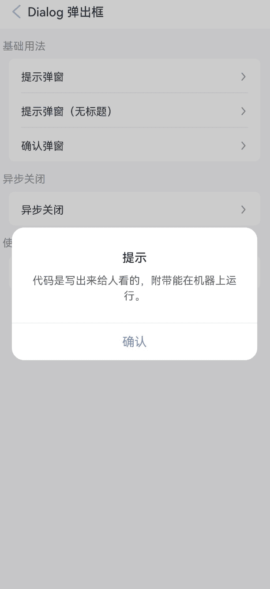
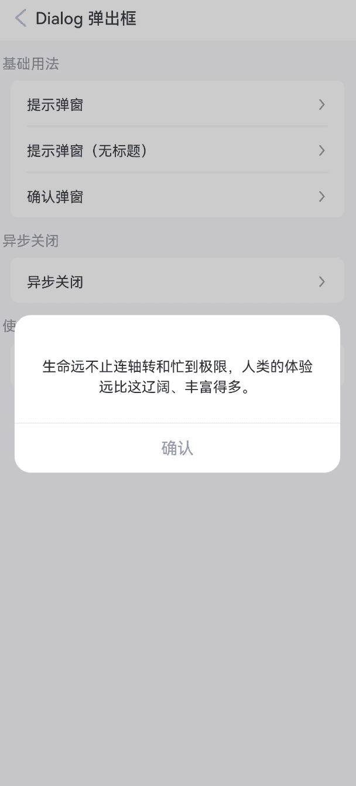
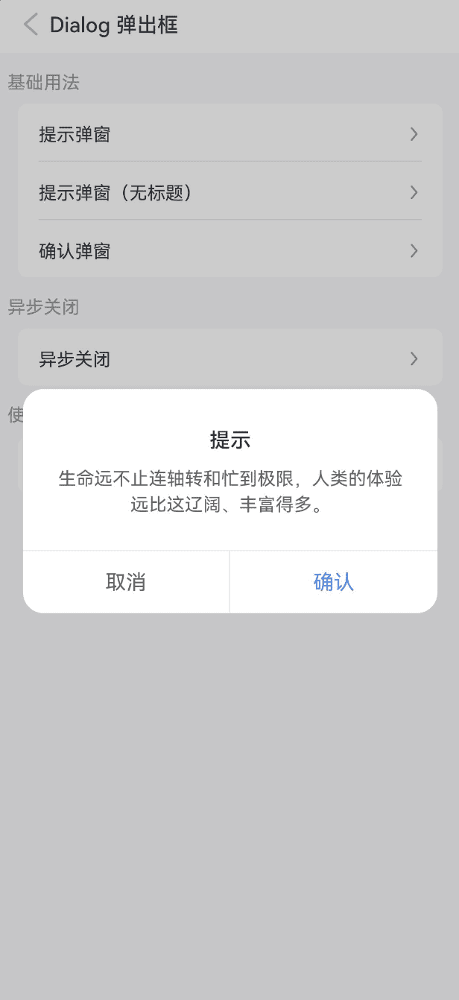
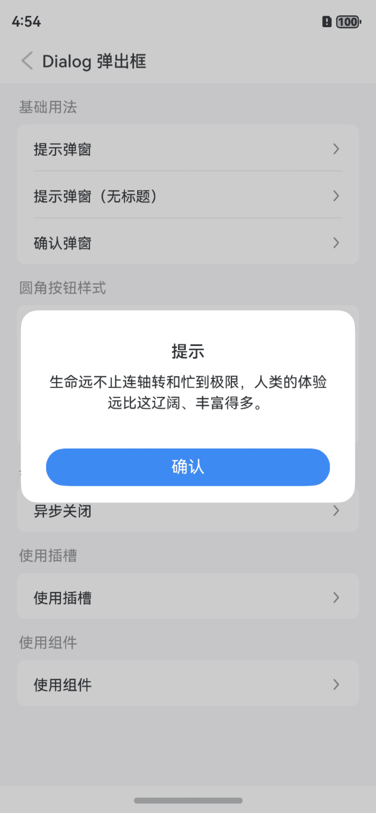
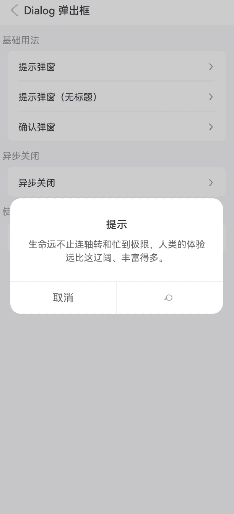
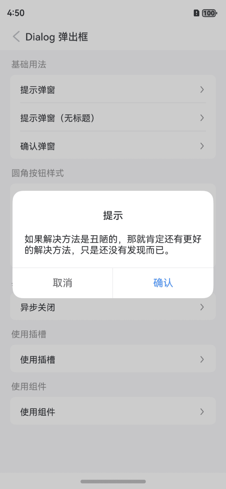
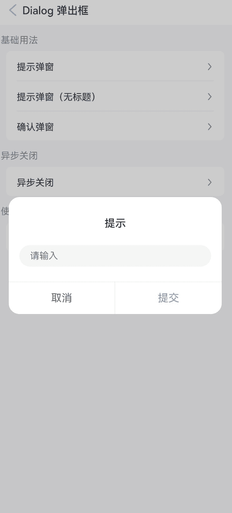

# Dialog 弹出框

## 介绍

弹出模态框，常用于消息提示、消息确认，或在当前页面内完成特定的交互操作。支持组件调用和函数调用两种方式。

## 引入

```ts
import { IBestDialogUtil, IBestDialog } from "@ibestservices/ibest-ui-v2";
```

## 代码演示

### 提示弹窗


::: tip
用于提示一些消息，默认只包含一个确认按钮。
:::

::: details 点我查看代码
```ts
@Entry
@ComponentV2
struct DemoPage {
  build(){
    Column(){
      IBestButton({
        text: '打开弹窗',
        type: 'primary',
        onBtnClick: () => {
          IBestDialogUtil.open({
            title: "提示",
            message: "代码是写出来给人看的，附带能在机器上运行。"
          })
        }
      })
    }
  }
}
```
:::

### 提示弹窗（无标题)



::: details 点我查看代码
```ts
@Entry
@ComponentV2
struct DemoPage {
  build(){
    Column(){
      IBestButton({
        text: '打开弹窗',
        type: 'primary',
        onBtnClick: () => {
          IBestDialogUtil.open({
            message: "生命远不止连轴转和忙到极限，人类的体验远比这辽阔、丰富得多。"
          })
        }
      })
    }
  }
}
```
:::

### 确认弹窗



::: details 点我查看代码
```ts
@Entry
@ComponentV2
struct DemoPage {
  build(){
    Column(){
      IBestButton({
        text: '打开弹窗',
        type: 'primary',
        onBtnClick: () => {
          IBestDialogUtil.open({
            title: "提示",
            message: "生命远不止连轴转和忙到极限，人类的体验远比这辽阔、丰富得多。",
            showCancelButton: true
          })
        }
      })
    }
  }
}
```
:::

### 圆角按钮样式


:::tip
通过 `theme` 属性设置弹窗主题，可选值为 `default`（默认）、`round-button`（圆角按钮）；   
通过 `buttonSpace` 属性可设置底部按钮间距, 仅 `round-button` 模式有效。
:::

::: details 点我查看代码
```ts
@Entry
@ComponentV2
struct DemoPage {
  build(){
    Column(){
      IBestButton({
        text: '圆角按钮样式',
        type: 'primary',
        onBtnClick: () => {
          IBestDialogUtil.open({
            title: "提示",
            message: "生命远不止连轴转和忙到极限，人类的体验远比这辽阔、丰富得多。",
            theme: "round-button"
          })
        }
      })
    }
  }
}
```
:::

### 背景图片


::: details 点我查看代码
```ts
@Entry
@ComponentV2
struct DemoPage {
  @Builder imageBgBuilder() {
    Column()
      .height(200)
  }
  build(){
    Column(){
      IBestCell({
        title: '背景图片',
        isLink: true,
        hasBorder: false,
        onCellClick: () => {
          IBestDialogUtil.open({
            bgImage: "https://img0.baidu.com/it/u=3217812679,2585737758&fm=253&fmt=auto&app=138&f=JPEG?w=889&h=500",
            showConfirmButton: false,
            defaultBuilder: () => this.imageBgBuilder(),
            closeOnClickOverlay: true
          })
        }
      })
    }
  }
}
```
:::

### 异步关闭


::: tip
通过 `beforeClose` 属性可以传入一个回调函数，在弹窗关闭前进行特定操作。
:::

::: details 点我查看代码
```ts
@Entry
@ComponentV2
struct DemoPage {
  build(){
    Column(){
      IBestButton({
        text: '打开弹窗',
        type: 'primary',
        onBtnClick: () => {
          IBestDialogUtil.open({
            title: textData.title,
            message: textData.life,
            showCancelButton: true,
            beforeClose: (action) => {
              if(action == "confirm"){
                return new Promise(resolve => {
                  IBestDialogUtil.open({
                    title: "提示",
                    message: "确认关闭？",
                    showCancelButton: true,
                    onConfirm: () => {
                      resolve(true)
                    },
                    onCancel: () => {
                      resolve(false)
                    }
                  })
                })
              }
              return true
            }
          })
        }
      })
    }
  }
}
```
:::

### 内部跳转



::: details 点我查看代码
```ts
@Entry
@ComponentV2
struct DemoPage {
  @Local uniId: number = 0
  private uiContext = this.getUIContext()
  @Builder customComponentContent() {
    Column({space: 20}){
      Text("如果解决方法是丑陋的，那就肯定还有更好的解决方法，只是还没有发现而已。")
      IBestButton({
        type: 'primary',
        text: "跳转页面",
        onBtnClick: () => {
          router.pushUrl({
            url: "pages/base/Button",
            params: {
              title: "Button 按钮"
            }
          })
        }
      })
    }
    .padding(20)
  }
  onDidBuild(): void {
    setTimeout(() => {
      let uniId = this.uiContext.getAttachedFrameNodeById("main")?.getUniqueId()
      if(uniId){
        this.uniId = uniId
      }
    }, 50)
  }
  build(){
    Column(){
      IBestButton({
        text: '打开弹窗',
        type: 'primary',
        onBtnClick: () => {
          IBestDialogUtil.open({
            title: textData.title,
            message: textData.life,
            showCancelButton: true,
            levelMode: 1,
            levelUniqueId: this.uniId,
            defaultBuilder: (): void => this.customComponentContent()
          })
        }
      })
    }
    .id("main")
  }
}
```
:::

### 使用Dialog组件



::: details 点我查看代码
```ts
@Entry
@ComponentV2
struct DemoPage {
  @Local inputValue: string = ''
  @Local formInputError: boolean = false
  @Local dialogVisible: boolean = false
  @Local dialogWidth: string = "90%"
  @Builder formInputContain() {
    Column({ space: 20 }) {
      IBestButton({
        type: 'primary',
        text: "切换宽度",
        onBtnClick: () => {
          this.dialogWidth = this.dialogWidth === "90%" ? "80%" : "90%"
        }
      })
      TextInput({ placeholder: '请输入' })
        .onChange(value => {
          this.inputValue = value
          this.formInputError = false
        })
      if (this.formInputError) {
        Text('不能为空')
          .width("100%")
          .textAlign(TextAlign.Start)
          .fontColor(Color.Red)
          .fontSize(12)
      }
    }.padding(20)
  }
  build(){
    Column(){
      IBestDialog({
        visible: this.dialogVisible!!,
        title: "提示",
        showCancelButton: true,
        defaultBuilder: (): void => this.formInputContain(),
        beforeClose: (action) => {
          if (action === 'cancel') {
            return true
          }
          const valueLength = this.inputValue.trim().length
          this.formInputError = !valueLength
          return !this.formInputError
        }
      })
      IBestButton({
        text: '打开弹窗',
        type: 'primary',
        onBtnClick: () => {
          this.dialogVisible = true
        }
      })
    }
  }
}
```
:::

## API

### IBestDialog @Props

| 参数                   | 说明                          | 类型      | 默认值  |
| --------------------- | -----------------------------| ----------| ------ |
| visible               | 弹窗是否可见, 支持双向绑定       | _boolean_ | `false` |
| dialogWidth           | 弹窗的宽度                     | _number_ \| _string_  | `320`|
| dialogBorderRadius    | 弹窗的圆角                     | _number_ \| _string_  | `16` |
| bgImage               | 弹框背景图片 | _ResourceStr_ | `''` |
| title                 | 弹窗的标题                     | _ResourceStr_  |    ``   |
| titleColor            | 弹窗的标题文字颜色              | _ResourceColor_ | `#323233` |
| titleFontSize         | 标题的文字大小                  | _number_ \| _string_  | `16` |
| titlePaddingTop       | 弹窗的标题的上内边距             | _number_ \| _string_  | `26` |
| titlePaddingX         | 标题的左右内边距                | _number_ \| _string_ | `24`  |
| titleLienHeight       | 标题的行高                     | _number_ \| _string_ | `24` |
| titleTextAlign        | 标题的对齐方式                  | _'left' \| 'center' \| 'right'_ | `center`|
| message               | 弹窗的内容区域文本               | _ResourceStr_| `''` |
| messageFontColor      | 弹窗的内容文字颜色               | _ResourceColor_ | `#323233`|
| messageFontSize       | 弹窗的内容文字大小               | _number_ \| _string_ | `14`|
| messageLineHeight     | 弹窗的内容区域文字行高            | _number_ \| _string_ | `20`|
| messagePaddingTop     | 弹窗的内容区域的上内边距          | _number_ \| _string_| `8` |
| messagePaddingX       | 弹窗的内容区域的左右内边距        | _number_ \| _string_ | `24` |
| messagePaddingXBottom | 弹窗的内容区域的下内边距          | _number_ \| _string_ | `26`|
| messageTextAlign      | 弹窗的内容区域的文字对齐方式       | _left_ \| _center_ \| _right_ | `center`|
| messageMaxHeight      | 弹窗的内容区域的滚动区域最大高度    | _number_ \| _string_ | `auto` |
| theme                 | 按钮样式风格，可选值 `default` `round-button`          | _string_ | `default`|
| buttonSpace           | 按钮间距                        | _number_ \| _string_ | `0`|
| showConfirmButton     | 是否展示确认按钮                 | _boolean_ | `true`|
| showCancelButton      | 是否展示取消按钮                 | _boolean_ | `false`|
| confirmButtonText     | 确认按钮文案                     | _ResourceStr_  | `确认` |
| cancelButtonText      | 取消按钮的文案                   | _ResourceStr_  | `取消` |
| buttonFontSize        | 按钮文字大小                     | _number_ \| _string_ | `16` |
| confirmButtonColor    | 确认按钮的文字颜色, 当 `theme` 为 `round-button` 时默认为 `#fff` | _ResourceColor_ | `#3D8AF2` |
| confirmButtonBgColor  | 确认按钮背景色, 当 `theme` 为 `round-button` 时默认为 `#3D8AF2` | _ResourceColor_  | `#fff` |
| cancelButtonColor     | 取消按钮的文字颜色                | _ResourceColor_| `#646566` |
| cancelButtonBgColor   | 取消按钮背景色                                | _ResourceColor_ | `#fff` |
| confirmButtonDisabled | 是否禁用确认按钮                  | _boolean_ | `false` |
| cancelButtonDisabled  | 是否禁用取消按钮                  | _boolean_ | `false`|
| showOverlay           | 是否展示遮罩层，不展示的话则没有遮罩层| _boolean_ | `true` |
| overlayColor          | 遮罩层颜色                       | _ResourceColor_  | `0x33000000` |
| showInSubWindow       | 某弹框需要显示在主窗口之外时，是否在子窗口显示此弹窗 | _boolean_  | `false` |
| closeOnClickOverlay   | 是否允许点击遮罩层关闭                          | _boolean_ | `false`|
| closeOnBackPress      | 是否允许返回键关闭                             | _boolean_ | `true`|
| alignment             | 弹窗在竖直方向上的对齐方式, 可选值 `top` `center` `bottom` | _string_ | `center`|
| offsetX               | 弹窗相对alignment所在位置的横向偏移量            | _number_ \| _string_ | `0` |
| offsetY               | 弹窗相对alignment所在位置的纵向偏移量            | _number_ \| _string_ | `0` |
| keyboardAvoidDistance | 弹窗避让键盘后，和键盘之间的距离 | _<a href="https://developer.huawei.com/consumer/cn/doc/harmonyos-references/js-apis-arkui-graphics#lengthmetrics" target="_blank">LengthMetrics</a>_ | `16vp` |
| levelMode             | 弹窗显示层级 | _<a href="https://developer.huawei.com/consumer/cn/doc/harmonyos-references/js-apis-promptaction#levelmode15%E6%9E%9A%E4%B8%BE%E8%AF%B4%E6%98%8E" target="_blank">LevelMode</a>_ | `0` |
| levelUniqueId         | 页面级弹窗需要显示的层级下的节点 uniqueId, 仅当levelMode属性设置为LevelMode.EMBEDDED时生效 | _number_ | `-` |
| beforeClose           | 关闭前的回调函数，返回 `false` 可阻止关闭，支持返回 `Promise` | _(action: cancel \| confirm) => Promise\<boolean\> \| boolean_ | `-` |
| confirmButtonFontWeight <span style="font-size: 12px; padding:2px 4px;color:#3D8AF2;border-radius:4px;border: 1px solid #3D8AF2">0.0.4</span>| 确认按钮的文字字重| _FontWeight_ | `Normal` |

### Events

| 事件名      | 说明                                     | 回调参数                   |
| ----------- | --------------------------------------- | ------------------------ |
| onOpen      | 打开弹窗的回调                            | `-` |
| onClose     | 关闭弹窗的回调                            | `-` |
| onCancel    | 点击取消按钮的回调                         | `-` |
| onConfirm   | 点击确认按钮的回调                         | `-` |

### 插槽

| 插槽名         | 说明                                                                   | 类型        |
| -------------- | ---------------------------------------------------------------------| ---------- |
| titleBuilder   | 标题的插槽，优先级大于 `title` 属性，将会完全接管 `title` 的渲染和间距控制     | _CustomBuilder_ |
| defaultBuilder | 内容的插槽，优先级大于 `message` 属性，将会完全接管 `message` 的渲染和间距控制 | _CustomBuilder_ |
| footerBuilder  | 底部按钮部分的插槽，将会完全接管按钮部分的渲染和间距控制                       | _CustomBuilder_ |