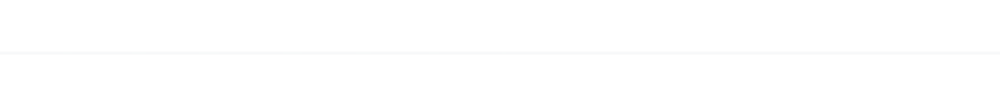
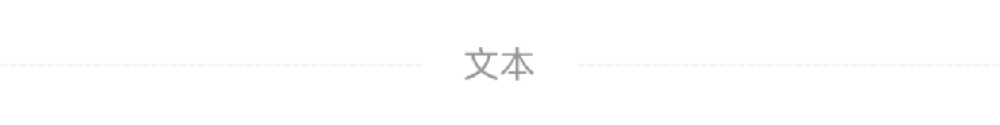

# Divider 分割线

## 介绍

用于将内容分隔为多个区域。
 
## 引入

```ts
import { IBestDivider } from "@ibestservices/ibest-ui-v2";
```

## 代码演示

### 基础用法



::: details 点我查看代码
```ts
@Entry
@ComponentV2
struct DemoPage {
  build() {
    Column(){
      IBestDivider()
    }
  }
}
```
:::

### 展示文本


::: details 点我查看代码
```ts
@Entry
@ComponentV2
struct DemoPage {
  @Builder textBuilder(){
    Row({space: 10}){
      Image($r("app.media.icon_star")).width(16)
      Text("自定义内容")
    }
  }
  build() {
    Column({space: 16}){
      IBestDivider({ text: '细线' })
      IBestDivider({text: '非细线', hairline: false})
      IBestDivider({
        textBuilder: (): void => this.textBuilder()
      })
    }.padding({top: 16, bottom: 16})
  }
}
```
:::

### 内容位置


::: details 点我查看代码
```ts
@Entry
@ComponentV2
struct DemoPage {
  build() {
    Column({space: 16}){
      IBestDivider({
        text: '文本',
        leftLineWidth: "10%"
      })
      IBestDivider({
        text: '文本',
        rightLineWidth: 50
      })
    }.padding({top: 16, bottom: 16})
  }
}
```
:::

### 虚线



::: details 点我查看代码
```ts
@Entry
@ComponentV2
struct DemoPage {
  build() {
    Column(){
      IBestDivider({
        text: '文本',
        dashed: true
      })
    }
  }
}
```
:::

### 自定义样式


::: details 点我查看代码
```ts
@Entry
@ComponentV2
struct DemoPage {
  build() {
    Column(){
      IBestDivider({
        text: '文本',
        color: "#3d8af2",
        lineColor: "#3d8af2",
        leftRightPadding: 20
      })
    }
  }
}
```
:::

### 垂直


::: details 点我查看代码
```ts
@Entry
@ComponentV2
struct DemoPage {
  build() {
    Row(){
      IBestDivider({ text: '文本', vertical: true })
      Text("文本")
      IBestDivider({ text: '文本', vertical: true, dashed: true })
      Text("文本")
      IBestDivider({ text: '文本', vertical: true, hairline: false })
      Text("文本")
      IBestDivider({ text: '文本', vertical: true, lineColor: "#3d8af2" })
    }.padding(16)
  }
}
```
:::

## API

### @Props

| 参数          | 说明                                | 类型      | 默认值     |
| ------------ | ----------------------------------- | --------- | ---------- |
| dashed       | 是否使用虚线                          | _boolean_  | `false` |
| hairline     | 是否显示细线                          | _boolean_  | `true` |
| vertical     | 是否为垂直方向                         | _boolean_  | `false` |
| lineHeight   | 分割线高度, 仅垂直时有效                | _number_ \| _string_  | `14` |
| lineColor    | 分割线颜色                            | _ResourceColor_ |  `#ebedf0` |
| text         | 文本内容, 仅水平时生效                  | _ResourceStr_  | `''` |
| color        | 文本内容颜色, 仅水平时生效               | _ResourceColor_ | `#969799` |
| textFontSize | 文本字体大小, 仅水平时生效               | _number_ \| _string_  | `14` |
| textLineSpace| 文本与线段间距, 仅水平时生效             | _number_ \| _string_  | `16` |
| leftLineWidth| 左侧线段宽度, 仅水平时生效               | _number_ \| _string_  | `''` |
| rightLineWidth|右侧线段宽度, 仅水平时生效               | _number_ \| _string_  | `''` |
| leftRightPadding| 左右内边距, 仅水平时生效              | _number_ \| _string_  | `0` |
| leftRightMargin| 左右外边距, 仅垂直时生效               | _number_ \| _string_  | `8` |
| dashGap <span style="font-size: 12px; padding:2px 4px;color:#3D8AF2;border-radius:4px;border: 1px solid #3D8AF2">1.0.0</span>| 虚线间距, 仅在dashed为true时生效            | _LengthMetrics_ | `-`   |
| dashWidth <span style="font-size: 12px; padding:2px 4px;color:#3D8AF2;border-radius:4px;border: 1px solid #3D8AF2">1.0.0</span>| 虚线线段长度, 仅在dashed为true时生效            | _LengthMetrics_ | `-`   |
| rightLineColor <span style="font-size: 12px; padding:2px 4px;color:#3D8AF2;border-radius:4px;border: 1px solid #3D8AF2">1.0.0</span>| 右侧线颜色, 默认与lineColor一致            | _ResourceColor_ | `''`   |
| rightDashed <span style="font-size: 12px; padding:2px 4px;color:#3D8AF2;border-radius:4px;border: 1px solid #3D8AF2">1.0.0</span>| 右侧线是否使用虚线, 默认与dashed一致         | _boolean_ | `false`   |

### 插槽

| 插槽名             | 说明               | 类型             |
| ------------------| ------------------| ----------------|
| textBuilder       | 自定义文本内容      | _CustomBuilder_ |