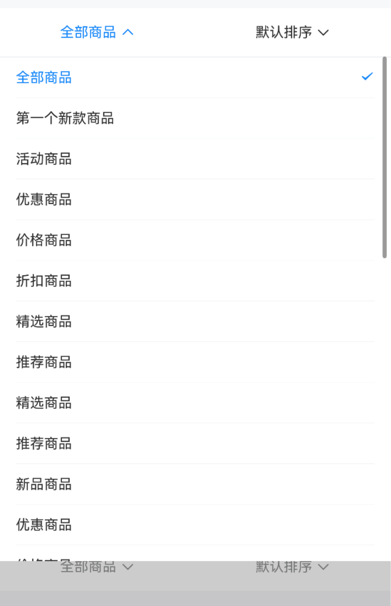
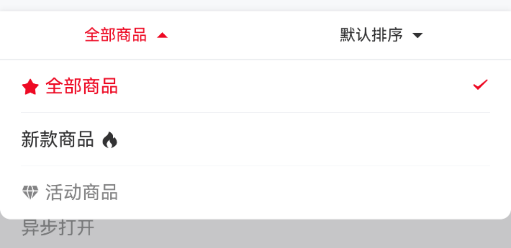

# DropdownMenu 下拉菜单

## 介绍

向下弹出的菜单列表。
 
## 引入

```ts
import { IBestDropdownMenu, IBestDropdownItem, IBestDropdownMenuOption, IBestDropdownMenuController } from "@ibestservices/ibest-ui-v2";
```

## 代码演示

### 基础用法



::: details 点我查看代码
```ts
@Entry
@ComponentV2
struct DemoPage {
  groupId: string = 'dropdown_menu'
  @Local value: number = 1
  @Local options: IBestDropdownMenuOption[] = [
    { text: '全部商品', value: 1 },
    { text: '新款商品', value: 2 },
    { text: '活动商品', value: 3 }
  ]
  @Local value1: string = ''
  @Local options1: IBestDropdownMenuOption[] = [
    { text: '默认排序', value: '' },
    { text: '好评排序', value: 'a' },
    { text: '销量排序', value: 'b' },
  ]
  build() {
    Column(){
      IBestDropdownMenu({ groupId: this.groupId }){
        IBestDropdownItem({
          groupId: this.groupId,
          value: this.value!!,
          options: this.options
        })
        IBestDropdownItem({
          groupId: this.groupId,
          value: this.value1!!,
          options: this.options1
        })
      }
    }
  }
}
```
:::

### 自定义菜单内容


::: details 点我查看代码
```ts
@Entry
@ComponentV2
struct DemoPage {
  groupId: string = 'dropdown_menu'
  @Local value: number = 1
  @Local options: IBestDropdownMenuOption[] = [
    { text: '全部商品', value: 1 },
    { text: '新款商品', value: 2 },
    { text: '活动商品', value: 3 }
  ]
  @Local switchValue: boolean = true
  @Local switchValue1: boolean = true
  private controller: IBestDropdownMenuController = new IBestDropdownMenuController()
  @Builder switchBuilder(){
    IBestSwitch({
      value: $switchValue
    })
  }
  @Builder switchBuilder1(){
    IBestSwitch({
      value: $switchValue1
    })
  }
  build() {
    Column(){
      IBestDropdownMenu({ groupId: this.groupId, controller: this.controller }){
        IBestDropdownItem({
          groupId: this.groupId,
          value: this.value!!,
          options: this.options
        })
        IBestDropdownItem({ groupId: this.groupId, title: "筛选" }){
          IBestCell({
            title: "轻量",
            center: true,
            rightIconBuilder: (): void => this.switchBuilder()
          })
          IBestCell({
            title: "简单",
            center: true,
            rightIconBuilder: (): void => this.switchBuilder1()
          })
          Row(){
            IBestButton({
              type: "primary",
              text: "确定",
              btnWidth: "100%",
              btnHeight: 50,
              round: true,
              onBtnClick: () => {
                this.controller.close()
              }
            })
          }.padding({top: 5, bottom: 5, left: 10, right: 10})
        }
      }
    }
  }
}
```
:::

### 自定义样式



::: details 点我查看代码
```ts
@Entry
@ComponentV2
struct DemoPage {
  groupId: string = 'dropdown_menu'
  @Local value: number = 1
  @Local options: IBestDropdownMenuOption[] = [
    { text: '全部商品', value: 1 },
    { text: '新款商品', value: 2 },
    { text: '活动商品', value: 3 }
  ]
  @Local value1: string = ''
  @Local options1: IBestDropdownMenuOption[] = [
    { text: '默认排序', value: '' },
    { text: '好评排序', value: 'a' },
    { text: '销量排序', value: 'b' },
  ]
  build() {
    Column(){
      IBestDropdownMenu({
        groupId: this.groupId,
        activeColor: "#ee0a24",
        radius: 8,
        menuHeight: 36,
        menuFontSize: 12,
        menuShadow: { color: 'rgba(100, 101, 102, 0.2)', radius: 12, offsetY: 2 },
        menuIcon: $r("app.media.icon_arrow_down_full")
      }){
        IBestDropdownItem({
          groupId: this.groupId,
          value: this.value!!,
          options: this.options
        })
        IBestDropdownItem({
          groupId: this.groupId,
          value: this.value1!!,
          options: this.options1
        })
      }
    }
  }
}
```
:::

### 横向滚动


::: details 点我查看代码
```ts
@Entry
@ComponentV2
struct DemoPage {
  groupId: string = 'dropdown_menu'
  @Local value: number = 1
  @Local options: IBestDropdownMenuOption[] = [
    { text: '全部商品', value: 1 },
    { text: '新款商品', value: 2 },
    { text: '活动商品', value: 3 }
  ]
  @Local value1: string = ''
  @Local options1: IBestDropdownMenuOption[] = [
    { text: '默认排序', value: '' },
    { text: '好评排序', value: 'a' },
    { text: '销量排序', value: 'b' },
  ]
  build() {
    Column(){
      IBestDropdownMenu({ groupId: this.groupId, menuWidthType: "auto" }){
        IBestDropdownItem({
          groupId: this.groupId,
          value: this.value!!,
          options: this.options
        })
        IBestDropdownItem({
          groupId: this.groupId,
          value: this.value1!!,
          options: this.options1
        })
        IBestDropdownItem({
          groupId: this.groupId,
          value: this.value1!!,
          options: this.options1
        })
        IBestDropdownItem({
          groupId: this.groupId,
          value: this.value1!!,
          options: this.options1
        })
        IBestDropdownItem({
          groupId: this.groupId,
          value: this.value1!!,
          options: this.options1
        })
        IBestDropdownItem({
          groupId: this.groupId,
          value: this.value1!!,
          options: this.options1
        })
      }
    }
  }
}
```
:::

### 异步选项


::: details 点我查看代码
```ts
@Entry
@ComponentV2
struct DemoPage {
  groupId: string = 'dropdown_menu'
  @Local value: number = 1
  @Local options: IBestDropdownMenuOption[] = []
  @Local value1: string = ''
  @Local options1: IBestDropdownMenuOption[] = []
  build() {
    Column(){
      IBestDropdownMenu({ groupId: this.groupId }){
        IBestDropdownItem({
          groupId: this.groupId,
          value: this.value!!,
          options: this.options,
          onOpen: () => {
            setTimeout(() => {
              this.options = [
                { text: '打折商品', value: 1 },
                { text: '新款商品', value: 2 },
                { text: '活动商品', value: 3 }
              ]
            }, 1500)
          }
        })
        IBestDropdownItem({
          groupId: this.groupId,
          value: this.value1!!,
          options: this.options1,
          onOpen: () => {
            setTimeout(() => {
              this.options1 = [
                { text: '默认排序', value: 'a' },
                { text: '好评排序', value: 'b' },
                { text: '销量排序', value: 'c' },
              ]
            }, 1500)
          }
        })
      }
    }
  }
}
```
:::

### 禁用菜单


::: details 点我查看代码
```ts
@Entry
@ComponentV2
struct DemoPage {
  groupId: string = 'dropdown_menu'
  @Local value: number = 1
  @Local options: IBestDropdownMenuOption[] = [
    { text: '全部商品', value: 1 },
    { text: '新款商品', value: 2 },
    { text: '活动商品', value: 3 }
  ]
  @Local value1: string = ''
  @Local options1: IBestDropdownMenuOption[] = [
    { text: '默认排序', value: '' },
    { text: '好评排序', value: 'a' },
    { text: '销量排序', value: 'b' },
  ]
  build() {
    Column(){
      IBestDropdownMenu({ groupId: this.groupId }){
        IBestDropdownItem({
          groupId: this.groupId,
          value: this.value!!,
          options: this.options,
          disabled: true
        })
        IBestDropdownItem({
          groupId: this.groupId,
          value: this.value1!!,
          options: this.options1,
          disabled: true
        })
      }
    }
  }
}
```
:::

## API

### IBestDropdownMenu @Props

| 参数         | 说明                                 | 类型      | 默认值     |
| ------------ | ----------------------------------- | --------- | ---------- |
| groupId      | 分组id, 需保证全局唯一性              | _string_ \| _number_  | `''`  |
| menuHeight   | 菜单高度                             | _string_ \| _number_  | `48`  |
| bgColor      | 菜单背景颜色                          | _ResourceColor_  | `#fff`  |
| closeOnClickOverlay| 点击遮罩层是否关闭菜单           | _boolean_ | `true` |
| menuWidthType| 菜单项宽度类型, 可选值 `auto`、`fixed` | _string_ | `flex` |
| menuIcon     | 菜单项标题右侧图标                     | _Resource_ | `arrow-down`  |
| menuShadow   | 菜单项阴影                            | _ShadowOptions \| ShadowStyle_  | `-`  |
| menuIconSize | 菜单项图标大小                        | _string_ \| _number_  | `16`  |
| menuFontSize | 菜单项文字大小                        | _string_ \| _number_  | `16`  |
| menuFontColor| 菜单项文字颜色                        | _ResourceColor_  | `#323232`  |
| activeColor  | 菜单标题和下拉选项的选中态颜色          | _ResourceColor_  | `#1989fa`  |
| dropDownFontSize| 菜单项下拉选项文字大小              | _string_ \| _number_  | `14`  |
| radius       | 下拉菜单圆角                          | _string_ \| _number_  | `0`  |
| selectedIcon | 菜单项选中图标                        | _ResourceStr_  | `success`  |
| controller   | 菜单项控制器                          | _IBestDropdownMenuController_  | `-`  |

### IBestDropdownMenu 插槽

| 插槽名             | 说明               | 类型             |
| ------------------| ------------------| ----------------|
| defaultBuilder    | 默认内容的插槽      | _CustomBuilder_ |

### IBestDropdownItem @Props

| 参数         | 说明                                 | 类型      | 默认值     |
| ------------ | ----------------------------------- | --------- | ---------- |
| groupId      | 分组id, 需保证全局唯一性              | _string_ \| _number_  | `''`  |
| title        | 菜单默认标题                          | _string_  | `''`  |
| options      | 菜单选项列表                          | _IBestDropdownMenuOption[]_  | `[]`  |
| value        | 当前选中项对应的value，支持双向绑定     | _string_ \| _number_  | `''`  |
| disabled     | 菜单是否禁用                          | _boolean_ | `false` |

### IBestDropdownMenuOption 数据结构
| 参数      | 说明                 | 类型            |
| ----------| --------------------| ----------------|
| text      | 选项文字             | _ResourceStr_ |
| value     | 选项标识符           | _string_ \| _number_ |
| disabled  | 选项是否禁用         | _boolean_ |
| icon      | 选项左侧的图标        | _ResourceStr_ |

### IBestDropdownItem Events

| 事件名     | 说明                                             | 回调参数                         |
| ---------- | ------------------------------------------------| -------------------------------- |
| onOpen     | 菜单打开时触发     | `-` |
| onClose    | 菜单关闭时触发     | `-` |
| onChange   | 点击选项时触发     | `value: string \| number` |

### IBestDropdownItem 插槽

| 插槽名             | 说明               | 类型             |
| ------------------| ------------------| ----------------|
| defaultBuilder    | 默认内容的插槽      | _CustomBuilder_ |

### IBestDropdownMenuController API

| 方法名          |       说明           | 参数                   |
| -------------- | ---------------------| ---------------------- |
| close          | 关闭所有下拉菜单       | `-` |