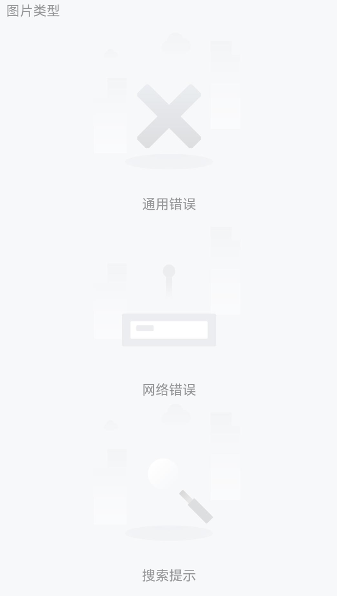
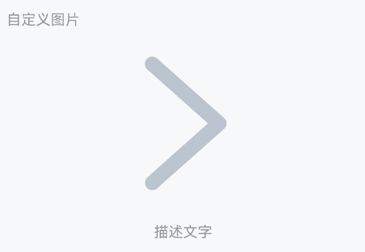
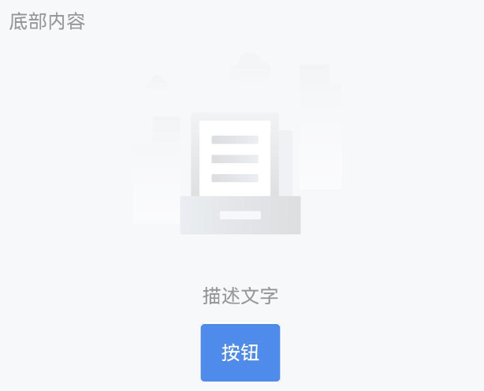

# Empty 空状态

## 介绍

空状态时的占位提示。

## 引入

```ts
import { IBestEmpty } from "@ibestservices/ibest-ui-v2";
```

## 代码演示

### 基础用法


::: details 点我查看代码
```ts
@Entry
@Component
struct DemoPage {
  build() {
    Column(){
      IBestEmpty({
        description: "描述文字"
      })
    }
  }
}
```
:::

### 图片类型



::: tip
Empty 组件内置了多种占位图片类型，可以在不同业务场景下使用。
:::

::: details 点我查看代码
```ts
@Entry
@Component
struct DemoPage {
  build() {
    Column(){
      // 通用错误
      IBestEmpty({
        emptyImage: "error",
        description: "通用错误",
      })
      // 网络错误
      IBestEmpty({
        emptyImage: "network",
        description: "网络错误",
      })
      // 搜索提示
      IBestEmpty({
        emptyImage: "search",
        description: "搜索提示",
      })
    }
  }
}
```
:::

### 自定义大小


::: tip
通过 `imageSize` 属性更改图片的大小。
:::

::: details 点我查看代码
```ts
@Entry
@Component
struct DemoPage {
  build() {
    Column(){
      IBestEmpty({
        imageSize: 100,
        description: "描述文字"
      })
    }
  }
}
```
:::

### 自定义图片



::: tip
需要自定义图片时，可以使用 `emptyImgBuilder` 插槽中传入任意内容。
:::

::: details 点我查看代码
```ts
@Entry
@Component
struct EmptyPage {
  @Builder Arrow() {
    Image($r('app.media.title_back'))
      .height(160)
  }
  build(){
    Column(){
      IBestEmpty({
        description: '描述文字',
        emptyImgBuilder: (): void => this.Arrow()
      })
    }
  }
}
```
:::

### 底部内容



::: tip
通过默认插槽 `defaultBuilder` 可以在 `Empty` 组件的下方插入内容。
:::

::: details 点我查看代码
```ts
@Entry
@Component
struct EmptyPage {
  @Builder Btn() {
    IBestButton({ text: '按钮', type: 'primary' })
  }
  build(){
    Column(){
      IBestEmpty({
        description: '描述文字',
        defaultBuilder: (): void => this.Btn()
      })
    }
  }
}
```
:::

## API

### @Props

| 参数                | 说明                                     | 类型          | 默认值  |
| ------------------- | ----------------------------------------| -------------| ---- |
| emptyImage          | 类型，可选值为 `error` `network` `search` | _string_      | `default`    |
| imageSize           | 图片大小                                 | _string_ \| _number_ | `160` |
| description         | 图片下方的描述文字                         | _ResourceStr_ |   |
| descriptionFontSize | 图片下方的描述文字的大小                    | _string_ | `14` |
| descriptionColor    | 图片下方的描述文字的颜色                    | _ResourceColor_ | `#969799` |
| emptyImageUrl       | 自定义占位图                              | _ResourceStr_ |  `''`  |

### 插槽

| 插槽名             | 说明           | 类型                      |
| ------------------ | -------------- | ------------------------- |
| defaultBuilder     | 自定义底部内容 | _CustomBuilder_ \| _null_ |
| emptyImgBuilder    | 自定义图标     | _CustomBuilder_ \| _null_ |
| descriptionBuilder | 自定义描述文字 | _CustomBuilder_ \| _null_ |