# Field 输入框

## 介绍

用户可以在文本框内输入或编辑文字。
 
## 引入

```ts
import { IBestField } from "@ibestservices/ibest-ui-v2";
```

## 代码演示

### 基础用法

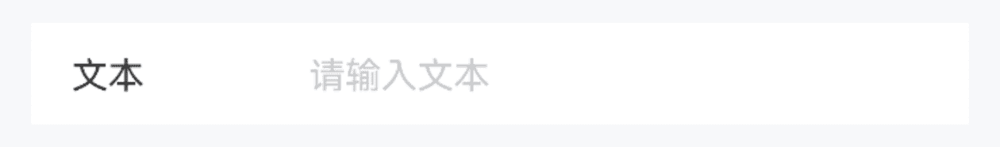
:::tip
通过 `value` 属性可绑定输入框的值, 使用 `!!` 可双向绑定。
:::

::: details 点我查看代码
```ts
@Entry
@ComponentV2
struct DemoPage {
  @Local value: string = ""
  build() {
    Column(){
      IBestField({
        value: this.value!!,
        label: "文本",
        placeholder: "请输入文本",
        hasBorder: false
      })
    }
  }
}
```
:::

### 自定义类型

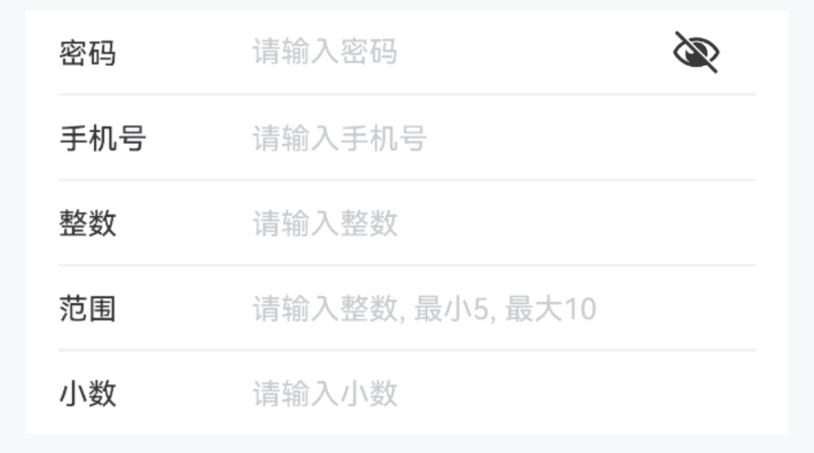
:::tip
通过 `type` 属性可指定输入框的类型, 默认为 `normal`。
:::

::: details 点我查看代码
```ts
@Entry
@ComponentV2
struct DemoPage {
  @Local value1: string = ""
  @Local value2: string = ""
  @Local value3: string = ""
  @Local value4: string = ""
  build() {
    Column(){
      // 密码
      IBestField({
        value: this.value1!!,
        label: "密码",
        placeholder: "请输入密码",
        type: "password"
      })
      // 手机号
      IBestField({
        value: this.value2!!,
        label: "手机号",
        placeholder: "请输入手机号",
        type: "phone"
      })
      // 整数数字
      IBestField({
        value: this.value3!!,
        label: "整数",
        placeholder: "请输入整数",
        type: "number"
      })
      // 小数
      IBestField({
        value: this.value4!!,
        label: "小数",
        hasBorder: false,
        placeholder: "请输入小数",
        type: "decimal"
      })
    }
  }
}
```
:::

### 禁用输入框

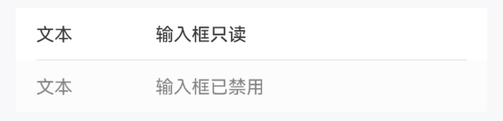
:::tip
通过 `disabled` 属性可设置输入框是否禁用, 通过 `readonly` 属性可设置输入框是否只读。
:::

::: details 点我查看代码
```ts
@Entry
@ComponentV2
struct DemoPage {
  @Local value1: string = '输入框只读'
  @Local value2: string = '输入框已禁用'
  build() {
    Column(){
      IBestField({
        value: this.value1!!,
        label: "文本",
        readOnly: true
      })
      IBestField({
        value: this.value2!!,
        label: "文本",
        hasBorder: false,
        disabled: true
      })
    }
  }
}
```
:::

### 前后缀

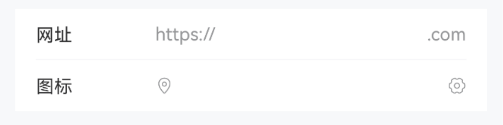

::: details 点我查看代码
```ts
@Entry
@ComponentV2
struct DemoPage {
  @Local value: string = ''
  build() {
    Column(){
      IBestField({
        value: this.value!!,
        label: "网址",
        prefix: "https://",
        suffix: ".com"
      })
      IBestField({
        value: this.value!!,
        label: "图标",
        prefixIcon: "location-o",
        suffixIcon: "setting-o",
        hasBorder: false
      })
    }
  }
}
```
:::

### 显示图标

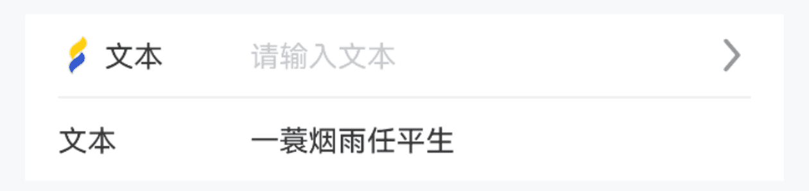
:::tip
通过 `leftIcon` `rightIcon` 属性可设置输入框左、右侧的图标, `clearable` 可显示输入框清除图标。
:::

::: details 点我查看代码
```ts
@Entry
@ComponentV2
struct DemoPage {
  @Local value1: string = ''
  @Local value2: string = '一蓑烟雨任平生'
  build() {
    Column(){
      IBestField({
        value: this.value1!!,
        label: "文本",
        placeholder: "请输入文本",
        leftIcon: "https://ibestui.ibestservices.com/favicon.ico",
        rightIcon: $r("app.media.arrow_right")
      })
      IBestField({
        value: this.value2!!,
        label: "文本",
        placeholder: "请输入文本",
        hasBorder: false,
        clearable: true
      })
    }
  }
}
```
:::

### 必填星号

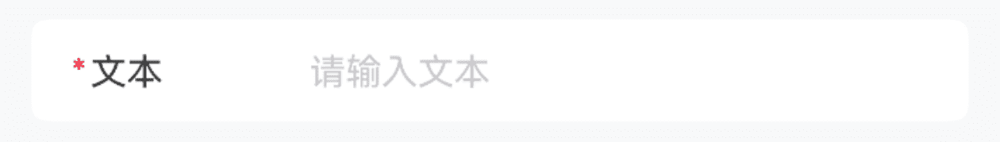
:::tip
通过 `required` 属性来展示必填星号。   
• 请注意 `required` 属性只用于控制星号展示，在进行表单校验时，需要使用 rule.required 选项来控制校验逻辑。
:::
::: details 点我查看代码
```ts
@Entry
@ComponentV2
struct DemoPage {
  @Local value: string = ''
  build() {
    Column(){
      IBestField({
        value: this.value!!,
        label: "文本",
        placeholder: "请输入文本",
        hasBorder: false,
        radius: 6,
        required: true
      })
    }
  }
}
```
:::

### 插入按钮

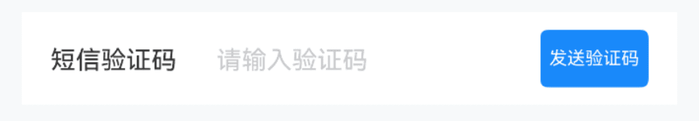
:::tip
通过 `buttonBuilder` 插槽可以在输入框的尾部插入按钮。
:::
::: details 点我查看代码
```ts
import { IBestButton } from "@ibestservices/ibest-ui-v2";
@Entry
@ComponentV2
struct DemoPage {
  @Local value: string = ''
  @Local count: number = 60
  @Local timer: number = 0
  @Builder sendCodeButton() {
    IBestButton({
      text: this.count == 60 ? '发送验证码' : `重新发送(${this.count})`,
      type: 'primary',
      buttonSize: 'mini',
      onBtnClick: () => {
          this.sendCode()
      }
    })
  }
  sendCode() {
    if (this.timer) {
      return
    }
    this.count = 60
    this.timer = setInterval(() => {
      if (this.count > 0) {
        this.count--
      } else {
        clearInterval(this.timer)
        this.timer = 0
        this.count = 60
      }
    }, 1000)
  }
  build() {
    Column(){
      IBestField({
        value: this.value!!,
        label: "短信验证码",
        placeholder: "请输入验证码",
        hasBorder: false,
        buttonBuilder: (): void => this.sendCodeButton()
      })
    }
  }
}
```
:::

### 格式化输入内容

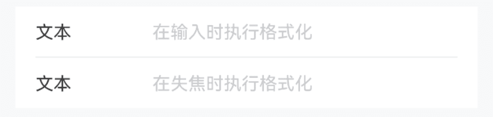
:::tip
通过 `formatter` 属性可以对输入的内容进行格式化，通过 `formatTrigger 属性可以指定执行格式化的时机，默认在输入时进行格式化。
:::
::: details 点我查看代码
```ts
@Entry
@ComponentV2
struct DemoPage {
  @Local value1: string = ''
  @Local value2: string = ''
  formatValue(value: string){
    return value.replace(/\d/g, '')
  }
  build() {
    Column(){
      IBestField({
        value: this.value1!!,
        label: "文本",
        placeholder: "在输入时执行格式化",
        formatter: (value: string): string => this.formatValue(value)
      })
      IBestField({
        value: this.value2!!,
        label: "文本",
        placeholder: "在失焦时执行格式化",
        hasBorder: false,
        formatter: (value: string): string => this.formatValue(value),
        formatTrigger: "onBlur"
      })
    }
  }
}
```
:::

### 高度自适应

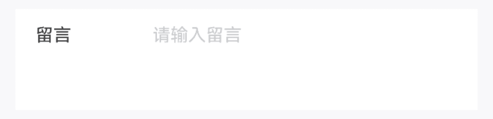
:::tip
通过 `autosize` 属性可以设置高度自适应, 通过 `rows` 可设置默认行数。
:::
::: details 点我查看代码
```ts
@Entry
@ComponentV2
struct DemoPage {
  @Local value: string = ''
  build() {
    Column(){
      IBestField({
        value: this.value!!,
        label: "留言",
        placeholder: "请输入留言",
        hasBorder: false,
        autosize: true,
        rows: 3
      })
    }
  }
}
```
:::

### 显示字数统计

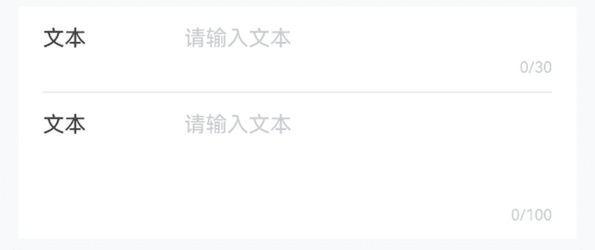
:::tip
通过设置 `showWordLimit` 和 `maxlength` 属性后会在底部显示字数统计。
:::
::: details 点我查看代码
```ts
@Entry
@ComponentV2
struct DemoPage {
  @Local value1: string = ''
  @Local value2: string = ''
  build() {
    Column(){
      IBestField({
        value: this.value1!!,
        label: "文本",
        placeholder: "请输入文本",
        maxlength: 30,
        clearable: true,
        showWordLimit: true
      })
      IBestField({
        value: this.value2!!,
        label: "文本",
        placeholder: "请输入文本",
        hasBorder: false,
        autosize: true,
        rows: 3,
        maxlength: 100,
        clearable: true,
        showWordLimit: true
      })
    }
  }
}
```
:::

### 输入框内容对齐

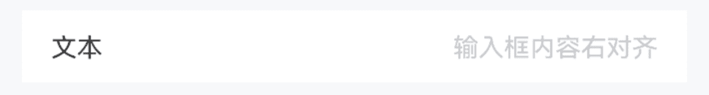
:::tip
通过 `inputAlign` 属性可以设置输入框内容对齐方式, 默认为 `left`。
:::
::: details 点我查看代码
```ts
@Entry
@ComponentV2
struct DemoPage {
  @Local value: string = ''
  build() {
    Column(){
      IBestField({
        value: this.value!!,
        label: "文本",
        placeholder: "输入框内容右对齐",
        hasBorder: false,
        inputAlign: "right"
      })
    }
  }
}
```
:::

### 输入框文本位置

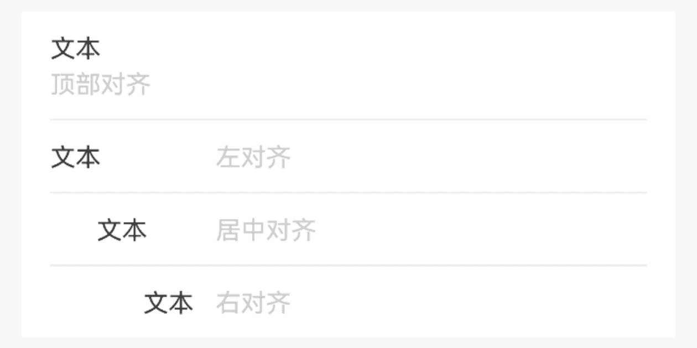
:::tip
通过 `labelPosition` 属性可以设置文本位置, 默认为 `left`; 通过 `labelAlign` 属性可以设置文本对齐方式, 默认为 `left`。
:::
::: details 点我查看代码
```ts
@Entry
@ComponentV2
struct DemoPage {
  @Local value1: string = ''
  @Local value2: string = ''
  @Local value3: string = ''
  @Local value4: string = ''
  build() {
    Column(){
      IBestField({
        value: this.value1!!,
        label: "文本",
        placeholder: "顶部对齐",
        labelPosition: "top"
      })
      IBestField({
        value: this.value2!!,
        label: "文本",
        placeholder: "左对齐",
        labelAlign: "left"
      })
      IBestField({
        value: this.value3!!,
        label: "文本",
        placeholder: "居中对齐",
        labelAlign: "center"
      })
      IBestField({
        value: this.value4!!,
        label: "文本",
        placeholder: "右对齐",
        labelAlign: "right",
        hasBorder: false
      })
    }
  }
}
```
:::

### 点击反馈

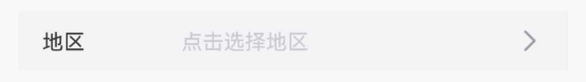
:::tip
通过 `clickable` `isLink` 属性可以开启点击反馈。
:::
::: details 点我查看代码
```ts
@Entry
@ComponentV2
struct DemoPage {
  @Local value: string = ''
  build() {
    Column(){
      IBestField({
        value: this.value!!,
        label: "地区",
        placeholder: "点击选择地区",
        hasBorder: false,
        isLink: true,
        onFieldClick: () => {
          console.log("点击")
        }
      })
    }
  }
}
```
:::

### 自定义右侧区域内容

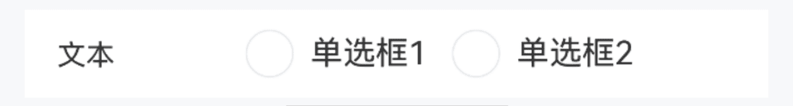
:::tip
通过 `customRightContent` 插槽可自定义右侧内容。
:::
::: details 点我查看代码
```ts
import { IBestRadioGroup, IBestRadio } from "@ibestservices/ibest-ui-v2";
@Entry
@ComponentV2
struct DemoPage {
  @Local value: string = ''
  @Builder radioContent() {
    IBestRadioGroup({
      active: this.value!!,
      group: 'group',
      placeDirection: Axis.Horizontal
    }){
      IBestRadio({
        label: '单选框1',
        name: '1',
        group: 'group'
      })
      IBestRadio({
        label: '单选框2',
        name: '2',
        group: 'group'
      })
    }
  }
  build() {
    Column(){
      IBestField({
        value: this.value,
        label: "文本",
        hasBorder: false,
        customRightContent: (): void => this.radioContent()
      })
    }
  }
}
```
:::

### 边框样式

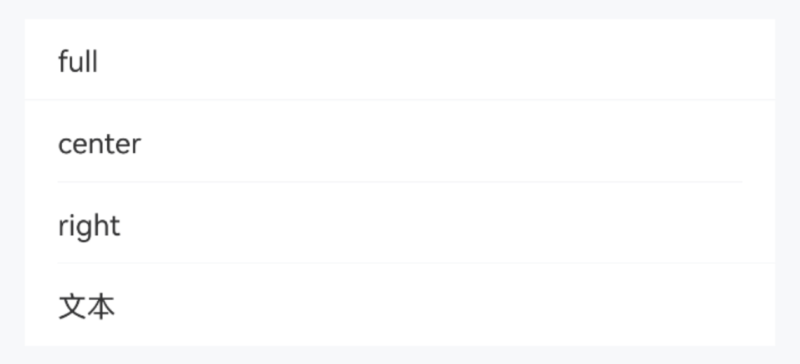
:::tip
通过 `borderSizeType` 属性可自定义底部边框线位置。
:::

::: details 点我查看代码
```ts
@Entry
@ComponentV2
struct DemoPage {
  @Local value: string = ''
  build() {
    Column(){
      IBestField({
        value: this.value!!,
        label: "full",
        readOnly: true,
        borderSizeType: 'full'
      })
      IBestField({
        value: this.value!!,
        label: "center",
        readOnly: true,
        borderSizeType: 'center'
      })
      IBestField({
        value: this.value!!,
        label: "right",
        readOnly: true,
        borderSizeType: 'right'
      })
      IBestField({
        value: this.value!!,
        label: "文本",
        readOnly: true,
        hasBorder: false
      })
    }
  }
}
```
:::

## API

### @Props

| 参数         | 说明                                                     | 类型      | 默认值     |
| ------------| --------------------------------------------------------| --------- | ---------- |
| type        | 输入框类型, `autosize` 为true时, 可选值 `normal` `password` `email` `number` `phone` `username` `number-password` `decimal` ; `autosize` 为false时, 可选值 `normal` `email` `number` `phone` `decimal`, 其他无效| _string_ |`'normal'`|
| value       | 当前输入的值, 支持双向绑定   | _string_ \| _number_ \| _boolean_ \| _(string \| number \| IBestUploaderFile)[]_ | `''`  |
| formId      | 唯一id, 当组件用于验证时必传                               | _string_ \| _number_  | `''` |
| prop        | 绑定value的属性名, 当组件用于验证时必传                     | _string_  | `''` |
| rules       | 验证规则列表, 可由form统一配置                             | _IBestFormRuleItem[]_ |`[]`|
| label       | 输入框左侧文本	                                         | _ResourceStr_ | `''`|
| colon       | 是否在label后加冒号, 可由form统一配置                      | _boolean_ | `false` |
| labelWidth  | 左侧文本宽度，可由form统一配置                              | _string_ \| _number_ |`80`|
| labelPosition | 左侧文本位置, 可选值 `left` `top`, 可由form统一配置       | _string_ |`left`|
| labelAlign  | 左侧文本对齐方式, 可选值 `left` `center` `right`, 可由form统一配置| _string_ |`left`|
| placeholder | 输入框占位提示文字                                        | _ResourceStr_ |`''`|
| decimalLength| 小数点位数, 仅当type为`decimal`时生效, 默认不限制           | _number_ |`-1`|
| showPasswordIcon| 是否显示密码框末尾图标                                 | _boolean_ | `true` |
| autosize    | 输入框自适应高度                                          | _boolean_ | `false` |
| rows        | 默认行数, 仅当 `autosize` 为true时生效                     | _number_ | `1` |
| maxlength   | 最大输入字符数, 默认不限制                                  | _number_ | `-1` |
| showWordLimit| 是否显示字数统计, 需配合 `maxlength` 一起使用               | _boolean_ | `false` |
| inputAlign  | 输入框文字对齐方式, 可选值  `left` `center` `right`         | _string_ | `left` |
| required    | 是否显示表单必填星号                                       | _boolean_ | `false` |
| requireAsteriskPosition| 星号的位置, 可选值 `left` `right`, 可由form统一配置| _string_ | `left` |
| disabled    | 是否禁用, 可由form统一配置                                  | _boolean_ | `false` |
| readOnly    | 是否只读                                                  | _boolean_ | `false` |
| clickable   | 是否开启点击反馈                                           | _boolean_ | `false` |
| isLink      | 是否展示右侧箭头并开启点击反馈                              | _boolean_ | `false` |
| leftIcon    | 左侧图标                                                  | _ResourceStr_ | `''` |
| leftIconColor| 左侧图标颜色, 仅svg格式有效                               | _ResourceColor_ | `''` |
| rightIcon    | 右侧图标                                                 | _ResourceStr_ | `''` |
| rightIconColor| 右侧图标颜色, 仅svg格式有效                               | _ResourceColor_ | `''` |
| hasBorder   | 是否展示底部线条                                           | _boolean_ | `true` |
| clearable   | 是否启用清除图标，点击清除图标后会清空输入框                  | _boolean_ | `false` |
| clearIcon   | 自定义清除图标                                              | _ResourceStr_ | `''` |
| clearTrigger| 显示清除图标的时机, 可选值 `always` `focus`                  | _string_ | `focus` |
| showMessage | 是否显示验证信息, 可由form统一配置                           | _boolean_ | `true` |
| formatter   | 格式化函数                                                 | _(value: string) => string_ | `-` |
| formatTrigger| 执行格式化函数触发时机, 可选值 `onchange` `onblur`         | _string_ | `onchange` |
| labelFontSize| 左侧字体大小                                              | _string_ \| _number_ | `14` |
| labelColor   | 左侧字体颜色                                               | _ResourceStr_ | `#323233` |
| leftIconSize | 左侧图标大小                                               | _string_ \| _number_ | `14` |
| rightIconSize| 右侧图标大小                                              | _string_ \| _number_ | `14` |
| showLabel    | 是否显示label                                             | _boolean_ | `true` |
| placeholderColor | 占位文字颜色                                          | _ResourceColor_ | `#c8c9cc` |
| bgColor      | 背景色                                                    | _ResourceColor_ | `#fff` |
| inputFontSize| 输入框字体大小                                            | _string_ \| _number_ | `14` |
| caretColor   | 光标颜色                                                  | _ResourceColor_ | `''` |
| min          | 最小值, type 为 `number` `decimal` 时有效                  | _number_ | `-1` |
| max          | 最大值, type 为 `number` `decimal` 时有效                  | _number_ | `-1` |
| verticalAlign| 垂直方向对齐方式, 仅 `labelPosition` 为left时有效, 可选值 `top` `center` | _string_ | `'top'` |
| radius       | 外部圆角                                                   | _Length_ \| _BorderRadiuses_ \| _LocalizedBorderRadiuses_ | `0` |
| prefix       | 前缀内容                                                   | _ResourceStr_ | `''` |
| prefixFontColor | 前缀内容颜色                                             | _ResourceColor_ | `#969799` |
| suffix       | 后缀内容                                                    | _ResourceStr_ | `''` |
| suffixFontColor | 后缀内容颜色                                             | _ResourceColor_ | `#969799` |
| messageTextAlign| 验证信息对齐方式, 可选值 `left` `center` `right`, 默认与输入框文字对齐方式一致 | _string_ | `left` |
| inputFontColor <span style="font-size: 12px; padding:2px 4px;color:#3D8AF2;border-radius:4px;border: 1px solid #3D8AF2">1.0.2</span>| 输入框文字颜色 | _ResourceColor_ | `#323233` |
| prefixIcon <span style="font-size: 12px; padding:2px 4px;color:#3D8AF2;border-radius:4px;border: 1px solid #3D8AF2">1.0.2</span>| 前缀图标, 优先级高于prefix | _ResourceStr_ | `''` |
| prefixSize <span style="font-size: 12px; padding:2px 4px;color:#3D8AF2;border-radius:4px;border: 1px solid #3D8AF2">1.0.2</span>| 前缀内容大小 | _string_ \| _number_ | `14` |
| suffixIcon <span style="font-size: 12px; padding:2px 4px;color:#3D8AF2;border-radius:4px;border: 1px solid #3D8AF2">1.0.2</span>| 后缀图标, 优先级高于suffix | _ResourceStr_ | `''` |
| suffixSize <span style="font-size: 12px; padding:2px 4px;color:#3D8AF2;border-radius:4px;border: 1px solid #3D8AF2">1.0.2</span>| 后缀内容大小 | _string_ \| _number_ | `14` |
| borderSizeType <span style="font-size: 12px; padding:2px 4px;color:#3D8AF2;border-radius:4px;border: 1px solid #3D8AF2">1.0.2</span>| 底部边框线尺寸类型, 可选值 `full` `center` `right` | _string_ | `center` |
| borderLeft <span style="font-size: 12px; padding:2px 4px;color:#3D8AF2;border-radius:4px;border: 1px solid #3D8AF2">1.0.2</span>| 底部边框线左侧left值 | _Dimension_ | `-` |
| fieldPadding <span style="font-size: 12px; padding:2px 4px;color:#3D8AF2;border-radius:4px;border: 1px solid #3D8AF2">1.0.2</span>| 输入框内边距 | _Length_ \| _Padding_ \| _LocalizedPadding_ | `{left: 16, right: 16, top: 10, bottom: 10}` |
| bdColor <span style="font-size: 12px; padding:2px 4px;color:#3D8AF2;border-radius:4px;border: 1px solid #3D8AF2">1.0.2</span>| 底部边框线颜色 | _ResourceColor_ | `#ebedf0` |
| showValue <span style="font-size: 12px; padding:2px 4px;color:#3D8AF2;border-radius:4px;border: 1px solid #3D8AF2">1.0.2</span>| 右侧要显示的内容，当右侧需要显示的内容与value不同时可使用该属性，仅autosize为false且disabled \| readOnly \| isLink为true时生效 | _ResourceStr_ | `''` |

### Events

| 事件名            | 说明                         | 事件类型                         |
| ------------------| ----------------------------| -------------------------------- |
| onChange          | value变化时触发              | `(value: string \| number \| boolean \| (string \| number \| IBestUploaderFile)[]) => void` |
| onClear           | 点击清除按钮时触发            | `() => void` |
| onFieldClick      | 点击组件时触发                | `() => void` |
| onFieldFocus      | 输入框获得焦点时触发          | `() => void` |
| onFieldBlur       | 输入框失去焦点时触发          | `() => void` |
| onLeftIconClick   | 左侧图标点击时触发            | `() => void` |
| onRightIconClick  | 右侧图标点击时触发            | `() => void` |


### 插槽
| 插槽名         | 说明                         | 类型                      |
| ------------  | -----------------------------| -------------------------|
|buttonBuilder  | 右侧按钮                      |  _CustomBuilder_  |
|customRightContent| 右侧内容, 使用该插槽后, 与输入框相关的属性和事件将失效 |  _CustomBuilder_  |

## 主题定制

组件提供了下列颜色变量，可用于自定义深色/浅色模式样式，使用方法请参考 [颜色模式](../../guide/color-mode/index.md) 章节，如需要其它颜色变量可提 [issue](https://github.com/ibestservices/ibest-ui/issues)。

| 名称                                       | 描述                              | 默认值        |
| -------------------------------------------|----------------------------------|--------------|
| ibest_field_label_color                    | 标签文字颜色                       | `#323233`   |
| ibest_field_input_color                    | 输入框文字颜色                     | `#323233`   |
| ibest_field_placeholder_color              | 输入框占位文字颜色                  | `#c8c9cc`   |
| ibest_field_right_icon_color               | 右侧图标颜色                       | `#969799`   |
| ibest_field_border_color                   | 边框颜色                           | `#ebedf0`   |
| ibest_field_background                     | 背景颜色                           | `#fff`      |
| ibest_field_active_color                   | 按压态背景颜色                      | `#f2f3f5`   |
| ibest_field_prefix_font_color              | 前缀内容颜色                        | `#969799`   |
| ibest_field_suffix_font_color              | 后缀内容颜色                        | `#969799`   |