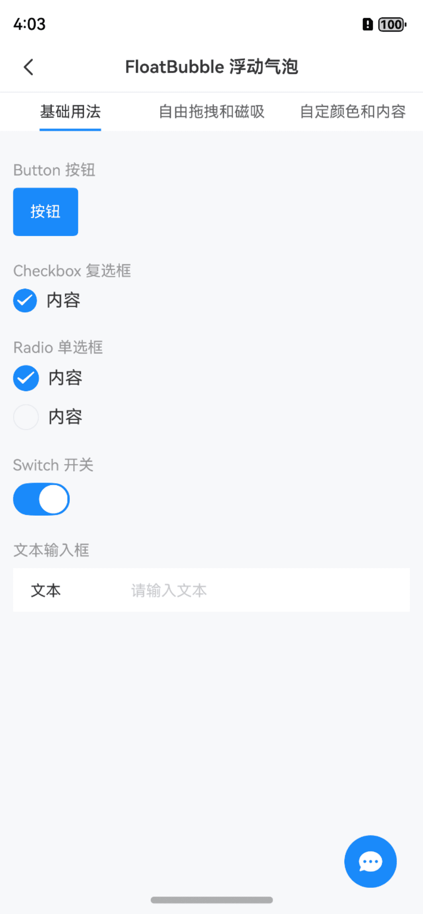
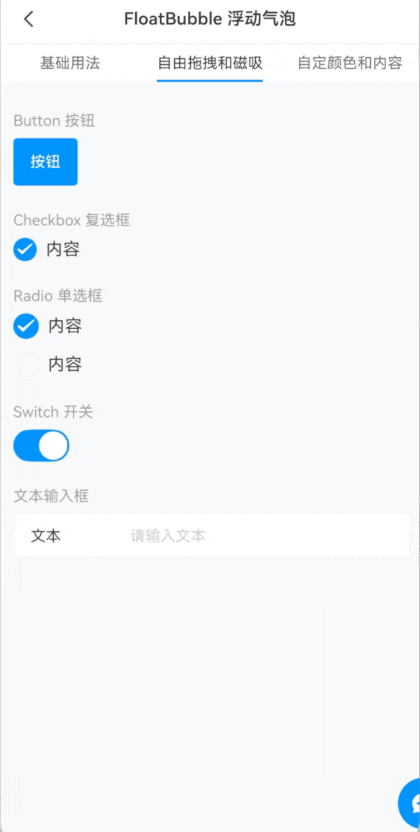
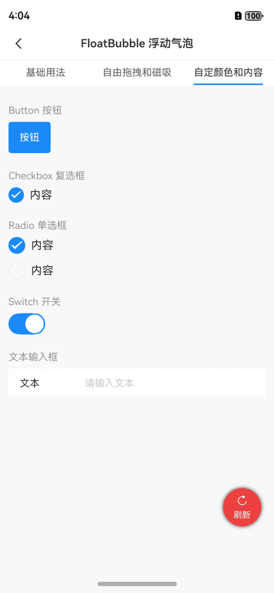

# FloatBubble 浮动气泡

## 介绍

悬浮在页面边缘的可点击气泡。
 
## 引入

```ts
import { IBestFloatBubble } from "@ibestservices/ibest-ui-v2";
```

## 代码演示

### 基础用法


:::tip
• 使用时需要通过 `show` 属性控制气泡的显隐, 具体显隐时机需开发者自己控制;   
• 如果当前页面内需要跳转其他页面, 且需要隐藏气泡, 需要手动设置 `show` 为 `false`。
:::

::: details 点我查看代码
```ts
@Entry
@ComponentV2
struct DemoPage {
  @Local bubbleShow: boolean = false
  build() {
    NavDestination(){
      IBestFloatBubble({
        show: this.bubbleShow,
        icon: "chat",
        onBubbleClick: () => {
          IBestToast.show("点击了气泡")
        }
      })
    }
    .onShown(() => {
      this.bubbleShow = true
    })
    .onWillHide(() => {
      this.bubbleShow = false
    })
  }
}
```
:::

### 自动隐藏



::: details 点我查看代码
```ts
@Entry
@ComponentV2
struct DemoPage {
  @Local bubbleShow: boolean = false
  build() {
    NavDestination(){
      IBestFloatBubble({
        show: this.bubbleShow,
        icon: "chat",
        dragAxis: "xy",
        autoHide: true
      })
    }
    .onShown(() => {
      this.bubbleShow = true
    })
    .onWillHide(() => {
      this.bubbleShow = false
    })
  }
}
```
:::

### 自定颜色和内容



::: details 点我查看代码
```ts
@Entry
@ComponentV2
struct DemoPage {
  @Local bubbleShow: boolean = false
  @Builder customBubble(){
    Column({space: 6}){
      IBestIcon({
        name: "replay",
        iconSize: 16,
        color: "#fff"
      })
      Text("刷新").fontSize(12).fontColor("#fff")
    }
  }
  build() {
    NavDestination(){
      IBestFloatBubble({
        show: this.bubbleShow,
        bubbleSize: 54,
        bgColor: "#ed4040",
        pos: {right: 0, bottom: 100},
        bubbleShadow: {
          radius: 14,
          color: "#333"
        }
      }){
        this.customBubble()
      }
    }
    .onShown(() => {
      this.bubbleShow = true
    })
    .onWillHide(() => {
      this.bubbleShow = false
    })
  }
}
```
:::


## API

### @Props

| 参数         | 说明                                   | 类型      | 默认值     |
| ------------| ---------------------------------------| --------- | ---------- |
| show        | 是否展示                                | _boolean_  | `false` |
| bgColor     | 气泡背景色                              | _ResourceColor_ | `#1989fa` | 
| bubbleSize  | 气泡大小                                | _string_ \| _number_ | `48` |
| shape       | 气泡形状, 可选值为 `circle` `square`      | _string_ | `circle` |
| radius      | 圆角, 仅shap为 `square` 时生效            | _string_ \| _number_ | `6` |
| icon        | 图标                                    | _ResourceStr_ | `-` |
| iconSize    | 图标大小                                 | _string_ \| _number_ | `24` |
| iconColor   | 图标颜色                                 | _ResourceColor_ | `#fff` |
| pos         | 气泡初始位置                              | _IBestEdges_ | `-` |
| dragAxis    | 可拖拽方向, 可选值为 `x` `y` `xy` `lock`   | _string_  | `y` |
| gap         | 气泡与窗口最小间距                         | _number_  | `24` |
| isMagnetic  | 是否开启磁吸                              | _boolean_ | `true` |
| bubbleShadow| 气泡阴影                                 | _ShadowOptions_ \| _ShadowStyle_ | `-` |
| autoHide    | 自动磁吸后是否自动延时隐藏, 仅isMagnetic为true时有效 | _boolean_ | `false` |
| hideDelay   | 延时隐藏时间, 单位ms, 仅autoHide为true时有效| _number_ | `2000` |
| remainSize  | 隐藏时预留尺寸, 仅autoHide为true时有效      | _number_ | `20` |

### IBestEdges 数据结构
| 参数            | 说明                             | 类型      |
| ---------------| ---------------------------------| ---------|
| top            | 顶部距离                          | _number_ |
| left           | 左侧距离                          | _number_ |
| right          | 右侧距离, 优先级大于left            | _number_ |
| bottom         | 底部距离, 优先级大于top             | _number_ |

### 插槽

| 插槽名             | 说明               | 类型             |
| ------------------| ------------------| ----------------|
| defaultBuilder    | 自定义气泡的内容     | _CustomBuilder_ |

### Events

| 事件名        | 说明                  | 回调参数             |
| -------------| ---------------------| ------------------- |
| onBubbleClick| 点击气泡触发           | `-` |