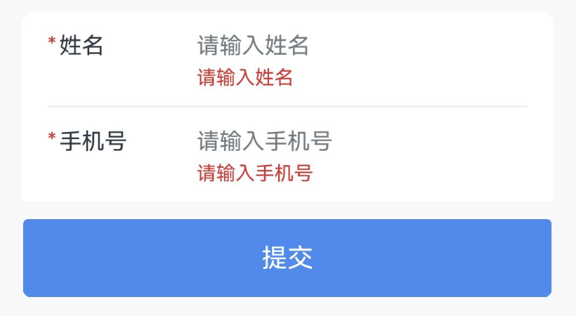
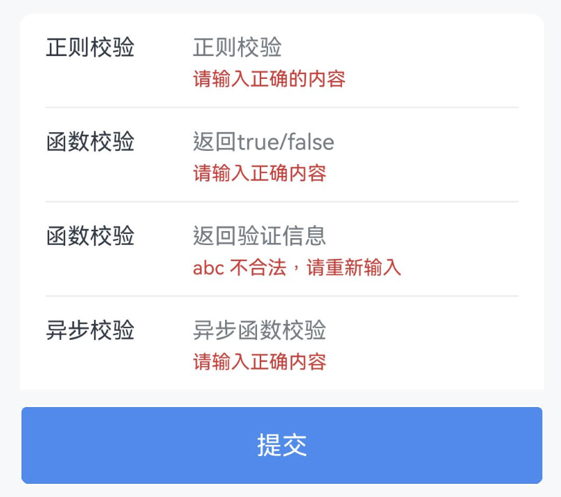
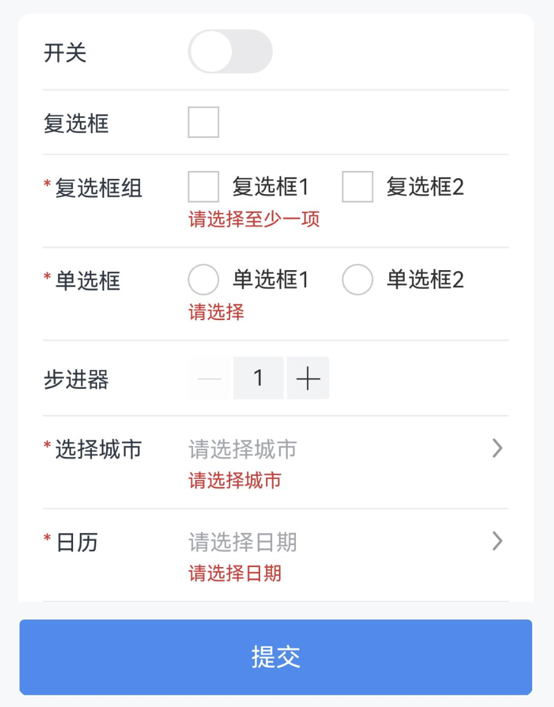
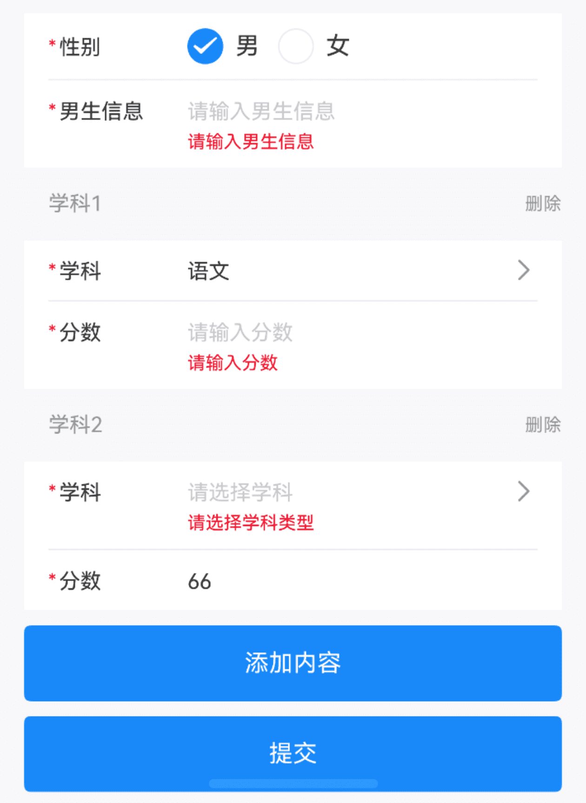

# Form 表单

## 介绍

用于数据录入、校验，支持输入框、单选框、复选框、文件上传等类型，需要与 Field 输入框 组件搭配使用。
 
## 引入

```ts
import { IBestForm, IBestFormRule, IBestField, IBestFormController } from "@ibestservices/ibest-ui-v2";
```

## 代码演示

### 基础用法


:::tip
通过 `formId` 属性绑定表单与表单项的关系, `rules` 属性可配置表单校验规则，绑定 `controller` 属性可获取表单实例。   
• `formId` `props` 属性为必填项，未设置 `formId` `prop` 的表单项将不触发表单验证。
:::

::: details 点我查看代码
```ts
import { IBestCellGroup, IBestButton, IBestToast } from "@ibestservices/ibest-ui-v2"
@ObservedV2
class Form{
  @Trace name: string = ''
  @Trace phone: string = ''
}
@Entry
@ComponentV2
struct DemoPage {
  @Local form: Form = new Form()
  private formId: string = 'form'
  private controller: IBestFormController = new IBestFormController()
  build() {
    Column(){
      IBestForm({
        formId: this.formId,
        controller: this.controller
      }){
        IBestCellGroup({hasBorder: false}) {
          IBestField({
            formId: this.formId,
            prop: 'name',
            value: this.form.name!!,
            label: "姓名",
            placeholder: "请输入姓名",
            rules:[
              { required: true, message: '请输入姓名' },
              { min: 3, max: 10, message: '姓名长度在3-10个字符之间' }
            ]
          })
          IBestField({
            formId: this.formId,
            prop: 'phone',
            value: this.form.phone!!,
            label: "手机号",
            placeholder: "请输入手机号",
            hasBorder: false,
            rules: [
              { required: true, message: '请输入手机号' }
            ]
          })
        }
        IBestButton({
          text: "验证姓名",
          type: 'primary',
          buttonSize: 'large',
          onBtnClick: () => {
            this.controller.validateField("name").then(res => {
              if(res.valid){
                IBestToast.show("验证成功")
              } else {
                IBestToast.show({
                  message: `${res.field.label}验证失败`
                })
              }
            })
          }
        })
        IBestButton({
          text: "提交",
          type: 'primary',
          buttonSize: 'large',
          onBtnClick: () => {
            this.controller.validate().then(res => {
              if(res.valid){
                IBestToast.show("验证成功")
              } else {
                let labels: string[] = res.fields.map(item => item.label)
                IBestToast.show({
                  message: `${labels.join(',')}验证失败`
                })
              }
            })
          }
        })
      }
    }
  }
}
```
:::

### 校验规则


:::tip
通过 `rules` 定义表单校验规则，所有可用字段见下方表格
:::
::: details 点我查看代码
```ts
import { IBestCellGroup, IBestButton, IBestToast } from "@ibestservices/ibest-ui-v2"
@ObservedV2
class Form{
  @Trace value1: string = "123"
  @Trace value2: string = ""
  @Trace value3: string = "abc"
  @Trace value4: string = ""
}
@Entry
@ComponentV2
struct DemoPage {
  @Local form: Form = new Form()
  private formId: string = 'form'
  // 正则校验
  private pattern = /\d{6}/
  // 校验函数返回 true 表示校验通过，false 表示不通过
  private validator = (val: string) => /1\d{10}/.test(val)
  // 校验函数可以直接返回一段错误提示
  private validatorMessage = (val: string) => `${val} 不合法，请重新输入`
  // 校验函数可以返回 Promise，实现异步校验
  private asyncValidator(val: string): Promise<boolean> {
    return new Promise((resolve) => {
      IBestToast.show({
        type: "loading",
        message: '校验中...'
      })
      setTimeout(() => {
        IBestToast.hide()
        resolve(val === '1234')
      }, 1000)
    })
  }
  private rules: IBestFormRule = {
    "value1": [
      { pattern: this.pattern, message: "请输入正确的内容" }
    ],
    "value2": [
      { validator: this.validator, message: "请输入正确内容" }
    ],
    "value3": [
      { validator: this.validatorMessage }
    ],
    "value4": [
      { validator: this.asyncValidator, message: "请输入正确内容" }
    ]
  }
  private controller: IBestFormController = new IBestFormController()
  build() {
    Column(){
      IBestForm({
        formId: this.formId,
        rules: this.rules,
        controller: this.controller
      }){
        IBestCellGroup({hasBorder: false}) {
          IBestField({
            formId: this.form,
            prop: 'value1',
            value: this.form.value1!!,
            label: "正则校验",
            placeholder: "正则校验"
          })
          IBestField({
            formId: this.form,
            prop: 'value2',
            value: this.form.value2!!,
            label: "函数校验",
            placeholder: "返回true/false"
          })
          IBestField({
            formId: this.form,
            prop: 'value3',
            value: this.form.value3!!,
            label: "函数校验",
            placeholder: "返回验证信息"
          })
          IBestField({
            formId: this.form,
            prop: 'value4',
            value: this.form.value4!!,
            label: "异步校验",
            placeholder: "异步函数校验",
            hasBorder: false
          })
        }
        IBestButton({
          text: "提交",
          type: 'primary',
          buttonSize: 'large',
          onBtnClick: () => {
            this.controller.validate((valid, fields) => {
              if (valid) {
                console.log("验证成功")
              }
            })
          }
        })
      }
    }
  }
}
```
:::

### 自定义表单项类型


::: details 点我查看代码
```ts
import {
  IBestButton,
  IBestCalendarDialog,
  IBestCascader,
  IBestCascaderOption,
  IBestCellGroup,
  IBestCheckbox,
  IBestCheckboxGroup,
  IBestRadio,
  IBestRadioGroup,
  IBestStepper,
  IBestSwitch,
  IBestToast,
  IBestUploaderFile,
  IBestUploader
} from "@ibestservices/ibest-ui-v2"
@ObservedV2
class Form{
  @Trace value1: boolean = false
  @Trace value2: boolean = false
  @Trace value3: string[] = []
  @Trace value4: boolean = false
  @Trace value5: number = 1
  @Trace value6: string[] = []
  @Trace value7: string = ""
  @Trace value8: IBestUploaderFile[] = []
}
@Entry
@ComponentV2
struct DemoPage {
  @Local form: Form = new Form()
  @Local selectValue: string = ''
  @Local visible: boolean = false
  @Local visible1: boolean = false
  private formId: string = 'form'
  private rules: IBestFormRule = {
    "value3": [
      { required: true, message: '请选择至少一项' }
    ],
    "value4": [
      { required: true, message: "请选择" }
    ],
    "value6": [
      { required: true, message: "请选择城市" }
    ],
    "value7": [
      { required: true, message: "请选择日期" }
    ],
    "value12": [
      { required: true, message: "请上传图片" }
    ]
  }
  private controller: IBestFormController = new IBestFormController()
  @Local options: IBestCascaderOption[] = [
    {
      text: "江苏省",
      value: "320000",
      children: [
        {
          text: "南京市",
          value: "320100",
          children: [
            {
              text: "秦淮区",
              value: "320104"
            },
            {
              text: "雨花台区",
              value: "320114"
            }
          ]
        },
        {
          text: "苏州市",
          value: "320500",
          children: [
            {
              text: "姑苏区",
              value: "320508"
            },
            {
              text: "昆山市",
              value: "320583"
            }
          ]
        }
      ]
    },
    {
      text: "安徽省",
      value: "340000",
      children: [
        {
          text: "合肥市",
          value: "340100",
          children: [
            {
              text: "蜀山区",
              value: "340104"
            },
            {
              text: "合肥高新技术产业开发区",
              value: "340171"
            }
          ]
        },
        {
          text: "黄山市",
          value: "341000",
          children: [
            {
              text: "屯溪区",
              value: "341002"
            },
            {
              text: "黄山区",
              value: "341003"
            }
          ]
        }
      ]
    }
  ]
  @Builder switchContent() {
    IBestSwitch({
      value: this.form.value1!!
    })
  }
  @Builder checkboxContent() {
    IBestCheckbox({
      value: this.form.value2!!,
      shape: "square"
    })
  }
  @Builder checkboxGroupContent() {
    IBestCheckboxGroup({
      group: "group1",
      activeList: this.form.value3!!,
      placeDirection: Axis.Horizontal
    }){
      IBestCheckbox({
        group: "group1",
        shape: "square",
        label: "复选框1",
        name: "1"
      })
      IBestCheckbox({
        group: "group1",
        shape: "square",
        label: "复选框2",
        name: "2"
      })
    }
  }
  @Builder radioContent() {
    IBestRadioGroup({
      active: this.form.value4!!,
      group: "group1",
      placeDirection: Axis.Horizontal
    }){
      IBestRadio({
        group: "group1",
        label: "单选框1",
        name: true
      })
      IBestRadio({
        group: "group1",
        label: "单选框2",
        name: false
      })
    }
  }
  @Builder stepperContent(){
    IBestStepper({
      value: this.form.value5!!,
      min: 1,
      max: 99
    })
  }
  @Builder uploadImg(){
    IBestUploader({
      fileList: this.form.value8!!,
      max: 2
    })
  }
  build() {
    Column(){
      IBestForm({
        formId: this.formId,
        rules: this.rules,
        controller: this.controller
      }){
        IBestCellGroup({hasBorder: false}) {
          IBestField({
            formId: this.formId,
            prop: 'value1',
            value: this.form.value1!!,
            label: "开关",
            customRightContent: (): void => this.switchContent()
          })
          IBestField({
            formId: this.formId,
            prop: 'value2',
            value: this.form.value2!!,
            label: "复选框",
            rules: this.form.value1 ? [{required: true, message: '请选择'}] : [],
            customRightContent: (): void => this.checkboxContent()
          })
          IBestField({
            formId: this.formId,
            prop: 'value3',
            value: this.form.value3!!,
            label: "复选框组",
            customRightContent: (): void => this.checkboxGroupContent()
          })
          IBestField({
            formId: this.formId,
            prop: 'value4',
            value: this.form.value4!!,
            label: "单选框",
            customRightContent: (): void => this.radioContent()
          })
          IBestField({
            formId: this.formId,
            prop: 'value5',
            value: this.form.value5!!,
            label: "步进器",
            customRightContent: (): void => this.stepperContent()
          })
          IBestField({
            formId: this.formId,
            prop: 'value6',
            value: this.form.value6!!,
            showValue: this.selectValue,
            label: "选择城市",
            placeholder: "请选择城市",
            isLink: true,
            onFieldClick: () => {
              this.visible = true
            }
          })
          IBestField({
            formId: this.formId,
            prop: 'value7',
            value: this.form.value7!!,
            label: "日历",
            placeholder: "请选择日期",
            isLink: true,
            onFieldClick: () => {
              this.visible1 = true
            }
          })
          IBestField({
            formId: this.formId,
            prop: 'value8',
            value: this.form.value8!!,
            label: "上传图片",
            hasBorder: false,
            customRightContent: (): void => this.uploadImg()
          })
        }
        IBestButton({
          text: "设置值",
          type: 'primary',
          buttonSize: 'large',
          onBtnClick: () => {
            this.controller2.setFormValues({
              "value1": true,
              "value2": true,
              "value3": ['1'],
              "value4": true,
              "value6": ["320000","320500","320583"],
              "value9": '2025-08-25'
            })
            this.selectValue = "江苏省,苏州市,昆山市"
          }
        })
        IBestButton({
          text: "提交",
          type: 'primary',
          buttonSize: 'large',
          onBtnClick: () => {
            this.controller.validate((valid, fields) => {
              if (valid) {
                IBestToast.show("验证成功")
              }
            })
          }
        }).margin({ top: 20 })
      }
      // 选择城市
      IBestCascader({
        visible: this.visible!!,
        options: this.options,
        value: this.form.value6!!,
        onConfirm: value => {
          this.selectValue = value.map(item => item.text).join(',')
        }
      })
      // 日历
      IBestCalendarDialog({
        visible: this.visible1!!,
        onConfirm: value => {
          this.form.value7 = value[0].dateStr
        }
      })
    }
  }
}
```
:::

### 动态表单校验


::: details 点我查看代码
```ts
import {
  IBestButton,
  IBestCellGroup,
  IBestField,
  IBestForm,
  IBestFormController,
  IBestFormRule,
  IBestPicker,
  IBestPickerOption,
  IBestPopup,
  IBestRadio,
  IBestRadioGroup,
  IBestToast
} from '@ibestservices/ibest-ui'
@ObservedV2
class Form{
  @Trace sex: string | number = ''
  @Trace info1: string = ""
  @Trace info2: string = ""
  @Trace list: Subject[] = []
}
@ObservedV2
class Subject {
  type: string = ""
  @Trace name: string = ""
  @Trace score: number = 0
}
@Entry
@ComponentV2
struct DemoPage {
  @Local form: Form = new Form()
  private formId: string = 'form'
  private rules: IBestFormRule = {
    "sex": [
      { required: true, message: "请选择是否" }
    ],
    "info1": [
      { required: true, message: "请输入男生信息" }
    ],
    "info2": [
      { required: true, message: "请输入女生信息" }
    ],
    "type": [
      { required: true, message: "请选择学科类型" }
    ],
    "score": [
      { required: true, message: "请输入分数" }
    ]
  }
  private controller: IBestFormController = new IBestFormController()
  @Builder radioContent() {
    IBestRadioGroup({
      active: this.form.sex!!,
      group: "group",
      placeDirection: Axis.Horizontal
    }){
      IBestRadio({
        group: "group",
        label: "男",
        name: 1
      })
      IBestRadio({
        group: "group",
        label: "女",
        name: 2
      })
    }
  }
  deleteContent(index: number){
    this.form.list.splice(index, 1)
  }
  build() {
    Column(){
      IBestForm({
        formId: this.formId,
        rules: this.rules,
        controller: this.controller
      }){
        IBestCellGroup({hasBorder: false}){
          IBestField({
            formId: this.formId,
            prop: 'sex',
            value: this.form.sex,
            label: "性别",
            hasBorder: this.form.sex != '',
            customRightContent: (): void => this.radioContent()
          })
          if(this.form.sex == 1){
            IBestField({
              formId: this.formId,
              prop: 'info1',
              value: this.form.info1!!,
              label: "男生信息",
              placeholder: "请输入男生信息",
              hasBorder: false
            })
          }else if(this.form.sex == 2){
            IBestField({
              formId: this.formId,
              prop: 'info2',
              value: this.form.info2!!,
              label: "女生信息",
              placeholder: "请输入女生信息",
              hasBorder: false
            })
          }
          ForEach(this.form.list, (item: Subject, index) => {
            subjectItem({
              item: item,
              index: index,
              formId: this.formId,
              delete: (): void => this.deleteContent(index)
            })
          })
        }
        IBestButton({
          text: "添加学科",
          type: "primary",
          buttonSize: 'large',
          onBtnClick: () => {
            this.form.list.push(new Subject())
          }
        })
        IBestButton({
          text: "提交",
          type: 'primary',
          buttonSize: 'large',
          onBtnClick: () => {
            this.controller.validate((valid) => {
              if (valid) {
                IBestToast.show("验证成功")
              }
            })
          }
        })
      }
    }
  }
}
@ComponentV2
struct subjectItem{
  @Param @Require item: Subject
  @Param @Require index: number
  @Param @Require formId: string
  @Local visible: boolean = false
  @Event delete: (index: number) => void = () => {}
  private options: IBestPickerOption[] = [
    { text: '语文', value: '1' },
    { text: '数学', value: '2' },
    { text: '英语', value: '3' },
    { text: '物理', value: '4' },
    { text: '化学', value: '5' },
    { text: '生物', value: '6' }
  ]
  @Builder pickerBuilder(){
    IBestPicker({
      options: this.options,
      title: "请选择学科",
      visibleItemCount: 5,
      onConfirm: (selectedValues, selectTexts) => {
        this.visible = false
        this.item.type = selectedValues[0] as string
        this.item.name = selectTexts.join('-')
      },
      onCancel: () => {
        this.visible = false
      }
    })
  }

  build() {
    IBestCellGroup({title: `学科${this.index+1}`, hasBorder: false}){
      Text("删除")
        .fontColor(modeColor.textColor4)
        .fontSize(FONT_SIZE.SM)
        .position({right: 0, top: 17})
        .onClick(() => {
          this.delete(this.index)
        })
      IBestField({
        formId: this.formId,
        prop: `type.${this.index}`,
        label: '学科',
        value: this.item.name,
        placeholder: "请选择学科",
        isLink: true,
        onFieldClick: () => {
          this.visible = true
        }
      })
      IBestField({
        formId: this.formId,
        prop: `score.${this.index}`,
        label: "分数",
        value: this.item.score!!,
        type: "number",
        placeholder: "请输入分数",
        hasBorder: false
      })
      IBestPopup({
        visible: this.visible!!,
        popupAlign: "bottom",
        contentBuilder: (): void => this.pickerBuilder()
      })
    }
  }
}
```
:::

## API

### @Props

| 参数         | 说明                                            | 类型      | 默认值     |
| ------------ | ------------------------------------------------| --------- | ---------- |
| formId       | 表单id, 必传, 需保证全局唯一性                    | _string_ \| _number_  | `''` |
| rules        | 表单验证信息                                     | _Record<string, IBestFormRuleItem[]>_  | `{}` |
| space        | 表单子项间距                                     | _string_ \| _number_  | `10`  |
| labelWidth   | 表单项左侧文本区域宽度                            | _string_ \| _number_ | `80`  |
| labelPosition | 左侧文本位置, 可选值 `left` `top`                | _string_ |`left`|
| labelAlign  | 左侧文本对齐方式, 可选值 `left` `center` `right`   | _string_ |`left`|
| colon       | 是否在label后加冒号                               | _boolean_ | `false` |
| requireAsteriskPosition| 星号的位置, 可选值 `left` `right`      | _string_ | `left` |
| showMessage | 是否显示验证信息                                  | _boolean_ | `true` |
| disabled    | 是否禁用                                          | _boolean_ | `false` |
| controller  | 表单实例控制器                                    | _IBestFormController_ | `-` |

### 插槽

| 插槽名         | 说明                        | 类型                      |
|---------------| ----------------------------| ------------------------- |
| defaultBuilder| 表单子项                     |  _CustomBuilder_  |

### IBestFormController API

| 方法名          |       说明            | 参数                   | 返回值   |
| -------------- | ----------------------| ---------------------- |-------|
| validate       | 验证整个表单           | `callback?: (valid: boolean, field: FieldValidateResult[]) => void` | `Promise<IBestFormValidateResult>` |
| validateField  | 验证指定表单           | `prop: string, callBack?: (valid: boolean, field?: FieldValidateResult) => void` | `Promise<IBestFieldValidateResult>` |
| resetValidation| 重置整个/指定表单验证信息| `prop?: string \| string[]` | `void` |
| getFormValues  | 获取表单所有表单项的值   | `-` | `Record<string, IBestFieldValueType>` |
| setFormValues <span style="font-size: 12px; padding:2px 4px;color:#3D8AF2;border-radius:4px;border: 1px solid #3D8AF2">1.0.2</span>| 设置表单值 | `values: Record<string, IBestFieldValueType>` | `void` |

### IBestFormRuleItem  数据结构

| 参数 | 说明 | 类型 |
| ------------ | -------------------------------| --------- |
| required   | 是否为必选字段，当值为空值时（空字符串、空数组、undefined、null ），校验不通过 | _boolean_ |
| message    | 验证错误提示信息                   | _string_ |
| pattern    | 正则表达式                         | _RegExp_ |
| validator  | 自定义校验函数                     | _(value: string) => boolean \| string \| Promise<boolean \| string>_ |
| trigger    | 验证触发时机, 默认都会触发          | _'blur' \| 'change'_ |
| min        | 字符最小长度                       | _number_ |
| max        | 字符最大长度                       | _number_ |