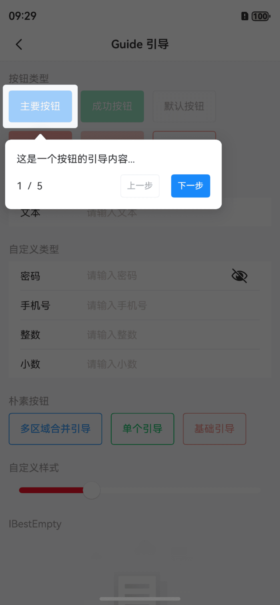
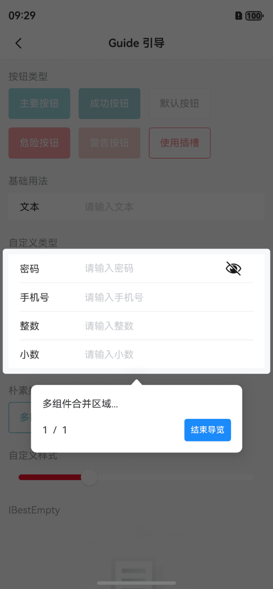

# Guide 引导

## 介绍

用于分步引导用户了解产品功能的气泡组件，用来引导用户并介绍产品。
 
## 引入

```ts
import { IBestGuide } from "@ibestservices/ibest-ui-v2";
```

## 代码演示

### 基础用法

<div style="display: flex;justify-content: space-between;">
  
  
</div>

::: details 点我查看代码
```ts
@Builder function demo(sort: number, total: number, ctl: IBestGuideController) {
  Scroll() {
    Column() {
      Text("这是一个自定义插槽，随便写点什么...")
        .width("100%")
        .padding(12)
        .textAlign(TextAlign.Start)
        .fontColor(Color.Red)
      Row({ space: 16 }) {
        Row({ space: 16 }) {
          Text("第" + sort + "个，共" + total + "个")
            .letterSpacing(2)
            .fontSize(12)
            .fontColor(Color.Green)
        }
        Blank()
        Row({ space: SPACE.LG }) {
          IBestButton({
            text: '上一步',
            type: 'warning',
            buttonSize: 'small',
            fontWeight: FontWeight.Medium,
            onBtnClick: () => {
              if (sort > 1) {
                ctl.prev()
              }
            },
            disabled: sort == 1
          })
          IBestButton({
            text: sort == total ? "结束导览" : "下一步",
            type: 'primary',
            buttonSize: 'small',
            fontWeight: FontWeight.Medium,
            onBtnClick: () => {
              if (sort == total) {
                ctl.close()
              } else {
                ctl.next()
              }
            }
          })
        }
      }
      .padding({ left: 12, right: 12 })
    }
    .padding(12)
  }
  .scrollBar(BarState.Auto)
  .height("auto")
  .constraintSize({ maxHeight: "auto" })
}
@Entry
@ComponentV2
struct DemoPage {
  @Local value: string = ""
  @Local value1: string = ""
  @Local value2: string = ""
  @Local value3: string = ""
  @Local value4: string = ""
  @Local value5: number = 30
  @Local controller: IBestGuideController = new IBestGuideController()
  @Local guideData: Array<IBestGuideItemType> = []
  build() {
    NavDestination() {
      IBestGuide({
        data: this.guideData,
        controller: this.controller
      }) {
        // 以下为页面内容
        CustomNavBar({ title: this.title })
        List() {
          ListItem() {
            ComponentShowContainer({ title: $r("app.string.custom_type", $r("app.string.button")) }) {
              Flex({
                wrap: FlexWrap.Wrap,
                space: { main: LengthMetrics.vp(12), cross: LengthMetrics.vp(12) }
              }) {
                IBestButton({
                  text: $r("app.string.custom_button", $r("app.string.primary")),
                  type: 'primary',
                  disabled: true
                }).id('ibest_guide_button_1')
                IBestButton({
                  text: $r("app.string.custom_button", $r("app.string.success")),
                  type: 'success',
                  disabled: true
                })
                IBestButton({
                  text: $r("app.string.custom_button", $r("app.string.default")),
                  type: 'default',
                  disabled: true
                })
                IBestButton({
                  text: $r("app.string.custom_button", $r("app.string.danger")),
                  type: 'danger',
                  disabled: true
                })
                IBestButton({
                  text: $r("app.string.custom_button", $r("app.string.warning")),
                  type: 'warning',
                  disabled: true
                })
                IBestButton({
                  text: $r('app.string.guid_mixed_use_slots'),
                  plain: true,
                  type: 'warning',
                  onBtnClick: () => {
                    this.guideData = [
                      {
                        componentId: 'ibest_guide_button_1',
                        content: "这是一个按钮的引导内容..."
                      },
                      {
                        componentId: 'ibest_guide_field',
                        content: "这是一个输入框的引导内容..."
                      },
                      {
                        componentId: 'ibest_guide_button_2',
                        content: "这是一个按钮的引导内容..."
                      },
                      {
                        componentId: 'ibest_guide_button_3',
                        content: wrapBuilder(demo),
                        placement: Placement.Top
                      },
                      {
                        componentId: 'ibest_guide_slider',
                        content: "一个滑块??"
                      }
                    ]
                    this.controller.start()
                  }
                })
              }
            }
          }

          ListItem() {
            ComponentShowContainer({ title: '基础用法' }) {
              IBestField({
                value: this.value!!,
                label: "文本",
                placeholder: "请输入文本",
                hasBorder: false
              }).id('ibest_guide_field')
            }
          }

          ListItem() {
            ComponentShowContainer({ title: '自定义类型' }) {
              // 密码
              IBestField({
                value: this.value1!!,
                label: "密码",
                placeholder: "请输入密码",
                type: "password"
              }).id('ibest_guide_form_1')
              // 手机号
              IBestField({
                value: $value2,
                label: "手机号",
                placeholder: "请输入手机号",
                type: "phone"
              })
              // 整数数字
              IBestField({
                value: $value3,
                label: "整数",
                placeholder: "请输入整数",
                type: "number"
              })
              // 小数
              IBestField({
                value: $value4,
                label: "小数",
                hasBorder: false,
                placeholder: "请输入小数",
                type: "decimal",
                decimalLength: 2
              }).id('ibest_guide_form_2')
            }
          }

          ListItem() {
            ComponentShowContainer({ title: $r("app.string.custom_button", $r("app.string.plain")) }) {
              Row({ space: 12 }) {
                IBestButton({
                  text: $r('app.string.guid_merge_rects'),
                  type: 'primary',
                  plain: true,
                  onBtnClick: () => {
                    this.guideData = [
                      {
                        componentId: ['ibest_guide_form_1', 'ibest_guide_form_2'],
                        content: "多组件合并区域..."
                      }
                    ]
                    this.controller.start()
                  }
                }).id('ibest_guide_button_2')
                IBestButton({
                  text: $r('app.string.guid_use_single'),
                  plain: true,
                  type: 'success',
                  onBtnClick: () => {
                    this.guideData = [
                      {
                        componentId: 'ibest_guide_button_1',
                        content: "这是单个引导内容..."
                      }
                    ]
                    this.controller.start()
                  }
                }).id('ibest_guide_button_3')
                IBestButton({
                  text: $r('app.string.guid_basic_usage'),
                  plain: true,
                  type: 'warning',
                  onBtnClick: () => {
                    this.guideData = [
                      {
                        componentId: 'ibest_guide_button_2',
                        content: "这是一个按钮的引导内容..."
                      },
                      {
                        componentId: 'ibest_guide_button_3',
                        content: "这是另一个按钮的引导内容..."
                      }
                    ]
                    this.controller.start()
                  }
                })
              }
            }
          }

          ListItem() {
            ComponentShowContainer({ title: '自定义样式' }) {
              IBestSlider({
                value: $value5,
                barHeight: 8,
                activeColor: "#ee0a24",
                onChange: (val) => {
                  IBestToast.show(val.toString())
                }
              }).id('ibest_guide_slider')
            }
          }

          ListItem().height(50)
        }
        .layoutWeight(1)
        .padding({ left: 12, right: 12 })
      }
    }
    .hideTitleBar(true)
    .backgroundColor("#f5f5f5")
  }
}
```
:::

## API

### @Props

| 参数         | 说明                                 | 类型      | 默认值     |
| ------------ | ----------------------------------- | --------- | ---------- |
| data         | 徽标内容                              | _IBestGuideItemType[]_  | `[]` |
| strictMode   | 严格模式,当引导的元素不在屏幕内时抛出异常| _boolean_ | `true` |
| popupWidth   | 气泡框宽度                             | _string_ \| _number_ | `300` |
| popupHeight  | 气泡框高度                             | _string_ \| _number_ | `auto` |
| popupMaxHeight| 气泡框最大高度                        | _string_ \| _number_ | `auto` |
| bgColor      | 气泡框背景色                           | _ResourceColor_ |  `#fff`  |
| popupCornerRadius| 气泡框圆角                         | _string_ \| _number_ | `8` |
| buttonSpace  | 按钮间距                               | _string_ \| _number_ | `16` |
| messageLineHeight| 内容区域的行高                      | _string_ \| _number_ | `20` |
| messageFontSize| 内容区域的字体大小                    | _string_ \| _number_ | `14` |
| messageFontColor| 内容区域的字体颜色                   | _ResourceColor_ |  `#323232`  |
| previousText | 上一步按钮的文字                        | _ResourceStr_ | `上一步` |
| nextText     | 下一步按钮的文字                        | _ResourceStr_ | `下一步` |
| completeText | 完成按钮的文字                          | _ResourceStr_ | `完成` |
| controller   | 引导控制器                              | _IBestGuideController_ | `-` |

### 插槽

| 插槽名             | 说明               | 类型             |
| ------------------| -------------------| ----------------|
| defaultBuilder    | 默认内容的插槽      | _CustomBuilder_ |

### IBestGuideController API

| 方法名          | 说明           | 参数|
| -------------- | ---------------| ----|
| prev           | 上一步          | `-` | 
| next           | 下一步          | `-` |
| close          | 关闭            | `-` |

## 主题定制

组件提供了下列颜色变量，可用于自定义深色/浅色模式样式，使用方法请参考 [颜色模式](../../guide/color-mode/index.md) 章节，如需要其它颜色变量可提 [issue](https://github.com/ibestservices/ibest-ui/issues)。

| 名称                                       | 描述                              | 默认值        |
| -------------------------------------------|----------------------------------|--------------|
| ibest_guide_text_color                     | 文字颜色                          | `#323233`   |