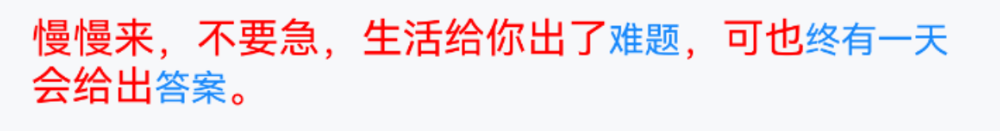

# Highlight 高亮文本

## 介绍

高亮指定文本内容。

## 引入

```ts
import { IBestHighlight } from "@ibestservices/ibest-ui-v2";
```

## 代码演示

### 基础用法


::: details 点我查看代码
```ts
@Entry
@ComponentV2
struct DemoPage {
  build() {
    Column(){
      IBestHighlight({
        keywords: '难题',
        sourceString: '慢慢来，不要急，生活给你出了难题，可也终有一天会给出答案。'
      })
    }
  }
}
```
:::

### 多字符匹配


::: details 点我查看代码
```ts
@Entry
@ComponentV2
struct DemoPage {
  build() {
    Column(){
      IBestHighlight({
        keywords: ['轻量', '深色模式', '鸿蒙'],
        sourceString: $r("app.string.app_desc")  // 换成项目本地资源
      })
    }
  }
}
```
:::

### 设置高亮样式


::: details 点我查看代码
```ts
@Entry
@ComponentV2
struct DemoPage {
  build() {
    Column(){
      IBestHighlight({
        keywords: ['难题', '终有一天', '答案'],
        sourceString: '慢慢来，不要急，生活给你出了难题，可也终有一天会给出答案。',
        highLightColor: Color.Red,
        highLightFontSize: 30
      })
    }
  }
}
```
:::

### 设置默认样式



::: details 点我查看代码
```ts
@Entry
@ComponentV2
struct DemoPage {
  build() {
    Column(){
      IBestHighlight({
        keywords: ['难题', '终有一天', '答案'],
        sourceString: '慢慢来，不要急，生活给你出了难题，可也终有一天会给出答案。',
        textColor: Color.Red,
        textFontSize: 16
      })
    }
  }
}
```
:::

## API

### @Props

| 参数           | 说明                                | 类型       | 默认值     |
| --------------| ----------------------------------- | --------- | ---------- |
| sourceString  | 源文本                               | _ResourceStr_ | `''` |
| keywords      | 高亮关键字                            | _ResourceStr_ \| _ResourceStr[]_ \| _IBestHighlightKeywords[]_ | `''` |
| autoEscape    | 是否自动转义                          | _boolean_ | `true` |  
| caseSensitive | 是否区分大小写                        | _boolean_ | `false` |  
| textColor     | 文字颜色                              | _ResourceColor_ |  `#969799`  |
| highLightColor| 高亮文字颜色                           | _ResourceColor_ |  `#1989fa`  |
| textFontSize  | 文字大小                              | _string_ \| _number_ |  `14`  |
| highLightFontSize| 高亮文字大小                        | _string_ \| _number_ |  `14`  |
| maxLines      | 最大行数                              | _number_ |  `-`  |
| overflow      | 超出隐藏                              | _TextOverflow_ |  `None`  |

### IBestHighlightKeywords 数据结构
| 参数       | 说明      | 类型 |
| ----------| ---------| --------- |
| text      | 关键字    | _ResourceStr_ |
| color     | 关键字颜色 | _ResourceColor_ |
| fontSize  | 关键字大小 | _string_ \| _number_ |

### Events

| 事件名          | 说明                                             | 事件类型                         |
| ---------------| ------------------------------------------------ | -------------------------------- |
| onKeywordClick <span style="font-size: 12px; padding:2px 4px;color:#3D8AF2;border-radius:4px;border: 1px solid #3D8AF2">1.0.3</span>| 高亮词点击事件                                    | `(text: string) => void` |