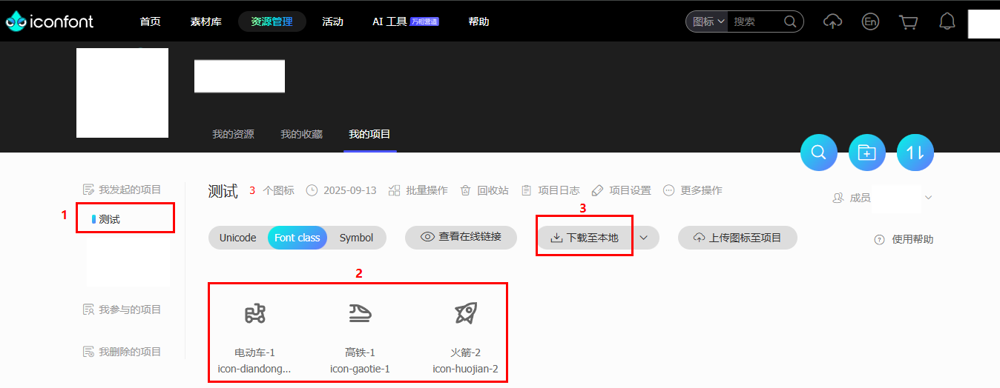
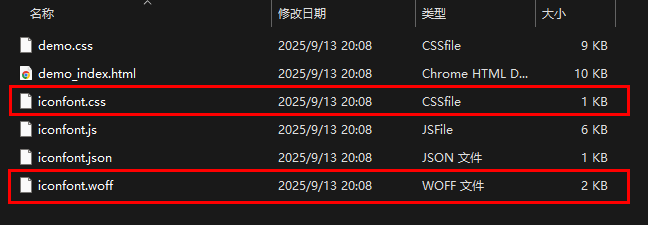
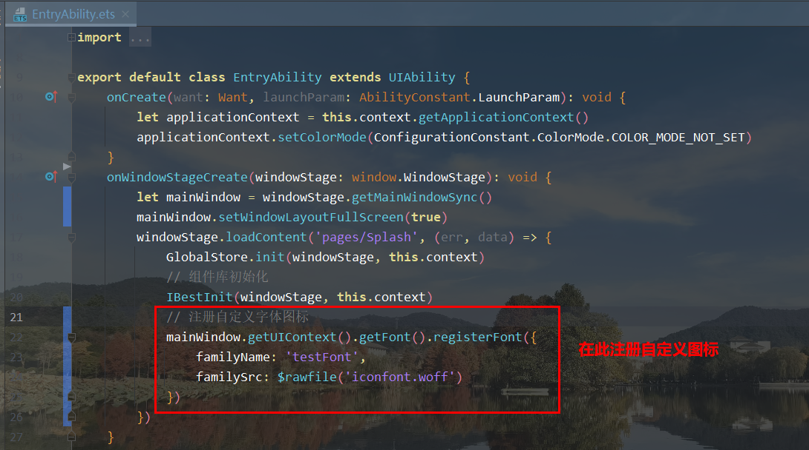
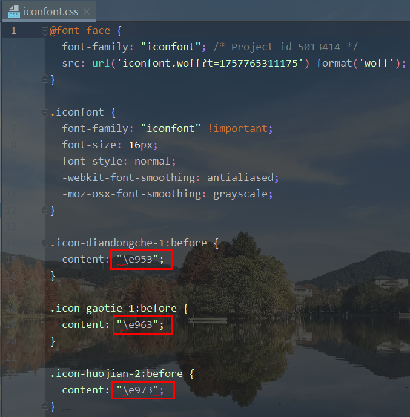

<script setup>
  import Collection from "./components/Collection.vue"
</script>
# Icon 图标

## 介绍

基于字体的图标集，可以通过 IBestIcon 组件使用。
 
## 引入

```ts
import { IBestIcon } from "@ibestservices/ibest-ui-v2";
```

## 代码演示

### 基础用法


::: details 点我查看代码
```ts
@Entry
@ComponentV2
struct DemoPage {
  build() {
    Column(){
      IBestIcon({ name: 'like' })
    }
  }
}
```
:::

### 自定义颜色


::: details 点我查看代码
```ts
@Entry
@ComponentV2
struct DemoPage {
  build() {
    Row({space: 20}){
      IBestIcon({ name: 'cart-o', color: '#1989fa' })
      IBestIcon({ name: 'fire-o', color: '#ee0a24' })
    }
  }
}
```
:::

### 自定义大小


::: details 点我查看代码
```ts
@Entry
@ComponentV2
struct DemoPage {
  build() {
    Row({space: 20}){
      IBestIcon({ name: 'chat-o', iconSize: 20 })
      IBestIcon({ name: 'chat-o', iconSize: 40 })
    }
  }
}
```
:::

### 使用自定义图标


:::tip
以使用 <a href="https://www.iconfont.cn/" target="_blank">iconfont</a> 图标为例。
:::

#### 步骤1
在 <a href="https://www.iconfont.cn/" target="_blank">iconfont</a> 网站选择图标后下载，打开文件夹，重点关注 iconfont.woff 和 iconfont.css 文件。





#### 步骤2
将 `iconfont.woff` 文件复制到项目目录下 `entry/src/main/resources/rawfile`, 并在 `entryability` 中<a href="https://developer.huawei.com/consumer/cn/doc/harmonyos-faqs/faqs-arkui-216" target="_blank">全局注册字体</a>。



#### 步骤3
在 `IBestIcon` 组件中传入上一步骤中的定义的 `familyName` 和 `iconfont.css` 文件中的 `unicode`。
:::tip
注意，`iconfont.css` 中的 `unicode` 需在`\`后手动添加字符串`u`才能正确展示。
:::



::: details 点我查看代码
```ts
@Entry
@ComponentV2
struct DemoPage {
  build() {
    Row({space: 20}){
      // \ue953 为自定义图标的unicode编码
      IBestIcon({ fontName: "testFont", name: "\ue953" })
      IBestIcon({ fontName: "testFont", name: "\ue963" })
      IBestIcon({ fontName: "testFont", name: "\ue973" })
    }
  }
}
```
:::

## 图标合集(点击可复制名称)
<Collection/>

## API

### @Props

| 参数         | 说明                                 | 类型      | 默认值     |
| ------------| -------------------------------------| ---------| ---------- |
| name        | 图标名称、unicode 编码、图片链接, 图标名称可参考上方图标合集| _ResourceStr_  | `''` |
| color       | 图标颜色                              | _ResourceColor_ |  `''`  |
| iconSize    | 图标大小                              | _string_ \| _number_ | `16` |
| iconRadius  | 图标圆角                              | _string_ \| _number_ | `0` |
| fontName <span style="font-size: 12px; padding:2px 4px;color:#3D8AF2;border-radius:4px;border: 1px solid #3D8AF2">1.0.3</span>| 自定义字体图标名称 | _ResourceStr_ | `''` |
| iconAnimation <span style="font-size: 12px; padding:2px 4px;color:#3D8AF2;border-radius:4px;border: 1px solid #3D8AF2">1.0.4</span>| 图标动画                            | _AnimateParam_ | `-` |

### Events

| 事件名       | 说明                     | 事件类型                         |
| ----------  | ------------------------ | -------------------------------- |
| onIconClick | 点击图标时的回调函数        | `() => void` |