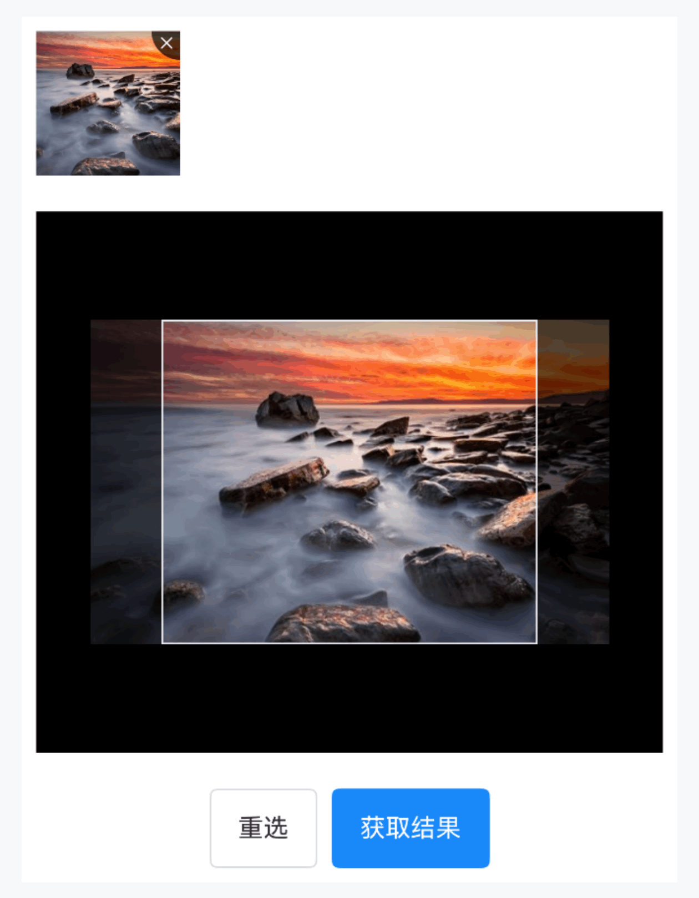
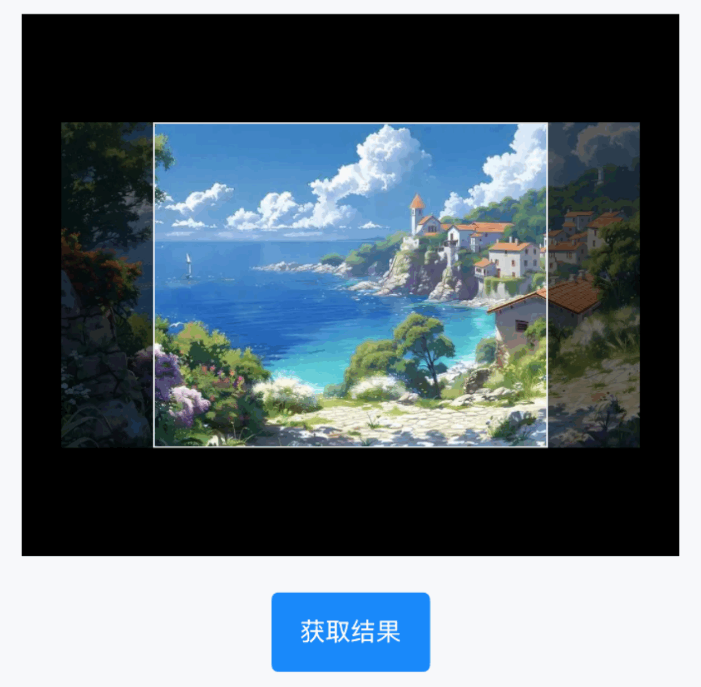
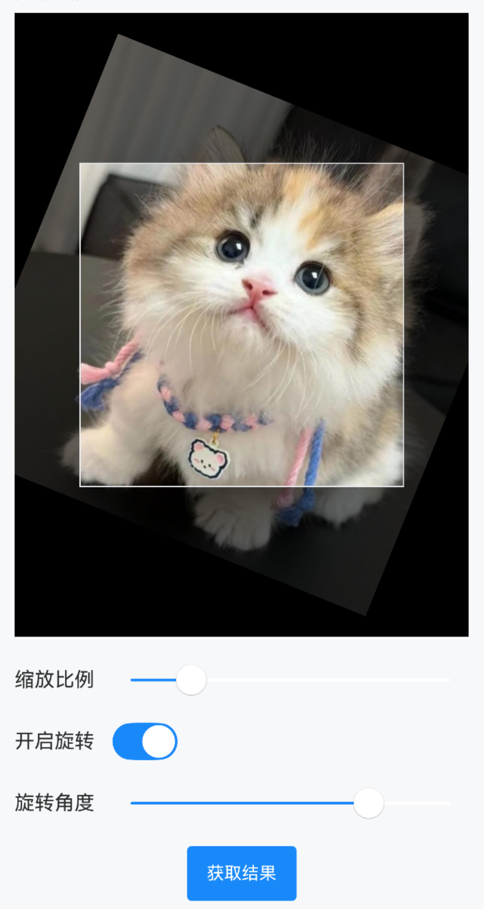
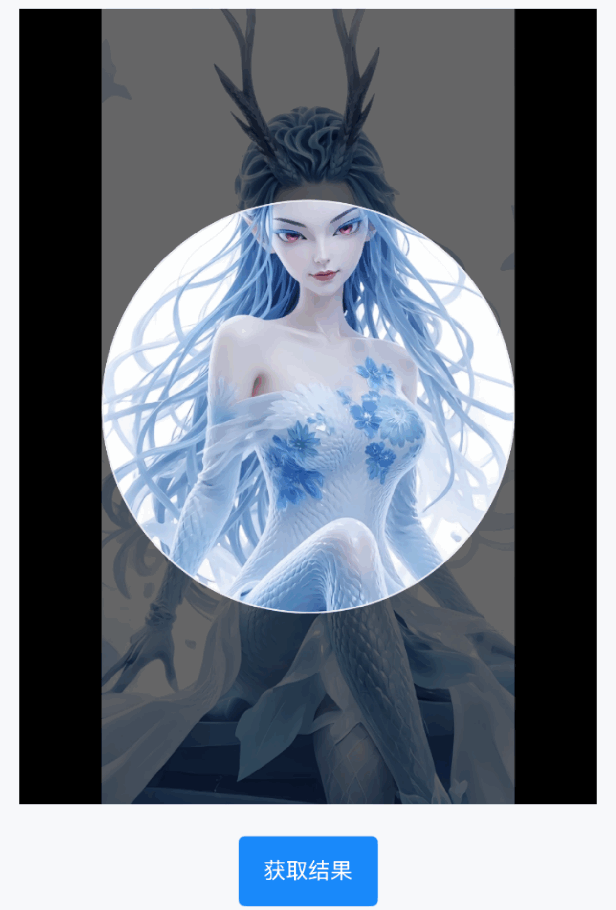

# ImageCropper 图片裁剪

## 介绍

用于头像截取、图片裁剪。
 
## 引入

```ts
import { IBestImageCropper, IBestImageCropperController } from "@ibestservices/ibest-ui-v2";
```

## 代码演示

### 基础用法


:::tip
通过传入 `url` 属性，即可截取图片。
:::

::: details 点我查看代码
```ts
import { IBestDialogUtil } from "@ibestservices/ibest-ui-v2"
@Entry
@ComponentV2
struct DemoPage {
  @Local imgList: IBestUploaderFile[] = []
  @Local initImg: string = ""
  private controller: IBestImageCropperController = new IBestImageCropperController()
  @Local previewUrl: PixelMap | string = ''
  @Builder imgBuilder() {
    Column() {
      Image(this.previewUrl)
        .width(260)
    }
    .padding(30)
  }
  showResult() {
    IBestDialogUtil.open({
      title: "截取结果",
      defaultBuilder: (): void => this.imgBuilder()
    })
  }
  build(){
    Column({ space: 20 }) {
      IBestUploader({
        fileList: this.imgList!!,
        max: 1,
        onChange: (fileList: IBestUploaderFile[]) => {
          this.initImg = fileList[0].previewUri || ""
        }
      })
      IBestImageCropper({
        componentHeight: 300,
        url: this.initImg,
        controller: this.controller
      })
      Row({space: 20}){
        IBestButton({
          text: "重选",
          onBtnClick: () => {
            this.imgList = []
          }
        })
        IBestButton({
          type: "primary",
          text: "获取结果",
          onBtnClick: () => {
            this.controller.getResult().then(res => {
              this.previewUrl = res
              this.showResult()
            })
          }
        })
      }.visibility(this.imgList.length ? Visibility.Visible : Visibility.None)
    }.padding(20).backgroundColor("#fff")
  }
}
```
:::

### 在线图片


:::tip
`url` 属性支持 `在线图片` 、`base64` 、`file协议` 格式。
:::

::: details 点我查看代码
```ts
import { IBestDialogUtil } from "@ibestservices/ibest-ui-v2"
@Entry
@ComponentV2
struct DemoPage {
  @Local initImg: string = "https://img0.baidu.com/it/u=3217812679,2585737758&fm=253&fmt=auto&app=138&f=JPEG?w=889&h=500"
  private controller: IBestImageCropperController = new IBestImageCropperController()
  @Local previewUrl: PixelMap | string = ''
  @Builder imgBuilder() {
    Column() {
      Image(this.previewUrl)
        .width(260)
    }
    .padding(30)
  }
  showResult() {
    IBestDialogUtil.open({
      title: "截取结果",
      defaultBuilder: (): void => this.imgBuilder()
    })
  }
  build(){
    Column({ space: 20 }) {
      IBestImageCropper({
        componentHeight: 300,
        url: this.initImg,
        controller: this.controller
      })
      IBestButton({
        type: "primary",
        text: "获取结果",
        onBtnClick: () => {
          this.controller.getResult(res => {
            this.previewUrl = res
            this.showResult()
          })
        }
      })
    }
  }
}
```
:::

### 其他操作



::: details 点我查看代码
```ts
import { IBestDialogUtil } from "@ibestservices/ibest-ui-v2"
@Entry
@ComponentV2
struct DemoPage {
  @Local initImg: string = "https://img1.baidu.com/it/u=404530833,1472694862&fm=253&fmt=auto&app=138&f=JPEG?w=800&h=800"
  @Local curScale: number = 1
  @Local enableRotate: boolean = false
  @Local curAngle: number = 0
  private controller: IBestImageCropperController = new IBestImageCropperController()
  @Local previewUrl: PixelMap | string = ''
  @Builder imgBuilder() {
    Column() {
      Image(this.previewUrl)
        .width(260)
    }
    .padding(30)
  }
  showResult() {
    IBestDialogUtil.open({
      title: "截取结果",
      defaultBuilder: (): void => this.imgBuilder()
    })
  }
  build(){
    Column({ space: 20 }) {
      IBestImageCropper({
        componentHeight: 500,
        url: this.initImg,
        centerWidth: 260,
        centerHeight: 260,
        maxScale: 3,
        enableRotate: this.enableRotate,
        maxAngle: 45,
        controller: this.controller
      })
      Row({ space: 14 }){
        Text("缩放比例")
        Row(){
          IBestSlider({
            value: this.curScale!!,
            min: 1,
            max: 3,
            step: 0.01,
            onChange: (value) => {
              this.controller.setScale(value as number)
            }
          })
        }.layoutWeight(1)
      }
      Row({ space: 14 }){
        Text("开启旋转")
        IBestSwitch({
          value: this.enableRotate!!,
          onChange: () => {
            this.curAngle = 0
          }
        })
      }.width("100%")
      Row({ space: 14 }){
        Text("旋转角度")
        Row() {
          IBestSlider({
            value: this.curAngle!!,
            min: -45,
            max: 45,
            step: 1,
            onChange: (value) => {
              this.controller.setAngle(value as number)
            }
          })
        }.layoutWeight(1)
      }
      .visibility(this.enableRotate ? Visibility.Visible : Visibility.None)
      IBestButton({
        type: "primary",
        text: "获取结果",
        onBtnClick: () => {
          this.controller.getResult(res => {
            this.previewUrl = res
            this.showResult()
          })
        }
      })
    }
  }
}
```
:::

### 自定义样式



::: details 点我查看代码
```ts
import { IBestDialogUtil } from "@ibestservices/ibest-ui-v2"
@Entry
@ComponentV2
struct DemoPage {
  @Local initImg: ResourceStr = $r("app.media.01")  // 此处替换为自己项目本地图片
  private controller: IBestImageCropperController = new IBestImageCropperController()
  @Local previewUrl: PixelMap | string = ''
  @Builder imgBuilder() {
    Column() {
      Image(this.previewUrl)
        .width(260)
    }
    .padding(30)
  }
  showResult() {
    IBestDialogUtil.open({
      title: "截取结果",
      defaultBuilder: (): void => this.imgBuilder()
    })
  }
  build(){
    Column({ space: 20 }) {
      IBestImageCropper({
        componentHeight: 500,
        url: this.initImg,
        controller: this.controller,
        shape: 'circle',
        centerWidth: 260
      })
      IBestButton({
        type: "primary",
        text: "获取结果",
        onBtnClick: async () => {
          this.previewUrl = await this.controller.getResult()
          this.showResult()
        }
      })
    }
  }
}
```
:::

## API

### @Props

| 参数             | 说明                               | 类型       | 默认值      |
| ----------------| -----------------------------------| ----------| -----------|
| componentWidth  | 组件宽度                            | _string_ \| _number_  | `100%` |
| componentHeight | 组件高度                            | _string_ \| _number_   | `100%` |
| bgColor         | 背景色                              | _ResourceColor_ |  `#000`  |
| url             | 需要裁剪的图片路径, 支持 `在线图片` `base64` `file协议` 格式。 | _ResourceStr_ | `''` |
| shape           | 裁剪形状, 可选值 `rect` `circle`     | _string_        | `rect` |
| maskColor       | 蒙层颜色                            | _ResourceColor_ | `rgba(0,0,0,0.6)` |
| centerWidth     | 裁剪区域宽度或直径                    | _string_ \| _number_  | `60%` |
| centerHeight    | 裁剪区域高度, 仅当 `shape` 为 `rect` 时有效| _string_ \| _number_ | `60%` |
| showBorder      | 是否显示裁剪区域边框                  | _boolean_   | `true` |
| bdColor         | 裁剪区域边框颜色                      | _ResourceColor_ | #ebedf0` |
| maxScale        | 最大缩放比例                         | _number_   | `2` |
| controller      | 组件实例控制器                        | _IBestImageCropperController_ | `-`  |
| enableRotate <span style="font-size: 12px; padding:2px 4px;color:#3D8AF2;border-radius:4px;border: 1px solid #3D8AF2">1.0.3</span>| 是否开启旋转, 开启后不可移动 | _boolean_ | `false` |
| maxAngle <span style="font-size: 12px; padding:2px 4px;color:#3D8AF2;border-radius:4px;border: 1px solid #3D8AF2">1.0.3</span>| 旋转最大角度, 默认180°, 即顺时针最大180°, 逆时针最大180° | _number_ | `180` |

### IBestImageCropperController 实例方法

| 方法名      | 说明            | 参数                |   返回值    |
| ---------- | ----------------| --------------------|------------|
| getResult  | 获取截取结果     |  `callBack?: (result: PixelMap) => void`  | `Promise<PixelMap>` |
| setScale <span style="font-size: 12px; padding:2px 4px;color:#3D8AF2;border-radius:4px;border: 1px solid #3D8AF2">1.0.3</span>| 设置缩放比例  | `scale: number`| `void` |
| setAngle <span style="font-size: 12px; padding:2px 4px;color:#3D8AF2;border-radius:4px;border: 1px solid #3D8AF2">1.0.3</span>| 设置旋转角度  | `angle: number`| `void` |
| reset <span style="font-size: 12px; padding:2px 4px;color:#3D8AF2;border-radius:4px;border: 1px solid #3D8AF2">1.0.3</span>| 重置 | `-` | `void` |