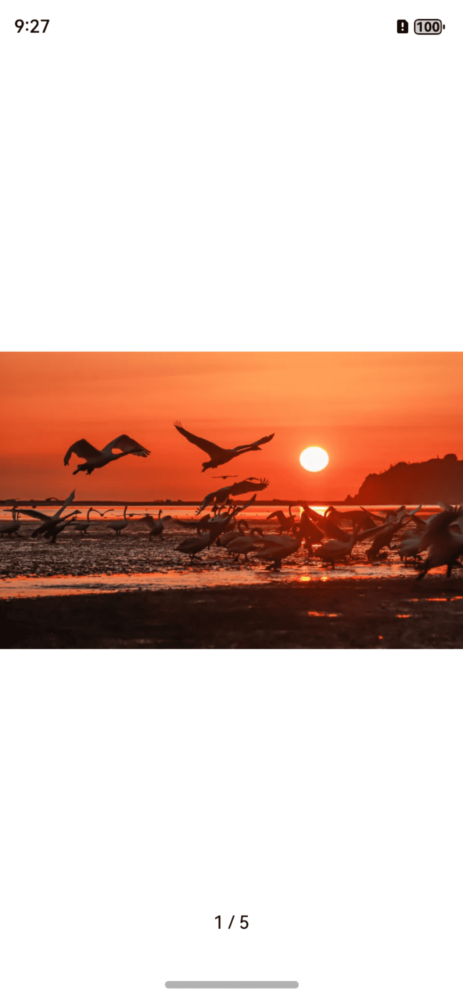
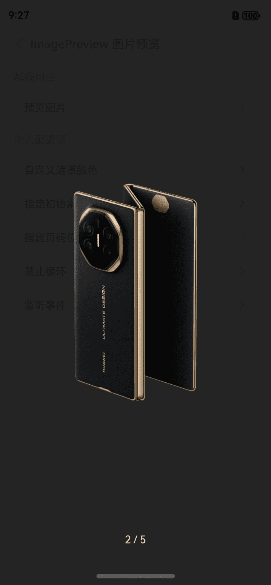

# ImagePreview 图片预览

## 介绍

图片放大预览。
 
## 引入

```ts
import { IBestImagePreview } from "@ibestservices/ibest-ui-v2";
```

## 代码演示

### 基础用法


::: details 点我查看代码
```ts
@Entry
@ComponentV2
struct DemoPage {
  @Local imageList: string[] = [
    "https://inews.gtimg.com/om_bt/Os3eJ8u3SgB3Kd-zrRRhgfR5hUvdwcVPKUTNO6O7sZfUwAA/641",
    "https://res1.vmallres.com/pimages/uomcdn/CN/pms/202409/gbom/6942103136221/800_800_333848611DC0B1FC64909F87CD048F2Cmp.png",
    "https://view.horsevision.cn/huataivr/static/images/longImage/%E9%AB%98%E9%A2%9D%E5%9B%9E%E6%8A%A5%E9%9C%80%E8%AD%A6%E6%83%95%EF%BC%8C%E5%88%87%E5%8B%BF%E8%90%BD%E5%85%A5%E2%80%9C%E5%BA%9E%E6%B0%8F%E9%AA%97%E5%B1%80%E2%80%9D.jpg",
    "https://img2.baidu.com/it/u=3121938960,3659852204&fm=253&fmt=auto&app=120&f=JPEG?w=500&h=500",
    "https://img2.baidu.com/it/u=1602275124,393968357&fm=253&fmt=auto&app=138&f=JPEG?w=889&h=500"
  ]
  build() {
    Column(){
      IBestCellGroup({ inset: true }) {
        IBestCell({
          title: '预览图片',
          isLink: true,
          hasBorder: false,
          onCellClick: () => {
            IBestImagePreview.show(this.imageList)
          }
        })
      }
    }
  }
}
```
:::

### 自定义遮罩颜色



::: details 点我查看代码
```ts
@Entry
@ComponentV2
struct DemoPage {
  @Local imageList: string[] = [
    "https://inews.gtimg.com/om_bt/Os3eJ8u3SgB3Kd-zrRRhgfR5hUvdwcVPKUTNO6O7sZfUwAA/641",
    "https://res1.vmallres.com/pimages/uomcdn/CN/pms/202409/gbom/6942103136221/800_800_333848611DC0B1FC64909F87CD048F2Cmp.png",
    "https://view.horsevision.cn/huataivr/static/images/longImage/%E9%AB%98%E9%A2%9D%E5%9B%9E%E6%8A%A5%E9%9C%80%E8%AD%A6%E6%83%95%EF%BC%8C%E5%88%87%E5%8B%BF%E8%90%BD%E5%85%A5%E2%80%9C%E5%BA%9E%E6%B0%8F%E9%AA%97%E5%B1%80%E2%80%9D.jpg",
    "https://img2.baidu.com/it/u=3121938960,3659852204&fm=253&fmt=auto&app=120&f=JPEG?w=500&h=500",
    "https://img2.baidu.com/it/u=1602275124,393968357&fm=253&fmt=auto&app=138&f=JPEG?w=889&h=500"
  ]
  build() {
    Column(){
      IBestCellGroup({ inset: true }) {
        IBestCell({
          title: '预览图片',
          isLink: true,
          hasBorder: false,
          onCellClick: () => {
            IBestImagePreview.show(this.imageList, {
              maskColor: '#fff',
              indexFontColor: "#000"
            })
          }
        })
      }
    }
  }
}
```
:::

### 指定初始索引



::: details 点我查看代码
```ts
@Entry
@ComponentV2
struct DemoPage {
  @Local imageList: string[] = [
    "https://inews.gtimg.com/om_bt/Os3eJ8u3SgB3Kd-zrRRhgfR5hUvdwcVPKUTNO6O7sZfUwAA/641",
    "https://res1.vmallres.com/pimages/uomcdn/CN/pms/202409/gbom/6942103136221/800_800_333848611DC0B1FC64909F87CD048F2Cmp.png",
    "https://view.horsevision.cn/huataivr/static/images/longImage/%E9%AB%98%E9%A2%9D%E5%9B%9E%E6%8A%A5%E9%9C%80%E8%AD%A6%E6%83%95%EF%BC%8C%E5%88%87%E5%8B%BF%E8%90%BD%E5%85%A5%E2%80%9C%E5%BA%9E%E6%B0%8F%E9%AA%97%E5%B1%80%E2%80%9D.jpg",
    "https://img2.baidu.com/it/u=3121938960,3659852204&fm=253&fmt=auto&app=120&f=JPEG?w=500&h=500",
    "https://img2.baidu.com/it/u=1602275124,393968357&fm=253&fmt=auto&app=138&f=JPEG?w=889&h=500"
  ]
  build() {
    Column(){
      IBestCellGroup({ inset: true }) {
        IBestCell({
          title: '预览图片',
          isLink: true,
          hasBorder: false,
          onCellClick: () => {
            IBestImagePreview.show(this.imageList, {
              startIndex: 1
            })
          }
        })
      }
    }
  }
}
```
:::

### 指定页码位置


::: details 点我查看代码
```ts
@Entry
@ComponentV2
struct DemoPage {
  @Local imageList: string[] = [
    "https://inews.gtimg.com/om_bt/Os3eJ8u3SgB3Kd-zrRRhgfR5hUvdwcVPKUTNO6O7sZfUwAA/641",
    "https://res1.vmallres.com/pimages/uomcdn/CN/pms/202409/gbom/6942103136221/800_800_333848611DC0B1FC64909F87CD048F2Cmp.png",
    "https://view.horsevision.cn/huataivr/static/images/longImage/%E9%AB%98%E9%A2%9D%E5%9B%9E%E6%8A%A5%E9%9C%80%E8%AD%A6%E6%83%95%EF%BC%8C%E5%88%87%E5%8B%BF%E8%90%BD%E5%85%A5%E2%80%9C%E5%BA%9E%E6%B0%8F%E9%AA%97%E5%B1%80%E2%80%9D.jpg",
    "https://img2.baidu.com/it/u=3121938960,3659852204&fm=253&fmt=auto&app=120&f=JPEG?w=500&h=500",
    "https://img2.baidu.com/it/u=1602275124,393968357&fm=253&fmt=auto&app=138&f=JPEG?w=889&h=500"
  ]
  build() {
    Column(){
      IBestCellGroup({ inset: true }) {
        IBestCell({
          title: '预览图片',
          isLink: true,
          hasBorder: false,
          onCellClick: () => {
            IBestImagePreview.show(this.imageList, {
              indexPosition: 'top'
            })
          }
        })
      }
    }
  }
}
```
:::


## API

### @Props

| 参数         | 说明                                          | 类型      | 默认值     |
| ------------ | ---------------------------------------------| --------- | ---------- |
| list         | 要预览的图片列表                                | _(<a href="https://developer.huawei.com/consumer/cn/doc/harmonyos-references-V5/js-apis-image-V5#pixelmap7" target="__blank">PixelMap</a> \| <a href="https://developer.huawei.com/consumer/cn/doc/harmonyos-references-V5/ts-types-V5#resourcestr" target="__blank">ResourceStr</a> \| <a href="https://developer.huawei.com/consumer/cn/doc/harmonyos-references-V5/js-apis-arkui-drawabledescriptor-V5#drawabledescriptor" target="__blank">DrawableDescriptor</a>)[]_ | `[]` |
| maskColor    | 遮罩背景色                                     | _ResourceColor_  | `rgba(24,24,25,0.95)` |
| startIndex   | 指定初始显示的图片索引                           | _number_ |  `0`  |
| swipeDuration| 切换动画时长                                    | _number_ | `200` |
| showIndex    | 是否显示页码, 当只有一张图片时默认不显示            | _boolean_ | `true` |
| indexPosition| 页码位置                                       | _'top' \| 'bottom'_ | `bottom` |
| indexOffset  | 页码距离顶部或底部距离                           | _number_ | `52` |
| indexFontColor| 页码字体颜色                                   | _ResourceColor_ | `#fff` |
| indexFontSize| 页码字体大小                                    | _number_ | `14` |
| loop         | 是否循环                                        | _boolean_ |  `true`  |
| doubleScale  | 是否启用双击缩放手势，禁用后，点击时会立即关闭图片预    | _boolean_ |  `true`  |
| closeOnClickOverlay | 是否在点击遮罩层后关闭图片预览               | _boolean_ |  `true`  |
| closeOnClickImage | 是否在点击图片后关闭图片预览                   | _boolean_ |  `true`  |
| maxScale     | 最大缩放比例                                     | _number_ |  `3`  |
| minScale     | 最小缩放比例                                     | _number_ |  `1`  |
| onImgClick   | 点击图片回调, 需设置 `closeOnClickImage` 属性为false  | _(index: number) => void_ | `-` |
| onImgLongPress| 长按图片回调                                    | _(index: number) => void_ | `-`