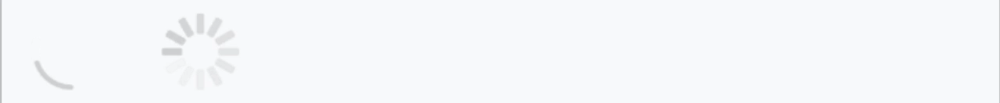
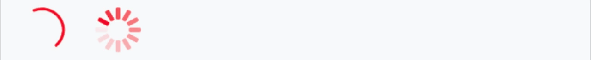
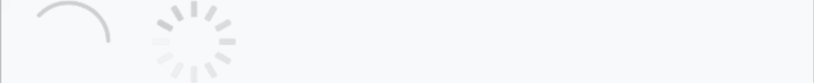
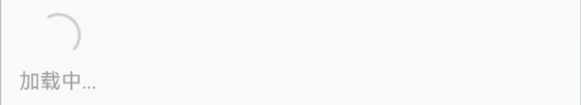
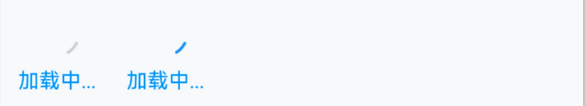

# Loading 加载

## 介绍

加载图标，用于表示加载中的过渡状态。

## 引入

```ts
import { IBestLoading } from "@ibestservices/ibest-ui-v2";
```

## 代码演示

### 加载类型


::: tip
通过 `loadingIconType` 属性可以设置加载图标的类型，默认为 `circular`，可选值为 `spinner`。
:::

::: details 点我查看代码
```ts
@Entry
@Component
struct DemoPage {
  build() {
    Row({space: 20}) {
      IBestLoading()
      IBestLoading({
        loadingIconType: "spinner"
      })
    }
  }
}
```
:::

### 自定义颜色


::: tip
通过 `loadingColor` 属性设置加载图标的颜色。
:::

::: details 点我查看代码
```ts
@Entry
@Component
struct DemoPage {
  build() {
    Row({space: 20}) {
      IBestLoading({
        loadingColor: "rgb(25, 137, 250)",
      })
      IBestLoading({
        loadingColor: "rgb(25, 137, 250)",
        loadingIconType: "spinner",
      })
    }
  }
}
```
:::

### 自定义大小


::: tip
通过 `loadingSize` 属性设置加载图标的大小，默认值为 `60px` 。
:::

::: details 点我查看代码
```ts
@Entry
@Component
struct DemoPage {
  build() {
    Row({space: 20}) {
      IBestLoading({
        loadingSize: 40
      })
      IBestLoading({
        loadingSize: 40,
        loadingIconType: "spinner"
      })
    }
  }
}
```
:::

### 加载文案


::: tip
可以使用 `loadingText` 属性在图标的下方插入加载文案。
:::

::: details 点我查看代码
```ts
@Entry
@Component
struct DemoPage {
  build() {
    Column(){
      IBestLoading({
        loadingText: "加载中..."
      })
    }
  }
}
```
:::

### 水平排列


::: tip
设置 `vertical` 属性为 `false` 后，图标和文案会垂直排列。
:::

::: details 点我查看代码
```ts
@Entry
@Component
struct DemoPage {
  build() {
    Column(){
      IBestLoading({
        loadingText: "加载中...",
        vertical: false
      })
    }
  }
}
```
:::

### 自定义文本颜色


::: tip
通过 `loadingTextColor` 属性设置加载文案的颜色。
:::

::: details 点我查看代码
```ts
@Entry
@Component
struct DemoPage {
  build() {
    Column(){
      IBestLoading({
        loadingText: "加载中...",
        loadingColor: "rgb(25, 137, 250)",
        loadingTextColor: "rgb(25, 137, 250)"
      })
      IBestLoading({
        loadingText: "加载中...",
        loadingTextColor: "rgb(25, 137, 250)"
      })
    }
  }
}
```
:::

### 包含内容


::: tip
通过 `defaultBuilder` 传入自定义内容
:::

::: details 点我查看代码
```ts
import { IBestEmpty } from '@ibestservices/ibest-ui'
@Entry
@Component
struct LoadingPage {
  @Builder EmptyContain() {
    IBestEmpty()
  }
  build(){
    Column(){
      IBestLoading({
        defaultBuilder: (): void => this.EmptyContain(),
        loadingMaskColor: 'rgba(0,0,0,0.5)',
        loadingColor: 'rgb(25, 137, 250)'
      })
    }
  }
}
```
:::

## API

### @Props

| 参数   | 说明          | 类型                  | 默认值    |
| ----- | --------------| -------------------- | -------- |
| loadingIconType       | 类型，可选值为 `spinner`| _string_   | `circular`   |
| loadingText           | 加载的文案              | _ResourceStr_  |   `''`   |
| loadingSize           | 加载图标大小            | _number_ \| _string_   |  `30`    |
| loadingColor          | loading 的颜色         | _ResourceColor_ | `#c8c9cc` |
| loadingTextColor      | loading 的文字颜色      | _ResourceColor_ | `#c8c9cc` |
| loadingTextFontSize   | loading 的文字内容大小   | _number_ \| _string_ | `14`    |
| loadingStrokeWidth    | loading 图形的线条宽度   | _Length_    | `2`  |
| loadingMaskColor      | loading 的遮罩颜色      | _ResourceColor_| `transparent`  |
| loadingIconMarginTop  | loading 的图标距离顶部的 `margin` 因为默认 `loading` 是垂直居中布局的 可通过该属性调整`loading` 图标的上下位置 只有在 `vertical` 为 `true` 即垂直布局时有效 | _string_ \| _number_   | `0`   |
| loadingTextMarginLeft | `loadingText` 的 `marginLeft` 值 只有在 `vertical` 为 `false` 即水平布局时有效     | _string_ \| _number_   | `8`  |
| loadingTextMarginTop  | `loadingText` 的 `marginTop` 值 只有在 `vertical` 为 `true` 即垂直布局时有效       | _string_ \| _number_   | `8`  |
| spinnerStrokeHeight   | `spinner` 图的每条线的长度 | _string_ \| _number_   | `8` |
| vertical              | 是否垂直排列图标和文字内容   | _boolean_   | `false` |

### 插槽

| 插槽名             | 说明                     | 类型                      |
| ------------------ | ------------------------ | ------------------------- |
| defaultBuilder     | `loading` 包裹的组件插槽 | _CustomBuilder_  |
| loadingIconBuilder | `loading` 的图标插槽     | _CustomBuilder_  |
| loadingTextBuilder | `loading` 的文案插槽     | _CustomBuilder_ |