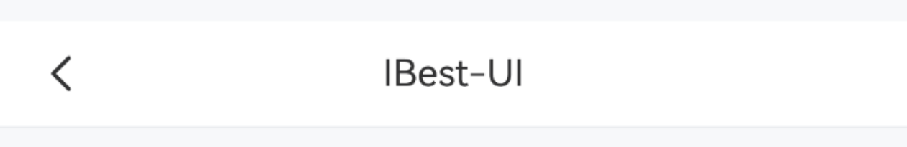
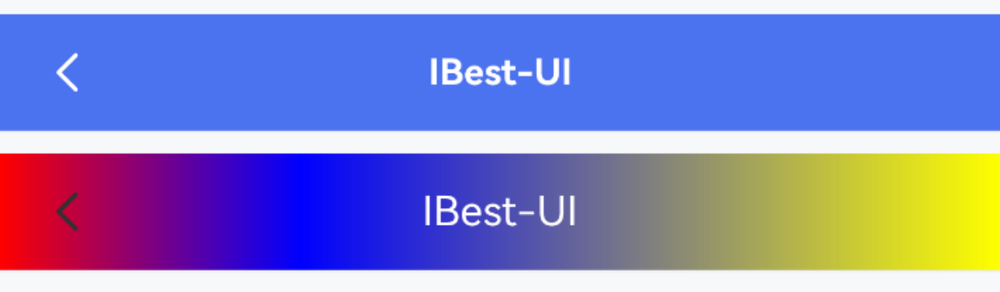
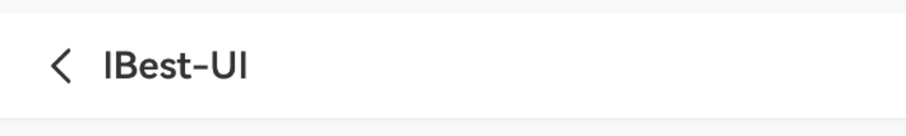
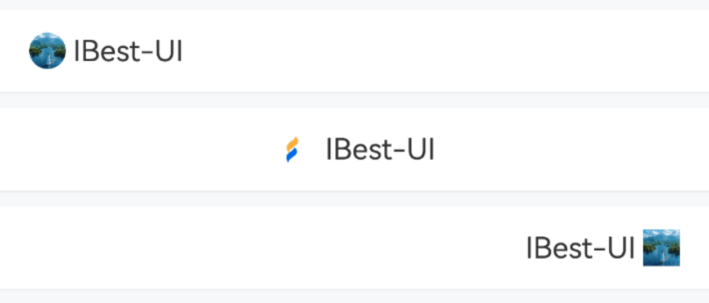
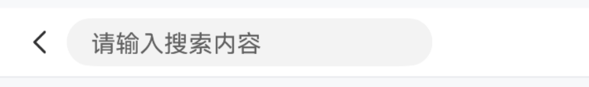
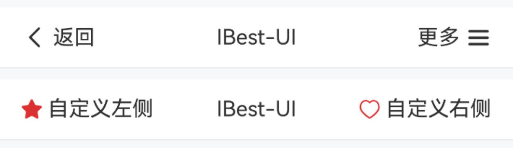
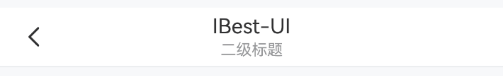
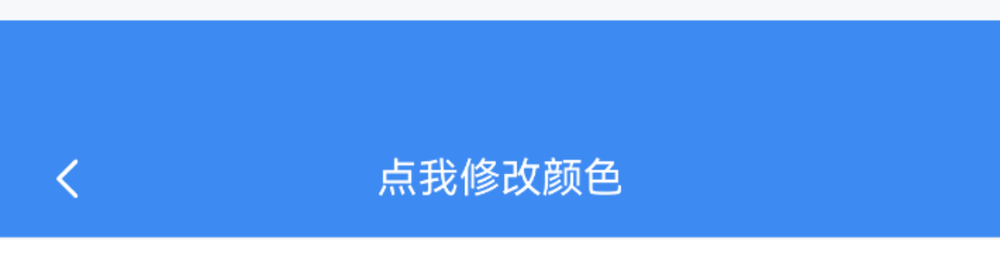

# NavBar 导航栏

## 介绍

为页面提供导航功能，常用于页面顶部。

## 引入

```ts
import { IBestNavBar } from "@ibestservices/ibest-ui-v2";
```

## 代码演示

### 基础用法



::: details 点我查看代码
```ts
@Entry
@ComponentV2
struct DemoPage {
  build() {
    Column(){
      IBestNavBar({
        title: "IBest-UI"
      })
    }
  }
}
```
:::

### 自定义样式



::: details 点我查看代码
```ts
@Entry
@ComponentV2
struct DemoPage {
  build() {
    Column({space: 14}){
      IBestNavBar({
        title: "IBest-UI",
        titleColor: "#fff",
        titleFontSize: 14,
        titleFontWeight: FontWeight.Bold,
        navBarBgColor: "#476ce3",
        leftIconColor: "#fff"
      })
      IBestNavBar({
        title: "IBest-UI",
        titleColor: "#fff",
        bgLinearGradient: {
          angle: 90,
          colors: [[0xff0000, 0.0], [0x0000ff, 0.3], [0xffff00, 1.0]]
        }
      })
    }
  }
}
```
:::

### 标题居左



::: details 点我查看代码
```ts
@Entry
@ComponentV2
struct DemoPage {
  build() {
    Column(){
      IBestNavBar({
        title: "IBest-UI",
        titleTextAlign: "left"
      })
    }
  }
}
```
:::

### 自定义显示区域



::: details 点我查看代码
```ts
@Entry
@ComponentV2
struct DemoPage {
  build() {
    Column({space: 14}){
      IBestNavBar({
        leftIcon: "https://img1.baidu.com/it/u=498751481,2849377151&fm=253&fmt=auto&app=138&f=JPEG?w=800&h=800",
        leftLabel: "IBest-UI",
        leftIconRadius: 999
      })
      IBestNavBar({
        isShowLeft: false,
        title: "IBest-UI",
        titleIcon: $r("app.media.app_icon"),
      })
      IBestNavBar({
        isShowLeft: false,
        isShowRight: true,
        rightIcon: "https://img1.baidu.com/it/u=498751481,2849377151&fm=253&fmt=auto&app=138&f=JPEG?w=800&h=800",
        rightLabel: "IBest-UI"
      })
    }
  }
}
```
:::

### 自定义标题内容



::: details 点我查看代码
```ts
@Entry
@ComponentV2
struct DemoPage {
  @Builder titleBuilder(){
		TextInput({text: this.searchVal, placeholder: "请输入搜索内容"}).width("70%").height("70%")
	}
  build() {
    Column(){
      IBestNavBar({
        titleBuilder: (): void => this.titleBuilder()
      })
    }
  }
}
```
:::

### 自定义左右内容



::: details 点我查看代码
```ts
@Entry
@ComponentV2
struct DemoPage {
  @Builder leftBuilder(){
		Row({space: 14}){
			Image($r("app.media.icon_star_o"))
				.width(16)
			Text("自定义左侧")
		}
	}
	@Builder rightBuilder(){
		Row({space: 14}){
			Image($r("app.media.icon_like"))
				.width(16)
			Text("自定义右侧")
		}
	}
  build() {
    Column({space: 14}) {
      IBestNavBar({
        title: "IBest-UI",
        leftLabel: "返回",
        isShowRight: true,
        rightIcon: "wap-nav",
        rightLabel: "更多"
      })
      IBestNavBar({
        title: "IBest-UI",
        leftBuilder: (): void => this.leftBuilder(),
        isShowRight: true,
        rightBuilder: (): void => this.rightBuilder()
      })
    }
  }
}
```
:::

### 二级标题



::: details 点我查看代码
```ts
@Entry
@ComponentV2
struct DemoPage {
  build() {
    Column(){
      IBestNavBar({
        title: "IBest-UI",
        subTitle: "一套轻量、可定制化主题的鸿蒙UI组件库"
      })
    }
  }
}
```
:::

### 显示状态栏



::: details 点我查看代码
```ts
@Entry
@ComponentV2
struct DemoPage {
  @Local navBarBgColor: string = "#3D8AF2"
  getRandomColor(): string {
    return '#' + Math.floor(Math.random()*16777215).toString(16).padStart(6, '0')
  }
  build() {
    Column(){
      IBestNavBar({
        title: "点我修改颜色",
        titleColor: "#fff",
        leftIconColor: "#fff",
        navBarBgColor: this.navBarBgColor,
        isShowStatusBar: true,
        onTitleClick: () => {
          this.navBarBgColor = this.getRandomColor()
        }
      })
    }
  }
}
```
:::

## API

### @Props

| 参数          | 说明                                  | 类型            | 默认值      |
| ------------ | -------------------------------------| -------------- | -----------|
| navBarHeight | 导航栏高度                             | _string_ \| _number_  | `46` |
| navBarBgColor| 导航栏背景颜色                          | _ResourceColor_ | `#fff`    |
| bgLinearGradient| 导航栏渐变背景色, 优先级高于navBarBgColor| _<a href="https://developer.huawei.com/consumer/cn/doc/harmonyos-references-V13/ts-universal-attributes-gradient-color-V13#lineargradient" target="__blank">LinearGradient</a>_ | `-` |
| leftRightPadding| 导航栏左右内边距                      | _number_ | `16` |
| isShowBorder | 是否显示下边框线                         | _boolean_ | `true` |
| title        | 标题文字                                | _ResourceStr_ | `''` |  
| titleColor   | 标题文字颜色                             | _ResourceColor_ | `#323233` |
| titleFontSize| 标题文字大小                             | _string_ \| _number_ | `16` |
| titleIcon    | 标题图标                                | _ResourceStr_ | `''` |
| titleIconColor| 标题图标颜色                            | _ResourceColor_ | `#323233` |
| titleIconSize| 标题图标大小                             | _string_ \| _number_ | `20` |
| titleIconRadius| 标题图标圆角                           | _string_ \| _number_ | `0` |
| titleFontWeight| 标题字重                               | _FontWeight_ | `600` |
| subTitle     | 副标题文字                               | _ResourceStr_ | `''` |
| subTitleColor| 副标题文字颜色                            | _ResourceColor_ | `#969799` |
| subTitleFontSize| 副标题文字大小                         | _string_ \| _number_ | `12` |
| isShowLeft   | 是否显示左侧内容                          | _boolean_ | `true` |
| leftIcon     | 自定义左侧图标                            | _ResourceStr_ | `arrow-left` |
| leftIconColor| 左侧图标颜色                              | _ResourceColor_ | `#323233` |
| leftIconSize| 左侧图标大小                               | _string_ \| _number_ | `20` |
| leftIconRadius| 左侧图标圆角                             | _string_ \| _number_ | `0` |
| leftLabel    |  左侧文字                                | _ResourceStr_ | `''` |
| leftLabelColor| 左侧文字颜色                             | _ResourceColor_ | `#323233` |
| leftLabelFontSize| 左侧文字大小                          | _string_ \| _number_ | `16` |
| isShowRight  | 是否显示右侧                              | _boolean_ | `false` |
| rightIcon    | 自定义右侧图标                             | _ResourceStr_ | `''` |
| rightIconColor | 右侧图标颜色                             | _ResourceColor_ | `#323233` |
| rightIconSize | 右侧图标大小                              | _string_ \| _number_ | `20` |
| rightIconRadius| 右侧图标圆角                             | _string_ \| _number_ | `0` |
| rightLabel | 右侧文字                                    | _ResourceStr_ | `''` |
| rightLabelColor| 右侧文字颜色                             | _ResourceColor_ | `#323233` |
| rightLabelFontSize| 右侧文字大小                          | _string_ \| _number_ | `16` |
| isShowStatusBar | 是否显示状态栏                          | _boolean_ | `false` |
| statusBarBgColor | 状态栏背景色, 默认与导航栏背景色一致       | _ResourceColor_ | `#fff` |
| isKeepBgColorSame | 是否保持与导航栏背景色一致，默认为是，即状态栏背景色会跟随导航栏背景色变化 | _boolean_ | `true` |
| titleTextAlign| 标题文字对齐方式, 可选值 `left` `center`   | _string_ | `center` |
| expandSafeAreaType  | 导航栏扩展区域类型                   | _SafeAreaType[]_ | `[SafeAreaType.SYSTEM, SafeAreaType.CUTOUT]` |

### Events

| 事件名        | 说明                      | 事件类型        |
| ------------ | --------------------------| -------------- |
| onLeftClick  | 点击左侧内容区域回调        | `() => void` |
| onRightClick | 点击右侧内容区域回调        | `() => void` |
| onTitleClick | 点击标题区域回调           | `() => void` |

### 插槽

| 插槽名        | 说明             | 类型            |
| -------------| ----------------| ----------------|
| leftBuilder  | 自定义左侧内容    | _CustomBuilder_ |
| rightBuilder | 自定义右侧内容    | _CustomBuilder_ |
| titleBuilder | 自定义标题内容    | _CustomBuilder_ |


## 主题定制

组件提供了下列颜色变量，可用于自定义深色/浅色模式样式，使用方法请参考 [颜色模式](../../guide/color-mode/index.md) 章节，如需要其它颜色变量可提 [issue](https://github.com/ibestservices/ibest-ui/issues)。

| 名称                                       | 描述                              | 默认值        |
| -------------------------------------------|----------------------------------|--------------|
| ibest_navbar_background                    | 标题栏背景色                      | `#fff`   |
| ibest_navbar_sub_title_text_color          | 副标题文字颜色                    | `#969799`|
| ibest_navbar_border_color                  | 边框颜色                          | `#ebedf0` |