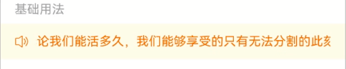
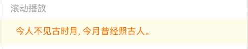
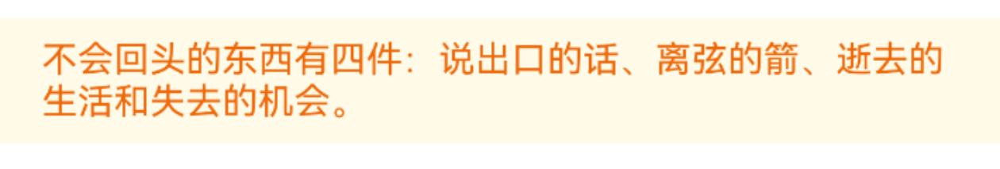
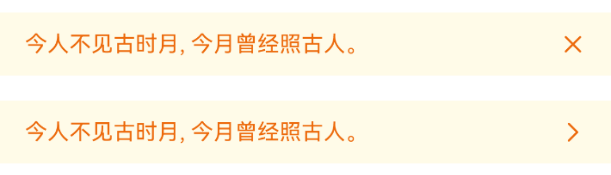
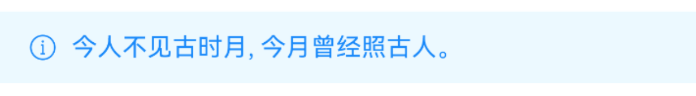
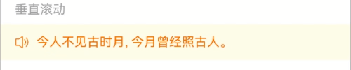

# NoticeBar 通知栏

## 介绍

用于循环播放展示一组消息通知。
 
## 引入

```ts
import { IBestNoticeBar } from "@ibestservices/ibest-ui-v2";
```

## 代码演示

### 基础用法



::: details 点我查看代码
```ts
@Entry
@ComponentV2
struct DemoPage {
  build() {
    Column(){
      IBestNoticeBar({
        leftIcon: "volume-o",
        text:"无论我们能活多久，我们能够享受的只有无法分割的此刻，此外别无其他。"
      })
    }
  }
}
```
:::

### 滚动播放


:::tip
默认情况下, 只有字数超出容器宽度才会滚动播放，如字数少也需要滚动播放，可设置 `scrollable` 为 `true`。
:::

::: details 点我查看代码
```ts
@Entry
@ComponentV2
struct DemoPage {
  build() {
    Column({space: 16}){
      IBestNoticeBar({
        scrollable: true,
        text: "今人不见古时月, 今月曾经照古人。"
      })
      IBestNoticeBar({
        scrollable: false,
        text: "不会回头的东西有四件：说出口的话、离弦的箭、逝去的生活和失去的机会。"
      })
    }
  }
}
```
:::

### 多行展示



::: details 点我查看代码
```ts
@Entry
@ComponentV2
struct DemoPage {
  build() {
    Column(){
      IBestNoticeBar({
        text: "不会回头的东西有四件：说出口的话、离弦的箭、逝去的生活和失去的机会。",
        wrapable: true
      })
    }
  }
}
```
:::

### 通知栏模式



::: details 点我查看代码
```ts
@Entry
@ComponentV2
struct DemoPage {
  build() {
    Column({space: 16}){
      IBestNoticeBar({
        mode: "closeable",
        text: "今人不见古时月, 今月曾经照古人。"
      })
      IBestNoticeBar({
        mode: "link",
        text: "今人不见古时月, 今月曾经照古人。",
        onBarClick: () => {
          console.log("点击了通知栏")
        }
      })
    }
  }
}
```
:::

### 自定义样式



::: details 点我查看代码
```ts
@Entry
@ComponentV2
struct DemoPage {
  build() {
    Column(){
      IBestNoticeBar({
        leftIcon: "info-o",
        leftIconColor: "#1989fa",
        bgColor: "#ecf9ff",
        text: "今人不见古时月, 今月曾经照古人。",
        textColor: "#1989fa"
      })
    }
  }
}
```
:::

### 垂直滚动



::: details 点我查看代码
```ts
@Entry
@ComponentV2
struct DemoPage {
  build() {
    Column(){
      IBestNoticeBar({
        leftIcon: "volume-o",
        vertical: true,
        verticalTextList: [
            "今人不见古时月, 今月曾经照古人。",
          "不会回头的东西有四件：说出口的话、离弦的箭、逝去的生活和失去的机会。",
          "无论我们能活多久，我们能够享受的只有无法分割的此刻，此外别无其他。"
        ]
      })
    }
  }
}
```
:::


## API

### @Props

| 参数         | 说明                                 | 类型      | 默认值     |
| ------------ | ----------------------------------- | --------- | ---------- |
| text         | 通知栏文本内容                         | _string_ | `''` |  
| mode         | 通知栏模式, 可选值 `closeable` `link`  | _string_  | `-` |
| barHeight    | 通知栏高度                            | _string_ \| _number_ | `40` |
| bgColor      | 背景色                                | _ResourceColor_ | `#fffbe8` |
| leftRightPadding| 左右内边距                          | _string_ \| _number_ | `16` |
| leftIcon     | 自定义左侧图标                         | _ResourceStr_ |  `''`  |
| leftIconSize | 左侧图标大小                           | _string_ \| _number_ | `16` |
| leftIconColor| 左侧图标颜色                           | _ResourceColor_ | `#ed6a0c` |
| textColor    | 文本颜色                              | _ResourceColor_ | `#ed6a0c` |
| textFontSize | 文本字体大小                           | _string_ \| _number_ | `16` |
| rightIcon    | 自定义右侧图标                         | _ResourceStr_ |  `''`  |
| rightIconSize | 右侧图标大小                          | _string_ \| _number_ | `16` |
| rightIconColor | 右侧图标颜色                         | _ResourceColor_ | `#ed6a0c` |
| scrollable   | 是否开启滚动播放，内容长度溢出时默认开启    | _boolean_ | `` |
| delay        | 滚动播放延迟时间，单位秒                  | _number_ | `1` |
| speed        | 滚动播放速度，单位 vp/s                  | _number_ | `60` |
| wrapable     | 是否开启换行, 为true时滚动不生效          | _boolean_ | `false` |
| vertical     | 是否开启垂直滚动                         | _boolean_ | `false` |
| verticalTextList | 垂直滚动文本列表                     | _string[]_ | `[]` |
| verticalInterval | 垂直滚动文本间隔时间，单位秒           | _number_ | `3` |

### Events

| 事件名     | 说明                            | 回调参数                         |
| ---------- | ------------------------------| --------------------------------|
| onBarClick | 点击通知栏回调                   | `-` |
| onClose    | 点击右侧关闭图标回调              | `-` |
| onTextClick | 垂直滚动时,点击文字回调          | `index: number` |