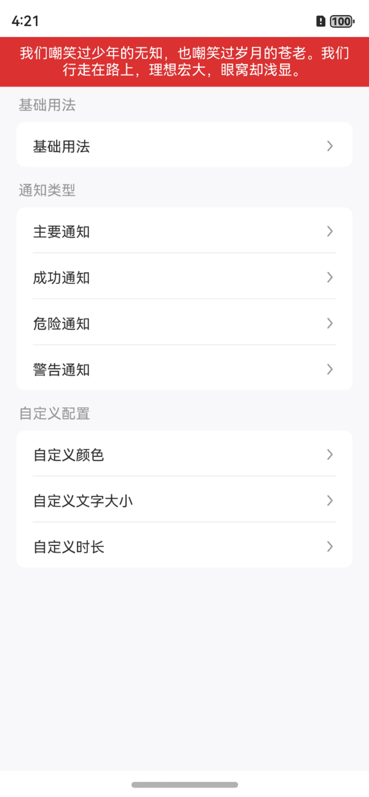
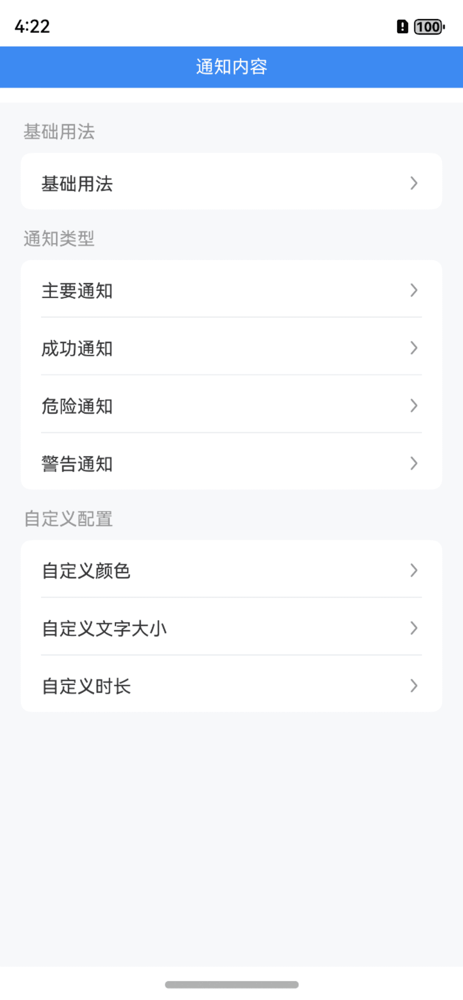
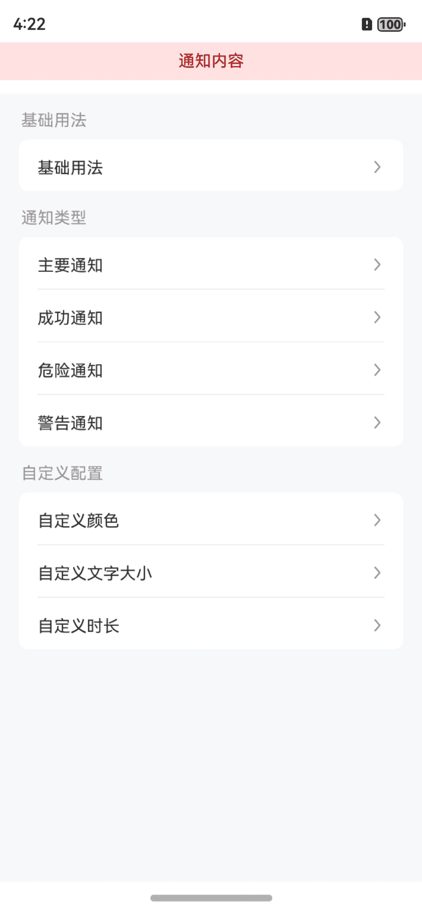
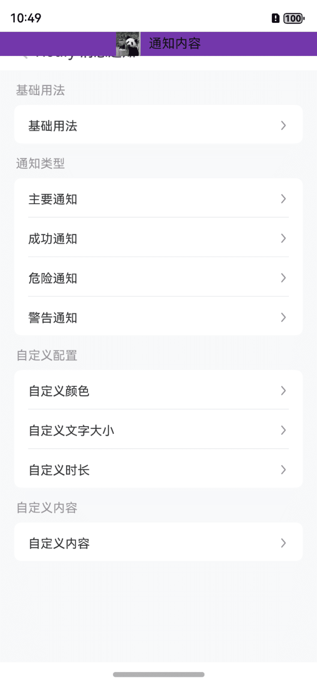

# Notify 消息提示

## 介绍

在页面顶部展示消息提示。
 
## 引入

```ts
import { IBestNotify } from "@ibestservices/ibest-ui-v2";
```

## 代码演示

### 基础用法



::: details 点我查看代码
```ts
@Entry
@ComponentV2
struct DemoPage {
  build() {
    Column(){
      IBestCell({
        title: '基础用法',
        isLink: true,
        hasBorder: false,
        onCellClick: () => {
          IBestNotify.show({
            message: '我们嘲笑过少年的无知，也嘲笑过岁月的苍老。我们行走在路上，理想宏大，眼窝却浅显。'
          })
        }
      })
    }
  }
}
```
:::

### 通知类型


:::tip
通过 `type` 属性可指定通知类型, 支持 `primary` `success` `warning` `danger` 四种, 默认为 `danger`。
:::

::: details 点我查看代码
```ts
@Entry
@ComponentV2
struct DemoPage {
  build() {
    Column(){
      IBestCell({
        title: '通知类型',
        isLink: true,
        hasBorder: false,
        onCellClick: () => {
          IBestNotify.show({
            message: '我们嘲笑过少年的无知，也嘲笑过岁月的苍老。我们行走在路上，理想宏大，眼窝却浅显。',
            type: 'primary'
          })
        }
      })
    }
  }
}
```
:::

### 自定义配置


:::tip
自定义消息通知的颜色、字体大小和展示时长。
:::

::: details 点我查看代码
```ts
@Entry
@ComponentV2
struct DemoPage {
  build() {
    Column(){
      IBestCell({
        title: '自定义配置',
        isLink: true,
        onCellClick: () => {
          IBestNotify.show({
            message: '通知内容',
            color: '#ad0000',
            backgroundColor: '#ffe1e1'
          })
        }
      })
      IBestCell({
        title: '自定义文字大小',
        isLink: true,
        onCellClick: () => {
          IBestNotify.show({
            message: '如果你爱上了某个星球的一朵花。那么，只要在夜晚仰望星空，就会觉得漫天的繁星就像一朵朵盛开的花。',
            fontSize: 34
          })
        }
      })
      IBestCell({
        title: '自定义时长',
        isLink: true,
        hasBorder: false,
        onCellClick: () => {
          IBestNotify.show({
            message: '通知内容',
            duration: 3000
          })
        }
      })
    }
  }
}
```
:::

### 自定义内容



::: details 点我查看代码
```ts
@Entry
@ComponentV2
struct DemoPage {
  @Builder customContent(){
		Row({space: 10}){
			Image("https://img0.baidu.com/it/u=2616823501,3205478532&fm=253&fmt=auto&app=138&f=JPEG?w=509&h=500")
				.width(30)
			Text("通知内容")
		}
		.width("100%")
		.backgroundColor("#7337ab")
		.justifyContent(FlexAlign.Center)
	}
  build() {
    Column(){
      IBestCell({
        title: '自定义内容',
        isLink: true,
        onCellClick: () => {
          IBestNotify.show({
            customContent: (): void => this.customContent()
          })
        }
      })
    }
  }
}
```
:::


## API

### IBestNotifyOption 数据结构

| 参数         | 说明                                         | 类型      | 默认值     |
| ------------| ---------------------------------------------| --------- | ---------- |
| message     | 通知内容                                      | _string_  | `''` |
| type        | 通知背景类型, 可选 `primary` `success` `warning` `danger` | _string_  | `danger` |
| duration    | 显示时长                                      | _number_  |  `1500`  |
| color       | 文字颜色                                      | _ResourceColor_ | `#fff` |
| fontSize    | 文字大小                                       | _string_ \| _number_ |  `14`  |
| backgroundColor| 自定义背景颜色                               | _ResourceColor_ | `''` |
| customContent| 自定义通知内容                                 | _CustomBuilder_ |  `-`  |
| onOpen      | 通知显示后触发                                  | _() => void_ |  `-`  |
| onClose     | 通知关闭后触发                                  | _() => void_ |  `-`  |
| onClick     | 点击通知时触发                                  | _() => void_ |  `-`  |