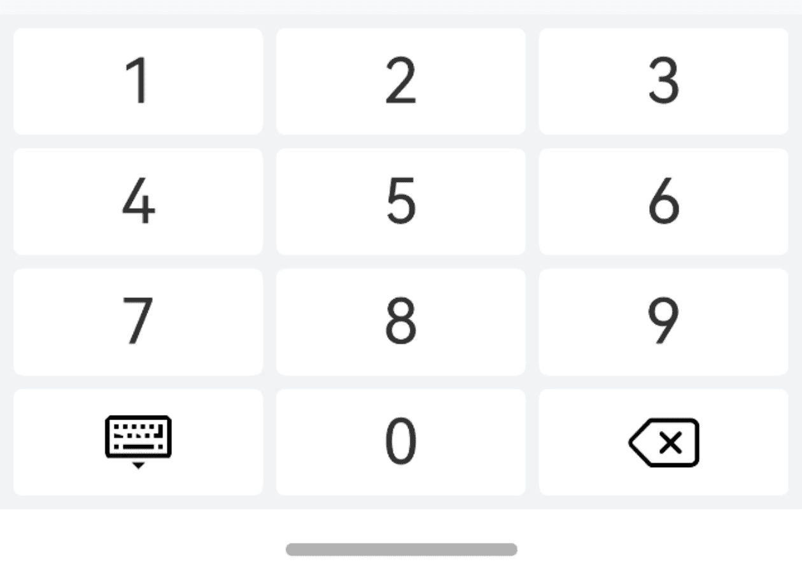
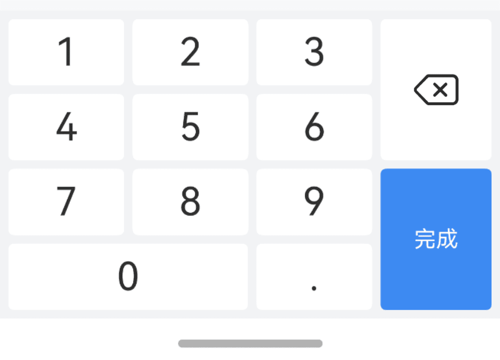
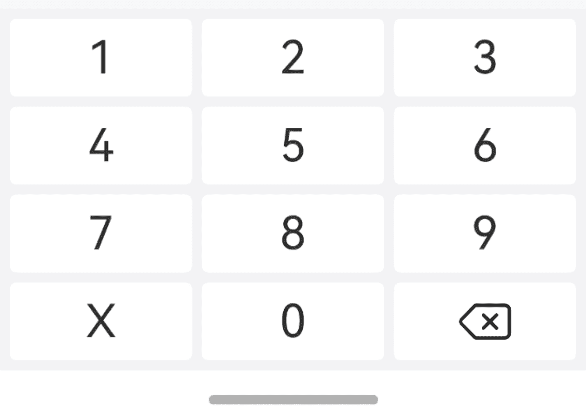
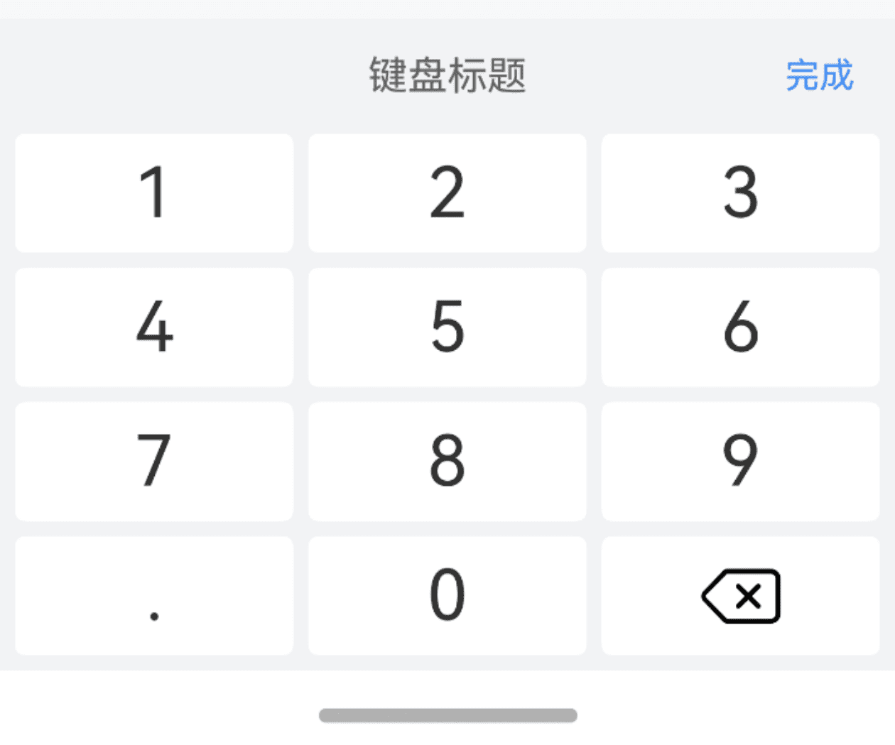
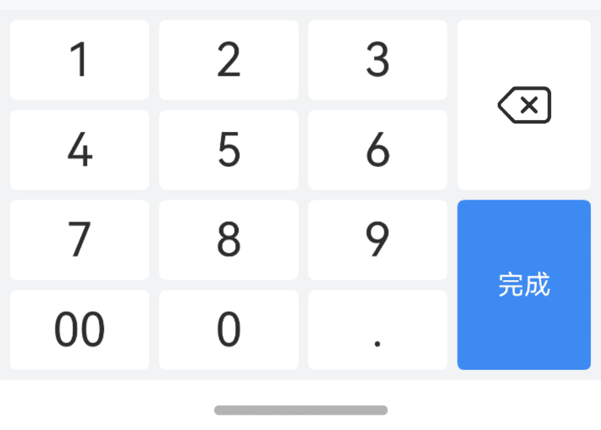
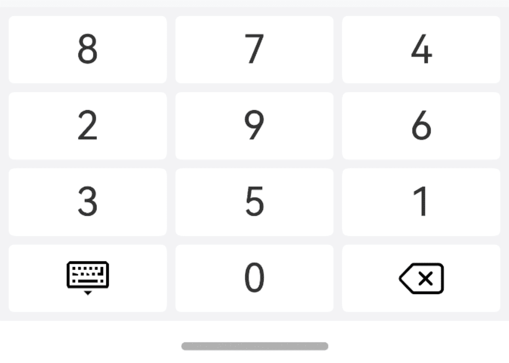
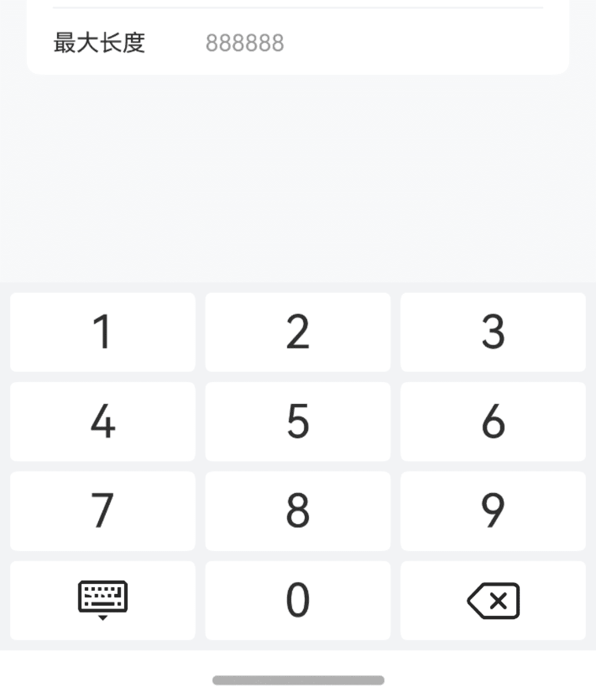

# NumberKeyboard 数字键盘

## 介绍

虚拟数字键盘，可以配合密码输入框组件或自定义的输入框组件使用。
 
## 引入

```ts
import { IBestNumberKeyboard } from "@ibestservices/ibest-ui-v2";
```

## 代码演示

### 基础用法



::: details 点我查看代码
```ts
import { IBestCellGroup, IBestCell } from "@ibestservices/ibest-ui-v2"
@Entry
@ComponentV2
struct DemoPage {
  @Local visible: boolean = false
  @Local value: string = ''
  build() {
    Column(){
      IBestCellGroup({ inset: true }) {
        IBestCell({
          title: "默认键盘",
          value: this.value,
          clickable: true,
          onCellClick: () => {
            this.visible = true
          }
        })
      }
      IBestNumberKeyboard({
        visible: this.visible!!,
        value: this.value!!,
        onInput: (value: string) => {
          console.log("输入：" + value)
        },
        onDelete: () => {
          console.log("删除")
        },
        onClose: () => {
          console.log("关闭")
        }
      })
    }
  }
}
```
:::

### 带右侧栏的键盘



::: details 点我查看代码
```ts
import { IBestCellGroup, IBestCell } from "@ibestservices/ibest-ui-v2"
@Entry
@ComponentV2
struct DemoPage {
  @Local visible: boolean = false
  @Local value: string = ''
  build() {
    Column(){
      IBestCellGroup({ inset: true }) {
        IBestCell({
          title: "带右侧栏的键盘",
          value: this.value,
          clickable: true,
          onCellClick: () => {
            this.visible = true
          }
        })
      }
      IBestNumberKeyboard({
        visible: this.visible!!,
        value: this.value!!,
        styleType: "custom",
        extraKey: ".",
        closeBtnText: "完成"
      })
    }
  }
}
```
:::

### 身份证号键盘



::: details 点我查看代码
```ts
import { IBestCellGroup, IBestCell } from "@ibestservices/ibest-ui-v2"
@Entry
@ComponentV2
struct DemoPage {
  @Local visible: boolean = false
  @Local value: string = ''
  build() {
    Column(){
      IBestCellGroup({ inset: true }) {
        IBestCell({
          title: "身份证号键盘",
          value: this.value,
          clickable: true,
          onCellClick: () => {
            this.visible = true
          }
        })
      }
      IBestNumberKeyboard({
        visible: this.visible!!,
        value: this.value!!,
        extraKey: "X"
      })
    }
  }
}
```
:::

### 带标题的键盘


:::tip
通过 `title` 属性可以设置键盘标题, 为空时不显示标题栏。
:::

::: details 点我查看代码
```ts
import { IBestCellGroup, IBestCell } from "@ibestservices/ibest-ui-v2"
@Entry
@ComponentV2
struct DemoPage {
  @Local visible: boolean = false
  @Local value: string = ''
  build() {
    Column(){
      IBestCellGroup({ inset: true }) {
        IBestCell({
          title: "带标题的键盘",
          value: this.value,
          clickable: true,
          onCellClick: () => {
            this.visible = true
          }
        })
      }
      IBestNumberKeyboard({
        visible: this.visible!!,
        value: this.value!!,
        title: "键盘标题",
        extraKey: "."
      })
    }
  }
}
```
:::

### 配置多个按键的键盘


:::tip
当 `styleType` 为 `custom` 时，支持以数组的形式配置两个 extraKey。
:::

::: details 点我查看代码
```ts
import { IBestCellGroup, IBestCell } from "@ibestservices/ibest-ui-v2"
@Entry
@ComponentV2
struct DemoPage {
  @Local visible: boolean = false
  @Local value: string = ''
  build() {
    Column(){
      IBestCellGroup({ inset: true }) {
        IBestCell({
          title: "配置多个按键的键盘",
          value: this.value,
          clickable: true,
          onCellClick: () => {
            this.visible = true
          }
        })
      }
      IBestNumberKeyboard({
        visible: this.visible!!,
        value: this.value!!,
        deleteButtonText: "删除",
        styleType: "custom",
        extraKey: ["00", "."],
        closeBtnText: "确定"
      })
    }
  }
}
```
:::

### 配置随机数字的键盘



::: details 点我查看代码
```ts
import { IBestCellGroup, IBestCell } from "@ibestservices/ibest-ui-v2"
@Entry
@ComponentV2
struct DemoPage {
  @Local visible: boolean = false
  @Local value: string = ''
  build() {
    Column(){
      IBestCellGroup({ inset: true }) {
        IBestCell({
          title: "配置随机数字的键盘",
          value: this.value,
          clickable: true,
          onCellClick: () => {
            this.visible = true
          }
        })
      }
      IBestNumberKeyboard({
        visible: this.visible!!,
        value: this.value!!,
        isRandomKeyOrder: true
      })
    }
  }
}
```
:::

### 最大长度



::: details 点我查看代码
```ts
import { IBestCellGroup, IBestField } from "@ibestservices/ibest-ui-v2"
@Entry
@ComponentV2
struct DemoPage {
  @Local visible: boolean = false
  @Local value: string = ''
  build() {
    Column(){
      IBestCellGroup({ inset: true }) {
        IBestCell({
          title: '最大长度',
          value: this.value || "点此输入",
          clickable: true,
          hasBorder: false,
          onCellClick: () => {
            this.visible = true
          }
        })
      }
      IBestNumberKeyboard({
        visible: this.visible!!,
        value: this.value!!,
        maxLength: 6
      })
    }
  }
}
```
:::


## API

### @Props

| 参数         | 说明                                          | 类型      | 默认值     |
| ------------ | ---------------------------------------------| --------- | ---------- |
| visible      | 控制键盘显隐, 支持双向绑定                       | _boolean_ | `false` | 
| value        | 当前输入的值, 支持双向绑定                       | _string_  | `''` |
| title        | 顶部标题文字                                    | _ResourceStr_ | `''` |
| extraKey     | 额外按键                                       | _string \| string[]_ | `''` |
| closeBtnText | 关闭按钮文字                                    | _ResourceStr_ | `完成` |
| deleteButtonText | 删除按钮文字, 为空时显示图标                  | _ResourceStr_ | `''` |
| styleType    | 样式风格, 可选值为 `default` `custom`            | _string_ |`default`|
| isRandomKeyOrder | 是否随机排序                                | _boolean_ | `false` |
| maxLength    | 最大长度, 默认不限制		                          | _number_ | `-1` |
 
### Events

| 事件名     | 说明                            | 回调参数             |
| ----------| ------------------------------ | -------------------------------- |
| onInput   | 按下按键后触发 | `value: string` |
| onDelete  | 点击删除键时触发 | `-` |
| onClose   | 点击关闭键时触发 | `-` |