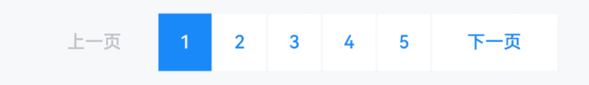
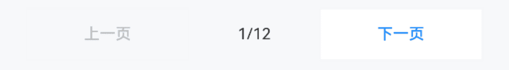
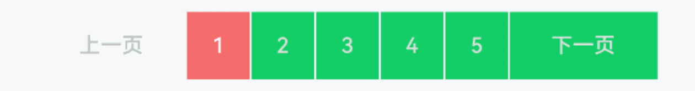

# Pagination 分页

## 介绍

数据量过多时，采用分页的形式将数据分隔，每次只加载一个页面。
 
## 引入

```ts
import { IBestPagination } from "@ibestservices/ibest-ui-v2";
```

## 代码演示

### 基础用法



::: details 点我查看代码
```ts
@Entry
@ComponentV2
struct DemoPage {
  @Local currentPage: number = 1
  build() {
    Column() {
      IBestPagination({
        currentPage: this.currentPage!!,
        totalItems: 24,
        itemsPerPage: 5,
        onChange: (value: number) => {
          console.log('当前页码:', value)
        }
      })
    }
  }
}
```
:::

### 简单模式



::: details 点我查看代码
```ts
@Entry
@ComponentV2
struct DemoPage {
  @Local currentPage: number = 1
  build() {
    Column() {
      IBestPagination({
        currentPage: this.currentPage!!,
        pageCount: 12,
        mode: 'simple'
      })
    }
  }
}
```
:::

### 自定义样式



::: details 点我查看代码
```ts
@Entry
@ComponentV2
struct DemoPage {
  @Local currentPage: number = 1
  build() {
    Column() {
      IBestPagination({
        currentPage: this.currentPage!!,
        totalItems: 24,
        itemsPerPage: 5,
        textColor: "#ddd",
        bgColor: "#13ce66",
        activeBgColor: "#f56c6c"
      })
    }
  }
}
```
:::

### 显示省略号


::: details 点我查看代码
```ts
@Entry
@ComponentV2
struct DemoPage {
  @Local currentPage: number = 1
  build() {
    Column() {
      IBestPagination({
        currentPage: this.currentPage!!,
        totalItems: 125,
        showPageSize: 3,
        forceEllipses: true
      })
    }
  }
}
```
:::

### 自定义按钮


::: details 点我查看代码
```ts
@Entry
@ComponentV2
struct DemoPage {
  @Local currentPage: number = 1
  build() {
    Column() {
      IBestPagination({
        currentPage: this.currentPage!!,
        totalItems: 125,
        showPageSize: 5,
        prevText: 'prev',
        nextText: 'next'
      })
    }
  }
}
```
:::


## API

### @Props

| 参数         | 说明                                 | 类型      | 默认值     |
| ------------ | ----------------------------------- | --------- | ---------- |
| currentPage  | 当前页码, 支持双向绑定                  | _number_  | `''` |
| mode         | 分页显示模式, 可选值 `simple`、`multi`  | _string_ | `multi` |
| prevText     | 上一页按钮文本                         | _ResourceStr_ | `上一页` |
| nextText     | 下一页按钮文本                         | _ResourceStr_ | `下一页` |
| textColor    | 文本颜色                              | _ResourceColor_ | `#1989fa` |
| activeTextColor| 文本选中颜色                         | _ResourceColor_ | `#fff` |
| disabledTextColor| 文本禁用颜色                       | _ResourceColor_ | `#646566` |
| bgColor      | 背景颜色                              | _ResourceColor_ | `#fff` |
| activeBgColor| 背景选中颜色                           | _ResourceColor_ | `#1989fa` |
| disabledBgColor| 背景禁用颜色                         | _ResourceColor_ | `#f7f8fa` |
| bdColor      | 边框颜色                              | _ResourceColor_ | `#f5f5f7` |
| pageCount    | 总页数                                | _string_ \| _number_ |  `''`  |
| totalItems   | 总数量                                | _string_ \| _number_ |  `''`  |
| showPageSize | 每页显示页码数                          | _string_ \| _number_ |  `5`  |
| itemsPerPage | 每页条目数                             | _string_ \| _number_ |  `10`  |
| forceEllipses| 是否显示省略号                          | _boolean_ | `false` |
| showPrevButton| 是否显示上一页按钮                      | _boolean_ | `true` |
| showNextButton| 是否显示下一页按钮                      | _boolean_ | `true` |

### Events

| 事件名     | 说明              | 回调参数                         |
| ----------| -----------------| -------------------------------- |
| onChange  | 页码变化时触发     | `page: number` |

## 主题定制

组件提供了下列颜色变量，可用于自定义深色/浅色模式样式，使用方法请参考 [颜色模式](../../guide/color-mode/index.md) 章节，如需要其它颜色变量可提 [issue](https://github.com/ibestservices/ibest-ui/issues)。

| 名称                                       | 描述                              | 默认值        |
| -------------------------------------------|----------------------------------|--------------|
| ibest_pagination_background                | 分页器背景色                      | `#fff`   |
| ibest_pagination_active_background         | 分页器激活态背景色                 | `#1989fa`|
| ibest_pagination_text_color                | 分页器文字颜色                     | `#1989fa` |
| ibest_pagination_active_text_color         | 分页器激活态文字颜色               | `#fff` |
| ibest_pagination_item_disabled_color       | 分页器禁用时文字颜色               | `#646566` |
| ibest_pagination_item_disabled_background  | 分页器禁用时背景色                 | `#f7f8fa` |
| ibest_pagination_desc_color                | 分页器描述文字颜色                 | `#646566` |
| ibest_pagination_border_color              | 分页器边框颜色                     | `#f5f5f7` |