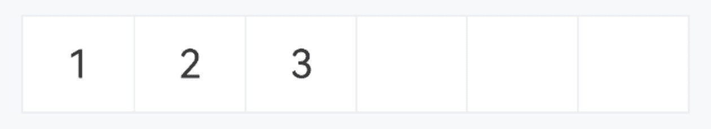

# PasswordInput 密码输入框

## 介绍

带网格的输入框组件，可以用于输入密码、短信验证码等场景，通常与数字键盘组件配合使用。
 
## 引入

```ts
import { IBestPasswordInput } from "@ibestservices/ibest-ui-v2";
```

## 代码演示

### 基础用法


:::tip
通过设置 `useSystemKeyboard` 属性为 true , 可使用系统键盘。
:::

::: details 点我查看代码
```ts
@Entry
@ComponentV2
struct DemoPage {
  @Local value: string = '123'
  build() {
    Column(){
      IBestPasswordInput({
        value: this.value!!,
        numberKeyboardConfig:{
          extraKey: ".",
          styleType: "custom"
        }
      })
    }
  }
}
```
:::

### 自定义长度


::: details 点我查看代码
```ts
@Entry
@ComponentV2
struct DemoPage {
  @Local value: string = '123'
  build() {
    Column(){
      IBestPasswordInput({
        value: this.value!!,
        inputLength: 4
      })
    }
  }
}
```
:::

### 格子间距


:::tip
通过 `space` 属性可以设置格子间距, 以下属性仅在space不为0时生效:   
• `radius` 设置单个格子圆角;   
• `isHighlightCurrent` 设置是否高亮当前正在输入的格子;   
• `highlightColor` 设置高亮颜色。
:::

::: details 点我查看代码
```ts
@Entry
@ComponentV2
struct DemoPage {
  @Local value: string = '123'
  build() {
    Column(){
      IBestPasswordInput({
        value: this.value!!,
        space: 20
      })
    }
  }
}
```
:::

### 明文展示



::: details 点我查看代码
```ts
@Entry
@ComponentV2
struct DemoPage {
  @Local value: string = '123'
  build() {
    Column(){
      IBestPasswordInput({
        value: this.value!!,
        isHidden: false
      })
    }
  }
}
```
:::

### 自定义样式


::: details 点我查看代码
```ts
@Entry
@ComponentV2
struct DemoPage {
  @Local value: string = '123'
  build() {
    Column({space: 14}){
      IBestPasswordInput({
        value: this.value!!,
        bdColor: '#3d8af2',
        cellTextColor: '#3d8af2'
      })
      IBestPasswordInput({
        value: this.value!!,
        space: 12,
        cellBgColor: "#1c1c1e",
        cellTextColor: "#fff"
      })
    }
  }
}
```
:::

### 提示信息


::: details 点我查看代码
```ts
@Entry
@ComponentV2
struct DemoPage {
  @Local value: string = '123'
  @Local errorTip: string = ''
  @Monitor("value")
  valueChange(){
    if (this.value.length === 6 && this.value !== '123456') {
      this.errorTip = '密码错误'
    } else {
      this.errorTip = ''
    }
  }
  build() {
    Column(){
      IBestPasswordInput({
        value: this.value!!,
        tip: "密码为6位数字",
        errorTip: this.errorTip
      })
    }
  }
}
```
:::

## API

### @Props

| 参数         | 说明                                          | 类型      | 默认值     |
| ------------ | ---------------------------------------------| --------- | ---------- |
| value        | 当前输入框的值, 支持双向绑定                      | _string_  | `''` |
| inputLength  | 输入框长度                                     | _number_ |  `6`  |
| inputHeight  | 输入框高度                                     | _number_ \| _string_ | `50` |
| space        | 格子间距                                       | _number_ \| _string_ | `0` |
| radius       | 格子圆角,当 `space` 不为0时有效                  | _number_ \| _string_ | `5` |
| isHighlightCurrent | 是否高亮当前正在输入的格子,当 `space` 不为0时有效| _boolean_ | `true` |
| highlightColor | 格子高亮颜色,当 `space` 不为0时有效            | _ResourceColor_ | `#3D8AF2` |
| isHidden     | 是否隐藏内容                                   | _boolean_ | `true` |
| tip          | 提示文字                                       | _string_ |  `''`  |
| errorTip     | 错误提示文字                                   | _string_ |  `''`  |
| useSystemKeyboard| 是否使用系统键盘, 默认使用自定义键盘           | _boolean_ |  `false`  |
| numberKeyboardConfig | 自定义键盘配置项                        | _NumberKeyboardConfig_ |  `-`  |
| isShowBorder | 是否显示边框线                                  | _boolean_ |  `true`  |
| bdColor      | 边框线颜色                                     | _ResourceColor_ |  `#ebedf0`  |
| cellBgColor  | 格子背景色                                     | _ResourceColor_ |  `#fff`  |
| cellTextColor| 格子文字颜色                                   | _ResourceColor_ |  `#323233`  |
| dotFontSize  | 黑点大小                                       | _number_ \| _string_ |  `40`    |
| textFontSize | 明文展示时文字大小                               | _number_ \| _string_ |  `20`    |
| tipFontSize  | 提示文字大小                                    | _number_ \| _string_ |  `16`    |
| autoFocus <span style="font-size: 12px; padding:2px 4px;color:#3D8AF2;border-radius:4px;border: 1px solid #3D8AF2">0.0.6</span>| 自动聚焦                                       | _boolean_ |  `false`  |
| showCursor <span style="font-size: 12px; padding:2px 4px;color:#3D8AF2;border-radius:4px;border: 1px solid #3D8AF2">0.0.6</span>| 是否显示闪烁光标                                | _boolean_ |  `true`  |
| highlightType <span style="font-size: 12px; padding:2px 4px;color:#3D8AF2;border-radius:4px;border: 1px solid #3D8AF2">0.0.6</span>| 格子高亮类型, 可选值为 `shadow` `border`        | _string_ |  `border`  |

### NumberKeyboardConfig 数据结构
| 参数              | 说明                              | 类型      | 默认值     |
| ------------------| ---------------------------------| --------- | ---------- |
| title             | 键盘标题                            | _string_ | `''`  |
| extraKey          | 额外按键                           | _string \| string[]_ | `''` |
| closeBtnText      | 关闭按钮文字                        | _string_ | `完成` |
| deleteButtonText  | 删除按钮文字, 为空时显示图标          | _string_ | `''` |
| styleType         | 样式风格, 可选值为 `default` `custom`| _string_ |`default`|
| isRandomKeyOrder  | 是否随机排序                        | _boolean_ | `false` |

### Events

| 事件名        | 说明                  | 回调参数             |
| -------------| ----------------------| -------------------------------- |
| onFieldClick | 点击输入框后触发        | `-` |
| onFinish     | 输入完成后触发    | `-` |