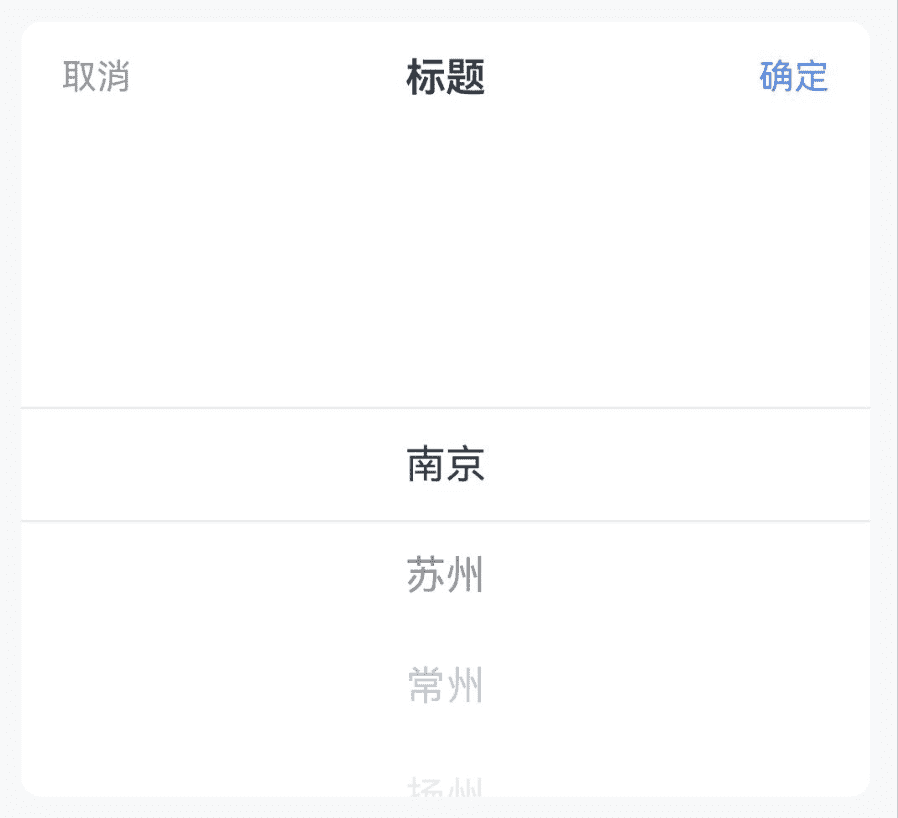

# Picker 选择器

## 介绍

提供多个选项集合供用户选择，支持单列选择、多列选择和级联选择，通常与弹出层组件配合使用。
 
## 引入

```ts
import { IBestPicker, IBestPickerOption } from "@ibestservices/ibest-ui-v2";
```

## 代码演示

### 基础用法



::: details 点我查看代码
```ts
@Entry
@ComponentV2
struct DemoPage {
  @Local options: IBestPickerOption[] = [
    { text: '南京', value: 'Nanjing' },
    { text: '苏州', value: 'Suzhou' },
    { text: '常州', value: 'Chazhou' },
    { text: '扬州', value: 'Yangzhou' },
    { text: '镇江', value: 'Zhejiang' }
  ]
  @Local selectValue: string[] = []
  build() {
    Column(){
      IBestPicker({
        options: this.options,
        title: "标题",
        value: this.selectValue!!,
        onConfirm: (selectedValues, selectTexts) => {
          IBestToast.show(selectTexts.join('-'))
        },
        onChange: (selectedValues, selectTexts, columnIndex) => {
          IBestToast.show(selectTexts.join('-'))
        }
      })
    }
  }
}
```
:::

### 搭配弹出层使用


::: details 点我查看代码
```ts
import { IBestField, IBestPopup } from '@ibestservices/ibest-ui'
@Entry
@ComponentV2
struct DemoPage {
  @Local selectValue: string[] = []
  @Local filedValue: string = ""
  @Local options: IBestPickerOption[] = [
    { text: '南京', value: 'Nanjing' },
    { text: '苏州', value: 'Suzhou' },
    { text: '常州', value: 'Chazhou' },
    { text: '扬州', value: 'Yangzhou' },
    { text: '镇江', value: 'Zhejiang' }
  ]
  @Builder pickerBuilder(){
    IBestPicker({
      options: this.options,
      title: "标题",
      visibleItemCount: 5,
      value: this.selectValue!!,
      onChange: (selectedValues, selectTexts, columnIndex) => {
        IBestToast.show(selectTexts.join('-'))
      },
      onConfirm: (selectedValues, selectTexts) => {
        this.visible = false
        this.filedValue = selectTexts.join('-')
      },
      onCancel: () => {
        this.visible = false
      }
    })
  }
  @Local visible: boolean = false
  build() {
    Column(){
      IBestField({
        label: '城市',
        value: this.filedValue,
        placeholder: "请选择城市",
        isLink: true,
        hasBorder: false,
        onFieldClick: () => {
          this.visible = true
        }
      })
      // 弹出层
      IBestPopup({
        visible: this.visible!!,
        popupAlign: "bottom",
        contentBuilder: (): void => this.pickerBuilder()
      })
    }
  }
}
```
:::

### 默认选中


::: details 点我查看代码
```ts
@Entry
@ComponentV2
struct DemoPage {
  @Local selectValue: string[] = ["Suzhou"]
  @Local options: IBestPickerOption[] = [
    { text: '南京', value: 'Nanjing' },
    { text: '苏州', value: 'Suzhou' },
    { text: '常州', value: 'Chazhou' },
    { text: '扬州', value: 'Yangzhou' },
    { text: '镇江', value: 'Zhejiang' }
  ]
  build() {
    Column(){
      IBestPicker({
        options: this.options,
        title: "标题",
        value: this.selectValue!!,
        onConfirm: (selectedValues, selectTexts) => {
          IBestToast.show(selectTexts.join('-'))
        },
        onChange: (selectedValues, selectTexts, columnIndex) => {
          IBestToast.show(selectTexts.join('-'))
        }
      })
    }
  }
}
```
:::

### 多列选择


::: details 点我查看代码
```ts
@Entry
@ComponentV2
struct DemoPage {
  @Local options: IBestPickerOption[][] = [
    [
      { text: '周一', value: 'Monday' },
      { text: '周二', value: 'Tuesday' },
      { text: '周三', value: 'Wednesday' },
      { text: '周四', value: 'Thursday' },
      { text: '周五', value: 'Friday' }
    ],
    [
      { text: '上午', value: 'Morning' },
      { text: '下午', value: 'Afternoon' },
      { text: '晚上', value: 'Evening' }
    ]
  ]
  @Local selectValue: string[] = []
  build() {
    Column(){
      IBestPicker({
        options: this.options,
        title: "标题",
        value: this.selectValue!!,
        onConfirm: (selectedValues, selectTexts) => {
          IBestToast.show(selectTexts.join('-'))
        },
        onChange: (selectedValues, selectTexts, columnIndex) => {
          IBestToast.show(selectTexts.join('-'))
        }
      })
    }
  }
}
```
:::

### 级联选择


::: details 点我查看代码
```ts
@Entry
@ComponentV2
struct DemoPage {
  @Local options: IBestPickerOption[] = [
    {
      text: "江苏省",
      value: "320000",
      children: [
        {
          text: "南京市",
          value: "320100",
          children: [
            {
              text: "秦淮区",
              value: "320104"
            },
            {
              text: "雨花台区",
              value: "320114"
            }
          ]
        },
        {
          text: "苏州市",
          value: "320500",
          children: [
            {
              text: "姑苏区",
              value: "320508"
            },
            {
              text: "昆山市",
              value: "320583"
            }
          ]
        }
      ]
    },
    {
      text: "安徽省",
      value: "340000",
      children: [
        {
          text: "合肥市",
          value: "340100",
          children: [
            {
              text: "蜀山区",
              value: "340104"
            },
            {
              text: "合肥高新技术产业开发区",
              value: "340171"
            }
          ]
        },
        {
          text: "黄山市",
          value: "341000",
          children: [
            {
              text: "屯溪区",
              value: "341002"
            },
            {
              text: "黄山区",
              value: "341003"
            }
          ]
        }
      ]
    }
  ]
  @Local selectValue: string[] = []
  build() {
    Column(){
      IBestPicker({
        options: this.options,
        title: "标题",
        value: this.selectValue!!,
        onConfirm: (selectedValues, selectTexts) => {
          IBestToast.show(selectTexts.join('-'))
        },
        onChange: (selectedValues, selectTexts, columnIndex) => {
          IBestToast.show(selectTexts.join('-'))
        }
      })
    }
  }
}
```
:::

## API

### @Props

| 参数         | 说明                                          | 类型      | 默认值     |
| ------------ | ---------------------------------------------| --------- | ---------- |
| value        | 当前选中的值, 支持双向绑定                       | _(string \| number)[]_  | `[]` | 
| options      | 选项         | _(IBestPickerOption \| IBestPickerOption[])[]_  | `[]` |
| title        |  标题                                         | _ResourceStr_ |  `''`  |
| itemHeight   | 单项高度                                       | _number_ \| _string_ | `44`   |
| visibleItemCount | 可见选项数量                                | _number_ | `6`   |
| showToolBar   | 是否显示顶部栏                                 | _boolean_ | `true` |
| confirmText   | 确认按钮文字                                   | _ResourceStr_ |  `确定`  |
| cancelText    | 取消按钮文字                                   | _ResourceStr_ |  `取消`  |
| groupId       | 分组id, 通常在配合PickerGroup组件使用时传入		   | _string_ \| _number_ | `''` |
| horizontal    | 是否横向     | _boolean_ | `false` |
| itemWidth     | 单项宽度     | _number_ \| _string_ | `44`   |
| contentHeight | 整体高度, 仅横向时生效 | _number_ \| _string_ | `44`   |
| optionFontSize| 选项字体大小    | _number_ \| _string_ | `16`   |
 
### Events

| 事件名     | 说明         | 回调参数          |
| ----------| ------------------------------ | -------------------------------- |
| onChange | 某一列选项变更后触发 | `selectedValues: (string \| number)[], selectTexts: string[], columnIndex` |
| onConfirm | 点击确定按钮时触发 | `selectedValues: (string \| number)[], selectTexts: string[]` |
| onCancel |  点击取消按钮时触发 | `-` |

### IBestPickerOption 数据结构
| 参数         | 说明                                          | 类型      |
| ------------ | ---------------------------------------------| --------- |
| text         | 选项文字, 必传                               	| _ResourceStr_  |
| value        | 选项值, 必传                                   | _string_ \| _number_  |
| children     | 下级选项, 可选                                 | _IBestPickerOption[]_  |