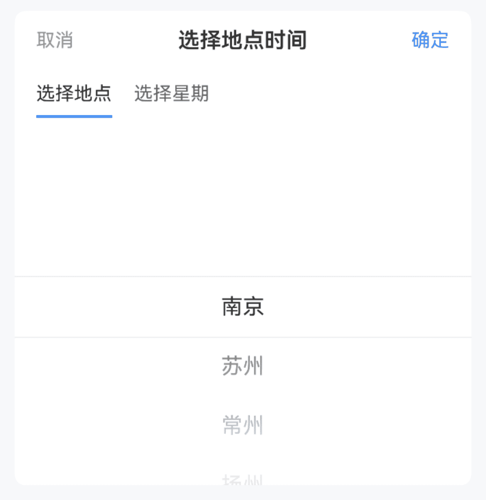
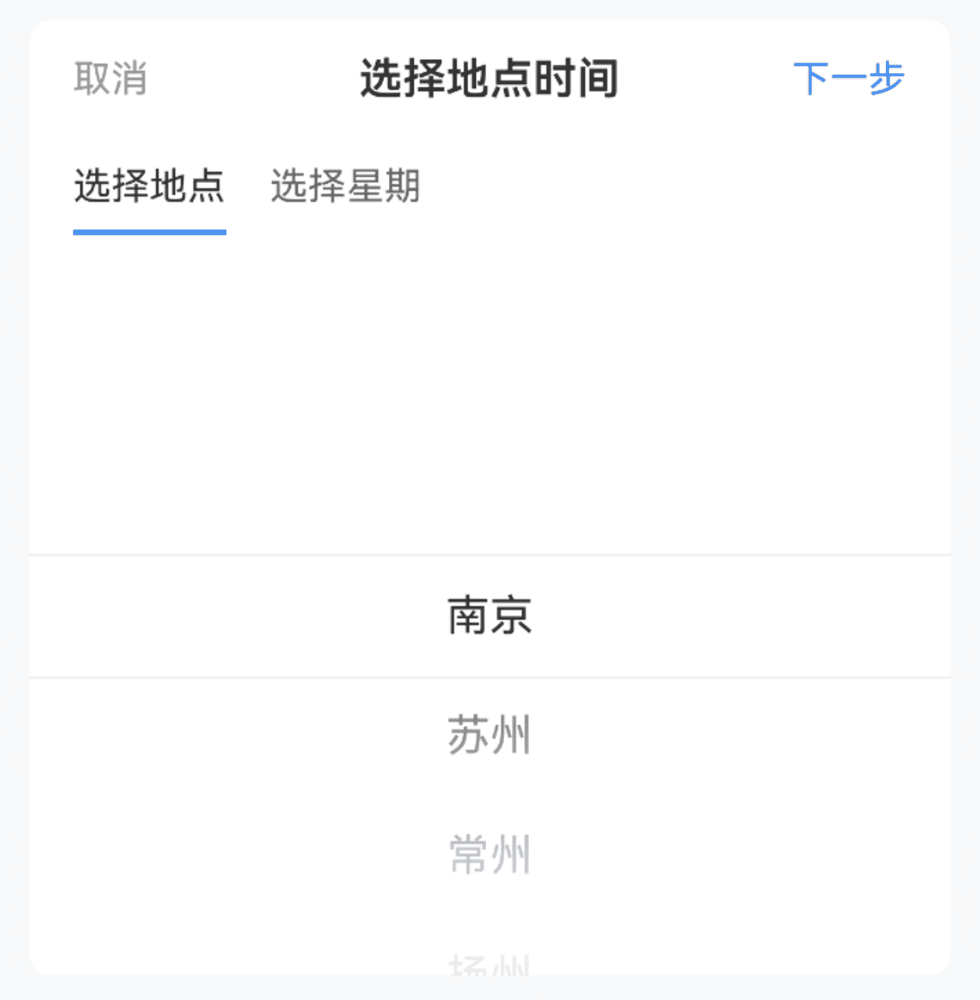
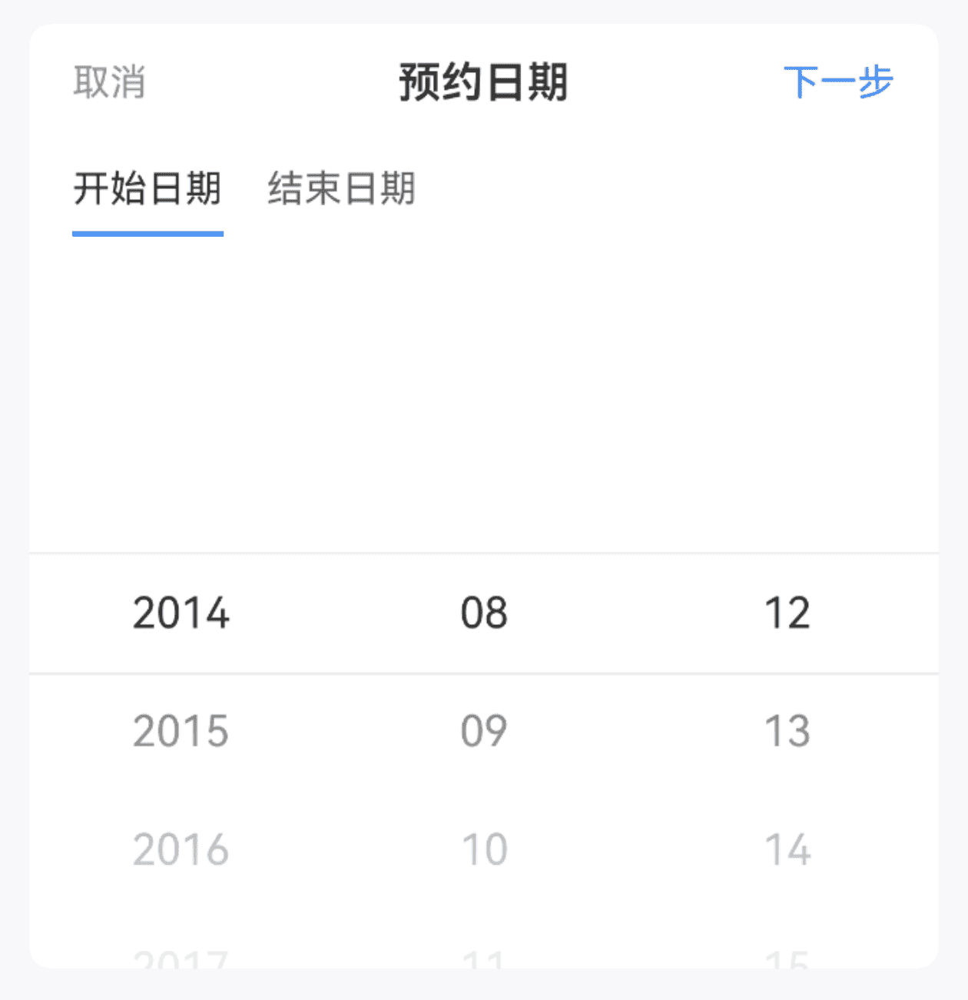
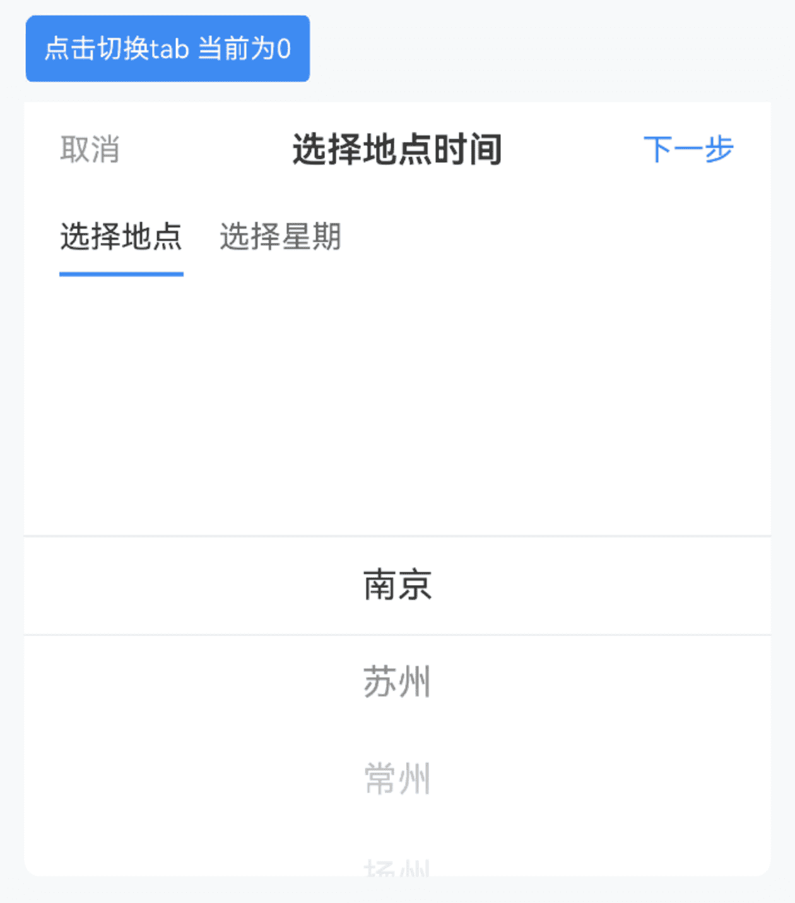

# PickerGroup 选择器组

## 介绍

用于结合多个 Picker 选择器组件，在一次交互中完成多个值的选择。   

PickerGroup 中可以放置以下组件：   

• Picker   
• DatePicker   
• TimePicker   
• 其他基于 Picker 封装的自定义组件
 
## 引入

```ts
import { IBestPickerGroup } from "@ibestservices/ibest-ui-v2";
```

## 代码演示

### 基础用法


:::tip
通过绑定 `groupId` 属性后, PickerGroup 会代替子组件来渲染统一的顶部栏。
:::

::: details 点我查看代码
```ts
@Entry
@ComponentV2
struct DemoPage {
  @Local groupId: string = "1"
  @Local tabs: string[] = ["选择地点", "选择星期"]
  @Local options1: IBestPickerOption[] = [
    { text: '南京', value: '南京' },
    { text: '苏州', value: '苏州' },
    { text: '常州', value: '常州' },
    { text: '扬州', value: '扬州' },
    { text: '镇江', value: '镇江' }
  ]
  @Local options2: IBestPickerOption[] = [
    { text: '周一', value: '周一' },
    { text: '周二', value: '周二' },
    { text: '周三', value: '周三' },
    { text: '周四', value: '周四' },
    { text: '周五', value: '周五' }
  ]
  @Local selectValue1: string[] = []
  @Local selectValue2: string[] = []
  build() {
    Column(){
      IBestPickerGroup({
        title: "选择地点时间",
        tabs: this.tabs,
        onConfirm: () => {
          IBestToast.show({
            message: `${this.selectValue1[0]} ${this.selectValue2[0]}`
          })
        }
      }){
        IBestPicker({
          groupId: this.groupId,
          options: this.options1,
          value: this.selectValue1!!
        })
        IBestPicker({
          groupId: this.groupId,
          options: this.options2,
          value: this.selectValue2!!
        })
      }
    }
  }
}
```
:::

### 下一步按钮


:::tip
通过设置 `nextStepText` 属性，可以自定义右侧按钮文案, 方便用户按步骤选择, 当切到最后一个标签时, `下一步` 变为`确认`。
:::

::: details 点我查看代码
```ts
@Entry
@ComponentV2
struct DemoPage {
  @Local groupId: string = "1"
  @Local tabs: string[] = ["选择地点", "选择星期"]
  @Local options1: IBestPickerOption[] = [
    { text: '南京', value: '南京' },
    { text: '苏州', value: '苏州' },
    { text: '常州', value: '常州' },
    { text: '扬州', value: '扬州' },
    { text: '镇江', value: '镇江' }
  ]
  @Local options2: IBestPickerOption[] = [
    { text: '周一', value: '周一' },
    { text: '周二', value: '周二' },
    { text: '周三', value: '周三' },
    { text: '周四', value: '周四' },
    { text: '周五', value: '周五' }
  ]
  @Local selectValue1: string[] = []
  @Local selectValue2: string[] = []
  build() {
    Column(){
      IBestPickerGroup({
        title: "选择地点时间",
        nextStepText: "下一步",
        tabs: this.tabs,
        onConfirm: () => {
          IBestToast.show({
            message: `${this.selectValue1[0]} ${this.selectValue2[0]}`
          })
        }
      }){
        IBestPicker({
          groupId: this.groupId,
          options: this.options1,
          value: this.selectValue1!!
        })
        IBestPicker({
          groupId: this.groupId,
          options: this.options2,
          value: this.selectValue2!!
        })
      }
    }
  }
}
```
:::

### 选择日期范围


:::tip
在默认插槽中放置两个 IBestDatePicker, 可以实现选择日期范围的交互效果。
:::

::: details 点我查看代码
```ts
@Entry
@ComponentV2
struct DemoPage {
  @Local groupId: string = "1"
  @Local tabs: string[] = ["开始日期", "结束日期"]
  @Local selectValue1: string[] = []
  @Local selectValue2: string[] = []
  build() {
    Column(){
      IBestPickerGroup({
        title: "选择日期范围",
        nextStepText: "下一步",
        tabs: this.tabs,
        onConfirm: () => {
          IBestToast.show({
            message: `${this.selectValue1[0]} ${this.selectValue2[0]}`
          })
        }
      }){
        IBestDatePicker({
          groupId: this.groupId,
          value: this.selectValue1!!
        })
        IBestDatePicker({
          groupId: this.groupId,
          value: this.selectValue2!!
        })
      }
    }
  }
}
```
:::

### 手动切换


:::tip
通过 `currentName` 属性，可手动切换标签页。
:::

::: details 点我查看代码
```ts
@Entry
@ComponentV2
struct DemoPage {
  @Local groupId: string = "1"
  @Local tabs: string[] = ["选择地点", "选择星期"]
  @Local options1: IBestPickerOption[] = [
    { text: '南京', value: '南京' },
    { text: '苏州', value: '苏州' },
    { text: '常州', value: '常州' },
    { text: '扬州', value: '扬州' },
    { text: '镇江', value: '镇江' }
  ]
  @Local options2: IBestPickerOption[] = [
    { text: '周一', value: '周一' },
    { text: '周二', value: '周二' },
    { text: '周三', value: '周三' },
    { text: '周四', value: '周四' },
    { text: '周五', value: '周五' }
  ]
  @Local selectValue1: string[] = []
  @Local selectValue2: string[] = []
  @Local currentName: number = 0
  changeName(){
    this.currentName = this.currentName === 0 ? 1 : 0
  }
  build() {
    Column(){
      IBestButton({
        text: `点击切换tab 当前为${this.currentName}`,
        type: "primary",
        buttonSize: "small",
        onBtnClick: () => {
          this.changeName()
        }
      })
      IBestPickerGroup({
        title: "选择地点时间",
        tabs: this.tabs,
        nextStepText: "下一步",
        currentName: this.currentName,
        onTabNameChange: name => {
          this.currentName = name
        },
        onConfirm: () => {
          IBestToast.show({
            message: `${this.selectValue1[0]} ${this.selectValue2[0]}`
          })
        }
      }){
        IBestPicker({
          groupId: this.groupId,
          options: this.options1,
          value: this.selectValue1!!
        })
        IBestPicker({
          groupId: this.groupId,
          options: this.options2,
          value: this.selectValue2!!
        })
      }
    }
  }
}
```
:::

## API

### @Props

| 参数         | 说明                                                     | 类型      | 默认值     |
| ------------ | ---------------------------------------------------------| --------- | ---------- |
| title        | 标题                                       						   | _ResourceStr_ |  `''`  |
| tabs         | 顶部标签栏列表                                             | _ResourceStr[]_ | `[]`  |
| nextStepText | 下一步按钮文案                                             | _ResourceStr_ | ``  |
| currentName  | 当前标签页名称                                             | _number_ | `0`  |
| showToolBar   | 是否显示顶部栏                                 						| _boolean_ | `true` |
| confirmText   | 确认按钮文字                                   						| _ResourceStr_ |  `确定`  |
| cancelText    | 取消按钮文字                                   						| _ResourceStr_ |  `取消`  |

### 插槽

| 插槽名         | 说明                                                     | 类型      |
| ------------ | --------------------------------------------------------| --------- |
| defaultBuilder | 默认插槽                                      				  | _CustomBuilder_ |

### Events

| 事件名     | 说明                                             | 事件类型                         |
| ----------| ------------------------------------------------ | ------------------------------- |
| onConfirm | 点击确定按钮时触发 | `() => void` |
| onCancel |  点击取消按钮时触发 | `() => void` |