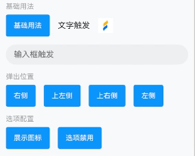
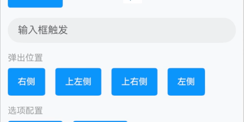
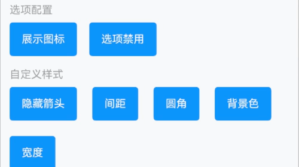
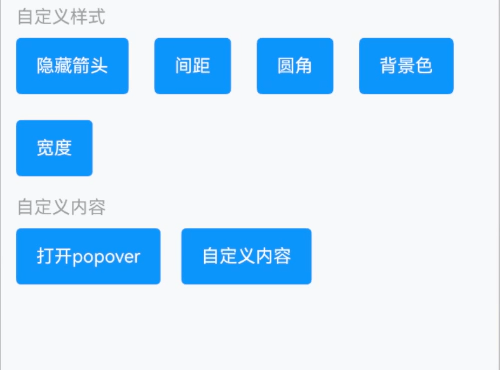
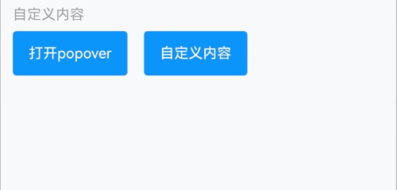

# Popover 气泡弹出框

## 介绍

弹出式的气泡菜单。
 
## 引入

```ts
import { IBestPopover, IBestPopoverAction } from "@ibestservices/ibest-ui-v2";
```
::: details 事例通用代码
```ts
  @Local textValue: string = ""
  @Builder triggerBuilder(type: string, text?: string){
    if(type == "button"){
      IBestButton({
        type: "primary",
        text
      })
    }else if(type == "text"){
      Text(text)
    }else if(type == "img"){
      Image($r("app.media.app_icon")).width(30)
    }else if(type == "input"){
      TextInput({text: this.textValue, placeholder: text})
        .width("100%")
        .onChange((text: string) => {
          if(text){
            this.actions = text.split("").map(e => {
              let obj: IBestPopoverAction = {
                text: "选项" + e
              }
              return obj
            })
          }else{
            this.actions = [
              {
                text: '选项一'
              },
              {
                text: '选项二'
              },
              {
                text: '选项三'
              }
            ]
          }
        })
    }
  }
```
:::

## 代码演示

### 基础用法



::: details 点我查看代码
```ts
@Entry
@ComponentV2
struct DemoPage {
  @Local actions: IBestPopoverAction[] = [
    {
      text: '选项一'
    },
    {
      text: '选项二'
    },
    {
      text: '选项三'
    },
    {
      text: '选项四'
    }
  ]
  build() {
    Column({space: 16}){
      Row({space: 16}){
        IBestPopover({
          actions: this.actions,
          triggerBuilder: (): void => this.triggerBuilder("button", "基础用法"),
          onSelect: (action: IBestPopoverAction, index: number) => {
            IBestToast.show(action.text)
          }
        })
        IBestPopover({
          actions: this.actions,
          triggerBuilder: (): void => this.triggerBuilder("text", "文字触发")
        })
        IBestPopover({
          actions: this.actions,
          triggerBuilder: (): void => this.triggerBuilder("img")
        })
      }
      IBestPopover({
        actions: this.actions,
        popoverWidth: "100%",
        triggerBuilder: (): void => this.triggerBuilder("input", "输入框触发"),
        onSelect: (action: IBestPopoverAction, index: number) => {
          this.textValue = action.text
        }
      })
    }.width("100%").alignItems(HorizontalAlign.Start)
  }
}
```
:::

### 弹出位置



::: details 点我查看代码
```ts
@Entry
@ComponentV2
struct DemoPage {
  @Local actions: IBestPopoverAction[] = [
    {
      text: '选项一'
    },
    {
      text: '选项二'
    }
  ]
  build() {
    Row({space: 16}){
      IBestPopover({
        actions: this.actions,
        placement: Placement.Right,
        triggerBuilder: (): void => this.triggerBuilder("button", "右侧")
      })
      IBestPopover({
        actions: this.actions,
        placement: Placement.TopLeft,
        triggerBuilder: (): void => this.triggerBuilder("button", "上左侧")
      })
      IBestPopover({
        actions: this.actions,
        placement: Placement.TopRight,
        triggerBuilder: (): void => this.triggerBuilder("button", "上右侧")
      })
      IBestPopover({
        actions: this.actions,
        placement: Placement.Left,
        triggerBuilder: (): void => this.triggerBuilder("button", "左侧")
      })
    }
  }
}
```
:::

### 选项配置



::: details 点我查看代码
```ts
@Entry
@ComponentV2
struct DemoPage {
  @Local actions: IBestPopoverAction[] = [
    {
      text: '选项一',
      icon: 'add-o'
    },
    {
      text: '选项二',
      icon: 'music-o'
    },
    {
      text: '选项三',
      icon: $r("app.media.app_icon")
    }
  ]
  @Local actions1: IBestPopoverAction[] = [
    {
      text: '选项一',
      disabled: true
    },
    {
      text: '选项二',
      disabled: true
    },
    {
      text: '选项三'
    }
  ]
  build() {
    Row({space: 16}){
      IBestPopover({
        actions: this.actions,
        triggerBuilder: (): void => this.triggerBuilder("button", "展示图标")
      })
      IBestPopover({
        actions: this.actions1,
        triggerBuilder: (): void => this.triggerBuilder("button", "选项禁用")
      })
    }
  }
}
```
:::

### 自定义样式



::: details 点我查看代码
```ts
@Entry
@ComponentV2
struct DemoPage {
  @Local actions: IBestPopoverAction[] = [
    {
      text: '选项一'
    },
    {
      text: '选项二'
    },
    {
      text: '选项三'
    },
    {
      text: '选项四'
    }
  ]
  build() {
    Flex({wrap: FlexWrap.Wrap, space: { main: LengthMetrics.vp(20), cross: LengthMetrics.vp(20)}}){
      IBestPopover({
        actions: this.actions,
        showArrow: false,
        triggerBuilder: (): void => this.triggerBuilder("button", "隐藏箭头")
      })
      IBestPopover({
        actions: this.actions,
        space: 12,
        triggerBuilder: (): void => this.triggerBuilder("button", "间距")
      })
      IBestPopover({
        actions: this.actions,
        radius: 16,
        triggerBuilder: (): void => this.triggerBuilder("button", "圆角")
      })
      IBestPopover({
        actions: this.actions,
        bgColor: '#4a4a4a',
        textColor: '#fff',
        dividerColor: "#646566",
        triggerBuilder: (): void => this.triggerBuilder("button", "背景色")
      })
      IBestPopover({
        actions: this.actions,
        popoverWidth: 200,
        triggerBuilder: (): void => this.triggerBuilder("button", "宽度")
      })
    }
  }
}
```
:::

### 自定义内容



::: details 点我查看代码
```ts
import { IBestPopoverController } from "@ibestservices/ibest-ui-v2";
@Entry
@ComponentV2
struct DemoPage {
  private controller: IBestPopoverController = new IBestPopoverController()
  @Builder popoverContent(){
    Column({space: 14}){
      Row({space: 14}){
        Image($r("app.media.app_icon")).width(18)
        Text("自定义提示内容")
      }
      IBestButton({
        type: "primary",
        buttonSize: "small",
        text: "确定",
        onBtnClick: () => {
          this.controller.close()
        }
      })
    }
    .alignItems(HorizontalAlign.End)
    .padding(16)
  }
  build() {
    Row({space: 16}){
      IBestButton({
        type: "primary",
        text: "打开popover",
        onBtnClick: () => {
          this.controller.open()
        }
      })
      IBestPopover({
        controller: this.controller,
        actions: this.actions,
        triggerBuilder: (): void => this.triggerBuilder("button", "自定义内容"),
        popoverContentBuilder: (): void => this.popoverContent()
      })
    }
  }
}
```
:::


## API

### @Props

| 参数         | 说明                                 | 类型      | 默认值     |
| ------------ | ----------------------------------- | --------- | ---------- |
| actions      | 通知栏文本内容                         | _IBestPopoverAction[]_ | `[]` |  
| textFontSize | 选项文字大小                          | _string_ \| _number_ | `16` |
| textColor    | 文字颜色                              | _ResourceColor_ | `#323232` |
| itemHeight   | 选项高度                              | _string_ \| _number_ | `44` |
| itemPadding  | 左右内边距                            | _string_ \| _number_ | `16` |
| textAlign    | 文字对齐方式                           | _TextAlign_ |  `-`  |
| iconSize     | 左侧图标大小                           | _string_ \| _number_ |  `20`  |
| iconColor    | 左侧图标颜色                           | _ResourceColor_ | `#323232` |
| dividerColor | 分割线颜色                             | _ResourceColor_ | `#ebedf0` |
| placement    | 弹出位置                              | _<a href="https://developer.huawei.com/consumer/cn/doc/harmonyos-references-V13/ts-appendix-enums-V13#placement8" target="__blank">Placement</a>_ | `Bottom` |
| popoverWidth | 气泡框宽度                             | _string_ \| _number_ | `''` |
| bgColor      | 气泡框背景色                           | _ResourceColor_ |  `#fff`  |
| showArrow    | 是否显示箭头                           | _boolean_ |  `true`  |
| arrowWidth   | 箭头宽度                               | _string_ \| _number_ | `12` |
| arrowHeight  | 箭头高度                               | _string_ \| _number_ | `6` |
| popoverMask  | 设置气泡是否有遮罩层及遮罩颜色。如果设置为false，则没有遮罩层；如果设置为true，则设置有遮罩层并且颜色为透明色；如果设置为Color，则为遮罩层的颜色。 | _boolean_ \| _IBestPopoverMask_ | `true` |
| space        | 气泡与目标的间隙                         | _string_ \| _number_ | `4` |
| radius       | 气泡圆角                               | _string_ \| _number_ | `8` |
| popoverShadow| 气泡阴影                               | _ShadowOptions_ \| _ShadowStyle_ | `ShadowStyle.OUTER_DEFAULT_MD` |
| borderSizeType| 底部分割线尺寸类型, 可选值 `full` `center` `right` | _BorderSizeType_ | `center` |
| fixHeight    | 内容高度      | _string_ \| _number_ | `auto` |
| maxHeight    | 内容最大高度   | _string_ \| _number_ | `auto` |
| scrollBarState | 滚动条状态 | _<a href="https://developer.huawei.com/consumer/cn/doc/harmonyos-references-V14/ts-appendix-enums-V14#barstate" target="__blank">BarState</a>_ | `Auto` |

### IBestPopoverMask 数据类型
| 属性名       | 说明                               | 类型      | 默认值     |
| ------------| ----------------------------------| --------- | ---------- |
| color       | 蒙层颜色值                          | _ResourceColor_ | `-` |

### Events

| 事件名     | 说明                           | 事件类型                         |
| ----------| -------------------------------| --------------------------------|
| onSelect  | 点击选项时回调                   | `(action: IBestPopoverAction, index: number) => void` |
| onOpen    | 气泡打开时回调                   | `() => void` |

### 插槽

| 插槽名         | 说明                                                   | 类型             |
| --------------| ------------------------------------------------------| ----------------|
| triggerBuilder| 触发气泡的对象              | _CustomBuilder_ |
| popoverContentBuilder | 自定义popover内容  | _CustomBuilder_ |

### IBestPopoverAction 数据结构
| 属性名         | 说明                                 | 类型      | 默认值     |
| ------------  | ----------------------------------- | --------- | ---------- |
| text          | 选项文字                              | _string_ | `''` |
| icon          | 自定义文字左侧图标                      | _ResourceStr_ | `''` |
| color         | 左侧图标颜色                           | _ResourceColor_ | `''` |
| disabled      | 是否禁用                              | _boolean_ | `''` |
| value         | 选项标识                              | _string_ | `''` |    

### IBestPopoverController 实例
| 方法名         | 说明          | 参数类型   | 返回值|
| ------------  | --------------| ----------|----------|
| open          | 打开气泡       | `-`       | `() => void`|
| close         | 关闭气泡       | `-`       | `() => void`|

## 主题定制

组件提供了下列颜色变量，可用于自定义深色/浅色模式样式，使用方法请参考 [颜色模式](../../guide/color-mode/index.md) 章节，如需要其它颜色变量可提 [issue](https://github.com/ibestservices/ibest-ui/issues)。

| 名称                                       | 描述                              | 默认值        |
| -------------------------------------------|----------------------------------|--------------|
| ibest_popover_background                   | 气泡框背景色                      | `#fff`   |
| ibest_popover_border_color                 | 气泡框边框颜色                    | `#ebedf0`   |