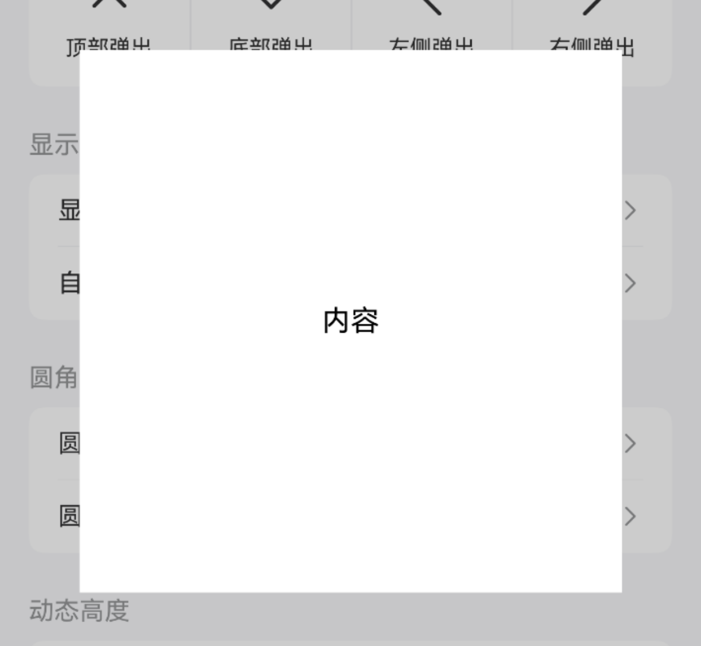
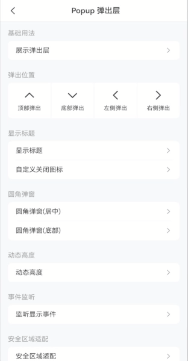
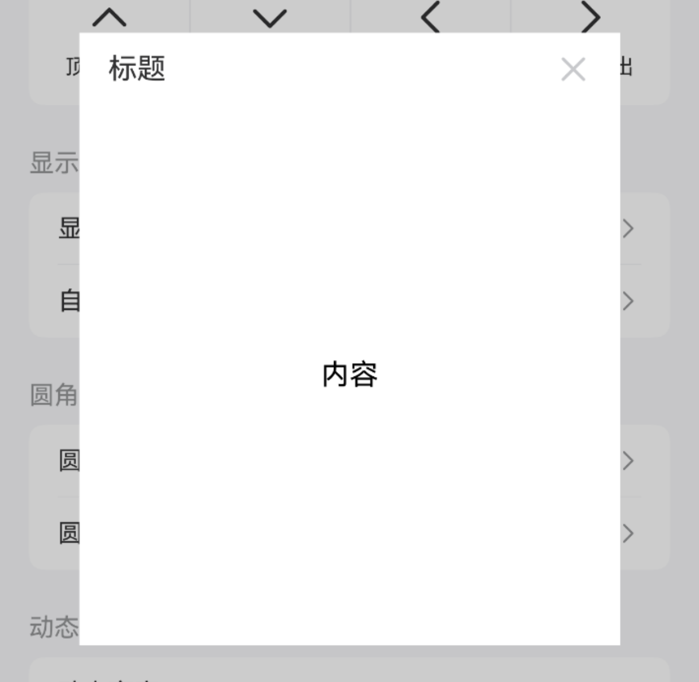
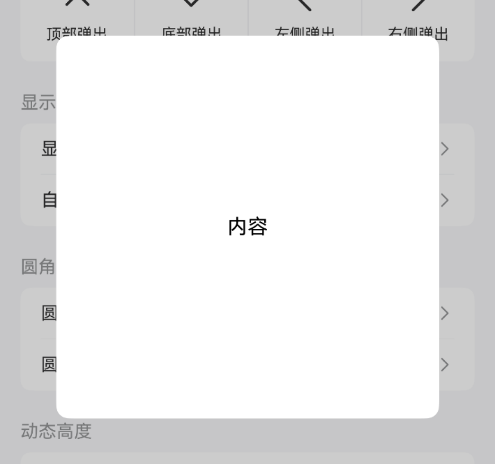
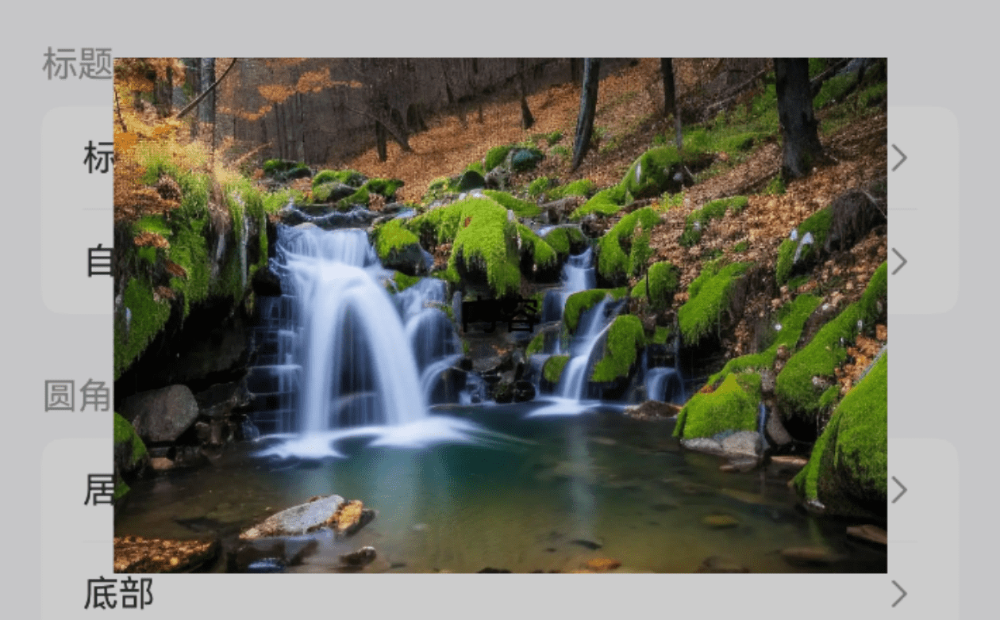
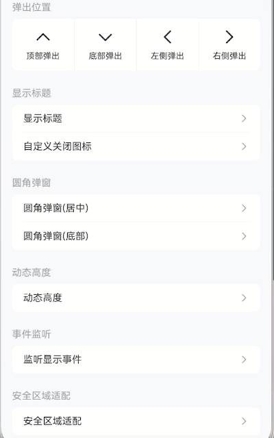
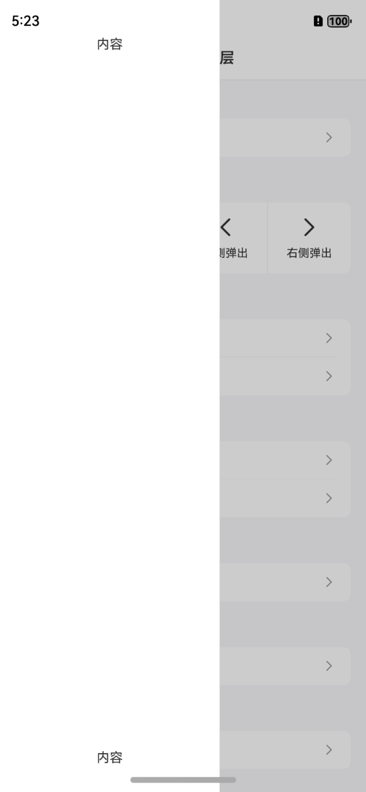

# Popup 弹出层

## 介绍

弹出层容器，用于展示弹窗、信息提示等内容，支持多个弹出层叠加展示。
 
## 引入

```ts
import { IBestPopup } from "@ibestservices/ibest-ui-v2";
```

## 代码演示

### 基础用法


::: tip
通过 `visible` 属性可控制弹出层是否显示。
:::

::: details 点我查看代码
```ts
import { IBestCell } from "@ibestservices/ibest-ui-v2"
@Entry
@ComponentV2
struct DemoPage {
  @Local visible: boolean = false
  @Builder centerBuilder() {
    Row() {
      Text("内容")
    }
    .width("100%")
    .aspectRatio(1)
    .justifyContent(FlexAlign.Center)
  }
  build() {
    Column(){
      IBestCell({
        title: '展示弹出层',
        isLink: true,
        hasBorder: false,
        onCellClick: () => {
          this.visible = true
        }
      })
      IBestPopup({
        visible: this.visible!!,
        popupWidth: 300,
        contentBuilder: (): void => this.centerBuilder()
      })
    }
  }
}
```
:::

### 弹出位置


::: tip
通过 `popupAlign` 属性可设置弹出位置，支持 `top`、`bottom`、`left`、`right` 四种弹出位置，默认为 `center`。  

• 当弹窗从顶部或底部弹出时，默认宽度与屏幕宽度保持一致，弹窗高度默认40%。  
• 当弹窗从左侧或右侧弹出时，默认高度与屏幕高度保持一致，弹窗宽度默认60%。  
• 当弹窗从中间弹出时，默认不设置宽高，弹窗的宽高取决于内容的宽高。
:::

::: details 点我查看代码
```ts
import { IBestCellGroup } from "@ibestservices/ibest-ui-v2"

@Extend(Column) function positionColStyle(bd: boolean = false){
  .layoutWeight(1)
  .height(75)
  .justifyContent(FlexAlign.Center)
  .border({width:{left: bd ? 1 : 0}, color: "#ebedf0"})
}

@Entry
@ComponentV2
struct DemoPage {
  @Local upVisible: boolean = false
  @Local downVisible: boolean = false
  @Local leftVisible: boolean = false
  @Local rightVisible: boolean = false
  build() {
    Column(){
      IBestCellGroup({ inset: true }) {
        Row(){
          Column(){
            Text("顶部弹出")
              .fontSize(14)
          }
          .positionColStyle()
          .onClick(() => {
            this.upVisible = true
          })
          Column(){
            Text("底部弹出")
              .fontSize(14)
          }
          .positionColStyle(true)
          .onClick(() => {
            this.downVisible = true
          })
          Column(){
            Text("左侧弹出")
              .fontSize(14)
          }
          .positionColStyle(true)
          .onClick(() => {
            this.leftVisible = true
          })
          Column(){
            Text("右侧弹出")
              .fontSize(14)
          }
          .positionColStyle(true)
          .onClick(() => {
            this.rightVisible = true
          })
        }
        .width(CONTAINER_SIZE.FULL)
        .backgroundColor("#fff")
      }
      IBestPopup({
        visible: this.upVisible!!,
        popupAlign: "top"
      })
      IBestPopup({
        visible: this.downVisible!!,
        popupAlign: "bottom"
      })
      IBestPopup({
        visible: this.leftVisible!!,
        popupAlign: "left"
      })
      IBestPopup({
        visible: this.rightVisible!!,
        popupAlign: "right"
      })
    }
  }
}
```
:::

### 显示标题


::: tip
通过 `isShowHeader` 属性可控制标题显示，`title` 属性可设置标题内容，`closeIcon` 属性可自定义关闭图标。
:::

::: details 点我查看代码
```ts
import { IBestCellGroup, IBestCell } from "@ibestservices/ibest-ui-v2"
@Entry
@ComponentV2
struct DemoPage {
  @Local visible1: boolean = false
  @Local visible2: boolean = false
  @Builder centerBuilder() {
    Row() {
      Text("内容")
    }
    .width("100%")
    .aspectRatio(1)
    .justifyContent(FlexAlign.Center)
  }
  build() {
    Column(){
      IBestCellGroup({ inset: true }) {
        Column() {
          IBestCell({
            title: '显示标题',
            isLink: true,
            onCellClick: () => {
              this.visible1 = true
            }
          })
          IBestCell({
            title: '自定义关闭图标',
            isLink: true,
            hasBorder: false,
            onCellClick: () => {
              this.visible2 = true
            }
          })
        }
      }
      IBestPopup({
        visible: this.visible1!!,
        popupWidth: 300,
        cornerRadius: 20,
        isShowHeader: true,
        title: "标题",
        contentBuilder: (): void => this.centerBuilder()
      })
      IBestPopup({
        visible: this.visible2!!,
        popupAlign: "bottom",
        isShowHeader: true,
        title: "标题",
        closeIcon: "https://ibestui.ibestservices.com/favicon.ico"
      })
    }
  }
}
```
:::

### 圆角弹窗



::: tip
通过 `cornerRadius` 属性可设置弹窗圆角。
:::

::: details 点我查看代码
```ts
import { IBestCellGroup, IBestCell } from "@ibestservices/ibest-ui-v2"
@Entry
@ComponentV2
struct DemoPage {
  @Local visible1: boolean = false
  @Local visible2: boolean = false
  @Builder centerBuilder() {
    Row() {
      Text("内容")
    }
    .width(150)
    .aspectRatio(1)
    .justifyContent(FlexAlign.Center)
  }
  build() {
    Column(){
      IBestCellGroup({ inset: true }) {
        Column() {
          IBestCell({
            title: '圆角弹窗(居中)',
            isLink: true,
            onCellClick: () => {
              this.visible1 = true
            }
          })
          IBestCell({
            title: '圆角弹窗(底部)',
            isLink: true,
            hasBorder: false,
            onCellClick: () => {
              this.visible2 = true
            }
          })
        }
      }
      IBestPopup({
        visible: this.visible1!!,
        popupWidth: 300,
        cornerRadius: 10,
        contentBuilder: (): void => this.centerBuilder()
      })
      IBestPopup({
        visible: this.visible2!!,
        popupAlign: "bottom",
        cornerRadius: 30
      })
    }
  }
}
```
:::

### 背景图片



::: details 点我查看代码
```ts
import { IBestCell } from "@ibestservices/ibest-ui-v2"
@Entry
@ComponentV2
struct DemoPage {
  @Local visible: boolean = false
  @Builder centerBuilder() {
    Row()
    .width("100%")
    .height("100%")
    .justifyContent(FlexAlign.Center)
  }
  build() {
    Column(){
      IBestCell({
        title: '背景图片',
        isLink: true,
        hasBorder: false,
        onCellClick: () => {
          this.visible = true
        }
      })
      IBestPopup({
        visible: this.visible!!,
        popupWidth: 300,
        popupHeight: 200,
        bgImage: "https://img1.baidu.com/it/u=1502587040,2600645085&fm=253&fmt=auto&app=120&f=JPEG?w=1422&h=800",
        contentBuilder: (): void => this.centerBuilder()
      })
    }
  }
}
```
:::

### 动态高度



::: details 点我查看代码
```ts
import { IBestCell } from "@ibestservices/ibest-ui-v2"
@Entry
@ComponentV2
struct DemoPage {
  @Local visible: boolean = false
  @Local popupHeight: number = 150
  @Builder cusHeightBuilder() {
    Column() {
      IBestButton({
        text: "切换高度",
        type: "primary",
        onBtnClick: () => {
          this.popupHeight = this.popupHeight == 150 ? 300 : 150
        }
      })
    }
    .width("100%")
    .padding(20)
    .justifyContent(FlexAlign.Center)
  }
  build() {
    Column(){
      IBestCell({
        title: '切换高度',
        isLink: true,
        onCellClick: () => {
          this.visible = true
        }
      })
      IBestPopup({
        visible: this.visible!!,
        popupWidth: 300,
        popupHeight: this.popupHeight,
        contentBuilder: (): void => this.cusHeightBuilder()
      })
    }
  }
}
```
:::

### 事件监听


::: tip
支持以下事件:  

• `onOpen` 弹窗打开时触发。  
• `onClose` 弹窗关闭时触发。
:::

::: details 点我查看代码
```ts
import { IBestCell, IBestToast } from "@ibestservices/ibest-ui-v2"
@Entry
@ComponentV2
struct DemoPage {
  @Local visible: boolean = false
  build() {
    Column(){
      IBestCell({
        title: '监听显示事件',
        isLink: true,
        hasBorder: false,
        onCellClick: () => {
          this.visible = true
        }
      })
      IBestPopup({
        visible: this.visible!!,
        popupAlign: "bottom",
        onOpen: () => {
          IBestToast.show("open")
        },
        onClose: () => {
          IBestToast.show("close")
        }
      })
    }
  }
}
```
:::

### 安全区域适配


::: tip
通过 `safeAreaInsetTop` 属性可设置顶部安全距离适配，`safeAreaInsetBottom` 属性可设置底部安全距离适配。
:::

::: details 点我查看代码
```ts
import { IBestCell } from "@ibestservices/ibest-ui-v2"
@Entry
@ComponentV2
struct DemoPage {
  @Local visible: boolean = false
  @Builder safeBuilder() {
    Column(){
      Text("内容")
    }
    .width("100%")
    .aspectRatio(1)
    .justifyContent(FlexAlign.SpaceBetween)
    .alignItems(HorizontalAlign.Center)
  }
  build() {
    Column(){
      IBestCell({
        title: '安全区域适配',
        isLink: true,
        hasBorder: false,
        onCellClick: () => {
          this.visible = true
        }
      })
      IBestPopup({
        visible: this.visible!!,
        popupAlign: "left",
        contentBuilder: (): void => this.safeBuilder(),
        safeAreaInsetTop: true,
        safeAreaInsetBottom: true
      })
    }
  }
}
```
:::

## API

### @Props

| 参数                 | 说明                                                     | 类型      | 默认值     |
| --------------------| --------------------------------------------------------| --------- | ---------- |
| visible             | 控制弹出层显示与隐藏                                        | _boolean_  | `false` |
| popupAlign          | 弹出层位置,可选值为 `left` `right` `top` `bottom` `center` | _string_  | `center` |
| popupWidth          | 弹出层宽度,默认值请参考弹出位置事例                           | _string \| number_  | `-`|
| popupHeight         | 弹出层高度,默认值请参考弹出位置事例                           | _string \| number_  | `-`|
| isShowHeader        | 是否展示头部                                              | _boolean_  | `false` |
| title               | 标题内容                                                  | _string_ | `''`|
| titleColor          | 标题字体颜色                                                | _ResourceColor_ | `#323232` |
| isShowClose         | 是否显示关闭图标                                           | _boolean_  | `true` |
| closeIcon           | 自定义关闭图标                                             | _ResourceStr_ | `''`|
| closeIconColor      | 关闭图标的颜色                                              | _ResourceColor_ | `#c8c9cc` |
| cornerRadius        | 弹出层圆角值                                               | _string \| number_ | `0`   |
| offsetY             | 弹出层底部偏移量                                           | _number_ |  `0`  |
| isModal             | 是否为模态窗口                                              | _boolean_ | `true` |
| maskColor           | 蒙层颜色                                                   | _ResourceColor_ | `0x33000000` |
| closeOnClickOverlay | 是否允许点击遮罩关闭                                        | _boolean_ |  `true`  |
| closeOnBackPress    | 是否允许返回键关闭                                          | _boolean_ |  `true`  |
| safeAreaInsetTop    | 是否开启顶部安全区适配                                       | _boolean_ | `false` |
| safeAreaInsetBottom | 是否开启底部安全区适配                                       | _boolean_ | `false` |
| bgImage             | 弹框背景图片 | _ResourceStr_ | `''` |

### Events

| 事件名     | 说明                                  | 回调参数                         |
| ----------| ------------------------------------ | -------------------------------- |
| onOpen    | 弹出层打开时触发 | `-` |
| onClose   | 弹出层关闭时触发 | `-` |

### 插槽
|插槽名         | 说明                        | 类型                      |
| ------------ | -------------------------- | ------------------------- |
|headerBuilder | 自定义头部      |  _CustomBuilder_  |
|contentBuilder| 弹出层自定义内容 |  _CustomBuilder_  |