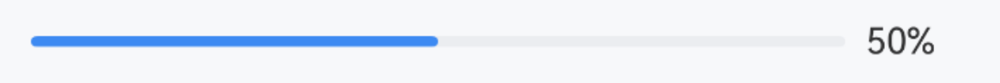
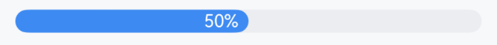
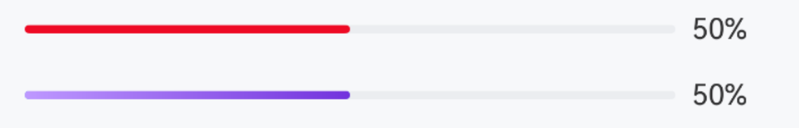
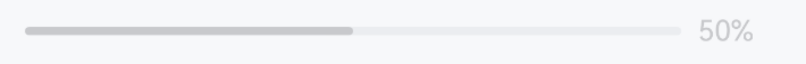
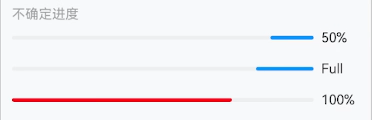

# Progress 进度条

## 介绍

用于展示操作的当前进度。
 
## 引入

```ts
import { IBestProgress } from "@ibestservices/ibest-ui-v2";
```

## 代码演示

### 基础用法



::: details 点我查看代码
```ts
@Entry
@ComponentV2
struct DemoPage {
  @Local value: number = 50
  build() {
    Column(){
      IBestProgress({
        value: this.value!!
      })
    }
  }
}
```
:::

### 进度内显示百分比



::: details 点我查看代码
```ts
@Entry
@ComponentV2
struct DemoPage {
  @Local value: number = 50
  build() {
    Column(){
      IBestProgress({
        value: this.value!!,
        lineWidth: 18,
        textInside: true
      })
    }
  }
}
```
:::

### 自定义样式



::: details 点我查看代码
```ts
@Entry
@ComponentV2
struct DemoPage {
  @Local value: number = 50
  format(value: number){
		return value < 100 ? `${value}%` : 'Full'
	}
  build() {
    Column({space: 16}){
      IBestProgress({
        value: this.value!!,
        color: "#ee0a24"
      })
      IBestProgress({
        value: this.value!!,
        linearGradientColor:{
          angle: 90,
          colors: [['#be99ff', 0], ['#7232dd', 1]]
        },
        format: (value: number): string => this.format(value)
      })
    }
  }
}
```
:::

### 置灰



::: details 点我查看代码
```ts
@Entry
@ComponentV2
struct DemoPage {
  @Local value: number = 50
  build() {
    Column(){
      IBestProgress({
        value: this.value!!,
        inactive: true
      })
    }
  }
}
```
:::

### 不确定进度



::: details 点我查看代码
```ts
@Entry
@ComponentV2
struct DemoPage {
  build() {
    Column({space: 16}){
      IBestProgress({
        value: 50,
        indeterminate: true
      })
      IBestProgress({
        value: 100,
        indeterminate: true,
        duration: 1,
        color: "#DB3131"
      })
    }
  }
}
```
:::


## API

### @Props

| 参数          | 说明                                | 类型       | 默认值     |
| ------------ | ----------------------------------- | --------- | ---------- |
| value        | 进度值                               | _number_ | `0` |  
| lineWidth    | 进度条粗细                            | _string_ \| _number_  | `4` |
| color        | 进度条颜色                            | _ResourceColor_ | `#3D8AF2` |
| linearGradientColor| 进度条渐变色                    | _LinearGradient_ | `-` |
| bgColor      | 进度条背景色                          | _ResourceColor_ | `#ebedf0` |
| showText     | 是否显示进度条文字                     | _boolean_ |  `true`  |
| textInside   | 文字显示在进度条内                     | _boolean_ |  `false`  |
| textColor    | 文本颜色                              | _ResourceColor_ | `#323233` |
| textFontSize | 左侧图标颜色                          | _string_ \| _number_ | `16` |
| inactive     | 文本颜色                              | _boolean_ |  `false`  |
| indeterminate| 不确定进度                            | _boolean_ |  `false`  |
| duration     | 不确定进度时动画时长 单位秒             | _number_ | `3` |
| format       | 格式化文本函数                         | _(value: number) => string_ |  `-`  |
| target       | 目标值                                | _number_ |  `100`  |

### Events

| 事件名         | 说明                            | 回调参数                         |
| --------------| --------------------------------| --------------------------------|
| onReachTarget | 到达目标值触发                   | `-` |