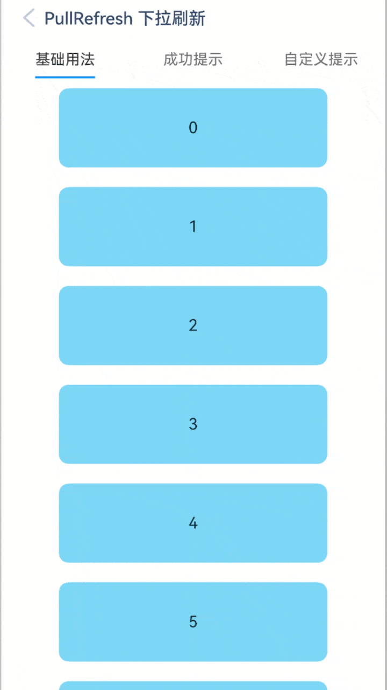
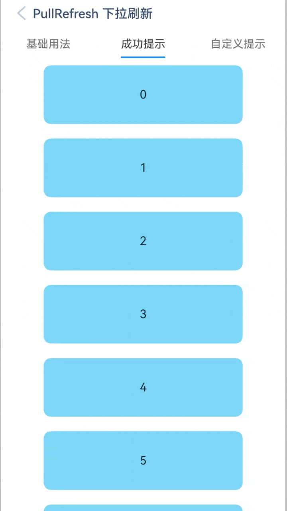
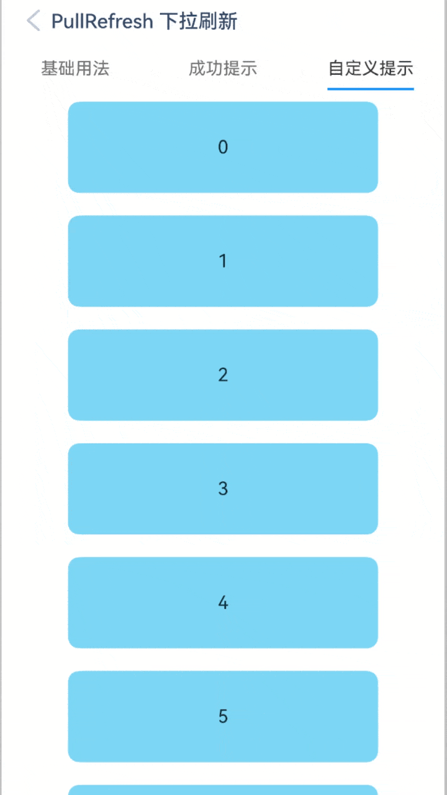

# PullRefresh 下拉刷新

## 介绍

轻量级, 用于提供下拉刷新的交互操作。
 
## 引入

```ts
import { IBestPullRefresh } from "@ibestservices/ibest-ui-v2";
```

## 代码演示

### 基础用法


:::tip
• 当组件内部内容包含List、Grid、Scroll组件时, `scroller` 为必传属性。   
• 由于 List 组件默认有边缘回弹效果, 使用时可设置 List 组件的`edgeEffect`属性为 EdgeEffect.None。
:::

::: details 点我查看代码
```ts
@Entry
@ComponentV2
struct DemoPage {
  @Local isLoading: boolean = false
	private listScroller: ListScroller = new ListScroller()
  @Local arr: String[] = ['0', '1', '2', '3', '4','5','6','7','8','9','10']
  @Builder customContent() {
    List({scroller: this.listScroller }) {
      ForEach(this.arr, (item: string) => {
        ListItem() {
          Text('' + item)
            .width('70%')
            .height(80)
            .fontSize(16)
            .margin(10)
            .textAlign(TextAlign.Center)
            .borderRadius(10)
            .backgroundColor(0x89CFF0)
        }.width("100%")
      }, (item: string) => item)
    }.width("100%").edgeEffect(EdgeEffect.None).height("100%")
	}
  build() {
    Column(){
      IBestPullRefresh({
        loading: this.isLoading!!,
        scroller: this.listScroller,
        defaultContent: (): void => this.customContent("1"),
        onRefresh: (): void => this.onRefresh()
      })
    }.height("100%")
  }
}
```
:::

### 成功提示


:::tip
通过 success-text 可以设置刷新成功后的顶部提示文案。
:::

::: details 点我查看代码
```ts
@Entry
@ComponentV2
struct DemoPage {
  @Local isLoading: boolean = false
	private scroller: Scroller = new Scroller()
  @Local arr: String[] = ['0', '1', '2', '3', '4','5','6','7','8','9','10']
  @Builder customContent() {
    Scroll(this.scroller){
      Column(){
        ForEach(this.arr, (item: string) => {
          Text('' + item)
            .width('70%')
            .height(80)
            .fontSize(16)
            .margin(10)
            .textAlign(TextAlign.Center)
            .borderRadius(10)
            .backgroundColor(0x89CFF0)
        }, (item: string) => item)
      }.width("100%")
    }.height("100%")
	}
  onRefresh(){
		// 此处模拟请求 延时关闭
		setTimeout(() => {
			this.isLoading = false
		}, 1500)
	}
  build() {
    Column(){
      IBestPullRefresh({
        loading: this.isLoading!!,
        scroller: this.scroller,
        defaultContent: (): void => this.customContent(),
        onRefresh: (): void => this.onRefresh()
      })
    }.height("100%")
  }
}
```
:::

### 自定义提示



::: details 点我查看代码
```ts
import { IBestRefreshContentParams } from "@ibestservices/ibest-ui-v2"
@Entry
@ComponentV2
struct DemoPage {
  @Local isLoading: boolean = false
	private scroller: Scroller = new Scroller()
  @Local arr: String[] = ['0', '1', '2', '3', '4','5','6','7','8','9','10']
  @Builder customPullingContent($$: IBestRefreshContentParams){
		Image($r("app.media.icon_loading_point_static"))
			.width(60)
			.scale({ x: $$.distance / 100, y: $$.distance / 100 })
	}
	@Builder customLoosingContent(){
		Image($r("app.media.icon_loading_point_static"))
			.width(60)
	}
	@Builder customLoadingContent(){
		Image($r("app.media.icon_loading_point_dynamics"))
			.width(60)
	}
  @Builder customContent() {
    Scroll(this.scroller){
      Column(){
        ForEach(this.arr, (item: string) => {
          Text('' + item)
            .width('70%')
            .height(80)
            .fontSize(16)
            .margin(10)
            .textAlign(TextAlign.Center)
            .borderRadius(10)
            .backgroundColor(0x89CFF0)
        }, (item: string) => item)
      }.width("100%")
    }.height("100%")
	}
  onRefresh(){
		// 此处模拟请求 延时关闭
		setTimeout(() => {
			this.isLoading = false
		}, 1500)
	}
  build() {
    Column(){
      IBestPullRefresh({
        loading: this.isLoading!!,
        defaultContent: (): void => this.customContent(),
        pullingContent: this.customPullingContent,
        loosingContent: this.customLoosingContent,
        loadingContent: (): void => this.customLoadingContent(),
        onRefresh: (): void => this.onRefresh()
      })
    }.height("100%")
  }
}
```
:::

## API

### @Props

| 参数         | 说明                                   | 类型      | 默认值     |
| ------------ | --------------------------------------| --------- | ---------- |
| loading      | 是否处于加载状态, 支持双向绑定             | _boolean_  | `false` |
| pullingText  | 下拉过程提示文案                         | _ResourceStr_ |  `下拉即可刷新...`  |
| loosingText  | 下拉释放过程提示文案                      | _ResourceStr_ | `释放即可刷新...` |
| loadingText  | 下拉加载过程提示文案                      | _ResourceStr_| `加载中...` |
| successText  | 下拉刷新成功提示文案                      | _ResourceStr_ | `''` |
| successDuration| 下拉刷新成功提示展示时长(ms)             | _number_ | `500` |
| duration     | 下拉刷新动画时长(ms)                      | _number_ | `300` |
| headHeight   | 顶部内容高度                             | _string_ \| _number_ | `50` |
| scroller     | 当自定义内容包含List Grid Scroll组件时必传  | _Scroller_ |  `-`  |
| isEnableSlideUp| 是否启用上滑加载 | _boolean_ | `true` |
| bottomHeight| 底部加载内容高度                           | _string_ \| _number_ | `50` |
| slidingUpText| 上滑过程提示文案                           | _ResourceStr_ | `上滑即可加载...` |
| slideUpLoosingText| 上滑释放过程提示文案                  | _ResourceStr_ | `释放即可加载...` |
| slideUpLoadingText| 上滑加载过程提示文案                  | _ResourceStr_ | `加载中...` |
| slideUpSuccessText| 上滑加载成功提示文案                  | _ResourceStr_ | `''` |
| slideUpSuccessDuration| 上滑加载成功提示展示时长(ms)        | _number_ | `500` |
| slideUpDuration| 上滑加载动画时长(ms)                   | _number_ | `300` |

### Events

| 事件名      | 说明                                | 事件类型      |
| ---------- | ----------------------------------- | ------------ |
| onRefresh  | 触发下拉刷新时的回调, pull 为下拉, slideUp 为上滑 | `(direction: 'pull' \| 'slideUp') => void` |

### 插槽

| 插槽名           | 说明                          | 类型      |
| ----------------| -----------------------------| --------- |
| defaultContent  | 默认内容                      | _CustomBuilder_ |
| pullingContent  | 自定义下拉过程内容              | _($$: IBestRefreshContentParams) => void_ |
| loosingContent  | 自定义释放过程内容              | _($$: IBestRefreshContentParams) => void_ |
| loadingContent  | 自定义加载过程内容              | _CustomBuilder_ |
| successContent  | 自定义刷新成功提示内容           | _CustomBuilder_ |
| slidingUpContent| 自定义上滑过程内容              | _($$: IBestRefreshContentParams) => void_ |
| slideUpLoosingContent| 自定义上滑释放过程内容      | _($$: IBestRefreshContentParams) => void_ |
| slideUpLoadingContent| 自定义上滑加载过程内容      | _CustomBuilder_ |
| slideUpSuccessContent| 自定义上滑加载成功提示内容   | _CustomBuilder_ |

### IBestRefreshContentParams 数据结构
| 参数          | 说明                        | 类型      |
| ------------ | --------------------------- | --------- |
| distance     | 下拉距离                     | _number_  |