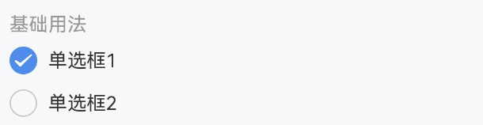
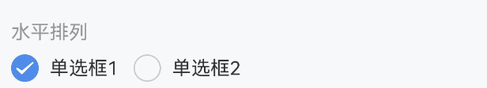
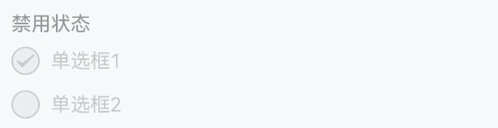
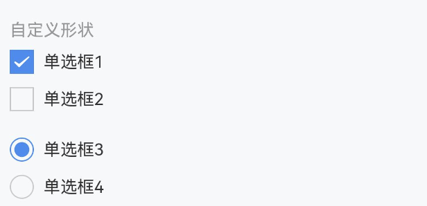
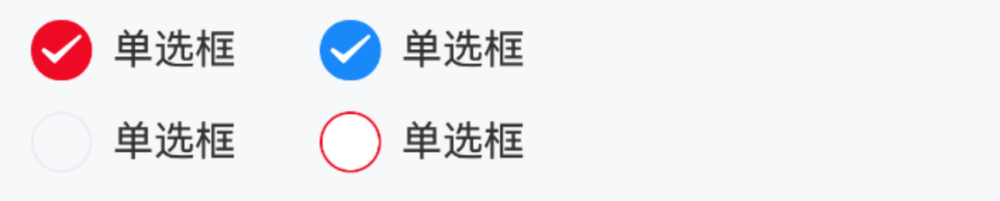
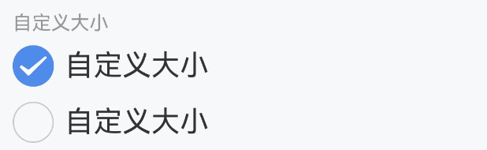
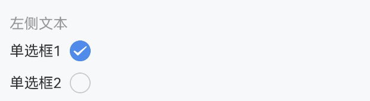
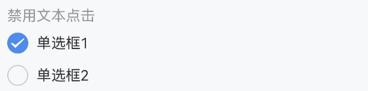
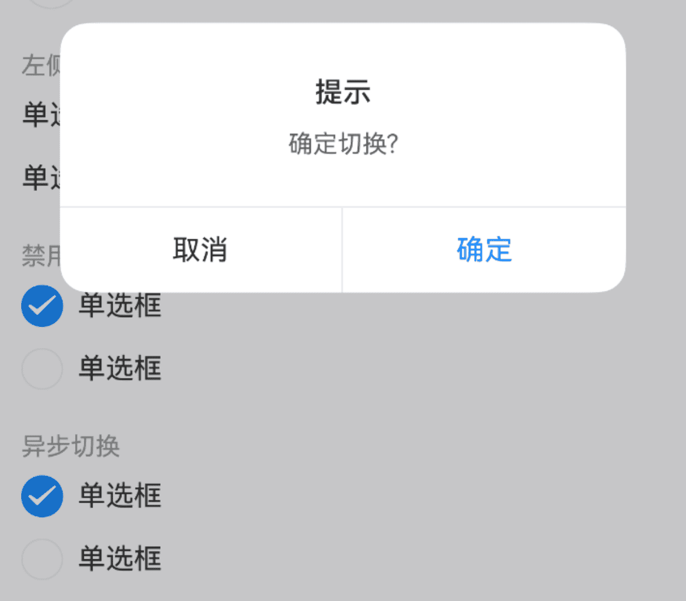
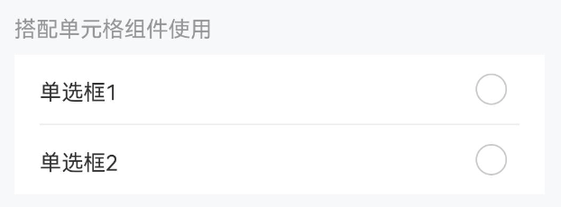

# Radio 单选框

## 介绍

在一组备选项中进行单选。

## 引入

```ts
import { IBestRadio, IBestRadioGroup } from "@ibestservices/ibest-ui-v2";
```

## 代码演示

### 基础用法


::: tip
• 通过 `group` 属性绑定 `IBestRadioGroup` 与 `IBestRadio` 的关系, `group` 值需具有**全局唯一性**。   
• `IBestRadio` 组件的 `name` 值在同一 `group` 中需具备**唯一性**。
:::

::: details 点我查看代码
```ts
@Entry
@ComponentV2
struct DemoPage {
  @Local group: string = "group"
  @Local active: string = "1"
  build() {
    Column(){
      IBestRadioGroup({ group: this.group, active: this.active!! }){
        IBestRadio({
          group: this.group,
          label: '单选框1',
          name: '1'
        })
        IBestRadio({
          group:this.group,
          label: '单选框2',
          name: '2'
        })
      }
    }
  }
}
```
:::

### 水平排列



::: details 点我查看代码
```ts
@Entry
@ComponentV2
struct DemoPage {
  @Local group: string = "group"
  @Local active: string = "1"
  build() {
    Column(){
      IBestRadioGroup({ group: this.group, active: this.active!!, placeDirection: Axis.Horizontal }){
        IBestRadio({
          group: this.group,
          label: '单选框1',
          name: '1'
        })
        IBestRadio({
          group:this.group,
          label: '单选框2',
          name: '2'
        })
      }
    }
  }
}
```
:::

### 禁用状态


::: tip
在 `Radio` 上设置 `disabled` 可以禁用单个选项。
:::

::: details 点我查看代码
```ts
@Entry
@ComponentV2
struct DemoPage {
  @Local group: string = "group"
  @Local active: string = "1"
  build() {
    Column(){
      IBestRadioGroup({ group: this.group, active: this.active!! }){
        IBestRadio({
          group: this.group,
          label: '单选框1',
          disabled: true,
          name: '1'
        })
        IBestRadio({
          group:this.group,
          label: '单选框2',
          name: '2'
        })
      }
    }
  }
}
```
:::

### 自定义形状


::: tip
`shape` 属性可选值为 `square` 和 `dot`，单选框形状分别对应方形和圆点形。
:::

::: details 点我查看代码
```ts
@Entry
@ComponentV2
struct DemoPage {
  @Local group: string = "group"
  @Local active: string = "1"
  build() {
    Column(){
      IBestRadioGroup({ group: this.group, active: this.active!! }){
        IBestRadio({
          group: this.group,
          label: '单选框1',
          shape: 'square',
          name: '1'
        })
        IBestRadio({
          group:this.group,
          label: '单选框2',
          shape: 'dot',
          name: '2'
        })
      }
    }
  }
}
```
:::

### 自定义颜色


::: tip
通过 `checkedColor` 属性设置选中状态的图标颜色。
:::

::: details 点我查看代码
```ts
@Entry
@ComponentV2
struct DemoPage {
  @Local group: string = "group"
  @Local active: string = "1"
  build() {
    Row({space: 14}){
      IBestRadioGroup({ group: this.group, active: this.active!! }){
        IBestRadio({
          group: this.group,
          label: '单选框',
          checkedColor: '#ee0a24',
          name: '1'
        })
        IBestRadio({
          group: this.group,
          label: '单选框',
          checkedColor: '#ee0a24',
          name: '2'
        })
      }
      IBestRadioGroup({ group: this.group, active: this.active!! }){
        IBestRadio({
          group: this.group,
          label: '单选框',
          bgColor: "#fff",
          bdColor: "#ee0a24",
          name: '1'
        })
        IBestRadio({
          group: this.group,
          label: '单选框',
          bgColor: "#fff",
          bdColor: "#ee0a24",
          name: '2'
        })
      }
    }
  }
}
```
:::

### 自定义大小


::: tip
通过 `iconSize` 属性可以自定义图标和文字的大小。
:::

::: details 点我查看代码
```ts
@Entry
@ComponentV2
struct DemoPage {
  @Local group: string = "group"
  @Local active: string = "1"
  build() {
    Column(){
      IBestRadioGroup({ group: this.group, active: this.active!! }){
        IBestRadio({
          group: this.group,
          label: '自定义大小',
          iconSize: 30,
          name: '1'
        })
        IBestRadio({
          group: this.group,
          label: '自定义大小',
          iconSize: 30,
          name: '2'
        })
      }
    }
  }
}
```
:::

### 左侧文本


::: tip
将 `labelPosition` 属性设置为 `'left'`，可以将文本位置调整到单选框左侧。
:::

::: details 点我查看代码
```ts
@Entry
@ComponentV2
struct DemoPage {
  @Local group: string = "group"
  @Local active: string = "1"
  build() {
    Column(){
      IBestRadioGroup({ group: this.group, active: this.active!! }){
        IBestRadio({
          group: this.group,
          label: '单选框',
          labelPosition: 'left',
          name: '1'
        })
        IBestRadio({
          group: this.group,
          label: '单选框',
          labelPosition: 'left',
          name: '2'
        })
      }
    }
  }
}
```
:::

### 禁用文本点击


::: tip
设置 `labelDisabled` 属性后，点击图标以外的内容不会触发单选框切换。
:::

::: details 点我查看代码
```ts
@Entry
@ComponentV2
struct DemoPage {
  @Local group: string = "group"
  @Local active: number = 1
  build() {
    Column(){
      IBestRadioGroup({ group: this.group, active: this.active!! }){
        IBestRadio({
          group: this.group,
          label: '单选框',
          labelDisabled: true,
          name: 1
        })
        IBestRadio({
          group: this.group,
          label: '单选框',
          labelDisabled: true,
          name: 2
        })
      }
    }
  }
}
```
:::

### 异步切换



::: details 点我查看代码
```ts
@Entry
@ComponentV2
struct DemoPage {
  @Local group: string = "group"
  @Local active: number = 1
  build() {
    Column(){
      IBestRadioGroup({ group: this.group, active: this.active!!, beforeChange: () => {
        return new Promise((resolve, reject) => {
          IBestDialogUtil.open({
            title: "提示",
            message: "确定切换?",
            showCancelButton: true,
            onConfirm: () => {
              resolve(true)
            },
            onCancel: () => {
              reject(false)
            }
          })
        })
      } }){
        IBestRadio({
          group: this.group,
          label: '单选框',
          name: 1
        })
        IBestRadio({
          group: this.group,
          label: '单选框',
          name: 2
        })
      }
    }
  }
}
```
:::

### 搭配单元格组件使用


::: tip
搭配单元格组件使用时，需要再引入 `IBestCell` 和 `IBestCellGroup` 组件。
:::

::: details 点我查看代码
```ts
import { IBestCell } from '@ibestservices/ibset-ui'
@Entry
@ComponentV2
struct DemoPage {
  @Local group: string = "group"
  @Local active: boolean = true
  @Builder CellRadio(name: boolean, group: string) {
    IBestRadio({ name, group })
  }
  build() {
    Column(){
      IBestRadioGroup({ group: this.group, active: this.active!! }){
        IBestCell({
          title: '是',
          rightIconBuilder: () => this.CellRadio(true, this.group),
          clickable: true,
          onCellClick: () => {
            this.active = true
          }
        })
        IBestCell({
          title: '否',
          rightIconBuilder: () => this.CellRadio(false, this.group),
          hasBorder: false,
          clickable: true,
          onCellClick: () => {
            this.active = false
          }
        })
      }
    }
  }
}
```
:::

## API

### Radio @Props

| 参数          | 说明                                                            | 类型   | 默认值  |
| ------------- | ----------------------------------------------------------------| ------| ------- |
| group         | 标识符，通常为一个唯一的字符串，需具备`全局唯一性`或已入栈的页面`唯一性`| _string_ \| _number_ |  `''`  |
| name          | 标识符，通常为一个唯一的字符串或数字                                  | _string_ \| _number_ \| _boolean_ |  `''` |
| label         | 显示的文本                                                       | _ResourceStr_  |  `''` |
| iconSize      | 图标大小                                                         | _string_ \| _number_ |  `18`  |
| shape         | 形状，可选值为 `round` `square` `dot`                             | _string_             | `round` |
| disabled      | 是否为禁用状态                                                    | _boolean_            | `false` |
| labelDisabled | 是否禁用文本内容点击                                               | _boolean_            | `false` |
| labelPosition | 文本位置，可选值为 `left`                                          | _string_             | `right` |
| checkedColor  | 选中状态颜色                                                      | _ResourceColor_      |  `#1989fa` |
| labelFontSize | 文本字体大小                                                      | _string_ \| _number_ |  `16`  |
| bgColor       | 默认背景色     | _ResourceColor_ | `''` |
| bdColor       | 默认边框色     | _ResourceColor_ | `#ebedf0` |

### Radio 插槽

| 插槽名          | 说明                          | 类型                           |
| -------------- | ---------------------------- | ------------------------------ |
| defaultBuilder | `label` 的插槽，优先级大于 `label` 属性       | `data: { checked: boolean, disabled: boolean }` |
| iconBuilder    | 自定义图标插槽，需要自己调整选中与未选中展示的 `UI` 内容 | `data: { checked: boolean, disabled: boolean }` |

### RadioGroup @Props

| 参数  | 说明                                                           | 类型      | 默认值 |
| ----- | --------------------------------------------------------------| -------- | ------ |
| group | 标识符，通常为一个唯一的字符串, 需保证全局唯一性      | _string_ \| _number_  |  `''`   |
| active| 激活的标识, 支持双向绑定                            | _string_ \| _number_ \| _boolean_  |  `''`  |
| placeDirection | 排列方向                                  | _<a href="https://developer.huawei.com/consumer/cn/doc/harmonyos-references-V13/ts-appendix-enums-V13#axis" target="__blank">Axis</a>_   | `Axis.Vertical` |
| space | 间距                                               | _string_ \| _number_ | `12` |
| beforeChange | 改变前的回调     | _(value: boolean) => Promise\<boolean\> \| boolean_ | `-` |
| disabled | 是否禁用                           | _boolean_ | `false` |

### RadioGroup Events

| 事件名    | 说明                               | 事件类型               |
| -------- | -----------------------------------| ---------------------- |
| onChange | 选中状态改变的回调事件               | `(name: string \| number \| boolean) => void` |

### RadioGroup 插槽

| 插槽名         | 说明                        | 参数类型    |
| --------------| ----------------------------| --------- |
| defaultBuilder | 默认内容插槽                | `-` |

## 主题定制

组件提供了下列颜色变量，可用于自定义深色/浅色模式样式，使用方法请参考 [颜色模式](../../guide/color-mode/index.md) 章节，如需要其它颜色变量可提 [issue](https://github.com/ibestservices/ibest-ui/issues)。

| 名称                                       | 描述                              | 默认值        |
| -------------------------------------------|----------------------------------|--------------|
| ibest_radio_label_color                    | 标签文字颜色                      | `#323233`   |
| ibest_radio_disabled_label_color           | 禁用时标签文字颜色                 | `#c8c9cc`   |
| ibest_radio_disabled_icon_color            | 禁用时图标颜色                     | `#c8c9cc`   |
| ibest_radio_border_color                   | 边框颜色                          | `#ebedf0`   |