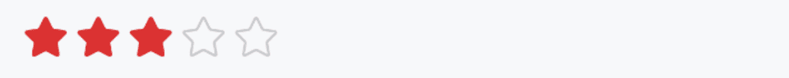

# Rate 评分

## 介绍

用于对事物进行评级操作。
 
## 引入

```ts
import { IBestRate } from "@ibestservices/ibest-ui-v2";
```

## 代码演示

### 基础用法



::: details 点我查看代码
```ts
@Entry
@ComponentV2
struct DemoPage {
  @Local value: number = 3
  build() {
    Column(){
      IBestRate({
        value: this.value!!
      })
    }
  }
}
```
:::

### 自定义图标


:::tip
通过 `inactiveIcon` 可自定义未激活图标, `activeIcon` 可自定义激活图标, 仅支持svg格式图片。
:::

::: details 点我查看代码
```ts
@Entry
@ComponentV2
struct DemoPage {
  @Local value: number = 3
  build() {
    Column(){
      IBestRate({
        value: this.value!!,
        activeIcon: $r("app.media.icon_like_o"),
        inactiveIcon: $r("app.media.icon_like")
      })
    }
  }
}
```
:::

### 自定义样式


::: details 点我查看代码
```ts
@Entry
@ComponentV2
struct DemoPage {
  @Local value: number = 3
  build() {
    Column(){
      IBestRate({
        value: this.value!!,
        iconSize: 60,
        space: 16,
        activeColor: '#ffd21e',
        inactiveIcon: $r("app.media.icon_star_o"),
        inactiveColor: '#eee'
      })
    }
  }
}
```
:::

### 半星


:::tip
通过 `allowHalf` 可开启半星功能, 未设置但传入小数时会被自动向上取整。
:::

::: details 点我查看代码
```ts
@Entry
@ComponentV2
struct DemoPage {
  @Local value: number = 3.5
  build() {
    Column(){
      IBestRate({
        value: this.value!!,
        allowHalf: true
      })
    }
  }
}
```
:::

### 自定义数量


::: details 点我查看代码
```ts
@Entry
@ComponentV2
struct DemoPage {
  @Local value: number = 3
  build() {
    Column(){
      IBestRate({
        value: this.value!!,
        count: 6
      })
    }
  }
}
```
:::

### 可清空


::: details 点我查看代码
```ts
@Entry
@ComponentV2
struct DemoPage {
  @Local value: number = 3
  build() {
    Column(){
      IBestRate({
        value: this.value!!,
        clearable: true
      })
    }
  }
}
```
:::

### 禁用状态


:::tip
可通过 `disabledColor` 属性自定义禁用颜色。
:::

::: details 点我查看代码
```ts
@Entry
@ComponentV2
struct DemoPage {
  @Local value: number = 3
  build() {
    Column(){
      IBestRate({
        value: this.value!!,
        disabled: true
      })
    }
  }
}
```
:::

### 只读状态


::: details 点我查看代码
```ts
@Entry
@ComponentV2
struct DemoPage {
  @Local value: number = 3
  build() {
    Column(){
      IBestRate({
        value: this.value!!,
        readOnly: true
      })
    }
  }
}
```
:::

### 只读状态小数显示


::: details 点我查看代码
```ts
@Entry
@ComponentV2
struct DemoPage {
  @Local value: number = 3
  build() {
    Column(){
      IBestRate({
        value: this.value!!,
        readOnly: true,
        allowHalf: true
      })
    }
  }
}
```
:::

### 监听 change 事件


::: details 点我查看代码
```ts
@Entry
@ComponentV2
struct DemoPage {
  @Local value: number = 3
  build() {
    Column(){
      IBestRate({
        value: this.value!!,
        onChange: (value: number) => {
          console.log(`${value}`)
        }
      })
    }
  }
}
```
:::

## API

### @Props

| 参数         | 说明                                          | 类型      | 默认值     |
| ------------ | ---------------------------------------------| --------- | ---------- |
| value        | 当前分值, 支持双向绑定                           | _number_  | `0` |
| count        | 图标总数                                       | _number_ |  `5`  |
| iconSize     | 图标大小                                       | _number_ \| _string_ | `20` |
| space        | 图标间距                                       | _number_ \| _string_ | `4` |
| activeIcon   | 选中时图标                                     | _Resource_ | `实心五角星` |
| inactiveIcon | 未选中图标                                     | _Resource_ | `空心五角星` |
| activeColor  | 选中颜色                                       | _ResourceColor_ | `#db3131` |
| inactiveColor| 未选中颜色                                     | _ResourceColor_ | `#c8c9cc` |
| allowHalf    | 是否允许半选, 为false时小数会被自动向上取整         | _boolean_ |  `false`  |
| disabled     | 禁用                                           | _boolean_ |  `false`  |
| disabledColor| 禁用颜色                                        | _ResourceColor_ |  `#c8c9cc`  |
| readOnly     | 只读                                           | _boolean_ |  `false`  |
| clearable    | 是否可清空                                      | _boolean_ |  `false`  |
| isTouchable  | 是否可通过滑动手势选择评分                         | _boolean_ |  `true`  |

### Events

| 事件名     | 说明         | 回调参数          |
| ----------| ------------------------------ | -------------------------------- |
| onChange  | 点击或手指滑动结束后触发 | `value: number` |