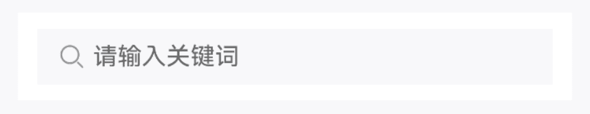
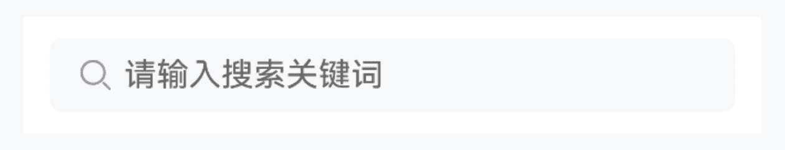
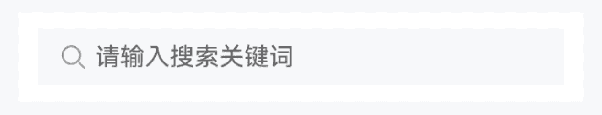
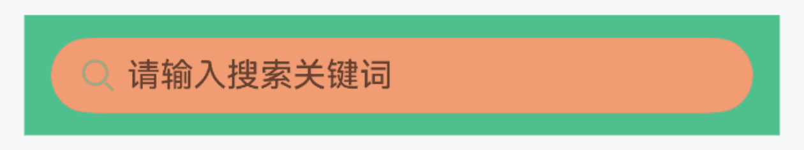
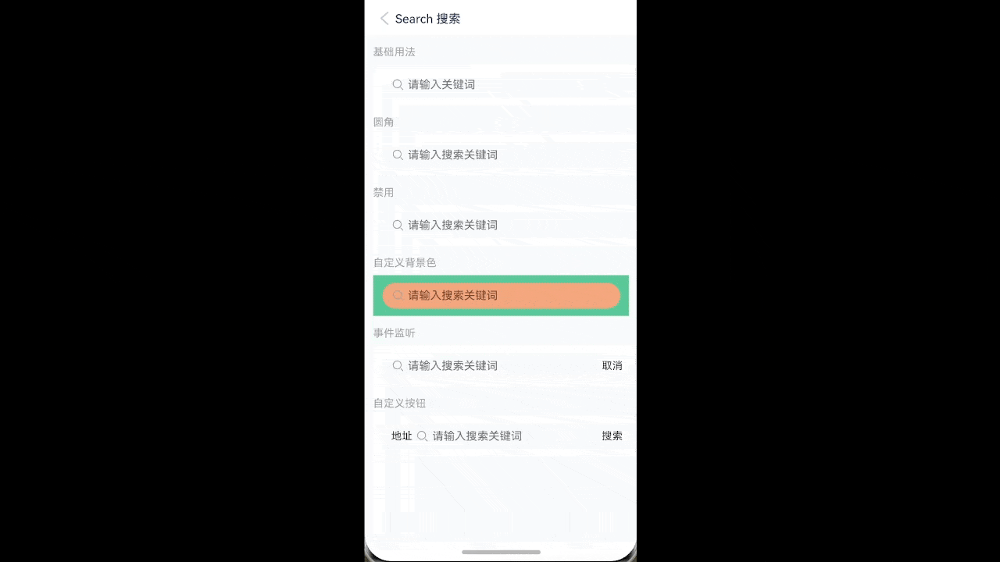
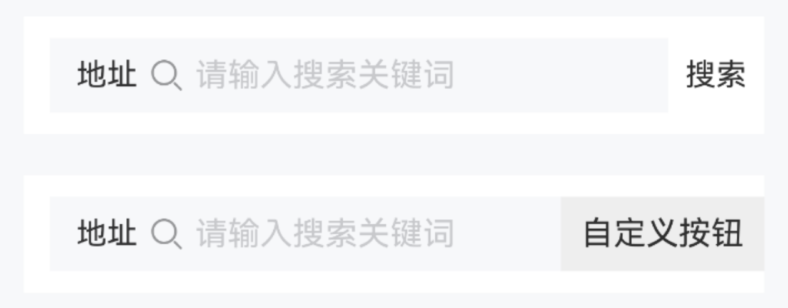

# Search 搜索

## 介绍

用于搜索场景的输入框组件。

## 引入

```ts
import { IBestSearch } from "@ibestservices/ibest-ui-v2";
```

## 代码演示

### 基础用法


:::tip
通过 `autoFocus` 属性，可以设置搜索框自动获取焦点。
:::

::: details 点我查看代码
```ts
@Entry
@ComponentV2
struct DemoPage {
  @Local value: string = ""
  build() {
    Column(){
      IBestSearch({
        value: this.value!!,
        placeholder: "请输入关键词",
        autoFocus: true
      })
    }
  }
}
```
:::

### 圆角



::: details 点我查看代码
```ts
@Entry
@ComponentV2
struct DemoPage {
  @Local value: string = ""
  build() {
    Column(){
      IBestSearch({
        value: this.value!!,
        placeholder: "请输入关键词",
        radius: 12
      })
    }
  }
}
```
:::

### 禁用



::: details 点我查看代码
```ts
@Entry
@ComponentV2
struct DemoPage {
  @Local value: string = ""
  build() {
    Column(){
      IBestSearch({
        value: this.value!!,
        placeholder: "请输入关键词",
        disabled: true
      })
    }
  }
}
```
:::

### 自定义样式



::: details 点我查看代码
```ts
@Entry
@ComponentV2
struct DemoPage {
  @Local value: string = ""
  build() {
    Column(){
      IBestSearch({
        value: this.value!!,
        placeholder: "请输入关键词",
        isRound: true,
        outBgColor: "#4fc08d",
        innerBgColor: "#F29C73"
      })
    }
  }
}
```
:::

### 事件监听



::: details 点我查看代码
```ts
import { IBestToast } from "@ibestservices/ibest-ui-v2";
@Entry
@ComponentV2
struct DemoPage {
  @Local value: string = ""
  build() {
    Column(){
      IBestSearch({
        value: this.value!!,
        placeholder: "请输入关键词",
        showRightButton: true,
        clearable: true,
        onRightButtonClick: () => {
          IBestToast.show("rightIconClick")
        },
        onClear: () => {
          IBestToast.show("clear")
        },
        onSearch: () => {
          IBestToast.show(`search: ${this.value}`)
        },
        onInput: (value: string) => {
          console.log(`输入的值为: ${value}`)
        }
      })
    }
  }
}
```
:::

### 自定义按钮


:::tip
通过 `label` 属性可设置左侧文本, 通过 `rightButtonText` 属性可设置右侧按钮文本, 通过 `customRightButton` 属性可自定义右侧按钮。
:::

::: details 点我查看代码
```ts
@Entry
@ComponentV2
struct DemoPage {
  @Local value: string = ""
  @Builder customBtn(){
    Text("自定义按钮")
      .height("100%")
      .padding({ left: 10, right: 10 })
      .backgroundColor("#eee")
  }
  build() {
    Column({ space: 20 }){
      IBestSearch({
        value: this.value!!,
        placeholder: "请输入关键词",
        label: "地址",
        showRightButton: true,
        rightButtonText: "搜索"
      })
      IBestSearch({
        value: this.value!!,
        label: "地址",
        customRightButton: (): void => this.customBtn()
      })
    }
  }
}
```
:::

## API

### @Props

| 参数         | 说明                                          | 类型      | 默认值     |
| ------------ | ---------------------------------------------| --------- | ---------- |
| value        | 当前输入的值, 支持双向绑定                       | _string_  | `''` |
| label        | 输入框左侧文本                                  | _ResourceStr_  | `''` |
| placeholder  | 占位文字                                       | _ResourceStr_  | `''` |
| placeholderColor  | 占位文字颜色                              | _ResourceColor_  | `#c8c9cc` |
| contentHeight| 搜索框高度                                     | _string_ \| _number_ | `34` |
| outBgColor   | 外侧背景色                                     | _ResourceColor_ | `#fff` |
| innerBgColor | 内侧背景色                                     | _ResourceColor_ | `#f7f8fa` |
| isRound      | 是否为胶囊搜索框, 优先级大于 `radius`             | _boolean_ |  `false`  |
| radius       | 圆角大小                                       | _string_ \| _number_ | `0` |
| leftIcon     | 左侧图标                                       | _ResourceStr_ | `-` |
| leftIconColor| 左侧图标颜色                                    | _ResourceColor_ |  `#969799`  |
| clearable    | 是否可清空                                      | _boolean_ |  `true`  |
| clearIcon    | 清除图标                                        | _ResourceStr_ |  `-`  |
| clearTrigger | 清除图标显示时机, 可选值 `always` `focus`         | _string_ |  `focus`  |
| autoFocus    | 是否自定聚焦                                    | _boolean_ |  `false`  |
| showRightButton| 是否显示右侧按钮                               | _boolean_ |  `false`  |
| rightButtonText| 右侧按钮文本                                   | _ResourceStr_ |  `取消`  |
| disabled     | 是否禁用                                        | _boolean_ |  `false`  |
| readOnly     | 是否只读                                        | _boolean_ |  `false`  |
| enterKeyType | 输入法回车键类型, 详见<a href="https://developer.huawei.com/consumer/cn/doc/harmonyos-references-V5/ts-types-V5#enterkeytype%E6%9E%9A%E4%B8%BE%E8%AF%B4%E6%98%8E" target="__blank">EnterKeyType枚举说明</a> | _EnterKeyType_ |  `Search`  |
| customRightButton| 自定义右侧按钮       | _CustomBuilder_ | `-` |
| textColor     | 输入框文字颜色          | _ResourceColor_ |  `#323233`  |
| labelColor    | 左侧文本颜色            | _ResourceColor_ |  `#323233`  |
| textFontSize  | 输入框文字大小          | _string_ \| _number_ |  `14`  |
| rightBtnBgColor | 右侧按钮背景色        | _ResourceColor_ |  `#fff`  |
| rightBtnPressBgColor| 右侧按钮按压背景色 | _ResourceColor_ |  `#f2f3f5`  |

### Events

| 事件名     | 说明         | 回调参数             |
| ----------| ------------------------------ | -------------------------------- |
| onInput   | 输入时触发 | `value: string` |
| onSearch  | 点击输入法右下角按钮触发 | `-` |
| onInputBlur| 搜索框失焦时触发 | `-` |
| onInputFocus  | 搜索框聚焦时触发 | `-` |
| onClear  | 点击清除图标时触发 | `-` |
| onRightButtonClick  | 点击右侧按钮时触发 | `-` |

## 主题定制

组件提供了下列颜色变量，可用于自定义深色/浅色模式样式，使用方法请参考 [颜色模式](../../guide/color-mode/index.md) 章节，如需要其它颜色变量可提 [issue](https://github.com/ibestservices/ibest-ui/issues)。

| 名称                                       | 描述                              | 默认值        |
| -------------------------------------------|----------------------------------|--------------|
| ibest_search_outer_background              | 外部背景色                        | `#fff`   |
| ibest_search_inner_background              | 内部背景色                        | `#f7f8fa`   |
| ibest_search_label_color                   | 输入框左侧文本文字颜色             | `#323233`   |
| ibest_search_left_icon_color               | 输入框左侧图标颜色                 | `#969799`   |