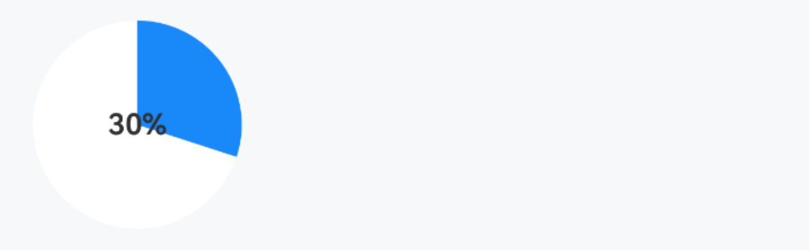
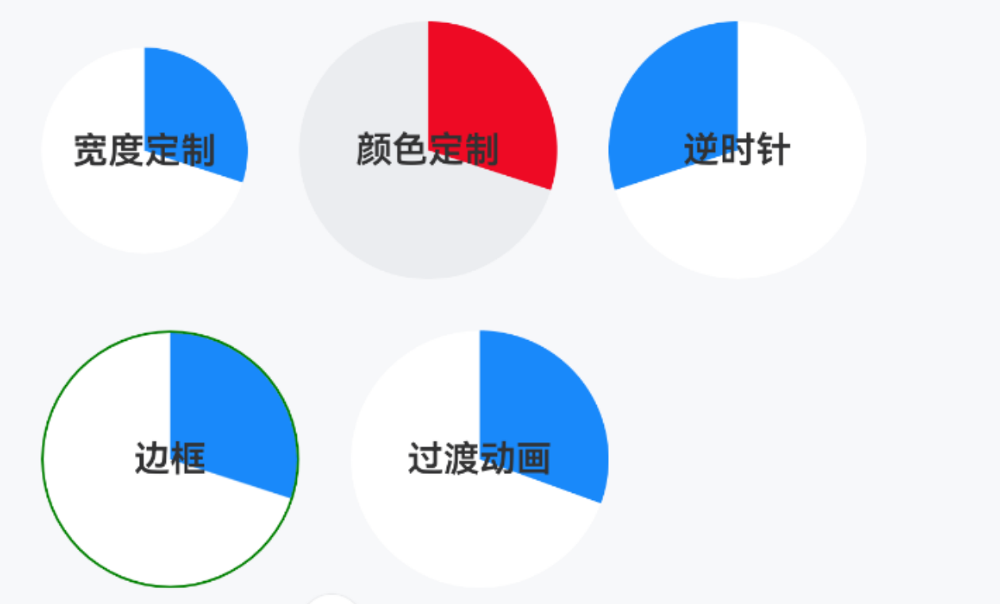
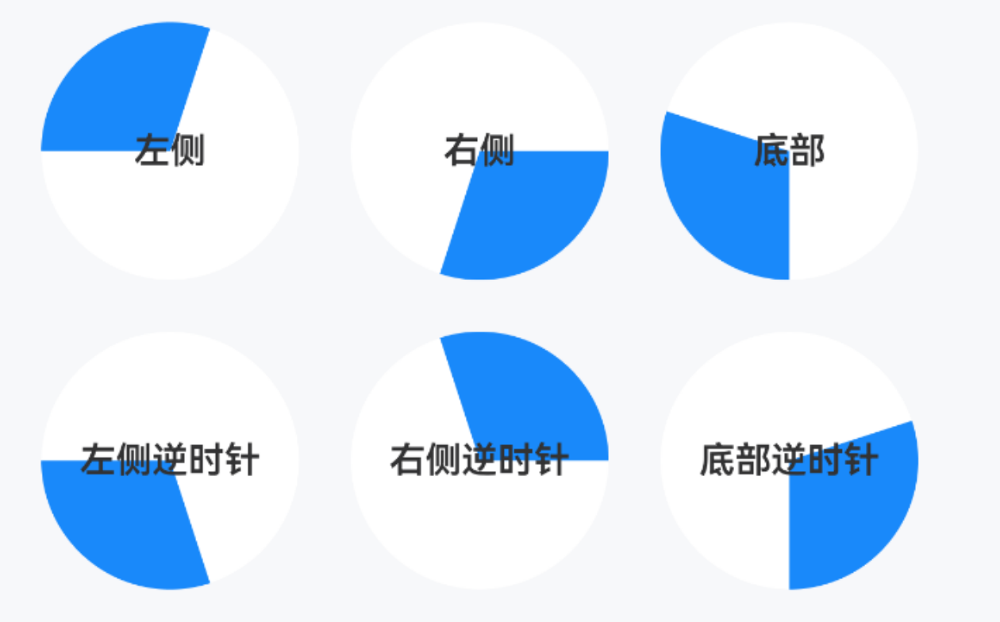

# SectorProgress 扇形进度条

## 介绍

用于展示进度、占比。
 
## 引入

```ts
import { IBestSectorProgress } from "@ibestservices/ibest-ui-v2";
```

## 代码演示

### 基础用法



::: details 点我查看代码
```ts
@Entry
@ComponentV2
struct DemoPage {
  @Local value: number = 30
  build() {
    Column(){
      IBestSectorProgress({
        value: this.value!!,
        text: `${this.value}%`
      })
    }
  }
}
```
:::

### 样式定制



::: details 点我查看代码
```ts
import { IBestSlider } from "@ibestservices/ibest-ui-v2"
@Entry
@ComponentV2
struct DemoPage {
  @Local value: number = 30
  build() {
    Column({space: 20}){
      Flex({wrap: FlexWrap.Wrap, alignItems: ItemAlign.Center, space: { main: LengthMetrics.vp(20), cross: LengthMetrics.vp(20) }}){
        IBestSectorProgress({
          value: this.value!!,
          diameter: 80,
          text: "宽度定制"
        })
        IBestSectorProgress({
          value: this.value!!,
          bgColor: "#ebedf0",
          sectorBgColor: "#ee0a24",
          text: "颜色定制"
        })
        IBestSectorProgress({
          value: this.value!!,
          clockwise: false,
          text: "逆时针"
        })
        IBestSectorProgress({
          value: this.value!!,
          text: "边框",
          outerBorder: {width: 1, color: Color.Green}
        })
        IBestSectorProgress({
          value: this.value!!,
          text: "过渡动画",
          enableAnimation: true
        })
      }
      Row({space: SPACE.SM}){
        IBestSlider({
          value: this.value!!
        })
      }
    }
  }
}
```
:::

### 起始位置



::: details 点我查看代码
```ts
@Entry
@ComponentV2
struct DemoPage {
  @Local value: number = 30
  build() {
    Flex({wrap: FlexWrap.Wrap, space: { main: LengthMetrics.vp(20), cross: LengthMetrics.vp(20) }}){
      IBestSectorProgress({
        value: this.value!!,
        startPosition: "left",
        text: "左侧"
      })
      IBestSectorProgress({
        value: this.value!!,
        startPosition: "right",
        text: "右侧"
      })
      IBestSectorProgress({
        value: this.value!!,
        startPosition: "bottom",
        text: "底部"
      })
      IBestSectorProgress({
        value: this.value!!,
        startPosition: "left",
        clockwise: false,
        text: "左侧逆时针"
      })
      IBestSectorProgress({
        value: this.value!!,
        startPosition: "right",
        clockwise: false,
        text: "右侧逆时针"
      })
      IBestSectorProgress({
        value: this.value!!,
        startPosition: "bottom",
        clockwise: false,
        text: "底部逆时针"
      })
    }
  }
}
```
:::

## API

### @Props

| 参数         | 说明                                 | 类型      | 默认值     |
| ------------ | -------------------------------------| --------- | ---------- |
| value        | 进度值, 支持双向绑定                   | _number_  | `0` |
| diameter     | 进度条直径(宽度)                       | _number_  | `100` |
| target       | 目标进度                              | _number_  | `100` |
| text         | 中间文字                              | _string_ |  `''`  |
| textColor    | 中间文字颜色                           | _ResourceColor_ |  `#323233`  |
| textFontSize | 中间文字大小                           | _string_ \| _number_  | `16` |
| textFontWeight| 中间文字字重                          | _FontWeight_ |  `600`  |
| clockwise    | 是否顺时针                             | _boolean_  | `true` |
| startPosition| 进度条起始位置, 可选值 `left` `right` `top` `bottom` | _string_  | `top` |
| bgColor      | 底层背景色                             | _ResourceColor_  | `#fff` |
| sectorBgColor| 扇形背景色                             | _string_ \| _number_ \| _CanvasGradient_ \| _CanvasPattern_  | `#1989fa` |
| outerBorder  | 边框                                  | _BorderOptions_  | `{}` |
| enableAnimation | 是否需要过渡动画                    | _boolean_  | `false` |

### Events

| 事件名         | 说明                 | 回调参数                       |
| --------------| ---------------------| ------------------------------ |
| onReachTarget | 到达目标值            | `-` |