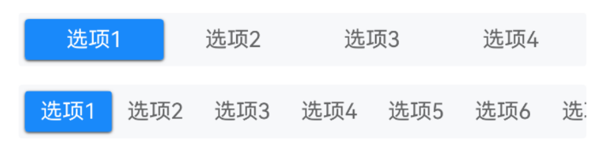
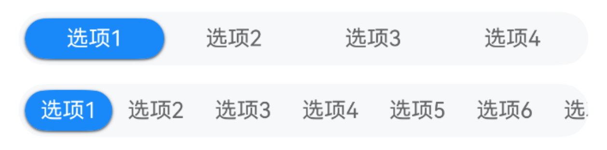
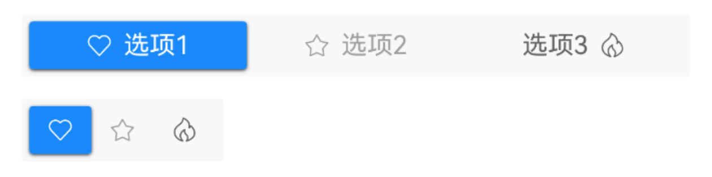
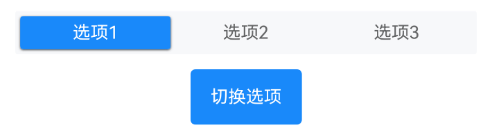
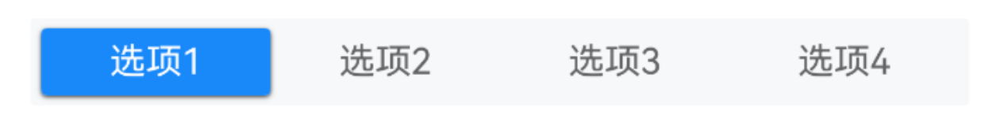
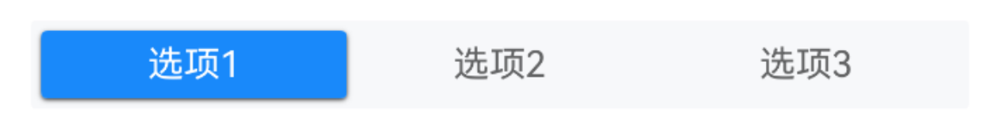

# Segmented 分段控制器

## 介绍

用于展示多个选项并允许用户选择其中单个选项。
 
## 引入

```ts
import { IBestSegmented, IBestSegmentedOption } from "@ibestservices/ibest-ui-v2";
```

## 代码演示

### 基础用法


::: tip
通过 `widthType` 属性可设置单个选项的宽度类型。
:::

::: details 点我查看代码
```ts
@Entry
@ComponentV2
struct DemoPage {
  @Local value: string = "选项1"
  private options: string[] = ['选项1', '选项2', '选项3', '选项4']
  @Local value1: string = "选项1"
  private longOptions: string[] = ['选项1', '选项2', '选项3', '选项4', '选项5', '选项6', '选项7', '选项8', '选项9', '选项10']
  build() {
    Column({space: 14}){
      IBestSegmented({
        value: this.value!!,
        options: this.options
      })
      IBestSegmented({
        value: this.value1!!,
        options: this.longOptions,
        widthType: 'auto'
      })
    }.alignItems(HorizontalAlign.Start)
  }
}
```
:::

### 胶囊形状



::: details 点我查看代码
```ts
@Entry
@ComponentV2
struct DemoPage {
  @Local value: string = "选项1"
  private options: string[] = ['选项1', '选项2', '选项3', '选项4']
  @Local value1: string = "选项1"
  private longOptions: string[] = ['选项1', '选项2', '选项3', '选项4', '选项5', '选项6', '选项7', '选项8', '选项9', '选项10']
  build() {
    Column({space: 14}){
      IBestSegmented({
        value: this.value!!,
        options: this.options,
        round: true
      })
      IBestSegmented({
        value: this.value1!!,
        options: this.longOptions,
        widthType: 'auto',
        round: true
      })
    }.alignItems(HorizontalAlign.Start)
  }
}
```
:::

### 自定义数据



::: details 点我查看代码
```ts
@Entry
@ComponentV2
struct DemoPage {
  @Local value: string = "1"
  private options: IBestSegmentedOption[] = [
    { label: "选项1", value: "1", icon: "like-o" },
    { label: "选项2", value: "2", icon: "star-o", disabled: true },
    { label: "选项3", value: "3", icon: "fire-o", iconPosition: "right" }
  ]
  private options1: IBestSegmentedOption[] = [
    { value: "1", icon: "like-o" },
    { value: "2", icon: "star-o", disabled: true },
    { value: "3", icon: "fire-o" }
  ]
  build() {
    Column({space: 14}){
      IBestSegmented({
        value: this.value!!,
        options: this.options
      })
      IBestSegmented({
        value: this.value!!,
        options: this.options1,
        widthType: 'auto'
      })
    }.alignItems(HorizontalAlign.Start)
  }
}
```
:::

### 动态选项



::: details 点我查看代码
```ts
@Entry
@ComponentV2
struct DemoPage {
  @Local value: string = "选项1"
  @Local options: string[] = ['选项1', '选项2', '选项3', '选项4']
  build() {
    Column({space: 14}){
      IBestSegmented({
        value: this.value!!,
        options: this.options
      })
      IBestButton({
        type: 'primary',
        text: "切换选项",
        onBtnClick: () => {
          this.options = this.options.length == 3 ? ['选项1', '选项2', '选项3', '选项4'] : ['选项1', '选项2', '选项3']
        }
      })
    }.alignItems(HorizontalAlign.Start)
  }
}
```
:::

### 事件监听



::: details 点我查看代码
```ts
@Entry
@ComponentV2
struct DemoPage {
  @Local value: string = "选项1"
  private options: string[] = ['选项1', '选项2', '选项3', '选项4']
  build() {
    Column(){
      IBestSegmented({
        value: this.value!!,
        options: this.options,
        onChange: (value: string | number) => {
          IBestToast.show({
            message: `${value}`
          })
        }
      })
    }.alignItems(HorizontalAlign.Start)
  }
}
```
:::

### 异步切换



::: details 点我查看代码
```ts
@Entry
@ComponentV2
struct DemoPage {
  @Local value: string = '选项1'
  private options: string[] = ['选项1', '选项2', '选项3']
  build() {
    Column(){
      IBestSegmented({
        value: this.value!!,
        options: this.options,
        beforeChange: (value: string | number) => {
          return new Promise((resolve, reject) => {
            IBestDialogUtil.open({
              title: "提示",
              message: `点击选项为${value}, 确定要切换吗?`,
              showCancelButton: true,
              onConfirm: () => {
                resolve(true)
              },
              onCancel: () => {
                reject(false)
              }
            })
          })
        }
      })
    }.alignItems(HorizontalAlign.Start)
  }
}
```
:::

## API

### @Props

| 参数           | 说明                                 | 类型      | 默认值     |
| ---------------| ----------------------------------- | --------- | ---------- |
| value          | 当前选中的值                         | _string_ \| _number_ | `''` |
| options        | 选项列表                             | _(string \| number \| IBestSegmentedOption)[]_ | `[]` |
| widthType      | 宽度类型, 可选 `auto`、`flex`        | _string_ | `flex` |
| contentHeight  | 内容高度                             | _string_ \| _number_ | `34` |
| contentPadding | 内边距                               | _Length_ \| _Padding_ \| _LocalizedPadding_ | `4` |
| round          | 是否为胶囊样式                        | _boolean_ | `false` |
| radius         | 圆角大小, 仅round为false时生效        | _Length_ \| _BorderRadiuses_ \| _LocalizedBorderRadiuses_ | `2` |
| itemPadding    | 单个选项内边距                        | _Length_ \| _Padding_ \| _LocalizedPadding_ | `{left: 10, right: 10}` |
| bgColor        | 背景颜色                              | _ResourceColor_ | `#f7f8fa` |
| activeBgColor  | 选中项背景颜色                        | _ResourceColor_ | `#1989fa` |
| inactiveTextColor| 未选中项文字颜色                    | _ResourceColor_ | `#646566` |
| activeTextColor| 选中项文字颜色                        | _ResourceColor_ | `#fff` |
| fontSize       | 文字大小                              | _string_ \| _number_ | `14` |
| activeShadow   | 色块阴影                              | _ShadowOptions_ \| _ShadowStyle_ | `{ radius: 4, color: "#333", offsetY: 2 }` |
| beforeChange   | 切换前回调                            | _(value: string \| number) => boolean \| Promise\<boolean\>_ | `-` |

### Events

| 事件名         | 说明           | 事件类型                         |
| --------------| ---------------| -------------------------------- |
| onOptionClick | 选项点击回调    | `(value: string \| number) => void` |
| onChange      | 切换回调        | `(value: string \| number) => void` |

## 主题定制

组件提供了下列颜色变量，可用于自定义深色/浅色模式样式，使用方法请参考 [颜色模式](../../guide/color-mode/index.md) 章节，如需要其它颜色变量可提 [issue](https://github.com/ibestservices/ibest-ui/issues)。

| 名称                                       | 描述                              | 默认值        |
| -------------------------------------------|----------------------------------|--------------|
| ibest_segmented_background                 | 背景颜色                          | `#f7f8fa`   |
| ibest_segmented_inactive_text_color        | 未选中文字颜色                     | `#646566`   |
| ibest_segmented_active_text_color          | 选中文字颜色                       | `#fff`   |